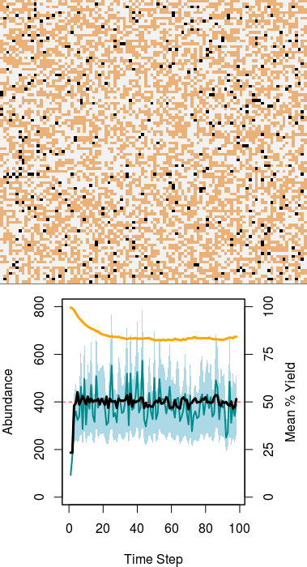
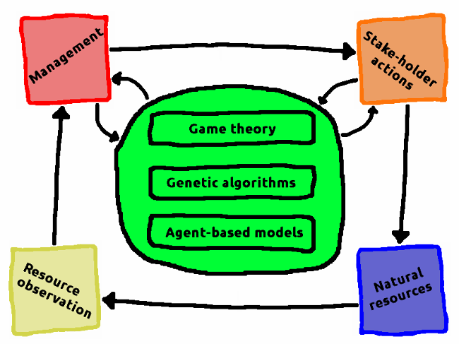
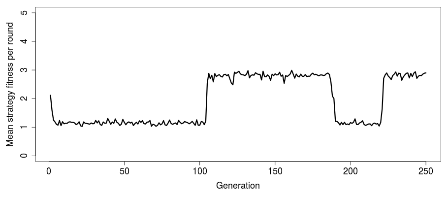
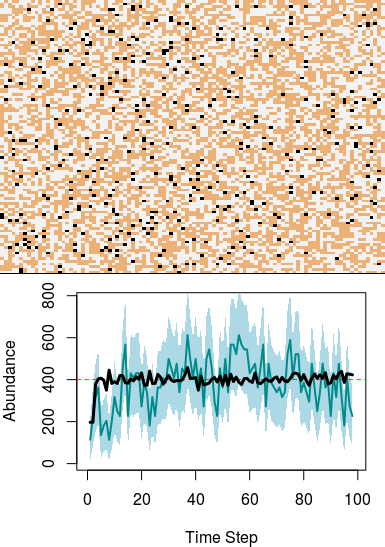
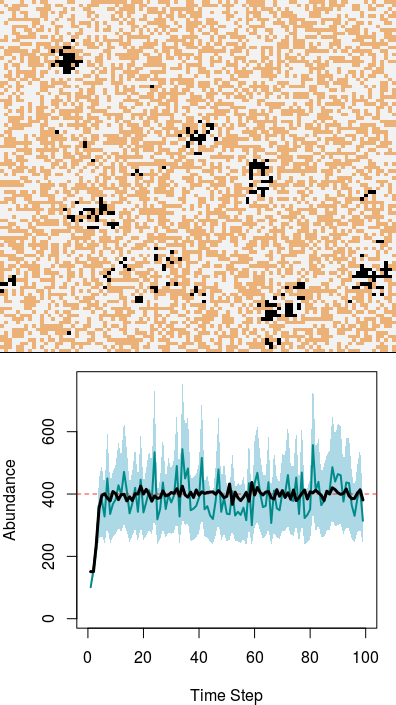
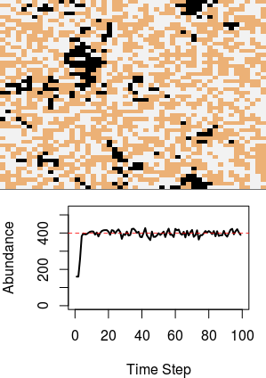

```{r, echo=FALSE}
library(shiny)
library(rhandsontable)
```

********************************************************************************

> **This notebook tracks progress on the development of [G-MSE software](https://bradduthie.github.io/gmse/), for game-theoretic management strategy evaluation, and related issues surrounding the development and application of game theory for addressing questions of biodiversity and food security.**

********************************************************************************

<a name="contents">Contents:</a>
================================================================================

[Project updates](#updates)

 - **2017**
 
     - **APR** [6](#u-6-APR-2017), [5](#u-5-APR-2017)
     - **MAR** [23](#u-23-MAR-2017), [22](#u-22-MAR-2017), [21](#u-21-MAR-2017), [17](#u-17-MAR-2017), [16](#u-16-MAR-2017), [15](#u-15-MAR-2017), [14](#u-14-MAR-2017), [13](#u-13-MAR-2017), [10](#u-10-MAR-2017), [9](#u-9-MAR-2017), [8](#u-8-MAR-2017), [7](#u-7-MAR-2017), [6](#u-6-MAR-2017), [3](#u-3-MAR-2017)
     - **FEB** [24](#u-24-FEB-2017), [23](#u-23-FEB-2017), [22](#u-22-FEB-2017), [17](#u-17-FEB-2017), [16](#u-16-FEB-2017), [13](#u-13-FEB-2017), [8](#u-8-FEB-2017), [7](#u-7-FEB-2017), [6](#u-6-FEB-2017), [3](#u-3-FEB-2017), [2](#u-2-FEB-2017), [1](#u-1-FEB-2017)
     - **JAN** [31](#u-31-JAN-2017), [30](#u-30-JAN-2017), [29](#u-29-JAN-2017), [27](#u-27-JAN-2017), [26](#u-26-JAN-2017), [25](#u-25-JAN-2017), [24](#u-24-JAN-2017), [23](#u-23-JAN-2017), [22](#u-22-JAN-2017), [20](#u-20-JAN-2017), [19](#u-19-JAN-2017), [18](#u-18-JAN-2017), [17](#u-17-JAN-2017), [16](#u-16-JAN-2017), [15](#u-15-JAN-2017), [13](#u-13-JAN-2017), [11](#u-11-JAN-2017), [10](#u-10-JAN-2017)
 
 - **2016**

     - **DEC** [22](#u-22-DEC-2016)

[Towards a Game-theoretic Management Strategy Evaluation (G-MSE)](#intro)

[General model development](#gendev)

[General software development](#soft)

[Game-theory modelling (game.c; green box above)](#game)

[Game-theory and modelling](#gamemod)

[Notes regarding Nilsen's MSE](#Nilsen)

[Some side-notes that might be of use](#side)

[Potentially relevant conferences and workshops](#meetings)

[References consulted and annotated (Mendeley)](#ref)

[References cited](#cited)

********************************************************************************

<a name="updates">Project updates:</a>
================================================================================

> <a name="u-6-APR-2017">Update: 6 APR 2017</a>


**Quick check on neural networks**

I want to make sure I understand neural networks well enough to be able to explain why I'm not using them (yet). [Daniel Shiffman's](https://github.com/shiffman) book [chapter](http://natureofcode.com/book/chapter-10-neural-networks/) in *The Nature of Code* helps out here. Because the simulated agents aren't trying to recognise a particular pattern, I don't think a neural network is how I would describe the `COST` and `ACTION` arrays -- nor would a more explicit network structure going from input (e.g., costs and resources abundances) to output (actions) be terribly useful for current purposes. Nevertheless, **a neural network will be useful if combined with empirical data to mimic human behaviour**. For example, if we want to make an agent that predicts stake-holders' actions based off of empirically collected data from behavioural games, then a neural network could be fed input and then callobrated to the 'correct' behaviour observed by humans through correlations with specific conditions. This would, in effect, create an artifical bot that does what a human would do based on correlating situations with actions. I'm not sure how much data it would require to parameterise effectively, but I suspect more than would be a lot -- we would probably need to have dozens of people [act as stake-holders or managers within G-MSE](#u-23-JAN-2017) and collect their actions.

**Back to fitness functions**

I now need to complete the genetic algorithm with a useful fitness function. The fitness function should calculate the change in resources caused by a stake-holder's actions, then match them to utility. Note that this doesn't require all resources to be calculated to figure out what total utility is before and after an agent has acted -- only how the agent's actions have increased or decreased resources, and the weight (utility) assigned to each.

> <a name="u-5-APR-2017">Update: 5 APR 2017</a>

**More thoughts on genetic algorithms**

I've come back to thinking more about how to write the fitness function of the G-MSE genetic algorithm, and about the relationship between evolution and individual learning, more generally. @Watson2016 argue that learning and (adaptive) evolution are formally linked. In practice, they note that *''In a good model space, desirable future behaviours should be similar (nearby) to behaviours that were useful in the past. For example, perhaps 'eating apples' should be close to 'eating pears' but far from 'eating red things'.''* @Watson2016 also note that *''The representation of associations or correlations has the same fundamental relationship to learning as transistors have to electronics or logic gates to computation (and synapses to neural networks). Although mechanisms to learn a single correlation between two features can be trivial, these are also sufficient, when built up in appropriate networks, to learn arbitrarily complex functions''*. A potentially confusing aspect of this with respect to G-MSE is that we have two scales of time of interest. The first scale is within a single time step (i.e., inside the user model), and the second scale is over multiple time steps (population model $\to$ observation model $\to$ management model $\to$ user model). Most of the time, when we focus on learning, we're talking about *the program learning to make a decsion within a time step* rather than *stake-holders learning to make decisions across time steps*. I'm not opposed to modelling the latter, but the former needs to come first in software development. So when we model learning through the genetic algorithm, it's the iterative processes in `ga()` -- there is less worry, I think, about the correlations that @Watson2016 describe; rather, the associations are explicit. A value in the `ACTION` array **is** associated with a particular outcome that can be tied to stake-holder interests. More abstract learning over G-MSE generations can be added in later with estimates of correlations between actions and outcomes.

> <a name="u-23-MAR-2017">Update: 23 MAR 2017</a>

**Major updates merged to `master`**

I have merged all of the recent updates on the genetic algorithm to the master branch. We now have a bug-free G-MSE model `v0.0.8` that has all of the necessary framework of proper machine learning once a fitness function is written that links costs and utilities of each agent to agent actions. There are a few things that will need to be updated thereafter, which I am putting off until later when the full genetic algorithm is complete and I am sure how it should be called by `user.c`. As of now, the function runs only once for the first agent in the `AGENT` array. Eventually, the function `ga` will need to be looped within `user.c` for each stake-holder (and called in `manager.c`, not yet written, for the manager). I also still need to pass the parameter vector to `ga` with values for the genetic algorithm which are currently hard coded into `ga`.

> <a name="u-22-MAR-2017">Update: 22 MAR 2017</a>

After some additional debugging of the `find_descending_order` in `utilities.c` (which was returning the incorrect index and therefore not selecting for high fitness strategies), I have a working genetic algorithm with a very simple fitness function.

```
void strategy_fitness(double *fitnesses, double ***population, int pop_size, 
                      int ROWS, int COLS, double ***landscape,  
                      double **resources, double **agent_array){
    int agent;
    
    for(agent = 0; agent < pop_size; agent++){
        fitnesses[agent] = population[0][12][agent];
    }
}
```

Essentially, the above function checks row zero and column 12 in an agent's action array, and defines fitness as whatever value is in this array element. Fitness cannot increase indefinitely because of the cost constraints from the `COST` array. Hence the genetic algorithm should increase fitness up to the point where it can't any longer because it is constrained by costs. We can see this over 20 generations of the genetic alogrithm (*note*, this is different than *simulation* time steps -- each simulated time step of G-MSE includes, in this example, a genetic algorithm where strategies updated over 20 generations). The plot below therefore represents an agent ''evolving'' the best strategy for one G-MSE time step


```{r, echo=FALSE}
fitnesses <- c(1.280000, 2.930000, 5.950000, 8.370000, 8.870000, 9.090000, 9.420000, 9.650000, 9.840000, 9.930000, 10.050000, 10.310000, 10.430000, 10.560000, 10.460000, 10.600000, 10.510000, 10.560000, 10.540000, 10.590000);
plot(x=1:length(fitnesses), y=fitnesses, pch=20, cex=1.5, type="b", ylim=c(0,12),
     xlab="Iterations of genetic algorithm", ylab="Mean strategy fitness");
```

The `ACTION` array for the zero agent (the only one run for a genetic algorithm in test simulations) showed a corresponding change in each simulated G-MSE time step, with agents having the actions below (or very similar actions).

```
     [,1] [,2] [,3] [,4] [,5] [,6] [,7] [,8] [,9] [,10] [,11] [,12] [,13]
[1,]   -2    1    0    0    0    0    0    0    0     0     0     0    12
[2,]   -1    1    0    0    0    0    0    0    0     0     0     0     0
[3,]    1    1    0    0    0    0    0    0    0     0     0     0     0
[4,]    2    1    0    0    0    0    0    0    0     0     0     0     0
```

In the above, the agent's only action is to invest all of their energy to doing the action in `ACTION[1,13]` (`bankem`), as predicted given the simple fitness function assigned *a priori*. Hence, with a working genetic algorithm for agents, what is necessary now is to clarify the fitness function to reflect agent utilities. Some clean-up is also necessary to call genetic algorithm specific parameters from the main `gmse.R` file -- right now there are some hard-coded values in the `ga` function, and `user.c` doesn't loop through multiple agents (or check and use only stake-holders).

> <a name="u-21-MAR-2017">Update: 21 MAR 2017</a>

Part of the problem from [last Friday](#u-17-MAR-2017) was that the arrays `fitnesses` and `winners` were uninitialised in the genetic algorithm before being used. Fixing this and running Valgrind returns no errors and no memory leaks.

```
==32451== 
==32451== HEAP SUMMARY:
==32451==     in use at exit: 89,001,346 bytes in 13,024 blocks
==32451==   total heap usage: 5,218,764 allocs, 5,205,740 frees, 621,820,827 bytes allocated
==32451== 
==32451== LEAK SUMMARY:
==32451==    definitely lost: 0 bytes in 0 blocks
==32451==    indirectly lost: 0 bytes in 0 blocks
==32451==      possibly lost: 0 bytes in 0 blocks
==32451==    still reachable: 89,001,346 bytes in 13,024 blocks
==32451==         suppressed: 0 bytes in 0 blocks
==32451== Reachable blocks (those to which a pointer was found) are not shown.
==32451== To see them, rerun with: --leak-check=full --show-leak-kinds=all
==32451== 
==32451== For counts of detected and suppressed errors, rerun with: -v
==32451== ERROR SUMMARY: 0 errors from 0 contexts (suppressed: 0 from 0)

```

So we have an error that Valgrind can't figure out for some reason. It's worth noting that the crash never occurs on the first simulation; it always takes a couple re-runs of `gmse` in success for it to crash. It could just be overloading Rstudio, but I want to keep pushing to figure it out. I'm now going to test by simply running 100 times in succession.

```
test <- NULL;
for(i in 1:100){
   test <- gmse( observe_type  = 0,
                 agent_view    = 20,
                 res_death_K   = 400,
                 plotting      = FALSE,
                 hunt          = FALSE,
                 start_hunting = 95,
                 fixed_observe = 1,
                 times_observe = 1,
                 land_dim_1    = 100,
                 land_dim_2    = 100,
                 res_consume   = 0.5
    )
   print(i);
}
```

Unfortunately, the above crashed in the first loop upon running. Then in the second attempt, it crashed on the 11th loop. When I stop running the genetic algorithm, it never crashes though, so I can at least start to isolate the problem. I have a feeling it's in the `utilites.c` file.

Except that now the crash occurs when the `ga` is commented out. The issue actually appears to be somewhere else in `user.c` because I can run the above for `i in 1:1000` and not get an error if I don't call `user.c` from R at all. Now I need to try to really examine `user.c` and see what's happening. I'm going to start by not calling `send_agents_home` or `count_cell_yield` within the user function (while still calling the genetic algorithm) to see if a crash occurs.

The problem, as it turns out, was in the function `send_agents_home`. After much hassle and multiple times running Valgrind, I found that  initialising `agent_xloc` or `agent_yloc` to the agent's array values would occaisionally produce a segfault because the values were not always within the landscape. This was corrected by initialising these values to zero before ''sending agents home'', but I'm not sure why it arose at all in the first place. Where the agents are has never been a focus, except for when manager agents (`type1 = 0`) are observing (the code for which is stable). To solve the problem more flexibly, I've replaced a straight assignment with the below code.

```
agent_xloc = agent_array[agent][4];
agent_yloc = agent_array[agent][5];            
if(agent_xloc < 0 || agent_xloc >= xdim){
    agent_xloc = 0;
}
if(agent_yloc < 0 || agent_yloc >= ydim){
    agent_yloc = 0;
}
```

Now in the very rare cases where agent locations are off the map (and it might be worth figuring out why -- perhaps they're getting moved somewhere arbitrarily and not moved back?), they will be placed on a cell that they own. This was the point of the function anyway, so it's not a huge deal. It's still a bit odd though, and I'm not sure why it was affecting only about one in thirty simulations. I'll consider **Issue #16: Potential bug: In `user.c`** closed now, and move on to the genetic algorithm again.

> <a name="u-17-MAR-2017">Update: 17 MAR 2017</a>

**Placing tournament winners into a new array**

At the end of the tournament function, we have a vector of winners with high fitness. These winners represent the array layers that need to comprise the *new* 3D array, which will be the start of the next generation of the genetic algorithm. Hence the need for a `place_winners` function to make a new `POPULATION` array to replace the old one. This could be done by individually replacing elements of a `NEW_POPULATION` into the old array `POPULATION`, but a handy swapping of pointers can do this without the multiple loops.

```
/* =============================================================================
 * Swap pointers to rewrite ARRAY_B into ARRAY_A for a an array of any dimension
 * ========================================================================== */
void swap_arrays(void **ARRAY_A, void **ARRAY_B){

    void *TEMP_ARRAY;

    TEMP_ARRAY = *ARRAY_A;
    *ARRAY_A   = *ARRAY_B;
    *ARRAY_B   = TEMP_ARRAY;
}
```

The above function works for 2D and 3D arrays by running the below.

```
swap_arrays((void*)&MAT1, (void*)&MAT2); 
```

We can see the arrays swapped in the output (the first 3 columns before the "|" partition denotes layer 1, and after denotes layer 2, so the array is $3 \times 3 \times 2$ dimensions).

```
========================================= 

---------------- Pre-swap MAT 1 ------------ 
0	0	1	  |  6	5	0	
2	8	6	  |  9	2	4	
1	2	1	  |  9	2	5	

---------------- Pre-swap MAT 2 ------------ 
1	4	3	  |  8	8	6	
1	5	8	  |  3	2	4	
3	9	2	  |  8	3	8	


---------------- Post-swap MAT 1 ------------ 
1	4	3	  |  8	8	6	
1	5	8	  |  3	2	4	
3	9	2	  |  8	3	8	

---------------- Post-swap MAT 2 ------------ 
0	0	1	  |  6	5	0	
2	8	6	  |  9	2	4	
1	2	1	  |  9	2	5
```

Since this works, we can use `swap_arrays` to write a concise function for placing the new individuals.

**Potential bug: In `user.c`**

I can't tell if I'm just overloading R by running the simulation too many times too quickly (clicking to fast), or if there's actually a bug here. But when I comment out the below lines of code in the `send_agents_home` function of `user.c`, things seem fine.

```
while(agent_ID != landowner){
    do{
        agent_xloc = (int) floor( runif(0, xdim) ); 
    }while(agent_xloc == xdim);
    do{
        agent_yloc = (int) floor( runif(0, ydim) ); 
    }while(agent_yloc == ydim);
    landowner = (int) landscape[agent_xloc][agent_yloc][layer];
}
```

When I re-run the code quickly in succession, the above (I think) will very rarely crash the G-MSE program. I can't figure out why yet. It's logged as an issue now. Valgrind report below.

```
==15500== Invalid read of size 8
==15500==    at 0xC298756: is_number_on_landscape (user.c:19)
==15500==    by 0xC298811: send_agents_home (user.c:50)
==15500==    by 0xC299166: user (user.c:303)

```

Valgrind doesn't appear to like the comparing of a landscape value (`double`) with an `int`, so I'm going to change this now. So the function `is_number_on_landscape` now defines `land_num = (int) landscape[xval][yval][layer];` instead of calling the landscape value directly. I have also gotten rid of the sub-function `is_number_on_landscape`, but the crash still sometimes happens. It's possible that this was actually two bugs though, one affecting the `ga`. From Valgrind below now (invalid read is gone).

```
==16758== Conditional jump or move depends on uninitialised value(s)
==16758==    at 0xC29819E: sort_vector_by (utilities.c:63)
==16758==    by 0xC29A1E1: tournament (game.c:280)
==16758==    by 0xC29A66D: ga (game.c:415)
==16758==    by 0xC29914F: user (user.c:294)
==16758==    by 0x4F0A57F: ??? (in /usr/lib/R/lib/libR.so)
==16758==    by 0x4F4272E: Rf_eval (in /usr/lib/R/lib/libR.so)
==16758==    by 0x4F44E47: ??? (in /usr/lib/R/lib/libR.so)
==16758==    by 0x4F42520: Rf_eval (in /usr/lib/R/lib/libR.so)
==16758==    by 0x4F43DDC: Rf_applyClosure (in /usr/lib/R/lib/libR.so)
==16758==    by 0x4F422FC: Rf_eval (in /usr/lib/R/lib/libR.so)
==16758==    by 0x4F45FB5: ??? (in /usr/lib/R/lib/libR.so)
==16758==    by 0x4F42520: Rf_eval (in /usr/lib/R/lib/libR.so)
==16758==  Uninitialised value was created by a heap allocation
==16758==    at 0x4C2DB8F: malloc (in /usr/lib/valgrind/vgpreload_memcheck-amd64-linux.so)
==16758==    by 0xC29A583: ga (game.c:390)
==16758==    by 0xC29914F: user (user.c:294)
==16758==    by 0x4F0A57F: ??? (in /usr/lib/R/lib/libR.so)
==16758==    by 0x4F4272E: Rf_eval (in /usr/lib/R/lib/libR.so)
==16758==    by 0x4F44E47: ??? (in /usr/lib/R/lib/libR.so)
==16758==    by 0x4F42520: Rf_eval (in /usr/lib/R/lib/libR.so)
==16758==    by 0x4F43DDC: Rf_applyClosure (in /usr/lib/R/lib/libR.so)
==16758==    by 0x4F422FC: Rf_eval (in /usr/lib/R/lib/libR.so)
==16758==    by 0x4F45FB5: ??? (in /usr/lib/R/lib/libR.so)
==16758==    by 0x4F42520: Rf_eval (in /usr/lib/R/lib/libR.so)
==16758==    by 0x4F44E47: ??? (in /usr/lib/R/lib/libR.so)
==16758== 

```

This all goes back to the `sort_vector_by`, which I should probably look at a potentially rewrite. The sort function is called by the `tournament` function.

**Some progress on the genetic algorithm**

Despite this, there has been progress on the genetic algorithm. Enough that I want to merge the local branch to dev and rev, but not master yet. The `place_winners` function appears to work fine.

```
void place_winners(double ****population, int *winners, int pop_size, int ROWS, 
                   int COLS){

    int i, row, col, layer, winner;
    double a_value;
    double ***NEW_POP;
    
    NEW_POP    = malloc(ROWS * sizeof(double *));
    for(row = 0; row < ROWS; row++){
        NEW_POP[row]    = malloc(COLS * sizeof(double *));
        for(col = 0; col < COLS; col++){
            NEW_POP[row][col]    = malloc(pop_size * sizeof(double));
        }
    }
    
    for(i = 0; i < pop_size; i++){
        winner = winners[i];
        for(row = 0; row < ROWS; row++){
            for(col = 0; col < COLS; col++){
                a_value              = (*population)[row][col][winner];
                NEW_POP[row][col][i] = a_value;
            }
        }
    }
    
    swap_arrays((void*)&(*population), (void*)&NEW_POP);
    
    for(row = 0; row < ROWS; row++){
        for(col = 0; col < COLS; col++){
            free(NEW_POP[row][col]);
        }
        free(NEW_POP[row]); 
    }
    free(NEW_POP);
}
```

Once I get the bugs worked out of it, the genetic algorithm should start to work. Then a fitness function needs to be made that is more realistic. Fortunately, all of the bugs now appear to be isolated in the genetic algorithm, but I might need to keep testing to be sure.

> <a name="u-16-MAR-2017">Update: 16 MAR 2017</a>

**Initialise new function to constrain costs in the genetic algorithm**

A new function has been written to constrain costs in the genetic algorithm when they go over budget as a consequence of crossover and mutation.

```
/* =============================================================================
 * This function will ensure that the actions of individuals in the population
 * are within the cost budget after crossover and mutation has taken place
 * Necessary variable inputs include:
 *     population: array of the population that is made (malloc needed earlier)
 *     COST: A 3D array of costs of performing actions
 *     layer: The 'z' layer of the COST and ACTION arrays to be initialised
 *     pop_size: The size of the total population (layers to population)
 *     ROWS: Number of rows in the COST and ACTION arrays
 *     COLS: Number of columns in the COST and ACTION arrays
 *     budget: The budget that random agents have to work with
 * ========================================================================== */
void constrain_costs(double ***population, double ***COST, int layer, 
                     int pop_size, int ROWS, int COLS, double budget){
    
    int xpos, ypos;
    int agent, row, col;
    double tot_cost, action_val, action_cost;

    for(agent = 0; agent < pop_size; agent++){
        tot_cost = 0;
        for(row = 0; row < ROWS; row++){
            for(col = 4; col < COLS; col++){
                action_val  = population[row][col][agent];
                action_cost = COST[row][col][layer];
                tot_cost   += (action_val * action_cost);
            }
        }
        while(tot_cost > budget){
            do{ /* This do assures xpos never equals ROWS (unlikely) */
                xpos = floor( runif(0,ROWS) );
            }while(xpos == ROWS);
            do{
                ypos = floor( runif(4,COLS) );
            }while(ypos == COLS);
            if(population[xpos][ypos][agent] > 0){
                population[xpos][ypos][agent]--;
                tot_cost -= COST[xpos][ypos][layer];
            }
        }
    }
}
```

The function has been tested, and works as intended. When the sum of the action elements of an individual multiplied by the cost of each action (`tot_cost` in the above function) are higher than the allowable `budget`, actions are randomly removed until the total costis at or under budget. Note that lower-cost actions are not removed preferentially so as not to bias evolution toward low-cost actions.

**Initial thoughts on the fitness function**

Having now completed functions modelling crossover, mutation, and cost-constraints in C, there are two functions left in the genetic algorithm that are needed. The **second** is a tournament function modelling selection -- this will be relatively easy to code once I have individual fitnesses in the population. The **first** is the fitness function, which be very complex -- so much so that I'm planning to write a very quick simplified version of the fitness function before expanding it out to deal with more difficult questions. What has to happen with the fitness function is that each simulated individual in the popuation has to use whatever information is available to an agent (e.g., manager observations, anecdotal surveys, past decisions of other agents, landscape status, etc.) to predict what the future status of the resources and landscape will be, then assign a fitness to that prediction. Utilities of each resource are in the (truncated) action and cost arrays, as below. 

| agent | type1 | type2 | type3 | util | u_loc | u_land | movem  | castem | killem | feedem | helpem | bankem |
|-------|-------|-------|-------|------|-------|--------|--------|--------|--------|--------|--------|--------|
| -1    |  1    |  0    | 0     | 2    | 1     | 0      | 0      |  0     |  0     |  0     |  0     |  1     |
| -1    |  2    |  0    | 0     | 0    | 1     | 0      | 0      |  0     |  2     |  0     |  0     |  1     |
|  1    |  1    |  0    | 0     | 0    | 0     | 0      | 0      |  0     |  0     |  0     |  0     |  1     |
|  1    |  2    |  0    | 0     | 0    | 0     | 0      | 0      |  0     |  0     |  0     |  0     |  1     |
|  2    |  1    |  0    | 0     | 0    | 0     | 0      | 0      |  0     |  0     |  0     |  0     |  1     |
|  2    |  2    |  0    | 0     | 0    | 0     | 0      | 0      |  0     |  0     |  0     |  0     |  1     |
|  3    |  1    |  0    | 0     | 0    | 0     | 0      | 0      |  0     |  0     |  0     |  0     |  1     |
|  3    |  2    |  0    | 0     | 0    | 0     | 0      | 0      |  0     |  0     |  0     |  0     |  1     |

Above we have the utilities of each resource type (`type1`), but I'm just realising that the **utilities of the landscape** are absent. **There isn't really anything in the above table, for example to say that a stake-holder assigns a utility to the value of a given landscape cell.**. But this needs to be the case if we want something like crop yield (perhaps I should more generally be calling it ''food security'') to be modelled as part of the landscape. **I think the best solution** for this is to include the landscape in `type1` as a negative integer. The landscape layer identifying crop yield is 1 in C (2 in R) -- if I placed a new row of `type1 = -1` in the `COST` and `ACTION` arrays for each agent, then the negative could simply indicate that we are looking at the `LANDSCAPE` array instead of the `RESOURCE` array. I also don't think more than one layer of landscape will ever be used, so I'm not seeing a confusing mess of negative and positive types. The corresponding action columns (`movem`, `castem`, etc.) could have interpretations for landscape, some of them such as `feedem` are obvoius, while others could just be ignored because they don't really apply. In the end the arrays would then look something like the below.

| agent | type1 | type2 | type3 | util | u_loc | u_land | movem  | castem | killem | feedem | helpem | bankem |
|-------|-------|-------|-------|------|-------|--------|--------|--------|--------|--------|--------|--------|
| -1    |  -1   |  0    | 0     | 1    | 0     | 0      | 0      |  0     |  0     |  0     |  0     |  1     |
| -1    |  1    |  0    | 0     | 2    | 1     | 0      | 0      |  0     |  0     |  0     |  0     |  1     |
| -1    |  2    |  0    | 0     | 0    | 1     | 0      | 0      |  0     |  2     |  0     |  0     |  1     |
|  1    |  -1   |  0    | 0     | 0    | 0     | 0      | 0      |  0     |  0     |  0     |  0     |  1     |
|  1    |  1    |  0    | 0     | 0    | 0     | 0      | 0      |  0     |  0     |  0     |  0     |  1     |
|  1    |  2    |  0    | 0     | 0    | 0     | 0      | 0      |  0     |  0     |  0     |  0     |  1     |
|  2    |  -1   |  0    | 0     | 0    | 0     | 0      | 0      |  0     |  0     |  0     |  0     |  1     |
|  2    |  1    |  0    | 0     | 0    | 0     | 0      | 0      |  0     |  0     |  0     |  0     |  1     |
|  2    |  2    |  0    | 0     | 0    | 0     | 0      | 0      |  0     |  0     |  0     |  0     |  1     |
|  3    |  -1   |  0    | 0     | 0    | 0     | 0      | 0      |  0     |  0     |  0     |  0     |  1     |
|  3    |  1    |  0    | 0     | 0    | 0     | 0      | 0      |  0     |  0     |  0     |  0     |  1     |
|  3    |  2    |  0    | 0     | 0    | 0     | 0      | 0      |  0     |  0     |  0     |  0     |  1     |

Maybe not the most elegant solution, but it keeps everything on a single array and the interpretations of types are fairly straightforward. I'll implement this next as new array initialisations, then build a prototype fitness function that attempts to maximise crop yield through `feedem` (not sure if this should actually be an action in the model).

**Manager summary missing**

In working with the fitness function in the user model, I realised that the manager information was obviously missing, so this will have to be added in later (should be easy to do so). One reason for doing the user model first is because the manager model (particularly the genetic algorithm) is going to get much more complicated. Nevertheless, the manager model's use of the genetic algorithm necessitates that the genetic algorithm be able to use both the `OBSERVATION` array and the manager's `OBS_SUMMARY` of the array. Different users will have access to do different information, but I'm starting small to make sure everything is built clearly. 

```
/* =============================================================================
 * This is a preliminary function that checks the fitness of each agent -- as of
 * now, fitness is just defined by how much action is placed into savem (last
 * column). Things will get much more complex in a bit, but there needs to be
 * some sort of framework in place to first check to see that everything else is
 * working so that I can isolate the fitness function's effect later.
 *     fitnesses: Array to order fitnesses of the agents in the population
 *     population: array of the population that is made (malloc needed earlier)
 *     pop_size: The size of the total population (layers to population)
 *     ROWS: Number of rows in the COST and ACTION arrays
 *     COLS: Number of columns in the COST and ACTION arrays
 *     landscape: The landscape array
 *     resources: The resource array
 *     agent_array: The agent array
 * ========================================================================== */
void strategy_fitness(double *fitnesses, double ***population, int pop_size, 
                      int ROWS, int COLS, double ***landscape,  
                      double **resources, double **agent_array){
    int agent;
    
    for(agent = 0; agent < pop_size; agent++){
        fitnesses[agent] += population[0][12][agent];
    }
    
}
```

The above function therefore simply returns the last column (`bankem`) as the individual's fitness. I'm now going to maximise this using a tournament approach to fitness, as suggested by @Hamblin2013.

**Functioning tournament function**

After some toiling with swaps and pointers, I've managed to come up with a somewhat concise and clear function that randomly samples `sampleK` individuals from the population and selects the `chooseK` individuals with highest fitness.

```
/* =============================================================================
 * This function takes an array of fitnesses and returns an equal size array of
 * indices, the values of which will define which new individuals will make it
 * into the next population array, and in what proportions.
 *     fitnesses: Array to order fitnesses of the agents in the population
 *     winners: Array of the winners of the tournament
 *     pop_size: The size of the total population (layers to population)
 *     sampleK: The size of the subset of fitnesses sampled to compete
 *     chooseK: The number of individuals selected from the sample
 * ========================================================================== */
void tournament(double *fitnesses, int *winners, int pop_size, 
                      int sampleK, int chooseK){
    int samp;
    int *samples;
    int left_to_place, placed;
    int rand_samp;
    double *samp_fit;
    
    samples  = malloc(sampleK * sizeof(int));
    samp_fit = malloc(sampleK * sizeof(double));
    placed   = 0;
    
    while(placed < pop_size){ /* Note sampling is done with replacement */
        for(samp = 0; samp < sampleK; samp++){
            do{
                rand_samp      = floor( runif(0, pop_size) );
                samples[samp]  = rand_samp;
                samp_fit[samp] = fitnesses[rand_samp];
            }while(rand_samp == pop_size);
        }
        sort_vector_by(samples, samp_fit, sampleK);
        if( (chooseK + placed) >= pop_size){
            chooseK = pop_size - placed;    
        }
        samp = 0;
        while(samp < chooseK && placed < pop_size){
            winners[placed] = samples[samp];
            placed++;
            samp++;
        }
    }
    free(samp_fit);
    free(samples);
}
```

Note that in writing the above, I had to write a simple sort (`sort_vector_by`) and swap function in `utilities.c`. I also need to write some error messages into the above (or in `ga` itself); `chooseK` cannot be larger than `sampleK`. Next up will be to iterate the `ga` functions and make sure that fitnesses asymptote to high fitness. The framework for the genetic algorithm will then be in place, and it will be time to switch to the complex part of more interesting fitness functions.

> <a name="u-15-MAR-2017">Update: 15 MAR 2017</a>

**Initialisation of action populations**

A new function has been written to initialise a population of agents, duplicated from a single agent in the larger G-MSE model and to be used for the genetic algorithm. Initial testing of this function shows that it returns appropriate arrays, in which actions are selected appropriately based on their cost values in the `COST` array.

```
/* =============================================================================
 * This function will initialise a population from the ACTION and COST arrays, a
 * particular focal agent, and specification of how many times an agent should
 * be exactly replicated versus how many times random values shoudl be used.
 * Necessary variable inputs include:
 *     ACTION: A 3D array of action values
 *     COST: A 3D array of costs of performing actions
 *     layer: The 'z' layer of the COST and ACTION arrays to be initialised
 *     pop_size: The size of the total population (layers to population)
 *     carbon_copies: The number of identical agents used as seeds
 *     budget: The budget that random agents have to work with
 *     ROWS: Number of rows in the COST and ACTION arrays
 *     COLS: Number of columns in the COST and ACTION arrays
 *     population: array of the population that is made (malloc needed earlier)
 * ========================================================================== */
void initialise_pop(double ***ACTION, double ***COST, int layer, int pop_size,
                    int budget, int carbon_copies, int ROWS, int COLS,
                    double ***population){
    
    int xpos, ypos;
    int agent;
    int row, col;
    double lowest_cost;
    double budget_count;
    double check_cost;

    /* First read in pop_size copies of the ACTION layer of interest */
    for(agent = 0; agent < pop_size; agent++){
        for(row = 0; row < ROWS; row++){
            population[row][0][agent] = ACTION[row][0][layer];
            population[row][1][agent] = ACTION[row][1][layer];
            population[row][2][agent] = ACTION[row][2][layer];
            population[row][3][agent] = ACTION[row][3][layer];
            if(agent < carbon_copies){
                for(col = 4; col < COLS; col++){
                    population[row][col][agent] = ACTION[row][col][layer];
                }
            }else{
                for(col = 4; col < COLS; col++){
                    population[row][col][agent] = 0;
                }
            }
        }
        lowest_cost  =  min_cost(COST, layer, budget, ROWS, COLS);
        budget_count =  budget;
        if(lowest_cost <= 0){
            printf("Lowest cost is too low (must be positive) \n");
            break;
        }
        while(budget_count > lowest_cost){
            do{
                do{ /* This do assures xpos never equals ROWS (unlikely) */
                    xpos = floor( runif(0,ROWS) );
                }while(xpos == ROWS);
                do{
                    ypos = floor( runif(4,COLS) );
                }while(ypos == COLS);
            }while(COST[xpos][ypos][layer] > budget_count);
            population[xpos][ypos][agent]++;
            budget_count -= COST[xpos][ypos][layer];
        } /* Should now make random actions allowed by budget */
    }
}
```

The above function cals the `min_cost` function, which simply examines the `COST` array to find the lowest cost action. It keeps filling up actions in the `ACTION` array until it's full.

```
/* =============================================================================
 * This function will find the minimum cost of an action in the COST array
 * for a particular agent (layer). Inputs include:
 *     COST: A full 3D COST array
 *     layer: The layer on which the minimum is going to be found
 *     budget: The total budget that the agent has to work with (initliases)
 *     rows: The total number of rows in the COST array
 *     cols: The total number of cols in the COST array
 * ========================================================================== */
int min_cost(double ***COST, int layer, double budget, int rows, int cols){
    int i, j;
    double the_min;
    
    the_min = budget;
    for(i = 0; i < rows; i++){
        for(j = 0; j < cols; j++){
            if(COST[i][j][layer] < the_min){
                the_min = COST[i][j][layer];
            }
        }
    }
    return the_min; 
}
```

We now have a functioning way to initialise a population of agents that will later go through a genetic algoirthm to select the best actions. In working through this, I've seen that an earlier idea of mine (not sure if I wrote this down below) might be useful -- have a column in both `COST` and `ACTION` that is simply `bankem` -- essentially stashing costs in a way that doesn't **do** anything. This might be important for situations in which an agent actually benefits by doing nothing, or when we want some general way to consider the benefits of stake-holder actions that affect utility but have no effect on resources or other stake-holders (e.g., holiday time).

**Add new `bankem` action on `COST` and `ACTION` arrays**

I have added a new action `bankem` onto the `COST` and `ACTION` arrays, which was not too difficult at all in practice. I envision this category of actions as (probably) always having a cost equal to one. Essentially, it's a way to shift unspent costs to a category, which might or might not affect the agent's overall utility.

**Initialise a new crossover function**

I have written a crossover function that, for each individual in the population, assigns a crossover partner (e.g., as would occur in sexual reproduction). With the partner assigned, the function then swaps `ACTION` array elements with some fixed probability (uniform crossover method). I don't see any reason to consider multiple types of crossover at this point, so I believe this method will be sufficient.

```
/* =============================================================================
 * This function will use the initialised population from intialise_pop to make
 * the population array undergo crossing over and random locations for 
 * individuals in the population. Note that we'll later keep things in budget
 * Necessary variable inputs include:
 *     population: array of the population that is made (malloc needed earlier)
 *     pop_size: The size of the total population (layers to population)
 *     ROWS: Number of rows in the COST and ACTION arrays
 *     COLS: Number of columns in the COST and ACTION arrays
 *     pr: Probability of a crossover site occurring at an element.
 * ========================================================================== */
void crossover(double ***population, int pop_size, int ROWS, int COLS, 
               double pr){
    
    int agent, row, col;
    int cross_partner;
    double do_cross;
    double agent_val, partner_val;
    
    for(agent = 0; agent < pop_size; agent++){
        do{
            cross_partner = floor( runif(0, pop_size) );
        }while(cross_partner == agent || cross_partner == pop_size);
        for(row = 0; row < ROWS; row++){
            for(col = 4; col < COLS; col++){
                do_cross = runif(0,1);
                if(do_cross < pr){
                    agent_val   = population[row][col][agent];
                    partner_val = population[row][col][cross_partner];
                    population[row][col][agent]         = partner_val;
                    population[row][col][cross_partner] = agent_val;
                }
            }
        }
    }
}
```

Originally, I was going to use a swap function to swap agent and partner values. The swap function is still in the `utilities.c` file, but I think the above code is more readable.

**I think it will make more sense to deal with the budget after mutation**. That is, as a result of crossover and mutation, some individuals might go overbudget on their actions. I think randomly removing actions in the event of being over budget is best solved after mutation to prevent redundancy; this was a `constrain_cost` command [originally written in R](#u-7-FEB-2017), so I can use this as a template.

**Mutation function created**

I have written a function to cause random mutations in the population array during the genetic algorithm.

```
/* =============================================================================
 * This function will use the initialised population from intialise_pop to make
 * the population array undergo mutations at random elements in their array
 * Necessary variable inputs include:
 *     population: array of the population that is made (malloc needed earlier)
 *     pop_size: The size of the total population (layers to population)
 *     ROWS: Number of rows in the COST and ACTION arrays
 *     COLS: Number of columns in the COST and ACTION arrays
 *     pr: Probability of a mutation occurring at an element.
 * ========================================================================== */
void mutation(double ***population, int pop_size, int ROWS, int COLS, 
               double pr){
    
    int agent, row, col;
    double do_mutation;
    double agent_val;
    double half_pr;
    
    half_pr = 0.5 * pr;
    
    /* First do the crossovers */
    for(agent = 0; agent < pop_size; agent++){
        for(row = 0; row < ROWS; row++){
            for(col = 4; col < COLS; col++){
                do_mutation = runif(0,1);
                if( do_mutation < half_pr ){
                    population[row][col][agent]--;
                }
                if( do_mutation > (1 - half_pr) ){
                    population[row][col][agent]++;
                }
                if( population[row][col][agent] < 0 ){
                    population[row][col][agent] *= -1;    
                } /* Change sign if mutates to a negative value */
            }
        }
    }
}
```

I might or might not want to tweak this later on because I'm not sure if the type of mutation is agressive enough to search for adaptive strategies. This issue will be greatly mitigated by the seeding of random action arrays and crossover, but I might want to come back to allow mutation to a wider range of numbers later. For now, there is simply a probability of a mutation occurring at each element, then, if a mutation occurs, the action value will either increase by one or decrease by one (if the original value was zero, it will increase to one). It's tempting to allow for bigger jumps, but if they are too big then they will regularly go over budget and hence cause the whole array to reshuffle again (essentially creating a random array and removing a potential opportunity for increased fitness. 

The next function that needs to be written is one that constrains the costs to be at or under budget after crossover and mutation, then a fitness function is needed (which will probably require several sub-functions to keep the code readable).

> <a name="u-14-MAR-2017">Update: 14 MAR 2017</a>

**Separate `ACTION` and `COST` arrays**

I've now made separate the arrays that affect an agent's *actions* and the agents *costs* (from a total budget) for performing things actions. The indices of these arrays will match at all times, such that `COST[i][j][k]` will be the cost of an agent `k` performing `ACTION[i][j][k]` Each agent will therefore have its own 2D layer that will include rows of other agents and columns of utilities and actions. This adds an extra array to a considerable number of things that we already need to keep track of, but I think it is less confusing than what I was doing before, and in the end separating costs from actions will be worth it. Ideally, all of this would just be some special `struct` in C, but, as mentioned [yesterday](#u-13-MAR-2017), this won't work because R and C need to work seemlessely.

**This is much more comprehensivle in another respect**; the genetic algorithm only needs to deal with the `ACTION` array, using the `COST` array as a reference. This readability of the code alone will probably be worthwhile. **As another bonus**, while re-writing the code, it is now obvious that it is unecessary to mutate, crossover, etc., *only a select few rows*; in the `ACTION` array, they are all fair game as determined by `COST` (columns 0-3 cannot be changed, but this is easy to remember).

**Working call to `game.c`, but bad action return**

There is now a working `game.c` file that `user.c` functions call, with proper header files to link. For some reason, the action arrays returned right now are incorrect, so this is the next thing that needs to be done. In general, I think it will be a good idea to make sure that calls from `gmse.R` are maintained without crash.

> <a name="u-13-MAR-2017">Update: 13 MAR 2017</a>

**Begin working on the genetic algorithm**

I have now initialised the file `game.c`, which will hold everything related to the genetic algorithm, including multiple functions for running each individual process. The file will include a high-level function that brings in five arrays.

1. The `UTILITY` array. The whole thing will need to be read in because agents need to have the option to affect one another's arrays (e.g., the potential to affect the cost of each others actions). **I'll need to be careful, eventually, regarding the *order* of agent actions** to make sure that the order in which stake-holders are put through the genetic algorithm doesn't affect resulting agent strategies (or, if this is inevitable, then stake-holder order should be randomised).
2. The `AGENTS` array will be necessary for agents to look up one anothers (and their own) locations, yield, etc.
3. The `RESOURES` array will be needed for agents to look up how many resources there are of each type, where they are located, and what consequences of these agents might be expected.
4. The `para` array of parameter values will be needed for any specifications of the genetic algorithm (e.g., mutation and crossover rate) we might want to implement from R.
5. The `LANDCAPE` array needs to be read in to identify both the owners of cells and the yield from cells, and anything else that might be of interest.

A couple other challenges that I need to keep in mind (but do not want to implement yet).

- **Eventually the *histories* of all of the above arrays (excepting `parameters`, for now)** will need to be included. Or, at least, the histories back to some arbitrary point in time. The reason for this is that we'll eventually want agents to be able to look back on past decisions and adjust their behaviours to maximise their own utilities. This will get nasty, and I think the best thing to do might be to read in histories as separate arrays (e.g., have a `UTILITY` and a `UTILITY_REC`), or at least immediately separate them after reading them into the `ga` function. Nevertheless, doing so will be a challenge, in the case of `UTILITY` requiring a 4D array that agents will search through. **I will build the framework of the genetic algorithm with this in mind, making it flexible enough to expand into histories**. This needs to be done in C, else it will be extremely slow, and it might take some time even with good coding in C.
- **I'll want the `ga` function to be able to call from R and C.** This isn't actually difficult, but worth mentioning because I think it will be helpful for users of the G-MSE R package. Really, the `ga` function will be called by default within `user.c` and `manager.c`, being linked to each in compiling -- keeping the genetic algorithm code in its own file seems like a good idea.

I think it will be best to force `ga` to specify a single agent whose fitness will be maximised (as this agent will need to be [replicated 100ish times](#internal-structure-of-the-genetic-algorithm) for the evolution of a single agent to be simulated). If nothing else, this will make the code easier to follow. Hence, the main functions of both `manager.c` and `user.c` will call `ga` (linked with the game header file `#include "game.c"`), reading in all of the five arrays above and specifying for which agent it is running the genetic algorithm. In `manager.c`, for example, only `type1 = 0` agents will be run, while these agents will be exclused in `user.c`.

**Progess while coding the initialisation of a population**

I think it makes sense to keep these functions generaly and very explicit about what can and cannot be tweaked. For example, given a 2D array, I am using `x0`, `x1`, `y0` and `y1` as indices that determine where to start and stop in terms of changing things. For example, this function that will be called from the `initialise_pop` function specifies all points in *where* to search the `UTILITY` layer for the lowest possible cost (needed for later).

```
/* =============================================================================
 * This function will find the minimum cost of an action in the UTILITY array
 * for a particular agent (layer). Inputs include:
 *     UTILITY: A full 3D utility array
 *     layer: The layer on which the minimum is going to be found
 *     budget: The total budget that the agent has to work with (initliases)
 * ========================================================================== */
int min_cost(double ***UTILITY, int layer, double budget, int x0, int x1,
             int y0, int y1){
    int i, j;
    double the_min;
    
    the_min = budget;
    for(i = x0; i < x1; i++){
        for(j = y0; j < y1; j++){
            if(UTILITY[i][j][layer] < the_min){
                the_min = UTILITY[i][j][layer];
            }
        }
    }

    return the_min; 
}
```

This requires more input, but I think it's also clearer what is meant to happen. The above function compiles without error.

**Change to the UTILITY array**

Having started coding in C, I've decided that it will be much easier to code if I switch what is represented in the first four rows of the a layer of the `UTILITY` array. Now, the first two rows in which `agent = -2` will be the focal agent's *cost*, while rows 3 and 4 will be the focal agents *actions*. This will make it easier to code for the manager's actions later. 

| agent | type1 | type2 | type3 | util | u_loc | u_land | movem  | castem | killem | feedem | helpem |
|-------|-------|-------|-------|------|-------|--------|--------|--------|--------|--------|--------|
| -2    |  1    |  0    | 0     | 2    | 1     | 0      | 1      |  1     |  2     |  3     |  3     |
| -2    |  2    |  0    | 0     | 0    | 1     | 0      | 5      |  20    |  12    |  5     |  10    |
| -1    |  1    |  0    | 0     | 2    | 1     | 0      | 0      |  0     |  0     |  0     |  0     |
| -1    |  2    |  0    | 0     | 0    | 1     | 0      | 0      |  0     |  0     |  0     |  0     |
|  1    |  1    |  0    | 0     |`Inf` | `Inf` | `Inf`  | `Inf`  |  `Inf` | `Inf`  | `Inf`  |  `Inf` |
|  1    |  2    |  0    | 0     |`Inf` | `Inf` | `Inf`  | `Inf`  |  `Inf` | `Inf`  | `Inf`  |  `Inf` |
|  2    |  1    |  0    | 0     |`Inf` | `Inf` | `Inf`  | `Inf`  |  `Inf` | `Inf`  | `Inf`  |  `Inf` |
|  2    |  2    |  0    | 0     |`Inf` | `Inf` | `Inf`  | `Inf`  |  `Inf` | `Inf`  | `Inf`  |  `Inf` |
|  3    |  1    |  0    | 0     |`Inf` | `Inf` | `Inf`  | `Inf`  |  `Inf` | `Inf`  | `Inf`  |  `Inf` |
|  3    |  2    |  0    | 0     |`Inf` | `Inf` | `Inf`  | `Inf`  |  `Inf` | `Inf`  | `Inf`  |  `Inf` |

The reason this is easier is because now I can just randomise elements in the genetic algorithm *below* some value of rows. Agents should never be able to change their own costs, but can always change their own actions (`agent = -1`), and potentially the actions of other agents (`agent` > -1). Fortunately, this doesn't require any extra coding of the initialisation of `UTILITY` -- I just need to note that I'm doing it this way from now on.

**Scrap the above idea completely**

It was better the way it was -- I confused myself with the 3 dimensions. The only actions on resources are in the focal agents first two rows. The second two rows will always be the costs of the focal agent for performing the first two rows of actions, and every other row is a cost associated with adjusting the cost of each other agent -- but the actual *change* that is made where these costs are not infinite (i.e., for the managers) will be made in *other layers* of the UTILITY function. 

**Here's how it will work:** Agents can **do** things to resources `movem`, `castem`, `killem`, `feedem`, `helpem` at a cost. What they do is specified by the first two rows of their `UTILITY` layer (`agent = -2`). The cost of doing each of these is specified in the second two rows (`agent = -2`). They can also potentially **change the cost of other agents doing things** to resources; this is determined by other remaining rows. But the tricky bit is that **their actions need to take effect in the *other* layers of `UTILITY`**. Hence, we need to somehow hold the actions as they apply to `UTILITY` without affecting the `UTILITY` array itself throughout the process of the genetic algorithm (if we start changing `UTILITY`, then we need some way to test changes with respect to agent fitness and then put the array back as it was -- actions therefore need to be recorded).

I didn't want to do this, but I think it might actually be necessary to have two arrays instead of one `UTILITY` array. These two arrays would include:

1. A `COST` array, which would be a 3D array (layers are agents) that identifies the cost of each agent changing *something* that affects agent actions.

| agent | type1 | type2 | type3 | util | u_loc | u_land | movem  | castem | killem | feedem | helpem |
|-------|-------|-------|-------|------|-------|--------|--------|--------|--------|--------|--------|
| -1    |  1    |  0    | 0     | 2    | 1     | 0      | 1      |  1     |  2     |  3     |  3     |
| -1    |  2    |  0    | 0     | 0    | 1     | 0      | 5      |  20    |  12    |  5     |  10    |
|  1    |  1    |  0    | 0     |`Inf` | `Inf` | `Inf`  | `Inf`  |  `Inf` | `Inf`  | `Inf`  |  `Inf` |
|  1    |  2    |  0    | 0     |`Inf` | `Inf` | `Inf`  | `Inf`  |  `Inf` | `Inf`  | `Inf`  |  `Inf` |
|  2    |  1    |  0    | 0     |`Inf` | `Inf` | `Inf`  | `Inf`  |  `Inf` | `Inf`  | `Inf`  |  `Inf` |
|  2    |  2    |  0    | 0     |`Inf` | `Inf` | `Inf`  | `Inf`  |  `Inf` | `Inf`  | `Inf`  |  `Inf` |
|  3    |  1    |  0    | 0     |`Inf` | `Inf` | `Inf`  | `Inf`  |  `Inf` | `Inf`  | `Inf`  |  `Inf` |
|  3    |  2    |  0    | 0     |`Inf` | `Inf` | `Inf`  | `Inf`  |  `Inf` | `Inf`  | `Inf`  |  `Inf` |

The `agent = -1` here would just be the direct cost of the focal agent in the layer affecting resources. 

2. An `ACTION` array, which would be a 3D array of dimenions identical to that of `COST` that would determine what an agent actually does.

| agent | type1 | type2 | type3 | util | u_loc | u_land | movem  | castem | killem | feedem | helpem |
|-------|-------|-------|-------|------|-------|--------|--------|--------|--------|--------|--------|
| -1    |  1    |  0    | 0     | 2    | 1     | 0      | 0      |  0     |  0     |  0     |  0     |
| -1    |  2    |  0    | 0     | 0    | 1     | 0      | 0      |  0     |  2     |  0     |  0     |
|  1    |  1    |  0    | 0     | 0    | 0     | 0      | 0      |  0     |  0     |  0     |  0     |
|  1    |  2    |  0    | 0     | 0    | 0     | 0      | 0      |  0     |  0     |  0     |  0     |
|  2    |  1    |  0    | 0     | 0    | 0     | 0      | 0      |  0     |  0     |  0     |  0     |
|  2    |  2    |  0    | 0     | 0    | 0     | 0      | 0      |  0     |  0     |  0     |  0     |
|  3    |  1    |  0    | 0     | 0    | 0     | 0      | 0      |  0     |  0     |  0     |  0     |
|  3    |  2    |  0    | 0     | 0    | 0     | 0      | 0      |  0     |  0     |  0     |  0     |

The benefit here is that the elements would line up completely so that it would be easy to keep track of actions and costs, and the `ACTION` array would be all that needs to be tweaked for the genetic algorithm.

It would be nice to specify a new `struct` in C for all of this, but that wouldn't change the fact that everything needs to read in and out seemlessly with R, so I don't think that this is possible.

> <a name="u-10-MAR-2017">Update: 10 MAR 2017</a>

**Regrouping and finding a way forward on the utility functions**

Reviewing my [old thoughts](#u-7-FEB-2017) on getting the genetic algorithm to work and get agents to do something to maximise thier own utilities. The first thing to do is to initialise a `UTILITY` array. I don't see anyway around this -- what is needed is a three dimensional array where each dimension `z` is an agent. A single agent's utility and decision-making process is therefore represented in a matrix like the one below. 

| agent | type1 | type2 | type3 | util | u_loc | u_land | movem  | castem | killem | feedem | helpem |
|-------|-------|-------|-------|------|-------|--------|--------|--------|--------|--------|--------|
| -2    |  1    |  0    | 0     | 2    | 1     | 0      | 0      |  0     |  0     |  0     |  0     |
| -2    |  2    |  0    | 0     | 0    | 1     | 0      | 0      |  0     |  0     |  0     |  0     |
| -1    |  1    |  0    | 0     | 2    | 1     | 0      | 1      |  1     |  2     |  3     |  3     |
| -1    |  2    |  0    | 0     | 0    | 1     | 0      | 5      |  20    |  12    |  5     |  10    |
|  1    |  1    |  0    | 0     |`Inf` | `Inf` | `Inf`  | `Inf`  |  `Inf` | `Inf`  | `Inf`  |  `Inf` |
|  1    |  2    |  0    | 0     |`Inf` | `Inf` | `Inf`  | `Inf`  |  `Inf` | `Inf`  | `Inf`  |  `Inf` |
|  2    |  1    |  0    | 0     |`Inf` | `Inf` | `Inf`  | `Inf`  |  `Inf` | `Inf`  | `Inf`  |  `Inf` |
|  2    |  2    |  0    | 0     |`Inf` | `Inf` | `Inf`  | `Inf`  |  `Inf` | `Inf`  | `Inf`  |  `Inf` |
|  3    |  1    |  0    | 0     |`Inf` | `Inf` | `Inf`  | `Inf`  |  `Inf` | `Inf`  | `Inf`  |  `Inf` |
|  3    |  2    |  0    | 0     |`Inf` | `Inf` | `Inf`  | `Inf`  |  `Inf` | `Inf`  | `Inf`  |  `Inf` |

Each agent will need to have a total cost budget, which will be specified in the `AGENT` array in its own column. In the `UTILITY ARRAY` above, the rows where `agent = -2` (column 1) identify the *actions* of an agent -- these are the things that an agent *can do to resources*. In the above example, the agent is not doing anything to resources (all are zeros). The rows where `agent = -1` indicate the *costs of doing things that affect the resources* (i.e., the columns where `agent = -2`. The agent represented by this `z` layer of the 3D array can therefore spend from their total budget where `agent = -1` to add actions where `agent = -2`, which in turn affects resources in one way or another. All of the remaining rows (`agent = 0` to `agent = 2`) define actions that would affect the *costs of other agents*. Esseentially, values (all currently `Inf`) represent the cost of changing another agent's cost by 1. So if we imagine a manager that wants to change the cost of `movem` for a stake-holder from 5 to 10, and their cost value in the table is 0.5, then it will cost 2.5 from their budget to increase this amount (or decrease). Note that there is also the opportunity for stake-holders to directly affect the utilities of other stake-holders -- *for a cost*. **I'm not going to play around with these options yet because it will get very complicated**. Instead, I will now write a function for inialising this array in R. Once the simple case of a genetic algorith for affecting resources based on utilities and budgets is up and running, then I will start doing more complex things like having stake-holders affect one another's utilities and costs.

**Note that column 1 refers to the agent ID, not the agent type. Hence, `agent = 1` will be a manager, not a stake-holder. It's possible that there could be other managers too, but the status of an agent can be accessed with the AGENT array.**

**Initial function making utility array**

A function below returns all of the necessary information for the table above, but with random numbers placed for all columns after `type3`. 

```{r}
make_utilities <- function(AGENTS, RESOURCES){
    UTILITY <- NULL;
    
    agent_IDs     <- c(-2, -1, unique(AGENTS[,1]) );
    agent_number  <- length(agent_IDs);
    res_types     <- unique(RESOURCES[,2:4]);
    unique_types  <- dim(res_types)[1];
    types_data    <- lapply(X   = 1:agent_number, 
                           FUN = function(quick_rep_list) res_types);
    
    column_1      <- sort( rep(x = agent_IDs, times = unique_types) );
    columns_2_4   <- do.call(what = rbind, args = types_data);
    static_types  <- cbind(column_1, columns_2_4);

    dynamic_types <- matrix(data = 0, nrow = dim(static_types)[1], ncol = 8);
    
    dynamic_vals  <- sample(x = 1:10, size = length(dynamic_types), 
                            replace = TRUE);    
    
    dynamic_types <- matrix(data = dynamic_vals, nrow = dim(static_types)[1], 
                            ncol = 8);
    
    colnames(static_types)  <- c("agent", "type1", "type2", "type3");
    colnames(dynamic_types) <- c("util", "u_loc", "u_land", "movem", "castem",
                                 "killem", "feedem", "helpem");
    
    UTILITY <- cbind(static_types, dynamic_types);
    
    return( UTILITY );
}
```

I'm not sure the best way to add the currently random numbers in a function, except that it these values might need to be put into the array by the user, who will want to specify which agents care about which resources and how much it will cost to change things. Better, the user could just perhaps, eventually, just specify *the utilities of each stake-holder with each type* (this is less to input). Then, once the genetic algorithm for the manager is up and running, all of the costs will be *initialised by the manager*, somehow -- with default costs *for the manager* to affect stake-holder costs. This scheme would minimise user input and have the costs arise organically from the model and management system, while the utilities would be specified by the user. For now though, I'll have to input the cost values by hand.

**Function tweak to make 3D array**

The previous function wasn't quite right because it only made one layer of the 3D `UTILITY` array. Really, each layer needs to be replicated for each agent, as below.

```{r}
#' Utility initialisation
#'
#' Function to initialise the utilities of the G-MSE model
#'
#'@param AGENTS The agent array 
#'@param RESOURCES The resource array
#'@export
make_utilities <- function(AGENTS, RESOURCES){

    agent_IDs     <- c(-2, -1, unique(AGENTS[,1]) );
    agent_number  <- length(agent_IDs);
    res_types     <- unique(RESOURCES[,2:4]);
    
    UTIL_LIST <- NULL;
    
    agent  <- 1;
    agents <- agent_number - 2;
    while(agent <= agents){
        UTIL_LIST[[agent]] <- utility_layer(agent_IDs, agent_number, res_types);
        agent            <- agent + 1;
    }
    
    dim_u <- c( dim(UTIL_LIST[[1]]), length(UTIL_LIST) );
    
    UTILITY <- array(data = unlist(UTIL_LIST), dim = dim_u);
    
    return( UTILITY );
}

#' Utility layer for initialisation
#'
#' Function to initialise a layer of the UTILITY array of the G-MSE model
#'
#'@param agent_IDs Vector of agent IDs to use (including -1 and -2)
#'@param agent_number The number of agents to use (length of agent_IDs)
#'@param res_types The number of unique resource types (cols 2-4 of RESOURCES)
#'@export
utility_layer <- function(agent_IDs, agent_number, res_types){
 
    LAYER <- NULL;
    
    unique_types  <- dim(res_types)[1];
    types_data    <- lapply(X   = 1:agent_number, 
                            FUN = function(quick_rep_list) res_types);
    
    column_1      <- sort( rep(x = agent_IDs, times = unique_types) );
    columns_2_4   <- do.call(what = rbind, args = types_data);
    static_types  <- cbind(column_1, columns_2_4);
    
    dynamic_types <- matrix(data = 0, nrow = dim(static_types)[1], ncol = 8);
    
    dynamic_vals  <- sample(x = 1:10, size = length(dynamic_types), 
                            replace = TRUE); # TODO: Change me?
    
    dynamic_types <- matrix(data = dynamic_vals, nrow = dim(static_types)[1], 
                            ncol = 8);
    
    colnames(static_types)  <- c("agent", "type1", "type2", "type3");
    colnames(dynamic_types) <- c("util", "u_loc", "u_land", "movem", "castem",
                                 "killem", "feedem", "helpem");
    
    LAYER <- cbind(static_types, dynamic_types);
    
    return( LAYER ); 
}
```

So when there are two agents, the `make_utilities` function returns a 3D array of 4 rows, 12 columns, and 2 layers. 

```
     [,1] [,2] [,3] [,4] [,5] [,6] [,7]
[1,]   -2    1    0    0    9    2    1
[2,]   -1    1    0    0    7    3    1
[3,]    1    1    0    0    9    8    4
[4,]    2    1    0    0    8    5    1
     [,8] [,9] [,10] [,11] [,12]
[1,]    8    8     8     3     9
[2,]    2    7    10     2     1
[3,]    5   10     6     3     8
[4,]    2    6     6     1     5

, , 2

     [,1] [,2] [,3] [,4] [,5] [,6] [,7]
[1,]   -2    1    0    0    1    8    9
[2,]   -1    1    0    0    3    7    2
[3,]    1    1    0    0    6    2    4
[4,]    2    1    0    0    4    3    7
     [,8] [,9] [,10] [,11] [,12]
[1,]    9    5     3     9    10
[2,]    6    5     7     5     7
[3,]    1    2     2     2     9
[4,]    4    8     9     7    10
```

I'll record changes in the `UTILITY` array over time to track social changes and game strategy. For now, the next goal is to write a genetic algorithm that will work on the `UTILITY` array (with input from the `AGENT`, `LANDSCAPE`, and `RESOURCE` arrays) to optimise stake-holder actions. The simplest case will be maximising crop yield.

**Plans for the genetic algorithm, short and long term**

In the short term, it is therefore necessary to write a set of functions for a genetic algorithm, starting first with the functions [written in R on 7 FEB 2017](#u-7-FEB-2017) to show proof of concept. I will use these on the UTILITY arrays that I made today and show how agent actions can be simulated to maximise a simple scenario -- trying to make as much crop yield as possible, where resources decrease yield if they are on the land. The most difficult part of this will be the fitness function. Essentially, stake-holder agents are going to need to learn or know the relationship between resources and their crop yields, then do something to affect the resources. There are two ways that the relationship between resource and crop yield could be implemented in the model:

1. Agents *know* how resources affect yield by looking at their `consume` column in the `RESOURCES` array. This is pretty straightforward to implement. Each agent could simply count the number of resources on its cells, look at the landscape cel values, then calculate the proportion their crop yield is predicted to decrease and act accordingly to maximise yield (e.g., by killing resources). **This is probably the first implementation to try**.
2. Agents *learn* how resources affect yield over time by correlating resource abundance on landscape cells with cell production. This would take longer (time steps would have to pass or be burned in before agents got the hang of things) and be more computationally intense (agents would need to dig through the history of interactions), but ultimately be more flexible. In the future, for example, if there was an interaction between two different types of resources, or between resources and other agents, that was not obvoius, then an on-the-fly correlation analysis could pick up unexpected links between interacting resources and stake-holders to affect stake-holder utility. Stake-holders could then adjust their behaviours accordingly, possibly resulting in unexpected decisions (e.g., maybe in a complex system where managers, stake-holders, and resources all affect dynamics, it sometimes is *beneficial* to have resources on your land but lobby the manager as if it's a cost). **This kind of implementation will require some more interesting correlational analyses that requires agents to see the history of interactions and outcomes.** It will be fun to build a framework for this, but I'll want to get the model up and running without these complications first, then add them in later.

Bringing in the manager will, of course, make things even more complex. I think the best order to do all of this is to focus on 1 above first, then build managers into the model with 1, and then work on thinking about how to implement 2.

> <a name="u-9-MAR-2017">Update: 9 MAR 2017</a>

The plotting of $2 \times 2$ figures that include maps of land ownership and individual stake-holder yields is now complete for observation types 2 and 3. With this complete, I will now turn to writing [yesterday's](#u-8-MAR-2017) R function in C (which needs to happen anyway -- may as well do it now to keep things fast). Once this is complete, then it will be easier to start building a genetic algorithm for maximising the utility of one stake-holder. Ignoring manager decision-making and conflicting stake-holders for the time being, I will focus on a stake-holder type with a relatively clear goal: maximise crop yield. Using the [utility matrices and genetic algorithm](#u-7-FEB-2017) notes from earlier, I'll be able to write a general function in c that affects user behaviour.

**User function now written in C**

The user function that was written [originally in R](#R-yield-to-agents) has now been coded in c. This makes it much faster to first place agents on their own land (if they own land), then count up their yield from the landscape. Testing of this function finds that everything appears to work normally for all observation types and different land dimensions.

I have run valgrind to check for memory leaks again (since it's been a while).

```
 R -d "valgrind --tool=memcheck --leak-check=yes --track-origins=yes" --vanilla < gmse.R
```

No memory leaks were reported.

```
==26147== HEAP SUMMARY:
==26147==     in use at exit: 104,719,416 bytes in 18,583 blocks
==26147==   total heap usage: 5,168,708 allocs, 5,150,125 frees, 953,760,506 bytes allocated
==26147== 
==26147== LEAK SUMMARY:
==26147==    definitely lost: 0 bytes in 0 blocks
==26147==    indirectly lost: 0 bytes in 0 blocks
==26147==      possibly lost: 0 bytes in 0 blocks
==26147==    still reachable: 104,719,416 bytes in 18,583 blocks
==26147==         suppressed: 0 bytes in 0 blocks
==26147== Reachable blocks (those to which a pointer was found) are not shown.
==26147== To see them, rerun with: --leak-check=full --show-leak-kinds=all
==26147== 
==26147== For counts of detected and suppressed errors, rerun with: -v
==26147== ERROR SUMMARY: 196884 errors from 2 contexts (suppressed: 0 from 0)
```

Next, I can start to make the users actually do things that might maximise their own yield (e.g., shoot resources or farm cells more effectively). I play to write a flexible genetic algorithm function in c. The function itself could be called from a higher-level function so as to be used directly in R (though I don't plan to do this for normal G-MSE operations, but it might be useful to include direct R call optoins once the package is complete).


> <a name="u-8-MAR-2017">Update: 8 MAR 2017</a>

**New landscape layer identifying land ownership**

There is now a new layer of landscape, and I have tweaked things to make the current default three layers. These layers include:

1. A layer of terrain type (not currently in use)
2. A layer of values that can be used to model cell productivity
3. A layer identifying the owner of each cell (corresponds to agent ID)

When the cell owner is 0, this effectively means the land is under manager (e.g., public) control. The new initialise landscape function now allows the user to explicitly set the proportion of cells that should go to each owner (vector input).

```{r}
make_landscape <- function(model, rows, cols, cell_types, cell_val_mn, 
                           cell_val_sd, cell_val_max = 1, cell_val_min = 0,
                           layers = 3, ownership = 0, owner_pr = NULL){
    the_land  <- NULL;
    if(model == "IBM"){
        if(rows < 2){
            stop("Landscape dimensions in IBM must be 2 by 2 or greater");   
        }         
        if(cols < 2){ # Check to make sure the landcape is big enough
            stop("Landscape dimensions in IBM must be 2 by 2 or greater");   
        }
        cell_count     <- cols * rows;
        the_terrain    <- sample(x = cell_types, size = cell_count, 
                                 replace = TRUE);
        the_terrain2   <- rnorm(n = cell_count, mean = cell_val_mn,
                                sd = cell_val_sd);
        if( length(ownership) == 1 ){
            who_owns     <- sample(x = 0:ownership, size = cell_count, 
                                   replace = TRUE);
            the_terrain3 <- sort(who_owns); # Make contiguous for now
        }else{
            who_owns     <- sample(x = ownership, size = cell_count, 
                                   replace = TRUE, prob = owner_pr);
            the_terrain3 <- sort(who_owns); 
        }
        the_terrain2[the_terrain2 > cell_val_max] <- cell_val_max;
        the_terrain2[the_terrain2 < cell_val_min] <- cell_val_min;
        alldata        <- c(the_terrain, the_terrain2, the_terrain3);
        the_land       <- array(data = alldata, dim = c(rows, cols, layers));
    }
    if( is.null(the_land) ){
        stop("Invalid model selected (Must be 'IBM')");
    }
    return(the_land);
}
```

Hence in the above, if `ownership = 0`, then the layer is effectively ignored, or if it is a scalar, then ownership of landscape cells is divided equally among integer values from zero to the scalar. However, the most thorough way to set ownership will be by setting `ownership` to a vector of possible owners and `owner_pr` to their relative proportions of cells owned. Addition of this landscape layer has been tested and runs without error.

<a name="R-yield-to-agents">**Linking cell yield with agents**</a>

I have now begun a `user` R function, which currently (1) moves agents to somehwere on their owned landscape (if not already there) and (2) calculates the amount of their total yield from the landscape and stores this total amount in the `AGENTS` array.

```{r}
user <- function(resource   = NULL,
                 agent      = NULL,
                 landscape  = NULL, 
                 paras      = NULL,
                 model      = "IBM"
) {
    check_model <- 0;
    if(model == "IBM"){
        # Relevant warnings below if the inputs are not of the right type
        if(!is.array(resource)){
            stop("Warning: Resources need to be in an array");   
        }
        if(!is.array(agent)){
            stop("Warning: Agents need to be in an array");   
        }
        if(!is.array(landscape)){
            stop("Warning: Landscape need to be in an array");
        } # TODO: make sure paras is right length below
        if(!is.vector(paras) | !is.numeric(paras)){
            stop("Warning: Parameters must be in a numeric vector");
        }
        # If all checks out, then run the population model

        #======================================================================
        # TEMPORARY R CODE TO DO USER ACTIONS (WILL BE RUN FROM C EVENTUALLY)
        #======================================================================
        
        for(agent_ID in 1:dim(agent)[1]){
            owned_cells <- sum(landscape[,,3] == agent_ID);
            # --- Put the agent on its own land
            if(owned_cells > 0){ # If the agent owns some land
                a_xloc <- agent[agent_ID, 5];
                a_yloc <- agent[agent_ID, 6];
                while(agent[agent_ID,1] != landscape[a_xloc, a_yloc, 3]){
                    a_xloc <- sample(x = 1:dim(landscape)[1], size = 1);
                    a_yloc <- sample(x = 1:dim(landscape)[2], size = 1);
                }
                agent[agent_ID, 5] <- a_xloc;
                agent[agent_ID, 6] <- a_yloc;
            } 
            # --- count up yield on cells
            agent_yield <- 0;
            xdim        <- dim(landscape[,,3])[1]
            ydim        <- dim(landscape[,,3])[2]
            for(i in 1:xdim){
                for(j in 1:ydim){
                    if(landscape[i,j,3] == agent[agent_ID,1]){
                        agent_yield <- agent_yield + landscape[i,j,2];
                    }
                }
            }
            agent[agent_ID, 15] <- agent_yield
        }
        USER_OUT <- list(resource, landscape, agent);
        # TODO: User actions are next...
        #======================================================================

        check_model <- 1;
    }
    if(check_model == 0){
        stop("Invalid model selected (Must be 'IBM')");
    }
    return(USER_OUT);
}
```

It might be useful to also have a column in the `AGENTS` array that records percent capacity of yield for stake-holders, perhaps by saving the original landscape (before resources remove yield) and calculating a proportion. **A couple notes**, the indicated code above will need to be put into C -- it's much to slow for R already. Also, for some reason, if I don't store `a_xloc` and `a_yloc` back into the appropriate `agent[agent_ID, 5]` and `agent[agent_ID, 6]`, respectively, a weird bug appears. The actual resource population (but not its estimate) flatlines after 20 or so generations at some value. This is very weird because the file `gmse.R` doesn't even return the resource or landscape arrays -- not yet. I'm not sure why a bug in this the code affects population demographics, but fixing it also appears to correct the problem completely. **This is something to watch out for, however.**

**Plotting owned landscape and stake-holder yield**

The figure below shows some new output for G-MSE. The left column of the figure [is familiar](#u-7-MAR-2017), but the right column now provides some feedback for five simulated stake-holders that own roughly equal amounts of land. The actual plots of land are shown in the upper right, while the individual yields for each stake-holder's plots are shown over time in the lower right.


As of now, this image is only produced for the first two observation functions (case 0 and 1), so I need to replicate it in the other two observation functions. Eventually, it would be better to just have one function for plotting so that any changes made would really be global.

> <a name="u-7-MAR-2017">Update: 7 MAR 2017</a>

**Tracking crop yield over time**

Given that resources now can affect the second layer of the landscape, which can model the percent crop yield (or anything else), we can now plot the mean percent yield per cell (orange) over time along with resource abundance (black) and its estimate (blue). The figure below shows this for an example in which each independent visit by a resource reduces crop yield by 50% (e.g., the individual consumes half of the resources on a cell if it arrives there at a time step).



This has now only been coded for the mark-recapture plot, so the next task is to fill this out for all of the plot types, then *add a new layer* of the landscape that will designate each cell with a number that identifies the owner of the land, or if the land is public (type 0). This will allow me to link crop yield to a specific agent.

> <a name="u-6-MAR-2017">Update: 6 MAR 2017</a>

**Fix read in and out of landscape array from R to C**

While testing the resource-landscape interaction, there was an issue with the landscape array being read into C correctly. When R sends an array or vector into C, it is sending the contents of a list (i.e., what might be a $2 \times 2$ array in R gets read in as if each element were in a list of four elements). The structure of the array then needs to be correctly defined in C so that it matches what it was in R. This requires placing the contents of the elements coming in from R in the correct order with respect to pointers in C, and this occurs in reverse order, so if we had a table in R

|    | Y1 | Y2 |
|----|----|----|
| X1 |  1 |  2 |
| X2 |  3 |  4 |

The list would be read in (apparently) as [1, 3, 2, 4], so if we want to read this in to an array in R, and we prefer to make a pointer to X1 and X2 location (which is easier for my brain because it allows `array[i][j]` to refer to the i individual and j trait), then we need to read in the array as follows:

```
the_array   = malloc(x_size * sizeof(double *));
for(i = 0; i < x_size; i++){
    the_array[i] = malloc(y_size * sizeof(double));   
} 
vec_pos = 0;
for(j = 0; j < y_size; j++){
    for(i = 0; i < x_size; i++){
        the_array[i][j] = R_ptr[vec_pos];
        vec_pos++;
    }
}
```

This is not quite intuitive at first, but doing it this way gets R and C on the same page. For example, here is the `RESOURCES` array moving from R to C and back again. Printed in each environment, the array is the same (*note*, they could be differently structured and still be technically consistent -- e.g., if all arrays were transposed -- but this would be a nightmare to code).

```
> RESOURCES[1:4,1:4]
     IDs type1 type2 type3
[1,]   1     1     0     0
[2,]   2     1     0     0
[3,]   3     1     0     0
[4,]   4     1     0     0
> RESOURCE_NEW      <- resource(resource   = RESOURCES,
+                                       landscape  = LANDSCAPE_r,
+                                       paras      = paras,
+                                       move_res   = TRUE,
+                                       model      = "IBM"
+         );
1.000000	1.000000	0.000000	0.000000	
2.000000	1.000000	0.000000	0.000000	
3.000000	1.000000	0.000000	0.000000	
4.000000	1.000000	0.000000	0.000000	
>         RESOURCES             <- RESOURCE_NEW[[1]];
> RESOURCES[1:4,1:4]
     [,1] [,2] [,3] [,4]
[1,]    1    1    0    0
[2,]    2    1    0    0
[3,]    3    1    0    0
[4,]    4    1    0    0
```

When reading in the landscape, this got confusing beause the same thing had to be done in three dimensions, and initially I lost track of the pointers causing the layers to mix. This has been resolved now, and I have tested to ensure that landscape elements are identical when read into C and when returned back into R

```
> LANDSCAPE_r[1:4,1:4,1:2]
, , 1

     [,1] [,2] [,3] [,4]
[1,]    1    2    2    2
[2,]    2    2    2    2
[3,]    1    1    1    2
[4,]    1    1    2    2

, , 2

         [,1]       [,2]       [,3]
[1,] 1.540700 -1.7960987  2.7759525
[2,] 1.483312  0.5855166 -0.4789347
[3,] 1.579536  1.0600302  2.2923279
[4,] 1.745043  0.2437264  0.6171671
          [,4]
[1,] 0.6596141
[2,] 0.8117666
[3,] 2.0330554
[4,] 1.1496975

> RESOURCE_NEW      <- resource(resource   = RESOURCES,
+                                       landscape  = LANDSCAPE_r,
+                                       paras      = paras,
+                                       move_res   = TRUE,
+                                       model      = "IBM"
+         );
1.000000	2.000000	2.000000	2.000000	
2.000000	2.000000	2.000000	2.000000	
1.000000	1.000000	1.000000	2.000000	
1.000000	1.000000	2.000000	2.000000	


1.540700	-1.796099	2.775952	0.659614	
1.483312	0.585517	-0.478935	0.811767	
1.579536	1.060030	2.292328	2.033055	
1.745043	0.243726	0.617167	1.149697	
>         RESOURCES             <- RESOURCE_NEW[[1]];
>         RESOURCE_REC[[time]]  <- RESOURCES;
>         
>         LANDSCAPE_r           <- RESOURCE_NEW[[2]];
> LANDSCAPE_r[1:4,1:4,1:2]
, , 1

     [,1] [,2] [,3] [,4]
[1,]    1    2    2    2
[2,]    2    2    2    2
[3,]    1    1    1    2
[4,]    1    1    2    2

, , 2

         [,1]       [,2]       [,3]      [,4]
[1,] 1.540700 -1.7960987  2.7759525 0.6596141
[2,] 1.483312  0.5855166 -0.4789347 0.8117666
[3,] 1.579536  1.0600302  2.2923279 2.0330554
[4,] 1.745043  0.2437264  0.6171671 1.1496975

>

```

The biological interactions (i.e., the function from [3 MAR](#u-3-MAR-2017)) now does what it is supposed to do, and I will move on to make the landscape interactions more interesting.

**Allow layers to change by themselves each generation**

Given that some resources will affect layers of the landscape, modelling consumption of biomass on cells, it is necessary to also include a function that changes the landscape cell values without any input from resources. This can model the growth of biomass on cells between time steps. I've therefore written a new function that does this in R (I don't think this will be complex enough to require it in C).

```{r}
update_landscape <- function(model = "IBM", landscape, layer, mean_change,
                             sd_change = 0, max_val = 1, min_val = 0){
    the_land <- NULL;
    if(model == "IBM"){
        xlength   <- dim(landscape[,,layer])[1];
        ylength   <- dim(landscape[,,layer])[2];
        lsize     <- xlength * ylength;
        adj_vals  <- rnorm(n = lsize, mean = mean_change, sd = sd_change);
        adj_layer <- matrix(data = adj_vals, nrow = xlength, ncol = ylength);
        new_layer <- landscape[,,layer] + adj_layer;
        
        new_layer[new_layer > max_val] <- max_val;
        new_layer[new_layer < min_val] <- min_val;
        landscape[,,layer]             <- new_layer;
        the_land                       <- landscape;
    }else{
        stop("Invalid model selected (Must be 'IBM')");
    }
    return(the_land);
}
```

One feature of the G-MSE model is now that, in addition to a hard imposed carrying capacity on resource types, it is also possible to make the carrying capacity a natural function of the landscape. For example, we might force individuals on the landscape to consume a certain amount of resources on the landscape to survive or reproduce. Hence, as landscape cell values decrease modelling the consumption of biomass, fewer individual resources can survive or reproduce.

**Ideally**, it will then be possible to parameterise the model using data for, e.g., how much damage to biomass a goose can do to a patch of land. As of now, by default, I'm just assuming that it decreases crop yield by 10%, and increases its own survival probability by the same when it lands on a cell.

**For some reason,** a function that I wrote to reset the landscape values screwed with the resource abundances (flat-lined after 20 gens for no clear reason). I've reverted to a simpler function, and will build up off of this tomorrow, but it would be nice to know why the R function was affecting the population dynamics *even when it returned the same landscape that it took in*. Tomorrow, I will build up a new function with similar features piece by piece to make sure it works. Then, I will do some initial simulations modelling crop growth as affected by resources on a landscape, and resource dynamics in turn affected by crops. Things to add after include:

1. User's ability to grow more crops or shoot resources
2. Resource movement behaviour that seeks out resources

I'm not sure which to tackle first just yet -- perhaps the former because the latter doesn't seem necessary now.

> <a name="u-3-MAR-2017">Update: 3 MAR 2017</a>

**Resource-landscape interactions**

Having now resolved the issue concerning [multi-layered landscapes](#u-24-FEB-2017), it's time to actually *use* one of these layers in the model. The goal here is to do the following:

1. Allow resources of any given type (e.g., individuals in a population of conservation interest) to affect values on the landscape (e.g., representing possible crop yield).
2. Have values on the landscape affect resources, potentially in one or all of the ways below.
    - Affect individual death rate
    - Affect individual birth rate
    - Affect individual movement
    
It would be nice if, for example, individuals could have their probability of death decrease if they are on a cell of high value (modelling increased food consumption), or their probability of giving birth (or number of offspring) increase. Movement rules could also allow individuals to gravitate towards high value cells (or stop when landing on one), thereby modelling behavioural change to move toward areas where opportunities for foraging (or nesting, or something else) are high. This could affect consumption of food on different landscape types (e.g., cropland) and hence make it possible to also model management strategies of diversionary feeding.

To incorporate the above, a new function in c is going to be needed that models interaction beween resources and landscapes. This function will require input of:

 - The `resource` array
 - The `landscape` array
 - What layer of the array is having an affect or being affected
 - What type of resources are having an affect or being affected
 - What trait or traits of the resource is having an affect or being affected
 - Some sort of value (or maybe even a completely different and independent function) that maps a trait to its effect on a landscape, and back. This could be something as simple as decreasing one trait or landscape value by a uniform increment, or it could be more complex, affected by resource density or other variables.
 
I will program this in a flexible way within c, and use some default features that will probably decrease a trait and landscape value by a uniform *proportion* each time (which seems intuitively more reasonable than a uniform value if we're thinking about probabilities of mortality and proportion of food on a landsdcape eaten). Key options will be called from R.

**Progress on resource-landscape interactions**

The initial code to allow interaction is written in the form of the following function, locating on a local branch (not pushed on GitHub).

```
/* =============================================================================
 * This function reads in resources and landscape values, then determines how
 * each should affect the other based on resource position and trait values
 * Inputs include:
 *     resource_array: resource array of individuals to interact
 *     resource_type_col: which type column defines the type of resource
 *     resource_type: type of resources to do the interacting
 *     resource_col: the column of the resources that affects or is affected
 *     rows: the number of resources (represented by rows) in the array
 *     resource_effect: the column of the resources of landscape effect size
 *     landscape: landscape array of cell values that affect individuals
 *     landscape_layer: layer of the landscape that is affected
 * ========================================================================== */
void res_landscape_interaction(double **resource_array, int resource_type_col,
                               int resource_type, int resource_col, int rows,
                               int resource_effect, double ***landscape, 
                               int landscape_layer){
    
    int resource;
    int x_pos, y_pos;
    double c_rate;
    double current_val;
    double esize;
    
    for(resource = 0; resource < rows; resource++){
        if(resource_array[resource][resource_type_col] == resource_type){
            x_pos  = resource_array[resource][4];
            y_pos  = resource_array[resource][5];
            c_rate = resource_array[resource][14];
        
            landscape[x_pos][y_pos][landscape_layer] *= (1 - c_rate);

            current_val = resource_array[resource][resource_col];
            esize       = resource_array[resource][resource_effect];
            resource_array[resource][resource_col] += (1 - current_val) * esize;
 
        }                
    }
}
```

This needs to be tested more carefully -- for some reason both layers are being affected, and I need to make sure that the landscape is being read in correctly.

> <a name="u-24-FEB-2017">Update: 24 FEB 2017</a>

**RESOLVED ISSUE #14: Success on multi-layered landscapes**

Initial testing suggests that I have successfully coded landscapes into G-MSE that have more than one layer. The G-MSE program now initialises (for the moment) landscapes that have depth of two layers, such as the below.

```{r, echo=FALSE}
land1 <- sample(x=1:10, size=100, replace=TRUE);
land2 <- round(runif(n=100, min=0, max=1), digits=2);
land  <- array(data=c(land1, land2), dim=c(10, 10, 2));
print(land);
```

Hence, we can now have different layers representing different aspects of the landscape. For example, the first layer of the array above (`,,1`) could represent the kind of terrain type for each cell, while the second layer (`,,2`) could represent the potential crop yield of the cell. **The resource function now returns both the resource array and the multi-layer landscape**, meaning the code structure is now in place to do some actual biology. We might have resources located on a particular cell increase or decrease the values of one or more layers. This can then be returned as information to agents or retained somehow. It might get fairly memory-intensive if G-MSE is saving ever layer of landscape for every time step, so it's worth thinking about how to use the dynamic landscape in each generation.

Running `valgrind` on the new program reassures me that I've not done anything too bone-headed in allocating memory for a three dimensional landscape array.

```
 R -d "valgrind --tool=memcheck --leak-check=yes --track-origins=yes" --vanilla < gmse.R
```

It all appears to be freed successfully, with no memory leaks picked up.

```
==27105== 
==27105== HEAP SUMMARY:
==27105==     in use at exit: 78,219,488 bytes in 16,679 blocks
==27105==   total heap usage: 2,791,027 allocs, 2,774,348 frees, 621,207,897 bytes allocated
==27105== 
==27105== LEAK SUMMARY:
==27105==    definitely lost: 0 bytes in 0 blocks
==27105==    indirectly lost: 0 bytes in 0 blocks
==27105==      possibly lost: 0 bytes in 0 blocks
==27105==    still reachable: 78,219,488 bytes in 16,679 blocks
==27105==         suppressed: 0 bytes in 0 blocks
==27105== Reachable blocks (those to which a pointer was found) are not shown.
==27105== To see them, rerun with: --leak-check=full --show-leak-kinds=all
==27105== 
==27105== For counts of detected and suppressed errors, rerun with: -v
==27105== ERROR SUMMARY: 0 errors from 0 contexts (suppressed: 0 from 0)

```

Hence, I have merged from a local branch to branch dev. I have also read in the new landscape into the observation function.

**Where all of this is going now**

Now that I have the hang of returning multiple elements from C to R simultaneously (which is accomplished basically by making a structure `SEXP` allocating to a list `VECSXP`, each element of which can be an array), it will be easier to think about the code more holistically -- each part of the model can potentially take in and return every type of object, hence there are no restrictions on what one model can affect. To model geese, which is probably the first type of conflict I'm tempted to look at, I can use the population model to allow landscape layers to affect probability of geese mortality and for geese (`RESOURCE` array) in turn to affect the landscape, and hence crop output. Next week, I'm hoping to get the required code for doing this in place, and to also get some feedback regarding how utility functions of agents should be modelled at the upcoming workshop after [my presentation](https://bradduthie.shinyapps.io/GRIMSO/). The game-theoretic component can probably be a work in progress though, and it should be possible to model geese without adding these complexities until after receiving feedback, though thinking about the game-theoretic algorithm and data structures continues to be a high priority of mine.

> <a name="u-23-FEB-2017">Update: 23 FEB 2017</a>

**Future decision-making algorithm**

A recent paper by @Miyasaka2017 looks at land use in a social-ecological system using an agent-based model and some interesting decision-making rules. Individuals calculate utility ''(expressed in terms of probability) for all land-use and location options [...] and select the option with the highest utility''. Basically, agents in this model rank probabilities of all land-use options, then try the one with highest probability, then go down the line if the first is not successful (I assume that the payoffs after success are identical, though this isn't entirely clear to me). Agents also shift decisions and labour allocation based on similar households (imitation).

**Coding goals for the day**
   
1. Break down move functions into easier to digest pieces by creating functions:
    - `movement_dir`: Causes movement in the `x` or `y` direction
    - `edge_effect`: Does something at the edge when encountered
2. Initialise landscape layers

**Further progress**

Goal 1 has been completed, and, as I've been tempted to do before, I have added a new `utilities.c` file for holding functions that need to be called by other c files (e.g., moving resources). 

**The next thing I have done** (on an unpushed branch, now merged) is to tweak the `observation` function in C to return a list with two elements. The first element is the set of observations in array form (as before), and the second element is the `AGENTS` array. With the new c code, I can now return multiple things from C to R with the same function, which opens up some new possibilities, in particular allowing the landscape to change along with the resource and observation arrays within the same C function. It also **potentially makes the anecdotal function obsolete**, as the change in the `AGENTS` array can just be made within `observation` instead of calling a new R function. 

The next challenge is to get a multi-layered landscape in and out of C from R. I'm not sure how many ways there are to do this, exactly, but the simplist might actually be to write a three dimensional array to read in the same way as the two dimensional arrays. This will require a very nasty set of loops allocating *pointers of pointers of pointers* (i.e., ***land), but the idea should be easy enough.

> <a name="u-22-FEB-2017">Update: 22 FEB 2017</a>

**Moving back to machine learning in G-MSE**

Having now completed a new [R package](https://github.com/bradduthie/gamesGA) modelling a genetic algorithm for iterated games played on  $2 \times 2$ symmetric payoff matrices, and applied this package to an [upcoming presentation](https://bradduthie.shinyapps.io/GRIMSO/#1) on the future of G-MSE, I now turn back to coming up with a functional genetic algorithm for G-MSE software.

**Additional issues**

Currently, there are five [outstanding issues](https://github.com/bradduthie/gmse/issues) in G-MSE. Issues [9](https://github.com/bradduthie/gmse/issues/9), [11](https://github.com/bradduthie/gmse/issues/11), and [12](https://github.com/bradduthie/gmse/issues/12) are rather trivial and easy to implement. Issues [10](https://github.com/bradduthie/gmse/issues/10) (dealing with the implementation of multiple resources) and [14](https://github.com/bradduthie/gmse/issues/14) (dealing with multiple landscape dimensions) require more serious consideration. Perhaps partly because of the recent ConFooBio focus on geese and the sizeable [special issue in Ambio](http://link.springer.com/journal/13280/46/2/suppl/page/1) that just came out, I am thinking about first coding in multiple layers to `LANDSCAPE`. As noted in [issue 10](https://github.com/bradduthie/gmse/issues/10), this can be done fairly straightforwardly in R and C -- the different layers can simply be list elements in R (so `LANDSCAPE[[i]]` is one layer that is actually a matrix of real values) and read in as a three dimensional array in C. I was able to do this while making the [gamesGA](https://github.com/bradduthie/gamesGA) package, with the `agents` array being set [in R](https://github.com/bradduthie/gamesGA/blob/master/R/games_ga.R), then being unlisted with `unlist()` before being changed into array form and read into C in [fitness.R](https://github.com/bradduthie/gamesGA/blob/master/R/fitness.R). This isn't a particularly elegant solution, but it's one that could work with code such as the following:

```
land_r_vec <- unlist(LANDSCAPE_r);
land_r_arr <- matrix(data = land_r_vec, nrow = dim(LANDSCAPE_r)[2]);
```

Alternatively, and probably better in the long run for efficiency (though I doubt that the above call would lose much) if the lists were directly read into C and returned as lists. I'm not sure if this is possible, but if it is, I'll have to make use of [C data structures](http://adv-r.had.co.nz/C-interface.html) that are read in from R's C interface.

The reason that I'm keen to start with the landscape layer implementation is that I think this might be the best way to initially model crop production. The more flexible way to do it would be to put crops in the `RESOURCE` array, but this would require much more memory and computation time than I really think is necessary for what, in all cases that I can currently concieve, really comes down to just a real number at a location. By adding this real number to the landscape and letting it be increased or decreased by agents and resources, we can have the most straight-forwad method of modelling crop production as affected by farmers, managers, and animals. Another layer, however, is potentially needed mapping `x` and `y` locations to ownership of a particular stake-holder. Thus, I can imagine a landscape with three layers, the combination of which will let us address some basic questions concerning conflict between farmers and conservationists:

```{r, echo=FALSE}
landscape <- NULL;
terr_vals <- sample(x = 4, size = 100, replace = TRUE);
crop_prod <- runif(n = 100, min = 0, max = 1);
landowner <- sample(x = 2, size = 100, replace = TRUE);
mat_terr  <- matrix(data = terr_vals, nrow = 10);
mat_prod  <- matrix(data = crop_prod, nrow = 10);
mat_own   <- matrix(dat = landowner, nrow = 10);
landscape[[1]] <- mat_terr;
landscape[[2]] <- mat_prod;
landscape[[3]] <- mat_own;
print(landscape);
```

Where, above, the first element (i.e., layer) is terrain type (already in G-MSE), the second element is the production potential of crops, and the third element is the stake-holder that owns the land (a zero could be included for public land). It would make sense if the land was contiguous -- I don't see a good algorithm for this, so it might be necessary to make one. I could imagine something that breaks down the map into equal segements (e.g., like programs created to avoid gerrymandering, but easier because we don't have to worry about population size -- at the moment). Of course, if the number of cells does not evenly divide by the number of simulated farmers, then some farmers are going to have bigger farms than others, but perhaps we want this to be the case? It would be nice to be able to specify the variation in farm size. In fact, it would probably be good to use this to also incorporate the total amount of farm space. Something like the below

```{r, echo=TRUE}
#farmers     <- 10;
#total_cells <- dim(landscape[[3]])[1] * dim(landscape[[3]])[2]
#pr_farmland <- 0.9;
#farm_cells  <- floor( pr_farmland * total_cells );
#extras      <- farm_cells - farmers; # Every farmer needs at least one cell
#farm_prp    <- rep(x = extras / farmers, times = farmers); # Vec can change
#farm_cells  <- sample(x = farmers, size = extras, 
#                      prob = farm_prp, replace = TRUE);
#farm_cells  <- c(farm_cells, 1:farmers);
#cell_table  <- table(farm_cells);
#print(cell_table);
```

**NOTE: The above has been commented out due to errors in making the page, for some reason.**

The above `cell_table` therefore shows how many cells each farmer gets. Some sort of (simple) cluster algorithm is needed to distribute each farmer's allocated cells to an area of the landscape. Remaining cells will be `0` cells, indicating other land. Note that the `pr_farmland` could also be a function of the number of cell types in `landscape[[1]]`. I haven't decided if this should be done in R (as above) or C. I'm leaning toward C (or, at least, kicking things to C when then get complicated) because I can imagine the need to specify some detail in these landscapes.

**Landscape connections to birth rate**

Given the above proposed additions to the landscape, it's worth perhaps considering an option in the `resource` function to link resource birth rate to properties of the landscape. As of now, carrying capacity is just assumed to be a parameter of the model that is static, but it would be particularly interesting if the parameter value could change based on properties of the landscape. For example, all of the values of `landscape[[2]]` could be summed up (perhaps multiplied by a scalar) to determine number of offspring produced on any given cell. If instead of random uniforms between zero and one, `landscape[[2]]` instead represented something more concrete such as *kilograms of edible biomass produced* (or whatever), this could be directly translated to offspring reared. Of course, with the geese, this opens up some issues -- mainly that breeding is done somewhere else; perhaps the `landscape[[2]]` should instead affect survival instead of birth rate? 

It's important to think about the scale here too -- as a habit, I've been thinking of cells as kind of mid-sized things, perhaps a square kilometer at most, but it might be better to think of them as much larger, so each cell could be its own farm with potentially many geese. Of course, we'll want the *option* to do both, but given the scale of the geese scenario, I'm thinking bigger might be better. It also would be useful to have managers be able to allocate refuge space from their budgets.

> <a name="u-17-FEB-2017">Update: 17 FEB 2017</a>

**Big picture notes regarding G-MSE presentation**

In presenting G-MSE, I think it is important to emphasise that game-theory is *the* standard, formal, tool for understanding conflict between rational agents. Hence, it is the natural tool for addressing issues of cooperation and conflict in conservation **[@Colyvan2011; @Lee2012; @Kark2015; @Adami2016; @Tilman2016]**. It's important to also recognise that game theory is broader in scope than the application of standard pay-off matrices, and includes extensions such as [adaptive dynamics](https://en.wikipedia.org/wiki/Evolutionary_invasion_analysis). Where strategies are complex, machine learning techniques such as the use of genetic algorithms can be used to find adaptive strategies for games **[e.g., @Balmann2000; @Tu2000]**. And a game-theoretic framework is entirely compatible with agent-based modelling **[@An2012, @Tesfatsion2017]**. @Bonabeau2002, citing Axelrod, argues strongly for an agent-based approach to game theory. Hence, a good summary of the key concepts of G-MSE is shown below.



The big green circle is the engine that drives the decision-making of rational agents (i.e., managers and stake-holders) under complex choices and payoffs. 

> <a name="u-16-FEB-2017">Update: 16 FEB 2017</a>

**New considerations for machine learning in gmse**

Finishing the [gameGA](https://github.com/bradduthie/gamesGA) R package has given me a bit more perspective on the eventual structure of the genetic algorithm of `gmse`. Taking into account the history of interations between two agents was straightforward in the case of Prisoner's dilemma, or any symmetrical $2 \times 2$ payoff matrix. Because there were only two options to consider ('cooperate' and 'defect'), every locus of each agent's strategy just represented a response to a different interaction history. By changing the default parameters, I was also able to recreate the results of @Darwen1995, who found that strategy evolution under the following payoff values tended to result in long periods of defection or cooperation punctuated by rapid transitions from one to the other.

|                         | Opponent cooperates | Opponent defects |
|-------------------------|---------------------|------------------|
| Focal player cooperates |   **3, 3**          |  **0, 5**        |
| Focal player defects    |   **5, 0**          |  **1, 1**        |

Typical evolution of strategies given the above payoff matrix and a three-move memory history with 100 rounds per opponent looks like the below. Periods of low fitness show areas where most strategies have evolved to defect, while periods of high fitness show areas where most strategies cooperate.



This simple example highlights something that is potentially important for understanding conflict in conservation scenarios, **cooperation (and conflict) might be fragile, with rapid shifts from one strategy dominating to another taking over without much external pressure**.

The fragility or robustness of conflict in conservation could have major influences on policy, particularly where we're interested in coming up with long-term sustainable solutions. **Two key questions immediately come to mind:**

  1. **How does the (lack of) robustness of cooperation in the simplified model of `gamesGA` scale up with complexity?** That is, real-world conflicts are much more complex than this simplified model, so will this complexity make existing cooperation and conflict more robust, or more fragile? We can draw a comparison here, perhaps, with the community ecology literature, where the questions have long been posed, *are more complex communities more stable and more productive?* There is a lot of recent literature on this, both from theoretical and empirical studies, and stretching all the way back to the early works of [Elton](https://en.wikipedia.org/wiki/Charles_Sutherland_Elton) and [May](https://en.wikipedia.org/wiki/Robert_May,_Baron_May_of_Oxford). Applying similar ideas to social-ecological systems could be useful -- it could be that, like community ecology, there are qualities of such systems that make cooperation or conflict more robust (I've been particularly interested in degeneracy). I'll revisit some of the community ecology literature to remind myself what the key points are.
  2. **How do external influences, including management actions, affect the robustness of cooperation?** If we find that cooperation is fragile in social-ecological systems, are there some kinds of managment options that tend to reduce that fragility, or at least slow down what might otherwise be a rapid shift from cooperation to conflict (or hasten a rapid shift from conflict to cooperation)? This is one area in which a machine learning and game-theoretic approach could really shine, producing a general framework for exploring the *robustness* of cooperation and conflict to changing conditions.

I'm wondering whether a couple papers could be especially useful to the conservation literature -- one could be a perspective piece just on the application of game theory to understanding conflict and management, and things that will need to be taken into account (more on this later -- but would include time lags, interactions among stake-holders, degeneracy of effects, etc.); the idea of applying game theory to management questions and conflict is now familiar to ConFooBio, but a lot of the thinking we've done could risk being lost if not published as a lead-in to more complex modelling, behavioural games, or time-series analyses. A second paper could be a basic starting point for addressing how robust cooperation and conflict are predicted to be -- this might be answerable without the full power of a complex `gmse` software, focusing instead on modelling some simplified scenarios (using a version of `gmse` with a more samplified 'g'), then (probably) concluding that additional work will be needed to really get at complex real-world case studies (which we'll do with `gmse`).

**Other thoughts on strategy**

It's also worth noting that `gamesGA` does not allow for some strategies that might be relevant, such as the 'win-stay' and 'lose-shift' strategy [@Nowak1995]. There is also considerable work on the *robustness* of cooperation in games such as Prisoner's dilemma -- a lot of which consider spatial effects (local networks, grid-based cooperation) explicitly. I've not found anything that looks at this in the context of conservation though, so I think there could well be scope for a high-level perspective paper here. It could also be worth considering other types of games, such as the snowdrift (chicken, hawk-dove) game, which cooperation and conflict are potential outcomes.

|                         | Opponent cooperates | Opponent defects |
|-------------------------|---------------------|------------------|
| Focal player cooperates |   **2, 2**          |  **3, 1**        |
| Focal player defects    |   **1, 3**          |  **0, 0**        |

The above payoff matrix produces even more fragile results (shown below).

.


The robustness of these results gets stronger though when the payoff differences get more severe so that mutual defection is much worse. For example, consider the following payoff matrix.

|                         | Opponent cooperates | Opponent defects |
|-------------------------|---------------------|------------------|
| Focal player cooperates |   **12, 12**        |  **13, 11**      |
| Focal player defects    |   **11, 13**        |  **0, 0**        |

Defection given the payoffs below has a much more difficult time getting a foothold because anytime defectors become sufficiently frequent in a population, their fitness drops dramatically compared to cooperators.

.

The point is that the differences between payof values will matter by increasing the risk associated defection (or cooperation). *Note that values near zero in the first plot implied a population of mostly defectors, whereas equal magnitude of change in mean fitness does not correspond to as great a difference in the proportion of cooperators and defectors in the second figure.*

**A perspective paper on theory of conflict and cooperation in conservation?**

Given that there is little to nothing on application of game theory to conflict and cooperation in conservation, it strikes me that a forward-looking paper could be useful for establishing some things -- perhaps making use of the [`gamesGA` R package](https://github.com/bradduthie/gamesGA) as a conceptual tool for demonstrating some key points. Relevant topics include:

 1. Background on conflict and cooperation in the context of conservation, particularly biodiversity and food security
 2. Background on game theory, and its use in understanding the logic of conflict and cooperation in both biological and social systems
 3. Key questions in applying game theory to conflict and cooperation in conservation social-ecological systems.
 
     - At what scale(s) should we model conflict -- at the individual or institutional level, or both?
     - How robust will sustained cooperation and conflict be in social-ecological systems, as affected by both internal and external pressures? Here is a place to insert `gamesGA` point about robustness.
     - How much complexity do we need to build into models before it becomes possible to predict the outcomes of management policies with any degree of confidence, especially given the inherent biological and social uncertainties involved?
     
  4. Specific points regarding the *complexity* inherent to predicting social-ecological conflict: how to address these in a way that can be beneficial for management recommendations
  
    - [Machine learning](https://en.wikipedia.org/wiki/Machine_learning) and [genetic algorithms](https://en.wikipedia.org/wiki/Genetic_algorithm): flexible tools for understanding and predicting complex strategies. Discuss how these tools are already used successfully in other contexts.
    - [Agent-based modelling](https://en.wikipedia.org/wiki/Agent-based_model) as an approach to simulating realistic scenarios of cooperation and conflict
    - Explicit consideration of [degeneracy](https://en.wikipedia.org/wiki/Degeneracy_(biology)) as a potential management strategy for increasing the robustness of cooperation [see recent work by @Man2016]
    
  5. The ultimate goal: towards a modelling framework that simulates adaptive management of populations under the influence of conflicting stake-holders, and is capable of simulating management options *in silico* to predict the efficacy of policy.
  
I'm not sure if this is the best structure or not, but I think I could see a paper like this succeeding in setting up the importance for future work.

> <a name="u-13-FEB-2017">Update: 13 FEB 2017</a>

**gameGA: [a new R package](https://github.com/bradduthie/gamesGA) that also can be [run from a browser](https://bradduthie.shinyapps.io/gameGA_browser/)**

In preparation for two upcoming workshop talks, I have developed a [new R package](https://github.com/bradduthie/gamesGA) to demonstrate the potential of machine learning and genetic algorithms in understanding human conflicts between food security and biodiversity. Package [installation instructions](https://github.com/bradduthie/gamesGA ) are available on the GitHub repository, and the program can also be run directly [from a browser](https://bradduthie.shinyapps.io/gameGA_browser/) courtesy of [shiny](https://shiny.rstudio.com/). This package is mostly to serve as a proof of concept; while limited in its applications (though it could later be incorporated into `gmse`, if desired), it demonstrates a relevant and flexible application of machine learning to games theory. Further, the fact that the processing time of simulations is very rapid -- not even noticeable even when run from a browswer (note, the fitness function is coded in c; had it been coded in R, most simulations would take up to a minute), shows that it is realistic to simulate multiple genetic algorithms (underlying multiple agent strategies) within a program. I have no desire to upload `gameGA` onto the [CRAN Repository](https://cran.r-project.org/), unless it is requested.

In the coming days, I will continue to put together a forward-looking talk that outlines how management strategy evaluation can be combined with game theory (making use of genetic algorithms to understand behaviour) to better understand *and potentially help resolve* conflicts over food security and biodiversity. I think that it will be reasonable to argue that the [range of strategies](https://bradduthie.shinyapps.io/gameGA_browser/) predicted by even a simple iterated Prisoner's dilemma (or any other two player two decision symmetric payoff scenario) **probably reflect, reasonably well, the kind of variation in human behaviour that might be predicted in real systems.** Most humans will not act completely rationally, therefore we might expect a lot of **uncertainty** in human behavoiur where conflict arises; most strategies will be aligned with the interests of individual stake-holders, even if they are not perfect at maximising stake-holder interests.


> <a name="u-8-FEB-2017">Update: 8 FEB 2017</a>

********************************************************************************

Project Summary: G-MSE v0.0.52
--------------------------------------------------------------------------------

A central purpose of G-MSE software will be to provide a user-friendly yet flexible tool for simulating the management of populations, with particular emphasis on a mechanistic simulation of uncertainty and interactions among managers and stake-holders. Hence, the software will be able to address key  questions concerning conflict in all of the specific ConFooBio case studies, but also provide a general framework for developing social-ecological theory. My hope is to introduce v1.0 by the end of the year, which will take advantage of [shiny](https://shiny.rstudio.com/) to let users [run simulations and view results within a browser](https://tomhopper.shinyapps.io/TB_Cases_shiny/), giving as many users as possible access to the key features of G-MSE. Because shiny is called directly from R, users who are familiar with R will be able to use functions within a `gmse` package (the name is not yet taken on the [CRAN list](https://cran.r-project.org/web/packages/available_packages_by_name.html)). All of the code underlying G-MSE, and its complete development history, will be [available on GitHub](https://github.com/bradduthie/gmse) for maintenance, further development, and collaboration (currently, the repository is private, meaning it is viewable by invite only, but I've no qualms with making it public). **My goal now is to summarise what aspects of G-MSE have already been developed, and to outline my plans for future development. Feedback at this stage is very welcome, particularly concerning what features of the software are most (or least) important**. *The figure below illustrates a general overview of G-MSE. The left panel represents how users will interact with the software, and the right panel represents the model itself, which uses the G-MSE concept proposed in the ConFooBio ERC proposal*. 

```{r, echo=FALSE, fig.height=3.8, fig.width=8}
par(mar=c(0,0,0,0),mfrow=c(1,2));
plot(x=0, y=0, type="n", xlim=c(0,100), ylim=c(0,100), xaxt="n", yaxt="n",
     xlab="",ylab="");
# ------- G-MSE logo below:
text(x=0,y=97,pos=4,family="mono",labels="  ____       __  __ ____  _____ ");
text(x=0,y=90,pos=4,family="mono",labels=" / ___|     |  \\/  / ___|| ____|");
text(x=0,y=83,pos=4,family="mono",labels="| |  _ ____ | |\\/| \\___ \\|  _|  ");
text(x=0,y=76,pos=4,family="mono",labels="| |_| |____|| |  | |___) | |___ ");
text(x=0,y=69,pos=4,family="mono",labels=" \\____|     |_|  |_|____/|_____|");
lines(x=1:100,y=rep(99,100),lwd=3,col="red");
lines(x=1:100,y=rep(64,100),lwd=3,col="blue");
lines(x=rep(0,36),y=64:99,lwd=3,col="yellow");
lines(x=rep(100,36),y=99:64,lwd=3,col="orange");
polygon(x=c(rep(14,16),14:40,rep(40,16),40:14), # box
        y=c(40:55,rep(40,27),55:40,rep(55,27)),
        lwd=3,border="black");
text(x=27,y=50,labels="Long-term data", cex=0.65);
text(x=27,y=45,labels="input as CSV file", cex=0.65);
polygon(x=c(rep(45,16),45:90,rep(90,16),90:45), # box
        y=c(40:55,rep(40,46),55:40,rep(55,46)),
        lwd=3,border="black");
text(x=65,y=50,labels="Set key parameters using", cex=0.65);
text(x=65,y=45,labels="any of the below", cex=0.65);
arrows(x0=65, x1=1, y0=40, y1=31, lwd=2, length=0.00);
arrows(x0=65, x1=100, y0=40, y1=31, lwd=2, length=0.00);

polygon(x=c(rep(1,20),1:15,rep(15,20),15:1), # box
        y=c(11:30,rep(30,15),30:11,rep(11,15)),
        lwd=3,border="black");
text(x=8,y=25,labels="Browser", cex=0.65);
text(x=8,y=20,labels="Interface", cex=0.65);

polygon(x=c(rep(21,20),21:35,rep(35,20),35:21), # box
        y=c(11:30,rep(30,15),30:11,rep(11,15)),
        lwd=3,border="black");
text(x=28,y=25,labels="R", cex=0.65);
text(x=28,y=20,labels="Interface", cex=0.65);

polygon(x=c(rep(41,20),41:100,rep(100,20),100:41), # box
        y=c(11:30,rep(30,60),30:11,rep(11,60)),
        lwd=3,border="black");
text(x=68,y=25,labels="Separate calls to high-level R files", cex=0.65);
text(x=68,y=20,labels="R files call from C independently", cex=0.65);

arrows(x0=15, x1=20, y0=20, y1=20, lwd=2, length=0.08);
arrows(x0=35, x1=41, y0=20, y1=20, lwd=2, length=0.08);

# ===============================================================
plot(x=0, y=0, type="n", xlim=c(0,100), ylim=c(0,100), xaxt="n", yaxt="n",
     xlab="",ylab="");
# Manager model box
polygon(x=c(rep(1,30),1:30,rep(30,30),30:1), # box
        y=c(70:99,rep(99,30),99:70,rep(70,30)),
        lwd=3,border="red");
# User model box
polygon(x=c(rep(70,30),70:99,rep(99,30),99:70), # box
        y=c(70:99,rep(99,30),99:70,rep(70,30)),
        lwd=3,border="orange");
# Obeservation model box
polygon(x=c(rep(1,30),1:30,rep(30,30),30:1), # box
        y=c(1:30,rep(30,30),30:1,rep(1,30)),
        lwd=3,border="yellow");
# Natural resources model
polygon(x=c(rep(70,30),70:99,rep(99,30),99:70), # box
        y=c(1:30,rep(30,30),30:1,rep(1,30)),
        lwd=3,border="blue");
# Natural resources model
polygon(x=c(rep(36,30),36:65,rep(65,30),65:36), # box
        y=c(36:65,rep(65,30),65:36,rep(36,30)),
        lwd=3,border="green");
arrows(x0=15, x1=15, y0=30, y1=70, lwd=2, length=0.15);
arrows(x0=30, x1=70, y0=85, y1=85, lwd=2, length=0.15);
arrows(x0=85, x1=85, y0=70, y1=30, lwd=2, length=0.15);
arrows(x0=70, x1=30, y0=15, y1=15, lwd=2, length=0.15);
arrows(x0=30, x1=36, y0=70, y1=65, lwd=2, length=0.075, code=3);
arrows(x0=65, x1=70, y0=65, y1=70, lwd=2, length=0.075, code=3);
text(x=50, y=90, labels="Policy");
text(x=50, y=20, labels="Monitoring");
text(x=10, y=48, labels="Indicators", srt=90);
text(x=90, y=52, labels="Off-take", srt=-90);
text(x=50, y=70, labels="Genetic algorithm", cex=0.8, col="darkgreen");
# Manager model details: 
text(x=15, y=95, cex=0.75,labels="Manager model");
text(x=15, y=90, cex=0.75,labels="file: manager.c");
# Bayesion priors details: 
text(x=50, y=55, cex=0.75,labels="Update manager");
text(x=50, y=50, cex=0.75,labels="or user strategy");
text(x=50, y=45, cex=0.75,labels="file: game.c");
# Manager model details: 
text(x=85, y=95, cex=0.75,labels="User model");
text(x=85, y=90, cex=0.75,labels="file: user.c");
# Natural resources model details: 
text(x=85, y=25, cex=0.75,labels="Natural");
text(x=85, y=20, cex=0.75,labels="resources model");
text(x=85, y=15, cex=0.75,labels="file: resources.c");
# Natural resources model details: 
text(x=15, y=25, cex=0.75,labels="Observ. model");
text(x=15, y=20, cex=0.75,labels="file: observe.c");
```

What I've done so far
--------------------------------------------------------------------------------

We now have a working, stable (i.e., bug-free, as far as I can tell), resource model (blue box above) and observation model (yellow box above). Details of how these models are coded and used can be found in the notes below, and I am happy to summarise them. For now, I will avoid the technical details and focus on what these models can **do**; the code is written with future development in mind, meaning that if there is a feature that is not in either of these models that should be, adding it will almost certainly be a matter of inserting a bit of additional code rather than re-coding major chunks of the model. I'll start by talking about the resource model.

**The resource model** is, by default, individual-based. What this means is that each resource is represented as a discrete entity with a number of different attributes. I use 'resource' as a general term because these resources can really be anything that we want them to be; potential resources include grouse, hen harriers, geese, fish, elephants, crops, hunting licenses, etc. Basically, anything that we want to represent discretely that is *not* an agent (a manager or stake-holder) can be considered a resource. Each resoure has its own ID, and can take an natural number of types in three type categories (i.e., `type1` can take any natural number to group resources in some way, as can `type2` and `type3`). Types could be used for different populations of resources within the same simulation (e.g., hen harriers and grouse; wild and farmed salmon), or further define life-history stages, sex, or something else. 

Resources occupy some `x` `y` location on a landscape. The landscape can be of any length and width combination, and has a [torus](https://en.wikipedia.org/wiki/Torus) edge whereby opposite edges are joined so that resource moving off of one side appear on the other (I can easily add a hard boundary, or a reflecting edge if desired). Currently, the landscape has one layer (more could be added), with cells on the landscape taking any real number. I'm not using cell values at the moment, but these could represent anything from terrain types to environmental variables. During one iteration of the `resource()` function, resources move according to one of four pre-specified rules:

 1. No movement
 2. Random movement in any `x` and `y` direction selected from a uniform distribution.
 3. Random movement in any `x` and `y` direction selected from a Poisson distribution.
 4. Movement a Poisson selected number of times, each time moving randonly in any `x` and `y` direction selected from a uniform distribution [@Duthie2013]

After movement, each resource can potentially reproduce according to a `growth` parameter. The number of offspring that a resource produces is determined by using this as the rate parameter in sampling from a poisson distribution. A carrying capacity can be applied to birth such that if too many offspring are born, then offspring are randomly removed until carrying capacity is reached. Offspring resources have identical traits to their parent resources. It is also possible to not allow any birth for some resources. 

After birth, resources *that were not just born* can be removed (i.e., death) in one of three ways:

 1. No removal possible
 2. Removal with some universal, individual-specific probability determined by an individual's `remove` trait.
 3. Removal probability determined by a carrying capacity (potentially different from the carrying capacity affecting birth), where probability of removal for any individual resource increases as the population increases above carrying capacity.
 
The resource model then returns the new set of individuals; we therefore have the basic processes of **movement**, **birth**, and **death**. These processes could be made more complex (e.g., sexual reproduction, more complex movement rules -- toward or away from other resources, perhaps), and any number of other processes might be added into the resource model, including interactions between resources, if desired. I'm considering what we have now as a starting point.

**The observation model** simulates the process of data collection (but *not* data analysis, which is done elsewhere -- eventually probably in the manager model). It basically generates an uncertain snapshot of the real population(s) by sampling from it in one of four ways (A-D):

 - **(A)** Sampling resources from a subset of the landscape, inferring population size from the density of the subset [@Nuno2013].
 - **(B)** Marking a random number of resources in the population, then recapturing them for [MRM analysis](https://en.wikipedia.org/wiki/Mark_and_recapture#Chapman_estimator).
 - **(C)** Sweeping down a linear transect of the landscape -- checking every cell *while resources are potentially moving* (and therefore generating double-counted and missed resources).
 - **(D)** Sweeping along blocks of the landscape, one at a time, and checking every cell, again *while resources are potentially moving*.
 
The figure below shows the dynamics of a real population (black line) with a carrying capacity on death of 800 (dotted red line), as estimated by each method (blue lines, panels A-D).


We can run 100 time steps of 800 resources in a trivial amount of time (less than half a second) using any observation method. Of course, things slow down when adding more resources or generations, but even hundreds of thousands of resources can be simulated over 100 time steps can be simulated in under a minute.

**In addition to the resource and observation models**, I have played around with a few more minor things that can be called on when desired. This includes a function called `anecdotal` that allows `agents` (managers and stake-holders) to see any resources within their local `view` -- essential mimicking anecdotal observation through seeing how many resources are around them at any given time (this might later affect stake-holder attitudes or decisions). 

The most interesting other thing that I've added is a prompt for user input. Basically, after a certain number of time steps (or right from the start of the simulation), an option in the program allows the user to act like a stake-holder or manager. After a time step has finished, the user is prompted with a message like the following on the R command line:

```
Year:  95
The manager says the population size is  181
You observe  11  animals on the farm
Enter the number of animals to shoot
```

The user then types in how many animals that they wish to shoot, and these animals are removed from the population.

What I'm going to do in the future
--------------------------------------------------------------------------------

A detailed journal of recent development history is [below](#u-7-FEB-2017). Here I will summarise how I plan to complete the software, and the rationale behind some (tentative) decisions. Right now, I am focused on getting through the main engine of G-MSE (red, green, and orange boxes from the first figure [above](#u-8-FEB-2017)), with the primary challenge of **integrating game theory** into G-MSE. The manager and users models are unique in that both require agents to make decisions that potentially affect each other and the resources. I am simulating agents as discrete individuals, but unlike resources, agents have different traits and are represented by different data structures in the code. Like resources, however, agents can take on any number of three different category types. Category `type1` is the type of most importance, which is used primarily for distinguishing among managers and different types of stake-holders. The manager(s) is always of `type1 = 0`, and plays a special role in observing the population, and will make policy decisions based on the observational model and (eventually) the numbers and past behaviour of stake-holders through the manager model. Other `type1` agents act as stake-holders instead of managers, and act through the user model. 

I've spent some time trying to decide how to incorporate game theory into the G-MSE software. There is more than one way to do it. My first thought was to model games using the traditional $2 \times 2$ payoff structure, with managers setting the payoffs and two stake-holders acting as players trying to maximise their gains. Given this sort of structure, solving for optimal strategies can be easily accomplished, and we can certainly add this type of mathematical solution as an option in G-MSE. The utility of this kind of mathematical approach starts to unravel, however, when games become more complex (discussion and references all below, mostly from late January). In particular, *solving* for optimal strategies and equilibria (of which there can be multiple) can become increasing difficult to intractable given any of the following:

 - **Asymmetric payoffs**: In other words, when the payoffs of choices such as 'cooperate' or 'defect' are not the same for each player, but depend instead on player type.
 - **More than two strategies**: If players are not constrained to doing one of two things, but could do three or more things instead, then the number of possible payoff structures and therefore optimal strategies increases exponentially.
 - **More than two players**: If there are many different players and types of players that affect payoffs (e.g., as Saro noted by including managers in the payoff structure), then finding optimal strategies quickly becomes intractable.
 - **Iterated interactions**: If players are able to access interaction histories (previous instances of games played; i.e., an [extensive-form game](https://en.wikipedia.org/wiki/Extensive-form_game)), then the number of *possible* strategies becomes extremely high -- **too high to enumerate in a lifetime** -- after even a few rounds of Prisoner's dilemma. 
 
Any realistic social-ecological conflict is probably going to include one or more more of the above complications. While I **really** like simple mathematical and conceptual models (particularly those that provide unifying explanations), and believe that they are especially useful in developing theory, I don't believe that the case studies that we are interested in will be tractable if we exclude the above bulleted possibilities. Nor will the software be very flexible if we confine users to very simple games. **Hence, I think a different approach is needed to model the strategies of rational agents.**

An increasingly used method of simulating complex, goal-oriented strategies, is through the use of [machine learning](https://en.wikipedia.org/wiki/Machine_learning). The idea behind the machine learning approach is to teach a program to learn, so the program can figure out how to solve a problem (e.g., find the best strategy) without actually being told the solution; figuring out the *best* solution would be effectively impossible because there are too many possible solutions to explore and compare. One technique for narrowing down the possibilities and arriving at a very good (though possibly not *best*) solution is to simulate the process of natural selection using a [genetic algorithm](https://en.wikipedia.org/wiki/Genetic_algorithm). The genetic algorithm starts of with a random set of simulated genomes (genotype), each of which maps to a random strategy (phenotype). It then allows for recombination between genomes, and mutation, and checks each strategy to see how good each is at solving the problem at hand (e.g., maximising the payoff in a game). The most fit strategies reproduce, and more generations are simulated until some criteria is filled (e.g., the mean fitness of strategies is no longer improving, or 100 generations have passed). Once this criteria is met, the evolved strategies have been selected to solve the problem. 

Additionally, a machine learning approach can use data to learn how to behave in a particular scenario. Google [uses this](https://medium.com/@DonDodge/how-is-google-using-machine-learning-adff7bfdc333#.ts4gwjnfa) in some of their software, perhaps most familiarly in gmail [sorting incoming emails](http://mikhailian.mova.org/node/256) into different categories. Most timely, and perhaps **most excitingly** for those of us who are interested in games, a machine learning algorithm has been very recently developed that can [consistently beat professional poker players](https://www.technologyreview.com/s/603342/poker-is-the-latest-game-to-fold-against-artificial-intelligence/). From the linked article in MIT Technology Review,

> ''DeepStack learned to play poker by playing hands against itself. After each game, it revisits and refines its strategy, resulting in a more optimized approach. Due to the complexity of no-limit poker, this approach normally involves practicing with a more limited version of the game. The DeepStack team coped with this complexity by applying a fast approximation technique that they refined by feeding previous poker situations into a deep-learning algorithm.''

My goal is to apply a genetic algorithm to G-MSE, which will allow manager and stake-holder behaviour to be modelled for *any potential objectives* (e.g., maximise crop yield, keep populations near carrying capacity, keep all stake-holders happy, etc.) and allowing for multiple types of actions (e.g., hunt, scare, plant crops, protect offspring, pester the manager, forbid stake-holders). I'm not yet sure if this is realistic [or not](https://blog.codinghorror.com/and-a-pony/), but I think the genetic algorithm approach will at least get us further than anything else (save for some sort of brilliant new conceptual theory that shows how we can avoid the aforementioned complications). I've drafted a [prototype](#u-7-FEB-2017) genetic algorithm in R, which conceptually looks like the following figure.

```{r, echo=FALSE, fig.height=5.5, fig.width=6}
mbox <- function(x0, x1, y0, y1){
    xx <- seq(from=x0, to=x1, length.out = 100);
    yy <- seq(from=y0, to=y1, length.out = 100);
    xd <- c(rep(x0, 100), xx, rep(x1,100), rev(xx));
    yd <- c(yy, rep(y1,100), rev(yy), rep(y0, 100));
    return(list(x=xd, y=yd));
}
par(mar=c(0,0,0,0));
# ===============================================================
plot(x=0, y=0, type="n", xlim=c(0,200), ylim=c(0,100), xaxt="n", yaxt="n",
     xlab="",ylab="");
text(x=22, y=95, labels="Data Frame", col="red");
text(x=90, y=45, labels="Fitness function", col="blue");
text(x=165, y=95, labels="Genetic algorithm", col="goldenrod4");
abox <- mbox(x0 = 0, x1 = 45, y0 = 70, y1 = 90);
polygon(x=abox$x, y=abox$y, lwd=3, border="red", col="rosybrown1");
bbox <- mbox(x0 = 65, x1 = 120, y0 = 10, y1 = 40);
polygon(x=bbox$x, y=bbox$y, lwd=3, border="blue", col="lightsteelblue1");
cbox <- mbox(x0 = 140, x1 = 195, y0 = 0, y1 = 90);
polygon(x=cbox$x, y=cbox$y, lwd=3, border="goldenrod4", col="gold3");
dbox <- mbox(x0 = 142, x1 = 193, y0 = 75, y1 = 88);
polygon(x=dbox$x, y=dbox$y, lwd=3, border="goldenrod4", col="white");
ebox <- mbox(x0 = 142, x1 = 193, y0 = 63, y1 = 73);
polygon(x=ebox$x, y=ebox$y, lwd=3, border="goldenrod4", col="white");
fbox <- mbox(x0 = 142, x1 = 193, y0 = 51, y1 = 61);
polygon(x=fbox$x, y=fbox$y, lwd=3, border="goldenrod4", col="white");
gbox <- mbox(x0 = 142, x1 = 193, y0 = 39, y1 = 49);
polygon(x=gbox$x, y=gbox$y, lwd=3, border="goldenrod4", col="white");
hbox <- mbox(x0 = 142, x1 = 193, y0 = 27, y1 = 37);
polygon(x=hbox$x, y=hbox$y, lwd=3, border="goldenrod4", col="white");
ibox <- mbox(x0 = 142, x1 = 193, y0 = 15, y1 = 25);
polygon(x=ibox$x, y=ibox$y, lwd=3, border="goldenrod4", col="white");
jbox <- mbox(x0 = 142, x1 = 193, y0 = 3, y1 = 13);
polygon(x=jbox$x, y=jbox$y, lwd=3, border="goldenrod4", col="white");
box1 <-  mbox(x0 = 67, x1 = 118, y0 = 22, y1 = 38);
polygon(x=box1$x, y=box1$y, lwd=3, border="blue", col="white");
box2 <-  mbox(x0 = 67, x1 = 118, y0 = 12, y1 = 20);
polygon(x=box2$x, y=box2$y, lwd=3, border="blue", col="white");
text(x=22, y=80, labels="UTILITY", col="black");
text(x=92, y=32, labels="Adj RES", col="black");
text(x=92, y=27, labels="values", col="black");
text(x=92, y=16, labels="E[t+1] RES", col="black");
text(x=167, y=84, labels="add row 10X", col="black");
text(x=167, y=79, labels="to 90 rand", col="black");
text(x=167, y=69, labels="crossover", col="black");
text(x=167, y=57, labels="mutation", col="black");
text(x=167, y=44, labels="check fitness", col="black");
text(x=167, y=32, labels="tournament", col="black");
text(x=167, y=20, labels="replace", col="black");
text(x=167, y=8, labels="converge?", col="black");
arrows(x0=46, x1=138, y0=85, y1=85, lwd=2, length=0.15);
arrows(x0=139, x1=122, y0=44, y1=36, lwd=2, length=0.15);
arrows(x0=139, x1=14.75, y0=5, y1=5, lwd=2, length=0.0);
arrows(x0=15, x1=15, y0=5, y1=70, lwd=2, length=0.15);
arrows(x0=55, x1=55, y0=5, y1=67, lwd=2, length=0.0);
arrows(x0=55, x1=138, y0=67, y1=67, lwd=2, length=0.15);
text(x=10, y=35, labels="Yes", col="black", srt=90);
text(x=50, y=35, labels="No", col="black", srt=90);
arrows(x0=121, x1=128.75, y0=16, y1=16, lwd=2, length=0);
arrows(x0=128, x1=128, y0=16, y1=31, lwd=2, length=0);
arrows(x0=128.75, x1=138, y0=31, y1=31, lwd=2, length=0.15);
```

The end result of this kind of implementation of G-MSE could allow us to:

 - Simulate many different kinds of social-ecological conflict (real and hypothetical) and predict how rational managers and stake-holders are likely to act given novel scenarios (i.e., perform *in silico* tests of new scenarios or new policies).
 - Compare model predictions to observations in the field.
 - Compare, more specifically, how the *strategies* of real people diverge from those predicted by a model, allowing us to identify stake-holder motivations that we might not otherwise have considered.
 - Build strategy algorithms based on empirically-derived data on people's behaviour and apply them to new scenarios of conflict.
 - Estimate the uncertainty of model predictions by multiple simulations with identical starting conditions.
 - Explore how uncertainty within the model affects agent strategies.

**This concludes the summary.** There are a lot of challenges to implementing the genetic algorithm, but a very initial [prototype](#u-7-FEB-2017) below shows the idea. My hope is to have a beta version of G-MSE up and running sometime in the summer (with a polished version later in the year), and to continue to build upon the model as needed to allow for new scenarios and improved genetic algorithms. **I am very open to feedback on what is and is not important for initial versions of G-MSE**.

********************************************************************************

> <a name="u-7-FEB-2017">Update: 7 FEB 2017</a>

**Prototype of genetic algorithm in R**

I have constructed a prototype of a genetic algorithm, written in R, but deliberately avoiding most base R functions that are not available (or that I won't want to use) in c. Once I have a prototype that I'm happy with, I will write it up in c and start to implement it into G-MSE. There are afew tricks that I'm going to want to use, particularly to swap arrays in the tournament, which I believe can be accomplished just by [swapping all pointer addresses](http://stackoverflow.com/questions/13246615/swap-two-pointers-to-exchange-arrays). Additional optimisation ideas might be found [here](https://www.codeproject.com/Articles/6154/Writing-Efficient-C-and-C-Code-Optimization); I'll probably need to be careful to keep this process speedy, but even the initial R code is fairly efficient, so I'm optimistic.

I've broken the R code down into five basic functions, representing the boxes from the most recent conceptual diagram from [3 FEB](#u-3-FEB-2017), with the exception of 'replace', which is done automatically within 'tournament'. The first function identifies the focal agent in UTILITY, then initialises a population of 100 agents, 10 of which are identical to the focal agent, and 90 of which are identical in all except their five *action* columns, which are randomised instead (note, the whole file is recorded by git in `scratch.R`, which might later be overwritten). We also need a `min_cost` function to run in `initialise_pop` too allocate actions according to costs cleanly.

```{r}
min_cost <- function(budget_total, util, row){
    the_min <- budget_total;
    for(check in 1:5){
         index <- (2*check) + 5;
         if(util[row, index] < the_min){
             the_min <- util[row, index];    
         }
    }
    return( as.numeric(the_min) );
}

# Add row 10X to 90 random (first brown box)
initialise_pop <- function(UTILITY, focal_agent, population){
    for(agent in 1:dim(population)[1]){
        if(agent < clone_seed){
            for(u_trait in 1:dim(population)[2]){
                population[agent, u_trait] <- UTILITY[focal_agent, u_trait];
            }
        }else{ # No need to bother with a loop here -- unroll to save some time
            population[agent, 1]  <- UTILITY[focal_agent, 1];
            population[agent, 2]  <- UTILITY[focal_agent, 2];
            population[agent, 3]  <- UTILITY[focal_agent, 3];
            population[agent, 4]  <- UTILITY[focal_agent, 4];
            population[agent, 5]  <- UTILITY[focal_agent, 5];
            population[agent, 6]  <- UTILITY[focal_agent, 6];
            population[agent, 7]  <- UTILITY[focal_agent, 7];
            population[agent, 9]  <- UTILITY[focal_agent, 9];
            population[agent, 11] <- UTILITY[focal_agent, 11];
            population[agent, 13] <- UTILITY[focal_agent, 13];
            population[agent, 15] <- UTILITY[focal_agent, 15];
            population[agent, 8]  <- 0;
            population[agent, 10] <- 0;
            population[agent, 12] <- 0;
            population[agent, 14] <- 0;
            population[agent, 14] <- 0;
            population[agent, 16] <- 0;
            lowest_cost <- min_cost(budget_total = budget_total, util = UTILITY,
                                    row = focal_agent);
            budget_count <- budget_total;
            while(budget_count > lowest_cost){
                affect_it <- 2 * floor( runif(n=1) * 5); # In c, do{ }while(!=6)
                cost_col  <- affect_it + 7;
                act_col   <- affect_it + 8;
                the_cost  <- population[agent, cost_col];
                if(budget_count - the_cost > 0){
                    population[agent, act_col] <- population[agent, act_col]+1;
                    budget_count <- budget_count - the_cost;
                } # Inf possible if keeps looping and can't remove 1
            }
        }
    }
    return(population);
}

```

After the initiali population of agents is made, we include functions through which the genetic algorithm will loop, simulating key evolutionary processes. The first such process is crossing over.

```{r}
# Crossover (second brown box)
# Would really help to define the SWAP function in c here -- use int trick
crossover <- function(population){
    agents     <- dim(population)[1];
    cross_prob <- 0.1;
    for(agent in 1:dim(population)[1]){
        c1 <- runif(n=1);
        if(c1 < cross_prob){
            cross_with                <- agents * floor(runif(n=1)) + 1;
            temp                      <- population[cross_with, 8];
            population[cross_with, 8] <- population[agent, 8];
            population[agent, 8]      <- temp;
        }
        c2 <- runif(n=1);
        if(c2 < cross_prob){
            cross_with                <- agents * floor(runif(n=1)) + 1;
            temp                      <- population[cross_with, 10];
            population[cross_with,10] <- population[agent, 10];
            population[agent, 10]     <- temp;
        }
        c1 <- runif(n=1);
        if(c1 < cross_prob){
            cross_with                <- agents * floor(runif(n=1)) + 1;
            temp                      <- population[cross_with, 12];
            population[cross_with,12] <- population[agent, 12];
            population[agent, 12]     <- temp;
        }
        c1 <- runif(n=1);
        if(c1 < cross_prob){
            cross_with                <- agents * floor(runif(n=1)) + 1;
            temp                      <- population[cross_with, 14];
            population[cross_with,14] <- population[agent, 14];
            population[agent, 14]     <- temp;
        }
        c1 <- runif(n=1);
        if(c1 < cross_prob){
            cross_with                <- agents * floor(runif(n=1)) + 1;
            temp                      <- population[cross_with, 16];
            population[cross_with,16] <- population[agent, 16];
            population[agent, 16]     <- temp;
        }
    }
    return(population);
}
```

Crossing over is followed by mutation.

```{r}
# Mutation (third brown box)
# Note that negative values equate to zero -- there can be a sort of threshold
# evolution, therefore, a la Duthie et al. 2016 Evolution
mutation <- function(population, mutation_prob){
    mutation_prob <- mutation_prob * 0.5;
    for(agent in 1:dim(population)[1]){
        c1 <- runif(n=1);
        if(c1 < mutation_prob){
            population[agent,8] <- population[agent, 8] - 1;    
        }
        if(c1 > (1 - mutation_prob) ){
            population[agent,8] <- population[agent, 8] + 1;    
        }
        c2 <- runif(n=1);
        if(c2 < mutation_prob){
            population[agent,10] <- population[agent, 10] - 1;    
        }
        if(c2 > (1 - mutation_prob) ){
            population[agent,10] <- population[agent, 10] + 1;    
        }     
        c3 <- runif(n=1);
        if(c3 < mutation_prob){
            population[agent,12] <- population[agent, 12] - 1;    
        }
        if(c3 > (1 - mutation_prob) ){
            population[agent,12] <- population[agent, 12] + 1;    
        }         
        c4 <- runif(n=1);
        if(c4 < mutation_prob){
            population[agent,14] <- population[agent, 14] - 1;    
        }
        if(c4 > (1 - mutation_prob) ){
            population[agent,14] <- population[agent, 14] + 1;    
        }  
        c5 <- runif(n=1);
        if(c5 < mutation_prob){
            population[agent,16] <- population[agent, 16] - 1;    
        }
        if(c5 > (1 - mutation_prob) ){
            population[agent,16] <- population[agent, 16] + 1;    
        }                 
    }
    return(population);
}
```

The function below ensures that the costs of agents actions are not over the total budget. If they are after `crosover` and `mutation`, then actions are randomly removed until they are within the costs.

```{r}
# Need to incorporate selection on *going over budget* and *negative values*
constrain_cost <- function(population){
    for(agent in 1:dim(population)[1]){
        over <- 0;
        if(population[agent, 8] < 0){
            population[agent, 8] <- 0;   
        }
        over <- over + (population[agent, 8] * population[agent, 7]);
        if(population[agent, 10] < 0){
            population[agent, 10] <- 0;   
        }
        over <- over + (population[agent, 10] * population[agent, 9]);
        if(population[agent, 12] < 0){
            population[agent, 12] <- 0;   
        }
        over <- over + (population[agent, 12] * population[agent, 11]);
        if(population[agent, 14] < 0){
            population[agent, 14] <- 0;   
        }
        over <- over + (population[agent, 14] * population[agent, 13]);
        if(population[agent, 16] < 0){
            population[agent, 16] <- 0;   
        }
        over <- over + (population[agent, 16] * population[agent, 15]);
        while(over > budget_total){
            affect_it <- 2 * floor( runif(n=1) * 5); # Must be a better way
            cost_col  <- affect_it + 7;
            act_col   <- affect_it + 8;
            if(population[agent,act_col] > 0){
                the_cost  <- population[agent, cost_col];
                population[agent, act_col] <- population[agent, act_col] - 1;
                over <- over - the_cost;
            }
        }
    }
    return(population);
}
```

After mutation, a fitness function checks the fitness of each agent. This will eventually be a complex function balancing actions according to costs and utility, but for now I've just given the agent with the highest 16th column the highest fitness (i.e., maximise `helpem`).

```{r}
# Fitness -- this is the most challenging function
# Just as proof of concept, let's just say fitness is maximised by helpem (16)
strat_fitness <- function(population){
    fitness <- rep(0, dim(population)[1]);
    for(agent in 1:length(fitness)){
        fitness[agent] <- population[agent,16];    
    }
    return(fitness);
}

```

Finally, we have tournament selection, which also replaces the original population. Tournament selection proceeds by randomly selecting four agents from the population, and passes the agent out of the four with the highest fitness to the next population. This kind of tournament selection seems effective, and will be more efficient in c that some other tournament types (e.g., best 4 out of 10), I think.

```{r}
# Tournament selection on population
tournament <- function(population, fitness){
    agents <- dim(population)[1];
    traits <- dim(population)[2];
    winners <- matrix(data = 0, nrow = agents, ncol=traits);
    for(agent in 1:dim(winners)[1]){
        r1   <- floor( runif(n=1) * dim(winners)[1] ) + 1   
        r2   <- floor( runif(n=1) * dim(winners)[1] ) + 1   
        r3   <- floor( runif(n=1) * dim(winners)[1] ) + 1   
        r4   <- floor( runif(n=1) * dim(winners)[1] ) + 1   
        wins <- r1;
        if(fitness[wins] < fitness[r2]){
            wins <- r2;
        }
        if(fitness[wins] < fitness[r3]){
            wins <- r3;
        }
        if(fitness[wins] < fitness[r4]){
            wins <- r4;   
        }
        for(trait in 1:dim(winners)[2]){
            winners[agent, trait] <- population[wins, trait];
        }
    }
    return(winners);
}
```

We can therefore simulate the genetic algorithm with the following code, which simulates 30 iterations (i.e., generations) of crossover, mutation, and selection.

```{r}
mean_fitness <- NULL;
clone_seed   <- 11;
budget_total <- 100;
focal_agent  <- 2;

# Add three agents, representing three stake-holders, to the utility array
a0 <- c(0, 0, 0,  0, 0, 0, 0, 0,  0, 0,  0, 0,  0, 0,  0, 0);
a1 <- c(1, 0, 0,  2, 0, 0, 8, 5, 30, 0, 20, 0, 10, 0, 10, 0);
a2 <- c(2, 0, 0, -1, 1, 1, 0, 0, 50, 0,  0, 1,  1, 2,  2, 1);

UTILITY <- rbind(a0, a1, a2);

population <- matrix(data = 0, ncol = 16, nrow = 100);

population <- initialise_pop(UTILITY = UTILITY, focal_agent = 2, 
                             population = population);

mean_fit   <- NULL;
iterations <- 30;
while(iterations > 0){
    population <- crossover(population = population);
    population <- mutation(population = population, mutation_prob = 0.2);
    population <- constrain_cost(population = population);
    fitness    <- strat_fitness(population);
    population <- tournament(population = population, fitness = fitness);
    mean_fit   <- c(mean_fit, mean(fitness));
    iterations <- iterations - 1;
}
```

The plot below shows that the algorithm converges on the best fitness strategy (`mean_fit`) quite rapidly.

```{r, echo=FALSE, fig.height=6, fig.width=6}
plot(x=1:length(mean_fit), y=mean_fit, pch=20, cex=1.5, type="b",
     xlab="Iterations of genetic algorithm", ylab="Mean strategy fitness");
```

Note that a strategy fitness of 10 is the highest possible because agents have a total budget of 100 and each `helpem` costs 10 from this total budget. The rapid convergence is encouraging -- the time taken from start to finish for this genetic algorithm is only 0.182 seconds in R (note also, that it found the solution in half the time), and will of course be much, much faster in c. Things will get slower as fitness functions become more complicated, and convergence might take a while given optimisation of multiple things.

Also note that the genetic algorithm will need to be run for multiple agents, slowing the processes down.

**Re-structuring the UTILITY array**

**I'm now noticing that there is an error in the genetic algorithm as applied to G-MSE. While the algorithm shows a proof-of-concept well, agents aren't actually individual rows in `UTILITY`, they're list elements made up of data frames. Hence, The code that I just constructed needs to be applied not to an individual row, but to lists.**

I think that the above point might be a good excuse to improve upon the data frame itself, and specifically to incorporate costs in a more effective way, then improve upon the algorithm. It's always important to keep in mind that **the goal of the genetic algorithm is to teach agents to learn to maximise their own utility.** Different agents will do this in different ways, so we need to keep everything broad -- one idea might be to incorporate *everyone's* UTILITY in the utility list; this could help out with the manager too. So now the data frame would like like the below.

| agent | type1 | type2 | type3 | util | cost_util | ... | cost_h | helpem |
|-------|-------|-------|-------|------|-----------|-----|--------|--------|
|  0    |  1    |  0    | 0     | 2    | 101       | ... |   101  |  0     |
|  0    |  2    |  0    | 0     | 0    | 101       | ... |   101  |  0     |
|  1    |  1    |  0    | 0     | 2    | 0         | ... |   10   |  0     |
|  1    |  2    |  0    | 0     | -1   | 1         | ... |   2    |  1     |
|  2    |  1    |  0    | 0     | 0    | 101       | ... |   101  |  0     |
|  2    |  2    |  0    | 0     | 1    | 101       | ... |   101  |  0     |

Something is still not quite perfect yet. Note that I've added a `cost_util`, which could be the cost of lobbying another stake-holder, or manager. We could then see stake-holders using some of their `budget` to affect manager utilities. Each agent has its own array too -- so the costs need to be uniquely reflecting the cost of agent `index` on affecting another agent's action or utility.

Maybe this is the wrong way to go -- first two columns might be the *utility then costs of the focal agent (as partially imposed by other agents)*, where subsequent rows could just be *costs* for imposing on all other agents? The array could then look something like the below. Note that values of `Inf`, in the code, should just be some value that is higher than the cost of any agent, making it impossible that such values can be altered.

| agent | type1 | type2 | type3 | util | u_loc | u_land | movem  | castem | killem | feedem | helpem |
|-------|-------|-------|-------|------|-------|--------|--------|--------|--------|--------|--------|
| -2    |  1    |  0    | 0     | 2    | 1     | 0      | 0      |  0     |  0     |  0     |  0     |
| -2    |  2    |  0    | 0     | 0    | 1     | 0      | 0      |  0     |  0     |  0     |  0     |
| -1    |  1    |  0    | 0     | 2    | 1     | 0      | 1      |  1     |  2     |  3     |  3     |
| -1    |  2    |  0    | 0     | 0    | 1     | 0      | 5      |  20    |  12    |  5     |  10    |
|  0    |  1    |  0    | 0     |`Inf` | `Inf` | `Inf`  | `Inf`  |  `Inf` | `Inf`  | `Inf`  |  `Inf` |
|  0    |  2    |  0    | 0     |`Inf` | `Inf` | `Inf`  | `Inf`  |  `Inf` | `Inf`  | `Inf`  |  `Inf` |
|  1    |  1    |  0    | 0     |`Inf` | `Inf` | `Inf`  | `Inf`  |  `Inf` | `Inf`  | `Inf`  |  `Inf` |
|  1    |  2    |  0    | 0     |`Inf` | `Inf` | `Inf`  | `Inf`  |  `Inf` | `Inf`  | `Inf`  |  `Inf` |
|  2    |  1    |  0    | 0     |`Inf` | `Inf` | `Inf`  | `Inf`  |  `Inf` | `Inf`  | `Inf`  |  `Inf` |
|  2    |  2    |  0    | 0     |`Inf` | `Inf` | `Inf`  | `Inf`  |  `Inf` | `Inf`  | `Inf`  |  `Inf` |

**Note the agent number -2** refers to the *utility* values of the focal agent -- in its rawest form, what does the agent *want* or *value*. This is defined for each type of resource (`type1`). In the above, for example, if we consider resources where `type1 = 1` to be crops and `type1 = 2` to be geese, then we might have a farmer represented (note -- the farmer likes crops, but is neutral on geese *per se* -- I'm just assuming that geese are fine as long as they don't affect crop production). The farmer can also specify whether the utility of each resource is dependent upon its location `u_loc` being within its `view`, or some other range -- I'm a bit nervous about this column as I fear that it might constrain the kinds of questions that can be addressed. It might be good actually make this any natural number, rather than a `TRUE` or `FALSE`, then have utility attached to a natural number on some layer of the landscape, so that one layer of `LANDSCAPE` can be the number of who owns it (zero for manager); a -1 could always just code for within `view`. The `u_land` specifies whether or not utility is attached to the value of some landscape layer (e.g., perhaps representing quality of land, or production in some cases). And finally the variables `movem`, `castem`, `killem`, `feedem`, and `helpem` are all *actions* -- what the focal agent *does* (initialised at zero above).

**The agent number -1** is identical for all but the last five rows, which refer to the *cost* values for affecting each of the actions; cost is drawn from some total budget. Finally, the remaining rows are the **costs for changing all other agents' costs with respect to all resource types** (note that before now, we've effectively only had the first four rows -- this adds to things). This means that the focal agent might, potentially, increase or decrease the cost of a different stake-holder performing an action -- this will mostly be applied when the manager is the focal agent, changing, for example, how much it costs for stake-holders to scare or hunt resources. But the model allows stake-holders to affect each other's costs too, if this is useful. Focal agents might also try affect others utility values; for example, a stake-holder might pay some cost to try to close the gap between their utility value for a particular resource and the manager's (or rival stake-holder's) value (i.e. 'lobbying'). Note that a focal agent's costs are represented twice, once where `agent = -1`, and once where `agent` equals the agent's natural number. However, the latter represents the 'cost' of changing its own cost which I've outlawd by setting it to `Inf`. There are potentially some other uses for this redundancy. It might be useful in the future if we want to simulate negotiations, so an agent has their original cost/utility values, and a copy of what they are after they have been altered in some way. 

The data frame above is therefore one of three data frames (one for each agent), each of which is an element in a list. The data frame above shows the utilities, actions, and costs of a focal agent, and the costs of affecting *other* agents' costs. In the above, affecting other agents costs is always forbidden, so these values are all `Inf`. A manager should be able to adjust these costs to enact policy -- for example, by outlawing killing of resources.

> <a name="u-6-FEB-2017">Update: 6 FEB 2017</a>

**Modelling crop yields and compensation**

The compensation scheme and importance of government funding that Saro has noted in her summary of geese and farming conflicts leads me to believe that some direct form of compensation needs to be included in the genetic algorithm. Adjust the government funding is simple enough -- we can just change the `budget` of the manager. How compensation -- and farming more generally -- will work is a bit more complicated. Here are three ways that I see could work:

 - Use a natural number on the `LANDSCAPE` to represent maximum farm yield. Reduce this yield for each organism on the land -- assign one type of stake-holder to a patch of land using `type` as an index of an individual farmer (note that the extra rows in the `AGENTS` array might need to be ignored for determining agent actions).
    - Good: Conceptually easy, easy to code, low memory
    - Bad: Might be less flexible in interacting with other resources
 - Make crop land a `RESOURCE`, thereby allowing it to interact more directly with other resources.
    - Good: Flexible -- could have multiple crops in the same location and interaction with other resources would be straightforward
    - Bad: High memory; the `RESOURCE` array could get quite big, and more loops would probably be required to manage it.
 - Just **directly** simulate compensation and crop growth by affecting the `utility` and `cost` columns in the `UTILITY` array. 
    - Good: Very easy to implement, fast
    - Bad: Not very flexible -- crop production and management is not concrete; probably some hidden assumptions.
    
Of course, there's no reason that *all* of these options can't be implemented depending on the situation; they aren't mutually exclusive in the code. I'm inclind to try the first option as a default. Adding a real number to each landscape cell could represent expected crop yield, and this number could change depending on the presence of resources and the actions of farmers. Note that the landscape cells are already initialised with a real number that was meant to represent types of landscape -- this can just be changed to a real number that represents crop yield. The files `resource.c` and `observation.c` already read in c as an array of type `double`; it's really just a matter of *using* the landscape that is already available.

Crop yield could therefore affect utility -- in that some utility value is assigned to (and multiplied by) the value of each cell. Presence of an organism could decrease this value (*sidenote*: we'll need to think about order of operations in the model). Compensation could directly off-set the loss of utility. So we could take the data frame from [Friday](#u-3-FEB-2017):

| type1 | type2 | type3 | util | u_loc | u_land | cost_m | movem | cost_c | castem | cost_k | killem | cost_f | feedem | cost_h | helpem |
|-------|-------|-------|------|-------|--------|--------|-------|--------|--------|--------|--------|--------|--------|--------|--------|
|  1    |  0    | 0     | 2    | 0     | 0      | 8      | 5     |    30  |  0     |  20    |  0     |   10   |  0     |   10   |  0     |
|  2    |  0    | 0     | -1   | 1     | 1      | 0      | 0     |    50  |  0     |  0     |  1     |   1    |  2     |   2    |  1     |

The column `util` could just be the direct effect that resources of `type1` have on the agent, u_loc could be whether or not utility is affected by location, and if it is, then u_land could be its effect on the landscape layer (for now, there is only one layer of landscape values, but another column should probably be added to specify). Hence, representing a goose to a farmer that doesn't care about geese at all but wants high crop yield could be `util = 0`, `u_loc = 0`, and `u_land = -1`. A farmer that kind of likes geese but also crop yeld could be something like `util = 1`, `u_loc = 0`, and `u_land = -1`. Note that the last farmer likes geese, but does not care where the geese are (`u_loc = 0`), but does not want their effects on the farmer's land (`u_land = -1`). I think that this is probably the right way to go, though optimising fitness given these multiple interests will be a challenge.

**It might also be useful to have a `compensation` column, which managers could affect, though this could be done in other ways too. Also, I think I have interprted `util` in a couple different ways throughout the notes, so it might be worth having a different column -- perhaps `target`, or something that identifies the target value that affects `util` in some way. If a resource is at carrying capacity, for example, we might want some mechanism in the model by which stake-holders no longer want it to increase.**

Given Saro's notes, it might also be worth just allowing an option for a traditional $2 \times 2$ payoff matrix too. This would allow another use of a genetic algorithm -- to simulate the barganing process as in @Tu2000.

**Minor error correction**

At 12:50, I have corrected a typo in the function `ind_to_land()`, which was making it impossible to plot non-square landscapes correctly.

> <a name="u-3-FEB-2017">Update: 3 FEB 2017</a>

**Late night (or early morning) idea**

One way to solve the first major concern at the end of [yesterday's](#u-2-FEB-2017) notes could be to do the following: Create a new list `strategy` in which each element of the list corresponds to an individual agent, `strategy[[agent_i]]`. The element itself would be a data frame that is eight columns wide and 1000 (ish) rows down. The first six of eight columns would identify a particular *kind* of individual -- an agent or a resource. The columns would indicate a type as follows:

  0. Agent versus Resource (which array)
  1. IDs
  2. type1
  3. type2
  4. type3
  5. xloc (perhaps +/- view?)
  6. yloc (perhaps +/- view?)
  
In the above, any negative values would indicate **all** individuals (i.e., disregard ID if 1 is -2) In all cases, some value The remain columns would define:

  7. The column to affect of the particular type identified in the first six columns (7+ of the resouce or agent array)
  8. The amount to affect it by
  
It could be a messy optimisation procedure, but this would ensure that agents could pinpoint which individuals to target, what to target, and by how much. The cost of doing so could be factored in perhaps by either: only enacting rows until actions are below the cost or constraining all actions to have an effect that is lower than the cost (e.g., by normalisation). There would need to be some error checks in it, but this could be the most flexible way to handle the search algorithm. The new structure would be either a list of data frames or (perhaps interpreted in c) a 3D array that is $1000 \times 8 \times agent_{number}$.

**Another look at the search algorithm**

The above proposal seems reasonable, though I now need to think a bit more about the implementation. If doing *something* is the consequence of an `if` statement in the code, then inapplicable values (e.g., non-existent types or locations) simply don't add to the actions (or cost) -- they would just be junk. Alternatively, they could add to the cost, and therefore be selected out in favour of better actions. I kind of like the latter more, for now, because I suspect it would cause convergence to happen more quickly and make the 'genome' more readable. 

I also think that the entire `strategy` array should probably be an `int`, with random sampling during a mutation -- note that this is a change from my earlier notes (anything before yesterday) in which I was planning to use `double` values *within the `AGENTS` array*. The previous plan would have just been a mess to implement, and this way we have a separate structure that acts as a 'genome' for strategies (I've not decided on how the utilities of strategies will be held yet -- probably a separate `UTILITY` array). The first seven columns will always be integers anyway, and it will be faster and more easy to understand if mutation just causes an integer change -- just sample with `new_mutation = floor( rbinom(0,1) * maxcol)`. Or, because we don't have to do this biologically, maybe we come up with something like the pseudocode below:

```
mutate = rbinom(0,1);
if(mutate < 0.05){
    effect =  floor( rbinom(0,1) * maxcol);
    value  -= effect;
}
if(mutate > 0.95){
    effect =  floor( rbinom(0,1) * maxcol);
    value  += effect;
}
```

Note that the above avoids calling rbinom more than necesary, and it is fairly agressive in searching. My other thought was to just have mutation cause either `value--` or `value++`. My fear is that this could result in local maxima issues because 'jumping over' a type would be impossible. This could be fixed by something like the below:

```
mutate = rbinom(0,1);
if(mutate < 0.05){
    effect =  floor(mutate * 100);
    value  -= effect;
}
if(mutate > 0.95){
    effect =  floor( (1 - mutate) * 100);
    value  += effect;
}
```

This avoids calling `rbinom` more than necessary, and avoids local maxima by letting mutations *jump* over types. It should also result in a mutation rate of 0.1, with equal probably of incrementing from 1 to 5 or decrementing from 1 to 5. But I'm still not terribly excited about the idea of making it add or subtract from `value` above, as types are not ordinal.

Here's another idea, maybe start with the aforementioned utility list/array. This array could be a list of arrays `UTILITY[[agent]][row][col]` in R and a `UTILITY[agent][row][col]` 3D array in c in which each `agent` is a list element or dimension. Rows could exhaust all possible types with their utilities in the final column such that the element corresponding to one agent, e.g., could be:

| type0 | type1 | type2 | type3 | utility | cost |
|-------|-------|-------|-------|---------|------|
| 0     |  0    |  0    | 0     | 0       | 1000 |
| 0     |  1    |  0    | 0     | 0       | 1000 |
| 0     |  2    |  0    | 0     | 0       | 1000 |
| 1     |  1    |  0    | 0     | 2       | 8    |
| 1     |  2    |  0    | 0     | -1      | 12   |

In the above, there are three types of agents (`type0 = 0`), which includes the manager (`type1 = 0`) and two stake-holders (`type1 = 1 & type1 = 2`). There are also two different types of resoures (`type0 = 1`), which include `type1 = 1` and `type1 = 2`. Types 2 and 3 are unused for both agents and resources. Each type has a `utility` -- how much the particular agent values the identified agent or resource (though I'm not sure how this will be interpreted for agents, particularly when the identity becomes self-referential). The `cost` identifies how much expenditure is required to affect the agent or resource -- **Note that this already creates the problem that different attributes of resources and agents should cost different amounts to affect**. At the very least, we don't want the cost of culling versus scaring to **have to be** the same. At the same time, we don't want the ouput of this software to be so messy that end users won't be able to interpret what is going on -- the possibilities should correspond to clear management options, I think (though we also don't want to constrain the model to force it to do what we presume is best; we want it to find novel solutions, where possible).

Ideally, it would be nice if both managers and stake-holders to potentially affect each other's costs, but this creates a kind of infinite regress problem -- the need for meta-costs for how much it costs to affect another agent's cost; *this is probably too much*. Instead, maybe costs are a function of the *manager's* `utility`, and that all lobbying occurs on `utility`. This avoids the 'cost of costs' problem -- the only thing we lose is that one stake-holder might not be able to directly affect how easy it is to hunt or scare, or do anything else -- though they might still affect each other's utilities? Even this seems to get a bit too complex. 

Maybe theres a starting point that gets the model working but also leaves remove for further development. What if the `UTILITY` array looked more like this:

| type1 | type2 | type3 | utility | cost_m | movem | cost_c | castem | cost_k | killem | cost_f | feedem | cost_h | helpem |
|-------|-------|-------|---------|--------|-------|--------|--------|--------|--------|--------|--------|--------|--------|
|  1    |  0    | 0     | 2       | 8      | 5     |    30  |  0     |  20    |  0     |   10   |  0     |   10   |  0     |
|  2    |  0    | 0     | -1      | 0      | 0     |    50  |  0     |  0     |  1     |   1    |  2     |   2    |  1     |

Now in the above, only resources are actually considered in the `UTILITY`  array. There are five basic things that an agent can *do* to a resource -- two ways to benefit it and three ways to have a negative affect on it. Agents can move resources (`movem`), castrate resources (`castem`), or kill resources (`killem`). And agents can feed resources (`feedem`) or help resources (`feedem`). Doing each of these things comes with an associated cost. It's important not to take these categories too literally, but for now they could loosely correspond to:
 
 1. Scaring by affecting `xloc` and `yloc` (`movem`), 
 2. Castrating by affecting birthrate parameter (`castem`)
 3. Killing by affecting the mortality parameter (`killem`)
 4. Feeding by affecting the birthrate parameter (`feedem`)
 5. Or helping by affecting offspring parameter (`helpem`)
 
I'm not sure how this last one will work yet. This sacrifices some of the generality of the code, but in the context of what G-MSE is for, I don't think that we lose much, and it's easy to see how we could add columns to `UTILITY` later as necessary. Then, following the diagram from [yesterday](#u-2-FEB-2017), when mangers use the genetic algorithm, they could affect their own cost columns *and everyone elses* as a function of their own utilities and the population sizes of each resource. The costs would then be update for the stake-holders, who could adjust their own parameters accordingly to maximise their utility.

Note that the index of each array in the list `UTILITY` will correspond to the ID in the `AGENT` array. This could be useful, if we want, for example, to eventually let stake-holders affect one another. The first agent is also always the manager (and it's hard to see a situation where we have more than one, but even if so, we can always have one *head manager*), so stake-holders can lobby the manager by indexing the zero index of `UTILITY` with ease.

**Focusing first on the stake-holder genetic algorithm**

The genetic algorithm can be fairly straightforward, and (I think), fairly efficient given the data structure above. All of the five aforementioned columns can be mutated by any integer value, and unlike the case in which types were random, the numbers are ordinal so that the following code isn't too much of a problem:

```
mutate = rbinom(0,1);
if(mutate < 0.05){
    value--;
}
if(mutate > 0.95){
    value++;
}
```

So the the code would do the following in c for a single agent:

  1. `malloc` a 3D array that is 100 deep, and copy the agent's entirey `UTILITY` data frame each time.
  2. For 90 of those copies, randomise (-cost to cost, perhaps?) all of the five aforemened values.
  3. Loop through the 100 deep indices, looking at each of the five columns and swap a column with that of another randomly chosen index with a certain probability.
  4. *While still looping* also check to see if any mutation occurs and if so, then increment or decrement the value -- actually, it might make more sense to mutate first then decide whether or not to swap. Note that this might cause a situation where the mutation rates among loci differ (one might get mutated, swapped, then mutated again), but since we're not trying to faithfully replicate a biological process, I don't think this is a problem -- it might even add more desirable variation.
  5. Check the fitness of each of the 100 indices, store them in a vector.
  6. Tournament selection on indices using the fitness.
  7. Replace the array so that 100 of the most fit offspring are in it.
  8. Go back to 3 -- Do this at least 20 times before checking to see if the mean fitness increase has increased by some amount, if not, repeat 20 more times.
  9. If 500 times have happened, just use the highest-fitness index as the new agent.
  
Given the above, we need to update the internal structure of the genetic algorithm to the below:

```{r, echo=FALSE, fig.height=5.5, fig.width=6}
mbox <- function(x0, x1, y0, y1){
    xx <- seq(from=x0, to=x1, length.out = 100);
    yy <- seq(from=y0, to=y1, length.out = 100);
    xd <- c(rep(x0, 100), xx, rep(x1,100), rev(xx));
    yd <- c(yy, rep(y1,100), rev(yy), rep(y0, 100));
    return(list(x=xd, y=yd));
}
par(mar=c(0,0,0,0));
# ===============================================================
plot(x=0, y=0, type="n", xlim=c(0,200), ylim=c(0,100), xaxt="n", yaxt="n",
     xlab="",ylab="");
text(x=22, y=95, labels="Data Frame", col="red");
text(x=90, y=45, labels="Fitness function", col="blue");
text(x=165, y=95, labels="Genetic algorithm", col="goldenrod4");
abox <- mbox(x0 = 0, x1 = 45, y0 = 70, y1 = 90);
polygon(x=abox$x, y=abox$y, lwd=3, border="red", col="rosybrown1");
bbox <- mbox(x0 = 65, x1 = 120, y0 = 10, y1 = 40);
polygon(x=bbox$x, y=bbox$y, lwd=3, border="blue", col="lightsteelblue1");
cbox <- mbox(x0 = 140, x1 = 195, y0 = 0, y1 = 90);
polygon(x=cbox$x, y=cbox$y, lwd=3, border="goldenrod4", col="gold3");
dbox <- mbox(x0 = 142, x1 = 193, y0 = 75, y1 = 88);
polygon(x=dbox$x, y=dbox$y, lwd=3, border="goldenrod4", col="white");
ebox <- mbox(x0 = 142, x1 = 193, y0 = 63, y1 = 73);
polygon(x=ebox$x, y=ebox$y, lwd=3, border="goldenrod4", col="white");
fbox <- mbox(x0 = 142, x1 = 193, y0 = 51, y1 = 61);
polygon(x=fbox$x, y=fbox$y, lwd=3, border="goldenrod4", col="white");
gbox <- mbox(x0 = 142, x1 = 193, y0 = 39, y1 = 49);
polygon(x=gbox$x, y=gbox$y, lwd=3, border="goldenrod4", col="white");
hbox <- mbox(x0 = 142, x1 = 193, y0 = 27, y1 = 37);
polygon(x=hbox$x, y=hbox$y, lwd=3, border="goldenrod4", col="white");
ibox <- mbox(x0 = 142, x1 = 193, y0 = 15, y1 = 25);
polygon(x=ibox$x, y=ibox$y, lwd=3, border="goldenrod4", col="white");
jbox <- mbox(x0 = 142, x1 = 193, y0 = 3, y1 = 13);
polygon(x=jbox$x, y=jbox$y, lwd=3, border="goldenrod4", col="white");
box1 <-  mbox(x0 = 67, x1 = 118, y0 = 22, y1 = 38);
polygon(x=box1$x, y=box1$y, lwd=3, border="blue", col="white");
box2 <-  mbox(x0 = 67, x1 = 118, y0 = 12, y1 = 20);
polygon(x=box2$x, y=box2$y, lwd=3, border="blue", col="white");
text(x=22, y=80, labels="UTILITY", col="black");
text(x=92, y=32, labels="Adj RES", col="black");
text(x=92, y=27, labels="values", col="black");
text(x=92, y=16, labels="E[t+1] RES", col="black");
text(x=167, y=84, labels="add row 10X", col="black");
text(x=167, y=79, labels="to 90 rand", col="black");
text(x=167, y=69, labels="crossover", col="black");
text(x=167, y=57, labels="mutation", col="black");
text(x=167, y=44, labels="check fitness", col="black");
text(x=167, y=32, labels="tournament", col="black");
text(x=167, y=20, labels="replace", col="black");
text(x=167, y=8, labels="converge?", col="black");
arrows(x0=46, x1=138, y0=85, y1=85, lwd=2, length=0.15);
arrows(x0=139, x1=122, y0=44, y1=36, lwd=2, length=0.15);
arrows(x0=139, x1=14.75, y0=5, y1=5, lwd=2, length=0.0);
arrows(x0=15, x1=15, y0=5, y1=70, lwd=2, length=0.15);
arrows(x0=55, x1=55, y0=5, y1=67, lwd=2, length=0.0);
arrows(x0=55, x1=138, y0=67, y1=67, lwd=2, length=0.15);
text(x=10, y=35, labels="Yes", col="black", srt=90);
text(x=50, y=35, labels="No", col="black", srt=90);
arrows(x0=121, x1=128.75, y0=16, y1=16, lwd=2, length=0);
arrows(x0=128, x1=128, y0=16, y1=31, lwd=2, length=0);
arrows(x0=128.75, x1=138, y0=31, y1=31, lwd=2, length=0.15);
```

The result is simpler, and therefore it should be faster and easier to implement. I'm hoping that it will be possible to code this to be as flexible as possible -- enough to really allow for some complex interactions with agents affecting agents in different ways, but I think this will have to be addressed when I actually start writing the code. For the moment, I think the above is a good balance for stake-holder genetic algorithms. I also think that the spatial effects will also better emerge organically through restricting stake-holders to affecting only their own cell (or the view around their cell). If we let the genetic algorithm try to evolve to *find* the locations *where* an agent should do something, I think it would slow down considerably. We can always use `view = 100`, or turn off spatial implementation, to have stake-holders affect across the whole region, and it's hard to see why we would want stake-holders to arbitrarily pick out parts of the map to care about (if it's caused by the presence of another resource, then the algorithm should find the right actions based on the resource's utility).

**Looking specifically at the fitness function**

Let's assume that costs ('policy' in the [updated figure](#u-2-FEB-2017)) are fixed for now, and the genetic algorithm takes these as a given. Then, instead of accounting for every other agents actions (like the manager might have to do -- figure this one out later), each stake-holder could just check to see how their actions affect the abundance or local density of each resource. In fact, why don't we add another column:

| type1 | type2 | type3 | util | u_loc | cost_m | movem | cost_c | castem | cost_k | killem | cost_f | feedem | cost_h | helpem |
|-------|-------|-------|------|-------|--------|-------|--------|--------|--------|--------|--------|--------|--------|--------|
|  1    |  0    | 0     | 2    | 0     | 8      | 5     |    30  |  0     |  20    |  0     |   10   |  0     |   10   |  0     |
|  2    |  0    | 0     | -1   | 1     | 0      | 0     |    50  |  0     |  0     |  1     |   1    |  2     |   2    |  1     |

For space, `utility` has been shortened to `util`, but I've also added a column `u_loc`, which codes for whether or not the utility of the resource depends on that resource being 'local', in whatever sense this could be relevant. For example, a zero could be a simple `FALSE`, while a 1 could be `TRUE` in the sense that resource do not affect utility or therefore fitness unless they are on the same cell as the agent, or within `view`. Better, values within this column might correspond to different definitions of 'local' -- It could mean utility is important when the resource is on any cell of the same type of agent, or on a cell with a particular landscape property.

Now, to implement this, we can't really just use the `RESOURCE` array, because neither managers nor stake-holders should have access to it. We have to use either the observation array (or summary statistics from it) or the agent array. When stake-holders have an estimate of how many resources there are, their utility is affected and they can act in a certain way. Note that I've placed some odd utility values in the rows above, but maybe they should actually be much different, reflecting the ideal *number* of resources -- perhaps more utility values are needed too:

> I wonder if a second utility parameter is needed so that utility doesn't not need to increase or decrease *linearly* with utility. Perhaps up to 3-5 `util` and `u_loc` values are needed -- unneeded ones can be ignored later.

The above could see stake-holders switch strategies when satisfied. It might also be worth having some sort of a dummy resource, or a reluctance to spend `cost` if not necessary -- stake-holders have other things to do, and if everything is working fine, then they don't need to *do* anything in the model, including use up costs, and perhaps there should be some pressure against it anyway.

In any case, I could see two types of information about resources being most relevant for stake-holders decisions, thereby affecting the fitness function:

 1. How many resources of each type does the manager claim there are globally?
 2. How many resources do **you** see locally (e.g., through `anecdotal`).
 
I can't, offhand, thinking of why anything else would be absolutely necessary -- not as a starting point, at least. Stake-holders could use one or both estimates to make their decisions, so those values and `UTILITY` could be read into the fitness function. The fitness function would then estimate how resource abundances would change as a consequence of the stake-holder's action, with higher fitness being awarded to actions that match utility values.

To make things even more complicated, it might be necessary to record the `UTILITY` actions over time -- eventually, stake-holders should be able to correlate them with changes in utility (both as a consequence of their own actions and other stake-holder responses) and use this in the genetic algorithm. For now, I think establishing a record-keeping method is enough. I'll worry about *how* to incorporate the game history into decision making after I have a simpler working model.

**Additional thoughts**

While this is going on, I'll want to keep in mind the four categories of @Tu2000, which I mentioned on [30 JAN 2017](#u-30-JAN-2017). These define conflict by different utility functions. This might be especially relevant because next I'll need to figure out how the *manager* is going to strategise given both stake-holders and resources.

**For next week: Consider writing a proto-type for the genetic algorithm in R. Make sure that it works and trouble-shoot any unforseen issues before trying to write the whole thing in c**

> <a name="u-2-FEB-2017">Update: 2 FEB 2017</a>

I have now started using [GitHub projects]() to better organise G-MSE development. This appears to improve the workflow a bit better, which is good because the workflow is probably going to get more complicated once I starting coding the genetic algorithm and integrating it into G-MSE. Below is an updated overview of how I expected G-MSE to work in light of the genetic algorithm approach.

```{r, echo=FALSE, fig.height=6.5, fig.width=3.8}
par(mar=c(0,0,0,0),mfrow=c(2,1));
plot(x=0, y=0, type="n", xlim=c(0,100), ylim=c(0,100), xaxt="n", yaxt="n",
     xlab="",ylab="");
# ------- G-MSE logo below:
text(x=0,y=97,pos=4,family="mono",labels="  ____       __  __ ____  _____ ");
text(x=0,y=90,pos=4,family="mono",labels=" / ___|     |  \\/  / ___|| ____|");
text(x=0,y=83,pos=4,family="mono",labels="| |  _ ____ | |\\/| \\___ \\|  _|  ");
text(x=0,y=76,pos=4,family="mono",labels="| |_| |____|| |  | |___) | |___ ");
text(x=0,y=69,pos=4,family="mono",labels=" \\____|     |_|  |_|____/|_____|");
lines(x=1:100,y=rep(99,100),lwd=3,col="red");
lines(x=1:100,y=rep(64,100),lwd=3,col="blue");
lines(x=rep(0,36),y=64:99,lwd=3,col="yellow");
lines(x=rep(100,36),y=99:64,lwd=3,col="orange");
polygon(x=c(rep(14,16),14:40,rep(40,16),40:14), # box
        y=c(40:55,rep(40,27),55:40,rep(55,27)),
        lwd=3,border="black");
text(x=27,y=50,labels="Long-term data", cex=0.65);
text(x=27,y=45,labels="input as CSV file", cex=0.65);
polygon(x=c(rep(45,16),45:90,rep(90,16),90:45), # box
        y=c(40:55,rep(40,46),55:40,rep(55,46)),
        lwd=3,border="black");
text(x=65,y=50,labels="Set key parameters using", cex=0.65);
text(x=65,y=45,labels="any of the below", cex=0.65);
arrows(x0=65, x1=1, y0=40, y1=31, lwd=2, length=0.00);
arrows(x0=65, x1=100, y0=40, y1=31, lwd=2, length=0.00);

polygon(x=c(rep(1,20),1:15,rep(15,20),15:1), # box
        y=c(11:30,rep(30,15),30:11,rep(11,15)),
        lwd=3,border="black");
text(x=8,y=25,labels="Browser", cex=0.65);
text(x=8,y=20,labels="Interface", cex=0.65);

polygon(x=c(rep(21,20),21:35,rep(35,20),35:21), # box
        y=c(11:30,rep(30,15),30:11,rep(11,15)),
        lwd=3,border="black");
text(x=28,y=25,labels="R", cex=0.65);
text(x=28,y=20,labels="Interface", cex=0.65);

polygon(x=c(rep(41,20),41:100,rep(100,20),100:41), # box
        y=c(11:30,rep(30,60),30:11,rep(11,60)),
        lwd=3,border="black");
text(x=68,y=25,labels="Separate calls to high-level R files", cex=0.65);
text(x=68,y=20,labels="R files call from C independently", cex=0.65);

arrows(x0=15, x1=20, y0=20, y1=20, lwd=2, length=0.08);
arrows(x0=35, x1=41, y0=20, y1=20, lwd=2, length=0.08);
arrows(x0=68, x1=1, y0=11, y1=2, lwd=2, length=0.00);
arrows(x0=65, x1=100, y0=11, y1=2, lwd=2, length=0.00);

text(x=56, y=0, cex=0.60,
     labels="(Use long-term data in Natural Resource Model before MSE)"
);

# ===============================================================
plot(x=0, y=0, type="n", xlim=c(0,100), ylim=c(0,100), xaxt="n", yaxt="n",
     xlab="",ylab="");
# Manager model box
polygon(x=c(rep(1,30),1:30,rep(30,30),30:1), # box
        y=c(70:99,rep(99,30),99:70,rep(70,30)),
        lwd=3,border="red");
# User model box
polygon(x=c(rep(70,30),70:99,rep(99,30),99:70), # box
        y=c(70:99,rep(99,30),99:70,rep(70,30)),
        lwd=3,border="orange");
# Obeservation model box
polygon(x=c(rep(1,30),1:30,rep(30,30),30:1), # box
        y=c(1:30,rep(30,30),30:1,rep(1,30)),
        lwd=3,border="yellow");
# Natural resources model
polygon(x=c(rep(70,30),70:99,rep(99,30),99:70), # box
        y=c(1:30,rep(30,30),30:1,rep(1,30)),
        lwd=3,border="blue");
# Natural resources model
polygon(x=c(rep(36,30),36:65,rep(65,30),65:36), # box
        y=c(36:65,rep(65,30),65:36,rep(36,30)),
        lwd=3,border="green");
arrows(x0=15, x1=15, y0=30, y1=70, lwd=2, length=0.15);
arrows(x0=30, x1=70, y0=85, y1=85, lwd=2, length=0.15);
arrows(x0=85, x1=85, y0=70, y1=30, lwd=2, length=0.15);
arrows(x0=70, x1=30, y0=15, y1=15, lwd=2, length=0.15);
arrows(x0=30, x1=36, y0=70, y1=65, lwd=2, length=0.075, code=3);
arrows(x0=65, x1=70, y0=65, y1=70, lwd=2, length=0.075, code=3);
text(x=50, y=90, labels="Policy");
text(x=50, y=20, labels="Monitoring");
text(x=10, y=48, labels="Indicators", srt=90);
text(x=90, y=52, labels="Off-take", srt=-90);
text(x=50, y=70, labels="Genetic algorithm", cex=0.8, col="darkgreen");
# Manager model details: 
text(x=15, y=95, cex=0.75,labels="Manager model");
text(x=15, y=90, cex=0.75,labels="file: manager.c");
text(x=15, y=85, cex=0.75,labels="In: Obs. Data");
text(x=15, y=80, cex=0.75,labels="Out: Game para.");
# Bayesion priors details: 
text(x=50, y=55, cex=0.75,labels="Update manager");
text(x=50, y=50, cex=0.75,labels="or user strategy");
text(x=50, y=45, cex=0.75,labels="file: game.c");
# Manager model details: 
text(x=85, y=95, cex=0.75,labels="User model");
text(x=85, y=90, cex=0.75,labels="file: user.c");
# Natural resources model details: 
text(x=85, y=25, cex=0.75,labels="Natural");
text(x=85, y=20, cex=0.75,labels="resources model");
text(x=85, y=15, cex=0.75,labels="file: resources.c");
# Natural resources model details: 
text(x=15, y=25, cex=0.75,labels="Observ. model");
text(x=15, y=20, cex=0.75,labels="file: observe.c");
```

Note that the Genetic algorithm (in green above) is being used twice, once by managers and once by users (stake-holders). What is happening here is that managers are taking in the observation model and updating their management plan by tapping into the genetic algorithm. Likewise, after the managers do this, the stake-holders respond by also tapping into the same genetic algorithm to update their off-take. **The flow of the model here needs to be planned carefully.** I think the best places to start after the observation model is by reading in the observation data into the manager model. Managers can then use the observation data for analysis in `manager.R`, which will call `manager.c` (I don't think that this will need to be a very intense program, but using c for the analysis will at least allow us to build upon the code in a complex way, if need be). The output from the manager model should then be the kinds of summary statistics that are relevant for policy-making. This could be as simple as an estimate of population size or density, or perhaps the abundance of different age classes. To keep things flexible, I think that a new object is needed -- a new list or array -- as output that is relevant for policy making. Perhaps if the output is just a scalar, then this can be interpreted as an abundance or density estimate, while if it is a vector, than it can represent ages or types?

Perhaps what we really want to do is tidy up the observational data? The `manager.c` function could serve as a special type of `apply` or `tapply` R function, which takes in different column arguments and then calculates summary statistics for the specified column. So, if no column is specified, then `manager.c` just estimates the population size or density of the entire population based on the observed data provided (using the mark-recapture or density procedures currently implemented by the `chapman_est()` and `dens_est()` R functions written in `gmse.R`). Whereas, instead, if we specify a type column, then the estimate is done for all estimates of that type. If a type and an age column, for example, are specified, then estimates for all unique combinations of type and age are performed. The output is then an array with fewer rows -- each row corresponds to an averaged out resource array where some columns don't mean anything (e.g., ID). This will require a lot of error checking, as bad user input could cause the manager to do odd things -- in fact, I think only column types and age (4 columns total) should be allowed to be uniquely estimated; even that is a bit much. The zero column of the array could then stand for an estimate instead of an ID in the output. For the simplest of cases where only one resource is being estimated, therefore, the relevant array `manage` would have a zero index `manage[0][0]`.

There is a bit of fuzziness here that should perhaps be better cleared out with planning. Currently the `observation.R` function requires a type and category type to be specified. In other words, the observation function has been constructed (deliberately) to look at one type at a time. This is probably good -- no need to change it, but for a simulation where multiple resources are being managed, `observation()` will need to be run multiple times. I think that the best thing to do in this case is to store observation data frames in a list, such that `OBSERVATION[[1]]` stores type 1 and `OBSERVATION[[2]]` type 2. This will keep the high-level resource types separate; within the list elements, other types (e.g. sex) and age can be managed, and we can pass each list element to the manager model separately to produce some output. The output can also be stored as a list `MANAGED[[1]]`, with all list elements subsequently being merged into one data frame -- *ideally in c*, but possibly before in R -- to go into the genetic algorithm. Again, a lot of the time all of this will just end up as one vector, with really just one number being of interest, but we want the model to stay flexible so that we can deal with eventual demands. The end result will be all of the information the manager is actually going to *use* to make decisions -- which may then be separated by resource type(s) and ages.

> G-MSE will run an independent observation model for each type of resource of interest. The output of observations will be respresented by a list of arrays in R. Each array in the list will then independently be run by the manager model, each run of which will return an array of summary statistics that will be added to a new list. The list (or an array of concatenated elements -- merged data frames) will then be read into the genetic algorithm. Additionally, the manager model should also affect the landscape list/array too -- this will give the option of using resource distribution in making decisions; a simple increment for each time a resource is observed on an x y location should do.

**Difficulties remain with the genetic algorithm**

This brings us to the genetic algorithm itself. Once the ''managed'' data has been finalised by the manager model (or after the manager model has been run for each reasource), then the **genetic algorithm will take the managed data, the agent array, the landscape, and the parameter vector and output a new agent array in which elements of the manager's row have potentially been changed**. This models the process of the manager potentially receiving summary statistics, information about stake-holders, distributions of resources and stake-holders on the landscape (along with other landscape-level properties), and other globally relevant parameters and potentially adjusting their policy and even interests accordingly. Actions, interests, and costs are encoded in the agent's rows:

 - Actions are things that managers can do themselves -- acting like a stake-holder, essentially.
 - Utility amount is what the manager values and form the bases of action and cost decisions
 - Costs affect how much of a user's budget needs to be spent to do some action (**Note that this should probably fit into the lobby idea from yesterday, as a specific instance of the more general idea**). The manager can, for example, effectively ban hunting by making it extremely costly -- or just coerce stake-holders not to hunt by increasing its cost. The manager can also encourage fences or scaring by decreasing their cost; a cost of zero is essentially the manager offering to do this for free, as if it benefits the stake-holder, the genetic algorithm will find it. A negative cost means that the manager pays the stake-holder to do it.
 
I'm not sure if we *need* managers to be able to have their own actions given the point about zero costs, but I think leaving this option open is easy, even if it's rarely used. Having three blocks of column types (actions, utilities, and costs) also mght allow stake-holders to affect each others costs, potentially, so it's worth planning this way. I think the best way to do this is to probably have the dimensions of `AGENTS` be adjustable, based on how many columns are needed. Four columns would actionally be needed to optimse

All of these values can be optimised as a consequence of data or other agents (for example, a high population size might cause the manager to allow more resources to be hunted or scared -- but more or angrier stake-holders might also causes this to happen). The interests of managers, obviously, should change before the actions, as how they act will depend on what they are interested in.

The *actions* of managers, as changed through the genetic algorithm will be directly interpreted by users as policy. Hence the relevant row(s) of the agent array will feed into the user model. These rows will affect the *costs* of stake-holder actions (recall that each stake-holder has a total budget). The stake-holders react to these policies and simultaneously adjust their own actions (and potentially utility). 

**A major challenge here is the sheer number of things that an agent could potentially do, and getting all of those options into the `AGENTS` array. Things that a set of columns is going to have to specify for an agent include:**

 - The utility associated with each type of resource
 - An action to directly affect each type of resource
 - The cost of taking a *particular* action on a resource

It seems as though there should be an action to directly affect the landscape in some way. E.g., fencing -- though I suppose a fence could just be a type of resource in the `RESOURCE` array. The problem is that if we allow users to directly affect resources *or* the landscape, then there has to be some sort of switch in the code to allow this. **If**, however, things like *fence* or *crop* is a resource, and therefore in the resource array, then agent actions could be restricted to subtracting or adding resources by adjusting the resource array. Then again, if a particular resource (e.g., a fence) is *not* in the resource array, then there is nothing to adjust. Of course, code-wise, is there really a difference between a fence and scaring? They both adjust the x y location of a resource. Maybe we really don't need much to do with the landscape -- just work with a *displacement* cost, leaving *how* resources are displaced to be abstract and interpreted by the end user of the software. 

Just working with the idea that *displacement* is all the same (maybe leave some hooks in the code for adjusting the landscape), what we *really* need to know then is the following:

 - How much utility each agent gives to each resource
 - What columns can be tweaked in the agent and resource arrays
 - How much does each tweak of a column cost?

Complicating things *even more*, costs might be different when adding or subtracting values from resources -- e.g., it might be not so costly to greatly decrease the birth rate of an organism, but increasing it by the same amount should be near impossible. **I'm not yet sure the best way to structure the arrays, or anything else, to handle all of these complications, so this will be a major project in the near future** (added to GitHub projects).

> <a name="internal-structure-of-the-genetic-algorithm">Internal structure of the genetic algorithm</a>

Once I resolve the issue of how to structure the data so that the appropriate values on `AGENTS`, `RESOURCES`, and possibly even `LAND` arrays can be tweaked through the genetic algorithm, the internal structure will look something like the below.

```{r, echo=FALSE, fig.height=5.5, fig.width=6}
mbox <- function(x0, x1, y0, y1){
    xx <- seq(from=x0, to=x1, length.out = 100);
    yy <- seq(from=y0, to=y1, length.out = 100);
    xd <- c(rep(x0, 100), xx, rep(x1,100), rev(xx));
    yd <- c(yy, rep(y1,100), rev(yy), rep(y0, 100));
    return(list(x=xd, y=yd));
}

par(mar=c(0,0,0,0));
# ===============================================================
plot(x=0, y=0, type="n", xlim=c(0,200), ylim=c(0,100), xaxt="n", yaxt="n",
     xlab="",ylab="");
# Manager model box
text(x=22, y=95, labels="Data Frame", col="red");
text(x=90, y=75, labels="Fitness function", col="blue");
text(x=165, y=95, labels="Genetic algorithm", col="goldenrod4");
abox <- mbox(x0 = 0, x1 = 45, y0 = 70, y1 = 90);
polygon(x=abox$x, y=abox$y, lwd=3, border="red", col="rosybrown1");
bbox <- mbox(x0 = 65, x1 = 120, y0 = 10, y1 = 70);
polygon(x=bbox$x, y=bbox$y, lwd=3, border="blue", col="lightsteelblue1");
cbox <- mbox(x0 = 140, x1 = 195, y0 = 0, y1 = 90);
polygon(x=cbox$x, y=cbox$y, lwd=3, border="goldenrod4", col="gold3");
dbox <- mbox(x0 = 142, x1 = 193, y0 = 75, y1 = 88);
polygon(x=dbox$x, y=dbox$y, lwd=3, border="goldenrod4", col="white");
ebox <- mbox(x0 = 142, x1 = 193, y0 = 63, y1 = 73);
polygon(x=ebox$x, y=ebox$y, lwd=3, border="goldenrod4", col="white");
fbox <- mbox(x0 = 142, x1 = 193, y0 = 51, y1 = 61);
polygon(x=fbox$x, y=fbox$y, lwd=3, border="goldenrod4", col="white");
gbox <- mbox(x0 = 142, x1 = 193, y0 = 39, y1 = 49);
polygon(x=gbox$x, y=gbox$y, lwd=3, border="goldenrod4", col="white");
hbox <- mbox(x0 = 142, x1 = 193, y0 = 27, y1 = 37);
polygon(x=hbox$x, y=hbox$y, lwd=3, border="goldenrod4", col="white");
ibox <- mbox(x0 = 142, x1 = 193, y0 = 15, y1 = 25);
polygon(x=ibox$x, y=ibox$y, lwd=3, border="goldenrod4", col="white");
jbox <- mbox(x0 = 142, x1 = 193, y0 = 3, y1 = 13);
polygon(x=jbox$x, y=jbox$y, lwd=3, border="goldenrod4", col="white");
box1 <-  mbox(x0 = 67, x1 = 118, y0 = 48, y1 = 68);
polygon(x=box1$x, y=box1$y, lwd=3, border="blue", col="white");
box2 <-  mbox(x0 = 67, x1 = 118, y0 = 36, y1 = 46);
polygon(x=box2$x, y=box2$y, lwd=3, border="blue", col="white");
box3 <-  mbox(x0 = 67, x1 = 118, y0 = 24, y1 = 34);
polygon(x=box3$x, y=box3$y, lwd=3, border="blue", col="white");
box4 <-  mbox(x0 = 67, x1 = 118, y0 = 12, y1 = 22);
polygon(x=box4$x, y=box4$y, lwd=3, border="blue", col="white");
text(x=22, y=80, labels="AGENTS", col="black");
text(x=92, y=62, labels="Adj RES", col="black");
text(x=92, y=57, labels="and AGENT", col="black");
text(x=92, y=52, labels="values", col="black");
text(x=92, y=42, labels="E[t+1] RES", col="black");
text(x=92, y=29, labels="E[t+1] AGTs", col="black");
text(x=92, y=16, labels="E[t+1] LAND", col="black");
text(x=167, y=84, labels="add row 10X", col="black");
text(x=167, y=79, labels="to 90 rand", col="black");
text(x=167, y=69, labels="check fitness", col="black");
text(x=167, y=57, labels="tournament", col="black");
text(x=167, y=44, labels="crossover", col="black");
text(x=167, y=32, labels="mutation", col="black");
text(x=167, y=20, labels="replace", col="black");
text(x=167, y=8, labels="converge?", col="black");
arrows(x0=46, x1=138, y0=85, y1=85, lwd=2, length=0.15);
arrows(x0=139, x1=122, y0=69, y1=62, lwd=2, length=0.15);
arrows(x0=139, x1=14.75, y0=5, y1=5, lwd=2, length=0.0);
arrows(x0=15, x1=15, y0=5, y1=70, lwd=2, length=0.15);
arrows(x0=55, x1=55, y0=5, y1=85, lwd=2, length=0.15);
text(x=10, y=35, labels="Yes", col="black", srt=90);
text(x=50, y=35, labels="No", col="black", srt=90);
arrows(x0=121, x1=128.75, y0=16, y1=16, lwd=2, length=0);
arrows(x0=128, x1=128, y0=16, y1=55, lwd=2, length=0);
arrows(x0=128.75, x1=138, y0=55, y1=55, lwd=2, length=0.15);
```

Essentially, the relevant row from `AGENTS` will be brought into the genetic algorithm; ten copies of the row will be added to 90 copies with random numbers. The fitness of all 100 copies will be checked in the fitness function -- the fitness function will adjust the resource and agent values according to the copy being assessed, and then some function needs to be called to predict what will happen to resouces and (possibly) agents and the landscape. Originally, I thought that this might be accomplished using the resource function itself, but I don't think this is best anymore -- mainly because it misses an error step (i.e., agents shouldn't be able to perfectly predict effects on resources). Perhaps it should just loop back through the observation data? Or the resources within view? It could then consider the effect of resources being removed on the agents own utility. It could be something as simple instead as: directly scare or remove resources from location -- does this decrease undesired resources from the location? Then lobby the manager: does the change in manager policy affected undesired resources form the location? In other words, should we just have agents look at the direct and immediate effects of what they're doing on a particular location. In the case of the manager, the location could be the entire landscape, perhaps incorporating birth and death rates into the fitness function?

For tomorrow, it might be worth just working through some of the things that will definitely need to be coded. Alternatively, there are two definite challenges that remain for using the genetic algorithm:

 1. How will agents actually have their strategies tweaked -- what is the structure of the array that will identify parts of the resource and agent arrays that can be change, and at what cost?
 2. How will agents estimate their own fitness, especially given that such judgements will come with error and be limited in scope.


> <a name="u-1-FEB-2017">Update: 1 FEB 2017</a>

**More thinking about agent fitness functions**

While I have a general idea of how to implement the genetic algorithm now, how agents make decisions and act on them is still not clear from a modelling perspective, so more critical thinking needs to be done here before any coding. Unlike the `resource` and `observation` models, I also think it might be better, given the complexity, to write a prototype of the code in R to show proof of concept before optimising the code in c. One thing that I think every agent needs will be some sort of *total budget* (note, this budget is not necessarily currency -- at the moment, I'm thinking about it more like a time budget; it's also possible we'll need two budgets, giving the option of one used explicitly for time and the other for currency, but I'm keeping it simple for now). This will give us the option of constraining agents' behaviours if desired so that agents cannot take unrealistic actions to increase their utility, and instead might have to consider trade-offs between different actions. For example, a farmer might be able to either tend crops, scare or kill organisms, build fence, or lobby the manager to increase utility, even though the *best* thing to do would be all four. A utility function would then determine how a combination of actions maps to utility, and a genetic algorithm could find the optimal behaviour to get the highest utility. We might consider different stake-holders, or different types of stake-holders, to have different total budgets from which to make decisions -- these budgets could also be affected by, and affect, `RESOURCES`. 

In the software, what this might look like is each `AGENT` having the opportunity to modify the following:

  - Other agents' *utility values* (lobbying)
  - Other agents' *actions* (harassment or intimidation)
  - Resource mortality (hunting)
  - Resource birth rate (castration)
  - Resource location (scaring)
  - Landscape movement ease (fencing)
  - Landscape productivity (farming)

Note that this way of conceptualising the implementation of actions is broad enough to include managers (who might lobby stake-holders, or intimidate them through laws to not do something). There might be other things to consider, but this suggests to me at least seven potential variables that an agent could affect, and agents will need to maximise their utility using a genetic algorithm that tweaks all of these parameter values -- ideally it would also take into account past actions of other agents to predict utility.

Agents might also be spatially restricted in their ability to perform any of these actions, thus making strategy dependent upon location (e.g., a farmer might not be able to hunt in certain areas). Here the option to define `type2` agents could come in hand -- one agent might be represented by multiple rows of the `AGENT` array with actions for each type `type2`, but each row having a unique `xloc` and `yloc`, thereby representing land owned. Managers could *own* all land, or just public land if they cannot do anything on stake-holder land. Some agents might have locations of -1 (or lower), meaning that they cannot do anything that requires control of land.

Implementing this type of system could be challenging, and will require that **the landscape be a 3 dimensionsal array (or list) with the third dimension or `[[layer]]` list element representing a different layer of the landscape.** I'll make this an **ISSUE** later.

The game implementation of G-MSE will require several additional `AGENT` columns corresponding the bullets above, but also type specifications. These columns would correspond to the `G1` to `Gn` columns [suggested earlier](#u-25-JAN-2017). More concrete, they will look something like this:

| IDs | type1 | type2 | ... | see2 | see3 | ... | budget        | lobby_type_1  | lobby_col_1 | lobby_val_1   | ... | farm_product  |
|-----|-------|-------|-----|------|------|-----|---------------|---------------|-------------|---------------|-----|---------------|
| 0   |  0    |  0    | ... | 0    |  0   | ... | 1000          | 0             | 0           | 0             | ... | 4.5           |
| 1   |  1    |  0    | ... | 0    |  0   | ... | 100           | 2             | 14          | 11.4          | ... | 19.6          |
| 2   |  1    |  0    | ... | 0    |  0   | ... | 100           | 2             | 14          | 16.1          | ... | 10.3          |
| ... |  ...  |  ...  | ... | ...  | ...  | ... | ...           | ...           | ...         | ...           | ... | ...           |
| N-1 |  2    |  0    | ... | 0    |  0   | ... | 75            | 0             | 12          | 3.2           | ... | 12.3          |
| N   |  2    |  0    | ... | 0    |  0   | ... | 75            | 0             | 12          | 4.2           | ... | 8.8           |

Hence in the above, `AGENTS` has a budget column, and columns for each type of actions that can be performed. For lobbying, agents can select a type to lobby (`lobby_type_1`), the column to try to affect (`lobby_col_1`), and a value to affect it by (`lobby_val_`). This raises an issue that an agent might want to lobby multiple types of agents, or even multiple columns of multiple types of agents. **It might be worth thinking about if there is a better way to organise what parameters can be affected and how**. Of course, we can make global changes that change the number of columns in `AGENTS`, giving all of the columns needed, but maybe there is a better way to do it. Between `see3` and `budget`, columns will include utility values on resource types and perhaps cell types on the landscape (these are what `lobb_val_1` affects -- agents should also be able to potentially affect each others `lobby_val_1`, but probably not lobby types or columns -- I can't see how realistic it would be to convince a different stake-holder to do something with the same value to a *different* type of agent or a *different* resource). It might just have to be the other agents' own cells (or all those of an agent's type, if we represent type as an individual), or the cells within `view`.

This setup could offer some interesting insights -- potentially figuring out the conditions under which it benefits stake-holders to take different actions for themselves (increasing yield, hunting, scaring, etc.), or taking different *types* of actions (e.g., doing work for oneself, lobbying managers, harrassing other stake-holders). Perhaps it's possible that conflicts could lead to energy being invested in different types of actions depending upon different *costs* of those actions (is it easier to lobby the manager or shoot an organism?), or arms races could develop that don't make a whole lot of sense until we understand the history of the conflict (easy to bother other stake-holder, which causes a retaliation, which escalates, etc., with not much action taken to manage). **A key here will be to adequately parameterise how much investment each type of action requires so that we have an idea of the kinds of trade-offs that stake-holders experience.** Again, in the absence of these trade-offs, it seems like stake-holders should and would try to do everything -- interacting with managers and other stake-holders, adding fences, maximising yield, hunting, etc. But I don't think such an unlimited model would reflect how people actually budget their time and money (i.e., I don't think that the assumption that agents have unlimited resources is realistic or useful, and that it would be both more realistic and more useful to allow for limited budget).

**To summarise briefly here** -- what we're going to do is have those columns in the `AGENTS` array, then use a genetic algorithm allowing each agent to tweak these values, which will produce the effect of changing other values of the `AGENTS`, `RESOURCES`, and `LANDSCAPE` arrays -- constrained to a certain `budget` -- to affect the focal agent's utility. This requires a utility function for the focal agent to somehow predict the consequences of these actions (perhaps by simulating a run of the G-MSE to predict what happens in the next generation if *only* their actions were to be applied). This could get computationally intense, but I don't see a speedier option just yet.

> <a name="u-31-JAN-2017">Update: 31 JAN 2017</a>

**Implementation of agent strategies**

More needs to be planned for the input and output of agent strategies. That is, what variables should and should not be available to managers and stake-holders when optimising strategies through the genetic algorithm, and how should these variables be incorporated into a strategy that causes agents to take one or more actions? Note, there are plenty of resourecs for incorporating multiple objectives into genetic algorithms [e.g., @Fonseca1998; @Fonseca1993; @ReyHorn1993; @Jaszkiewicz2002], so agents can be complex in their utility functions. What I'm talking more about is *what do agents get to consider when optimising to maximise their own utility functions*? And *what kinds of actions do stake-holders engage in upon formulating a strategy?* **Once the answers to these questions are clear, it will possible to start the process of coding `manager` and `user` functions**. Some potential things to consider as variables affecting manager and stake-holder strategies:

 - Observed density of resources produced by manager reports. This could as reported from the observation function (or as statistics from an analysis on these observations), or perhaps something directly from the `RESOURCE` array if resources are meant to be known (e.g., if hunting licenses or crop yields are modelled as resources). 
 - Direct knowledge of and interest in some spatially restricted area, perhaps representing a stake-holder's farm or other property -- or their common hunting grounds. Stake-holders utility functions might therefore be particularly affected by the *distribution* of resources and any management policy that explicitly considers geography. I've not seen models that do anything like this, but given the importance of local interests and therefore spatial dynamics in ConFooBio case studies, and in conservation more generally, I think spatial distribution needs to be included.
 - History of resource abundance distributions, perhaps placing diminishing weight on older resource abundances and distributions.
 - History of previous management policies and stake-holder actions.
 - Uncertainty associated with any of the previous bullet points.
 
Some things to consider as potential actions (outputs) of `manager` and `user` functions:

 - A general approach to management; i.e., will the manager allow users to hunt resources? Will they protect areas of landscape so that some resources cannot move into these areas? Will they cull resources themselves, or castrate them (`birth_rate = 0`), perhaps at some cost that should be considered explicitly? There are probably some high-level decisions to consider here, and it would be ideal to have many possibilities to choose from.
 - Will manager decisions be biased by resource age or type (e.g., sex), or by resource location? This could get very complex, but space is going to be important.
 - How are stake-holder agents going to respond to management decisions? Will they simply act to maximise their own utility within the rules set by management, or are these rules break-able if the cost to doing so is sufficiently low?
 - Can stake-holders 'lobby' managers, or other stake-holders, affecting their utility values and therefore their utility functions?
 - Are stake-holders limited by time or costs in some way? Should each be given some sort of budget (or should mangers?) that allows them to take certain actions, hence imposing a trade-off on things that they can do? Should this budget be affected by resources (e.g., crop yield)?

Neither of these lists are exhaustive, and the input and output options could get very complex. I think that this is okay as long as it doesn't cause the program to be too inefficient, intractable, or unrealistic. We want the options available to managers and stake-holders to reflect those of real systems as much as possible, but it is also worth thinking about whether some options can be safely pruned out of the software, or at least tabled for a later time.

**Note**, it *might* be that for most stake-holders, the strategy is really obvious -- always act in such a way as to maximise the resources that you're interested in -- no need to optimise much then because the action to take is clear. For managers, however, I can imagine that the decision will always be a bit more challenging, requiring trade-offs between the interests of different stake-holders in determining policy.

**Also Note**, there should be no need to tell managers what kind of approach to take with respect to policy (though this should be an option, of course). The genetic algorithm should be able to handle this sort of thing -- indeed, we might just see very different approaches come out of this model organically as a consequence of different resource abundances and distributions and stake-holder interactions. For example, between time steps, we might see managers switch from establishing a global hunting quota to prohibiting hunting and constructing fences (protected areas of landscape) instead; all we need to do is allow some sort of `switch` to affect manager's general approach, then incorporate this `switch` variable into the genetic algorithm.

**Use of genetic algorithms in ecology and evolution**

@Hamblin2013 has a nice methods paper on the use of genetic algorithms, focused especially on a ecology and evolution audience. He cites a highly relevant book by [Sean Luke](https://cs.gmu.edu/~sean/), which includes a general introduction to genetic algorithms, but also chapters on coevolution (competing strategies), multiobjective optimisation, and policy optimisation [@Luke2015]. @Luke2015 is particularly cited for the a quote on the utility of metaheuristics (which includes genetic algorithms), which I'll just include here in full:

> ''Metaheuristics are applied to I know it when I see it problems. They’re algorithms used to find answers to problems when you have very little to help you: you don’t know what the optimal solution looks like, you don’t know how to go about finding it in a principled way, you have very little heuristic information to go on, and brute-force search is out of the question because the space is too large. But if you're given a candidate solution to your problem, you can test it and assess how good it is. That is, you know a good one when you see it.''

I think this probably applies well to G-MSE. @Hamblin2013 notes that ''fitness evaluation'' is the larges performance bottelneck, so it is probably not worth investing too much energy on optimising the specifics of structure types, or crossover, mutation, and reproduction algorithms; instead, more attention might be paid to making speedy assessments of the fitness (payoffs) of agent strategies. It's also possible to control recombination (I'm going to call it that sometimes -- ''crossover'' strikes me as a bit of a confused term from the computer science literature) and mutation frequency through a parameter, so they could effectively be turned off if the parameter were set to zero. @Hamblin2013 notes that mutation *type* (e.g., random per locus or chromosome) is not terribly important (**but it's worth pointing out that the mutation rates from the literature search in Table 3 are generally much lower than @Luo2014 mentioned -- 0.1 still seems reasonable to me**), but **recombination parameters can be important -- one point crossover (i.e., forcing cross-over to happen once for all individuals) can break up good linkage combinations -- better to just use uniform (probabilistic) crossover.** Population sizes shown in Table 2 of @Hamblin2013 references shows that population sizes around 100-200 (though some much lower, but nearly always less than or equal to 2000) are common, with run lenghts commonly around 500 (1000 is also commmon); reals are about as common as binaries. The most popular selection algorithm is truncation, making up well over half of ecology and evolutionary biology applications of genetic algorithms [Table 1 of @Hamblin2013]. To my surprise, truncation selection is not the consensus recommendation for genetic algorithms (and proportional methods are quite bad when multiple strategies are near an optimum, resulting in premature convergence). The recommended selection method according to @Correia2010 is actually tournament selection. The algorithm is described by the quote below:

> ''It randomly picks *k* individuals from the population and copies the fittest of them to the mating pool. All the *k* individuals go back to the population. The process is repeated until the mating pool has the desired size.''

So tournament selection is not probabilistic -- in that sense, it is like truncated selection, but there is an extra sampling step that is iterated until the new generation is formed. If *k* is the same size as the mating pool, the this is effectively truncation selection, so really tournament selection is a generalisation of this that will be useful to code. @Hamblin2013 also cites a book chapter by [Syswerda](https://books.google.co.uk/books?hl=en&lr=&id=3TqeBQAAQBAJ&oi=fnd&pg=PA94&ots=Y499aq82nH&sig=n56XXHbYkA0vv4hRSfNfVk9ZDSs#v=onepage&q&f=false) (I'm still waiting on the full text, but the link has all of it) that shows that overlapping generations (termed ''steady state'' in the computer science literature) perform better than non-overlapping (termed ''generational'') algorithms. This can be easy to implement -- allow selected agents to be placed in a new array, but have mutation and crossover in half. **This will fit especially well with G-MSE given that agent strategies might not be expected to change much from one time step (of the model, not the genetic algorithm) to the next. Hence, the optimal solution from the previous time step will be included in next time step, and if nothing changes, then convergence will occur as soon as possible.**

It will obviously be important to run diagnostic tests on the G-MSE genetic algorithm. @Hamblin2013 recommends,

> ''Plots of mean population fitness (and its variance) and the fitness of the best individual over time can be important for both diagnostic and reporting purposes; populations that reach a single solution (close to zero variance) within a few generations are a clear sign of premature convergence, likely stemming from a problem in the balance of exploration and exploitation (selection too strong, too little mutation/crossover, population size too small, etc).''

Testing shouldn't be too difficult -- the results of genetic algorithms can be printed off to a c file, then read in by R and presented in a figure. @Hamblin2013 suggests that genetic algorithms are robust, so it's unlikely that parameter values choices will cause major problems or affect things greatly, but it's worth doing all of the quality checks.

> <a name="u-30-JAN-2017">Update: 30 JAN 2017</a>

**More review of utility functions in genetic algorithms**

I'm turning now to the use of utility functions, particularly the use of them in genetic algorithm and games. It appears that these can be found in economics and business. For example, @Luo2014 address an optimsation problem for product demand using a utility function to be maximised and a genetic algorithm. @Luo2014 use [fuzzy numbers](https://en.wikipedia.org/wiki/Fuzzy_number) to model market segements, which include three numbers representing most pessimistic, most likely, and most optimistic values. The authors use [conjoint analysis](https://en.wikipedia.org/wiki/Conjoint_analysis_(marketing)), apparently a technique to figure out what people will pay for, combined with a 'part-worth utility model'. Utility is modelled as a USD amount, and as a linear function (summation) of the product of weights, part-worth utilities, and a binary variable linking product profiles and product attributes -- summations over levels and product attributes. I'm not too worried about the details here, just that total utility is measured in currency in this case, and is calculated as weighted sub-utilities -- this kind of logic is relevant for G-MSE.

@Luo2014 then go on to model how utility determines a consumer's choice of product (essentially, consumers pick the product of highest utility, or none at all). Several constraints on product choice and product attribute-profiles are noted in the model, but the genetic algorithm is implemented using `int` coding -- one chromosome has consumer choice and product configuration sections. Genes within the consumer choice section each represent consumers in a particular market segment -- values of these genes correspond to choice of different product profiles (if the value is zero, no product is chosen). The product configuration section contains subsections related to product profiles; each subsection has genes whose integer values indicate the level selected for a product attribute. A population's gene values are initialised randomly, and individual fitness is calculated using the linear models introduced prior to the genetic algorithm. The authors use a uniform [crossover procedure](https://en.wikipedia.org/wiki/Crossover_(genetic_algorithm)), which might be useful type of algorithm -- apparently searching a lot of strategy space, though the costs and benefits of different crossover methods are still unclear to me. Parameters for the genetic algorithm seemed unusual, to me at least; @Luo2014 set a population size of 30, a crossover probability of 0.7, and a mutation probability of 0.4. I would have considered the population size much too low, and the mutation probability much too high, but it's worth keeping in mind that perhaps these parameter combinations are useful in genetic algorithms even they appear odd biologically -- it's worth experimenting with them, at least (their Figure 2 suggests that my presumed ideal parameters might be on the low side for crossover and mutation). **Surprisingly (at least, to me), @Luo2014 conclusded that their algorithm had the best performance (in terms of profit maximisation) when ''crossover probability was 0.7 and mutation probability was 0.7''**. The authors used MATLAB to implement the genetic algorithm, so the might have been stressed on computation efficiency -- it took 85 seconds for 50 generations on a Pentium IV processor; had the analysis been run in c, it surely would have been faster. 

@Luo2014 do note that **''low mutation probability (e.g. 0.1) is a good choice'' for genetic algorithms** (as a biologist, of course, this seems very, very high!), but their problem was an exception because the space that needed to be explored was very large.  **The general take-home I get from this is that the relatively low mutation and recombination rates that we observe as biologists are probably not appropriate for a good genetic algorithm; higher ones should be used by default -- of course, this will require citation to reassure reviewers that this is standard practice.**

@Tu2000 look at genetic algorithms for negotiations among agents using utility functions, which is exactly the kind of thing that we're interested in for G-MSE. In addition to being a useful resource for showing an overlap between utility functions and genetic algorithms, this conference proceedings is very interesting in that it has interacting agents, and considers negotiation as ''a serch for an optimal negotation outcome with respect to the utility functions of each partner'' [@Tu2000]. I'm not sure if we've proposed it this way before, but given that I've been conceptualising the manager in G-MSE as a special kind of agent (and, in that sense, similar to stake-holders, but following its utility to make rules rather than work within rules to maximise utility), it would be very interesting if we could use a genetic algorithm and the manager agent's utility function to **optimise** negotiation outcomes in addition to management outcomes -- or perhaps, define ideal management outcomes as the optimal negotiation outcomes that maximise the interests of stake-holders. We could then use the manager genetic algorithm as a tool in real-world case studies where real or simulated stake-holders play the role of agents.

The use of automated negotiation strategies in online commerce appears to follow a protocol using simple sequential rules and threshold utility values. @Tu2000 created a generic framework for a genetic algorithm, implemented using Java. Three functions needed included mutation, crossover, and reproduction. The algorithm for selection seems a bit unclear. It appears that parent individuals (i.e., reproduction) is chosen based on probability, while selection of offspring simply draws the highest fitness offspring to become the next generation of parents? (''*The parent individuals are chosen with a probability proportional to their fintess and the operators are chosen randomly. From the new population of size $\lambda$, the $\mu$ individuals with the highest fitness are propogated into the next generation as parents''*). This isn't entirely clear.

The method by which agents reach a consensus is really interesting as way that an agreement -- e.g., a policy -- is reached. It occurs to me that there might need to be some utility in inaction as well -- rather, some cost associated with doing something as a consequence of low utility, though I'm not yet entirely sure how this would be implemented practically. Stake-holders have other interests, of course. The authors consider four types of scenarios on which negotiations take place:

 1. **No conflict** -- i.e., both agents have ''identical utility functions'', so the optimal outcome for each is the same.
 2. **Pure distributive** -- Completely opposite utility functions, so a gain for one agent is always a loss for the other.
 3. **Simple integrative** -- Contrary utility functions, but the importance of issues under negotiation are a bit different, so a compromise can potentially be reached.
 4. **Divorce** -- Similar to *Simple integrative*, but more complex and potentially resulting in many different outcomes.
 
@Tu2000 tweaked crossover and mutation probabilities to get best results (unfortunately, the exact values they used aren't reported anywhere in the proceedings, that I can find).  

> <a name="u-29-JAN-2017">Update: 29 JAN 2017</a>

**Sunday musings**

As a bit of an aside, I'm thinking about how [biological degeneracy](https://en.wikipedia.org/wiki/Degeneracy_(biology)) might fit in to the efficacy of management policies, given that multiple independent agents might affect a biological system in different ways. I think that degeneracy is interesting and probably greatly under-considered across all biological scales, but it appears entirely absent as a theoretical or practical consideration in conservation and the maintenance of ecosystem function. @Man2016 very recently developed the theory to quantify *degeneracy*, doing so while simulating networks of complex neoronal systems characterised by non-linearity -- specifically comparing degeneracy to *redundancy* and *complexity*, which were also defined mathematically. I think there's a lot of room for theoretical development on degeneracy, and a lot of scope for the application of degeneracy theory to big questions in evolutionary ecology, community ecology, and conservation biology. The modelling in G-MSE is general enough to be potentially able to address these kinds of questions, perhaps using the mathematical definitions introduced by @Man2016 for analysis of simulation results.

> <a name="u-27-JAN-2017">Update: 27 JAN 2017</a>

I've been doing a bit more literature review on the subject of genetic algorithms, particularly as applied to economic and social-ecological questions [e.g., @Balmann2000; @Ascough2008]. Given the need to keep things computationally efficient while also repeatedly updating agent strategies, I think it's worth defining `AGENTS` as an `integer` array (I'm not sure why `RESOURCES` can't also be one, actually, so it might be worth checking on this) instead of a `double`. Supporting this:

 - There is really nothing currently in the `AGENT` array that *needs* to be a non-integer. the closest thing is a parameter affecting movement, but this can be made into an `int`, I should think. It might also help if the parameter affecting `error` was continuous, though I'm not yet convinced it *must* be -- `error` could just be the probability of error from zero to 100, interpreted as 0 to 1.0 by increments of 0.01.
 - Similarly, there really isn't anything in `RESOURCES` that *needs* to be a non-integer either. The probabilities of removal (i.e., death) and growth (i.e., birth) are the closest, but I don't know if there's any good reason to have these be especially precise -- i.e., why not just have an `int` value from zero to 100, corresponding to a 0.01 to 1.0 probability of mortality later? That way, the whole array could be `int`. I suspect the same can be done for the birth parameter, though the case is certainly less convincing than for the agent array.
 
**NEW ISSUE 13: Switch agent array to type int** 
 
In light of the above reasoning, I think I'll plan to switch `AGENTS` to an `int` type, then see how this affects things. Using integers to define 'genotypes' that affect agent strategies would permit the use of [bitwise operators](http://graphics.stanford.edu/~seander/bithacks.html) to increase speed at a very computationally intense part of the model (genetic algorithm mutation and selection). The size of an `int` [must be](https://en.wikipedia.org/w/index.php?title=C_data_types&oldid=376652910#Size) at least 16 bits in c, so a signed `int` could correspond to $2^{15} - 1 = 32,767$ unique values -- plenty, I would think, for coding a sufficient number of strategies. I'll want to do a bit more digging to see how much this could be expected to speed up the genetic algorithm (see [here](http://softwareengineering.stackexchange.com/questions/207408/is-it-necessary-to-map-integers-to-bits-in-a-genetic-algorithm) ). Of course, if it's trivial, then using `double` and columns affecting behaviour is probably just fine. But if speed is an issue, a vector of `int` values could really be better than several columns of `double` values; I'm just not sure what would have to be sacrificed yet. Quick random number sampling will be needed.

**Having second thoughts about binary encoding**

I'm not entirely convinced yet, actually that [binary instead of real](http://www.obitko.com/tutorials/genetic-algorithms/encoding.php) encoding is needed. One advantage of real encoding, besides that it fits a bit more easily into the current data structure I'm using, is that it might converge on optimal strategies sooner even if the bitwise calculations are faster [@Salomon1996]. Note that phenotypes in bitwise encoding are affected by both the position and value of bytes, whereas phenotypes in real encoding are only affected by the value of real numbers [@Kumar2013]. There are some techniques to [map binary values to real numbers](http://webpages.iust.ac.ir/yaghini/Courses/AOR_872/Genetic%20Algorithms_03.pdf), though I've not yet found anything comparing the efficiency of binary versus real encoding, but @Salomon1996 argued that real encoding was the best choice of applying genetic algorithms to optimisation -- I think this might be the way to go, though I'll want to think about how crossing over and mutation will work efficiently. **I'm not entirely sure I do want to finish issue 13.** In the end, using `int` instead of `double` could cut the memory in half, but this would be almost useless for the `AGENT` array -- if it could be done for the `RESOURCES` array, it might be more useful, but R doesn't differentiate, so it really won't matter that much, if at all.

**REMOVING ISSUE 13: Convinced myself that this was a bad idea**

Note that @Balmann2000 writes that ''population size usually ranges between 10 to 50'', though from population-genetics perspective, this seems too small to me.


> <a name="u-26-JAN-2017">Update: 26 JAN 2017</a>

**Fleshing out the use of Genetic Algorithms for G-MSE**

I'm becoming more convinced that some sort of genetic algorithm is the best way to model the strategies of **all** agents, including managers and stake-holders. Here is a rough overview of how I see the next step of the software development process:

 - Insert columns into the `AGENT` data frame that represent utility values associated with each type of resource. This will effectively quantify how much of each resource managers and stake-holders *want*. For example, while managers might prefer a balance of resources (perhaps the average of stake-holders?), stake-holders might prefer to maximise only one resource with little or no concern for another (or to actually prefer some resource quantities to be minimised). The utility values of each agent will be used as variables in a *utility function*, which will calculate agents' *satisfaction* (or *happiness* or *contentness*) with a current situation of resource quantities (note: this utility function need not be linear -- for some stake-holders, I'd expected it to be more log-linear, but it might be good to try different functions and ask real stake-holders what they think). Hence, a function `calc_utility` will be needed.
 
 - Insert another set of columns into `AGENT` that influences agent *actions* -- how managers and stake-holders will do *something* in their environment. This can be thought of as analagous to genes affecting an organisms phenotype in an evolutionary model, but will have different types of effects for agents:
    - Column values will directly affect manager decisions, establishing rules (i.e., the game) for stake-holders. A `manager` function will therefor be needed.
    - Column values will directly affect stake-holder actions -- i.e., how they will play the game. A `user` function will therefore be needed.
  
 - The second set of `AGENT` columns affecting manager and stake-holder actions will be updated before every decision using a [genetic algorithm](https://en.wikipedia.org/wiki/Genetic_algorithm). This will require a separate `opt_utility` function. This general function will work as follows:
    - Read in an agent (or a type of agent) and identify their utility values associated with each resource type (first new columns) and their actions (second new columns).
    - Read in the resources.
    - Read in the most recent observer estimates.
    - Read in the most recent game rules.
    - Use the `calc_utility` to calculate the utility of the agent of interest.
    - Use the agent of interest to produce a new data array of 10 pseudo-agents of the same type with randomised *action* variables. Next:
        1. For 20 generations
        2. Have each pseudo-agent produce 100 offspring with random recombination among pseudo-agents, and random mutation, for each *action* variable.
        3. Use the `manager` or `user` function for managers or stake-holders (perhaps need an R and C version of these functions -- c for here, R for later), respectively, to temporarily simulate each offspring's decision if used in one or more previous time steps (e.g., by using the current `AGENT` values)
        4. Use `calc_util` to find the utility associated with the simulated decision in 2 -- this effectively tests each pseudo-agent to see if their *action* variables are good at maximising utility.
        5. Grab the 10 pseudo-agents with the highest utility values and go back to step 2.
        6. If after 20 generations, mean utility values have not gotten sufficiently larger, stop and grab the pseudo-agent with the highest value -- its *action* variable values then replace those of the original agent.
    - The above could be speeded up by making one of the original pseudo-agents be the actual agent -- assuming strategies won't change much over time.
    
 - The above genetic algorithm can be used both for maangers maximising utility through establishing game rules and for stake-holders maximising utility by affecting resources. The idea is to have the general `opt_utility` to optimise what an agent does to maximise their utility through the use of a general genetic algorithm (perhaps simulating human planning, if it were as good as adaptation by natural selection, which I don't think it is).
 
 - This entire process will need to go into one `c` function for reasons of efficiency -- we're going to add some time onto these simulations, but I think it will be worth it provided we:
    - Consider some tricks for optimisation, such as using previous time step values as seeds in later time steps.
    - Make this process optional, with alternatives of specifying strategies *a priori* (perhaps empirically derived ones) and allowing the end user to input decisions as the simulation proceeds.
    - Are not too strict about convergence in optimisation -- I don't think we need to be, as we're not really trying to model **perfectly rational** agents so much as **intelligent** agents.

 - So, **perhaps**, the `manager.r` function will take in all of the necessary information and send it to c, and then c will go through the entire process of potentially automating manager interpretation of observation data and decision of making game rules based on manager utility values. Other management options will of course be available. 
 
 - Then, the `user.r` function will likewise take all of the necessary information and send it to c to go through the entire process of automating stake-holder interpretation of the manager's rules and updated actions based on stake-holder utility valuse. Other user options will of course be available.
 
 - This removes the need for a specific game arena, `games.R`, because the game is defined by `manager.r` and effectively played by users in `user.r`. The novelty is that we're using evolutionary game theory under the hood in both management and stake-holder actions to infer broader patterns about how cooperation and conflict might arise when all parties are acting according to their own interest.

I think this is getting on the right track, and I am starting to see how the code will look and run. We also might want to include a spatial component to all of this, affecting both manager and user actions. For example, perhaps some stake-holders can only have their utility functions affected by or act in resources within certain areas of the landscape.

> <a name="u-25-JAN-2017">Update: 25 JAN 2017</a>

**NEW ISSUE 12: Observe multiple times for density estimator**

Currently, estimating total population size using a sub-sample of observed area and assuming that the density of this sub-sample reflects global density (`method = case 0`) only works when one sub-sample is taken. There are multiple ways of fixing this so that the population size estimate takes into account multiple sub-samples. It would be a good idea to think about the most efficient way to do this and program it into R (perhaps with `tapply` to start, but eventually in the `manager.c` function, maybe).

**NEW ISSUE 11: Permanently move agents**

Allow agents to move in each time step, permanently, in some way. This might be best done through the `anecdotal` function. As of now, they go back to their original place at the end of each time step, and it would be good to have an option to let them move all around the landscape.

**Agent-based modelling in economics -- potentially useful ideas**

@Phan2003 briefly summarises the emerging (at least, at the time emerging) field of Agent-based Computational Economics, noting that agent-based models can complement mathematical theory in economics especially when equilibrium conditions cannot be easily computed or attained by agents. Relating agent-based models to cognitive economics, @Phan2003 notes that the latter ''is an attempt to take into account the incompleteness of information in the individual decision making process'', which seems especially relevant to G-MSE. The program [SWARM](https://en.wikipedia.org/wiki/Swarm_(simulation)) might be useful to explore -- written in java though. Software like SWARM, [MODULECO](http://www.gemass.fr/dphan/moduleco/english/moduleco12.htm), and [CORMAS](http://cormas.cirad.fr/en/outil/presentation/) appear to have a similar interface as G-MSE has (or will have), but I think that writing G-MSE from the ground up was definitely the right choice. This makes G-MSE more targeted to a specific social-ecological problem, allowing it to be written in a way that is computationally efficient, but can also be accessible through a browser by end users without proficiency in R (regarding efficiency, current simulation times for the model itself are: 100 time steps = `0.241` seconds, 1000 time steps = `3.179` seconds, and 10000 time steps = `27.740` seconds; I can't imagine anyone would want simulations longer than 1000 time steps, but the efficiency allows many replicate simulations in a time frame that will not be an issue for serious research -- especially if run in parallel. Things do slow a bit when more individuals are needed, but I've simulated 100 time steps with over 100000 individuals and found the simulation to take only `22.8` seconds. Memory might be an issue, but I'm currently storing entire resource and observation histories -- an option to not do this would cut back massively).

@Phan2003 discusses how agents might optimise behaviour over the course of some number of iterations, which appears analagous to evolution of traits, except that it's one individual essentially working through a trial-and-error process of finding the best behaviour to adopt to maximise some sort of utility function (in this case, profit). `Beliefs` are reported over time as numeric values that affect behaviour. @Phan2003 likewise considers the situation in which individuals buy or don't buy something to maximise a surplus via a maximisation function that multiplies a binary variable to the difference between costs and benefits of a good.

@Marks1992, in a now fairly dated paper, looked at modelling generalised prisoner's dilemmas, which involve continuous rather than discrete strategies, and discusses solutions for optimal strategies, including [evolutionary stable strategies](https://en.wikipedia.org/wiki/Evolutionarily_stable_strategy) as pioneered by [John Maynard Smith](https://en.wikipedia.org/wiki/John_Maynard_Smith). The general idea of the ideas in @Marks1992 has overlap with G-MSE, in that there are agents (perhaps rational agents) attempting to maximise something through interaction. @Marks1992 first introduces the oligopoly problem, stating, *''with a small number of competitive sellers, what is the equilibrium pattern of price and quantity across these sellers, if any?''* The analagy to managers and stake-holders would seem to be appropriate, perhaps: given a small number of stake-holders what is the equilibrium value of a set of resources (including population size, farm yield, etc.), if any? To do this we need to understand the agency of the stake-holders and the rules of the game as set by managers.

@Marks1992 considers an economic model of a generalised prisoner's dilemma with three players, considering the *genetic algorithm*, a machine-learning technique that makes it unnecessary for a human being to consider a strategy (i.e., the strategies are derived from the conditions of the model). **This is the kind of avenue that we want to go down**. In fact @Marks1992 puts it quite clearly in the block below:

> ''Mathematically, the problem of generating winning strategies is equivalent to solving a multi-dimensional, non-linear optimization with many local optima. In population genetic terms, it is equivalent to selecting for fitness''

Hence the overlap between evolutionary game theory and adaptive dynamics models with models that produce optimal strategies for maximising utility in economic situations appears to be quite large, as presumed. Therefore, using evolutionary game theory would appear to be a reasonable way of selecting stake-holder strategies in G-MSE. Delving a bit more into this literature might make the jargon clearer, and identify any subtle differences in the maths or algorithms though. And I'm still not sure how this fits in with machine learning (e.g., if *machine learning* is just adaptive dynamics under the hood -- a quick search doesn't give an answer to this, so I think it will be necessary to do a bit more reading to understand the two; @Marks1992 differentiates, ''[...] advent of [[Genetic Algorithms]](https://en.wikipedia.org/wiki/Genetic_algorithm) (and machine learning) means [...]''). [Here](https://www.burakkanber.com/blog/machine-learning-genetic-algorithms-part-1-javascript/) is an interesting example from a course in machine learning, where the instructor first looks at genetic algorithms -- the instructor describes them as the ''least practical'' of machine learning algorithms in the course, but the instructor is also an engineer, so perhaps they'll be more practical (probably more general, if I'm thinking correctly) for solving G-MSE type problems. 

Perhaps one c function (e.g., `adaptive.c`) could go through a learning process of maximising utility for each type of agent (*each* agent might get intense, depending on how many agents there are). The rules of the game could be passed from `game.c` to `adaptive.c`, where `adaptive.c` also takes in the array of `AGENTS`. From the starting point of each agent's traits, agents within the program could reproduce themselves with mutation, the selection could minimise some cost function until some sort of maxima is acheived that results in agent trait values that havet he highest return on utility. The program `adaptive.c` could therefore take in `AGENTS`

| IDs | type1 | type2 | ... | see2 | see3 | G1  | G2   | ... | Gn   |
|-----|-------|-------|-----|------|------|-----|------|-----|------|
| 0   |  0    |  0    | ... | 0    |  0   | 0   | 0    | ... | 0    |
| 1   |  1    |  0    | ... | 0    |  0   | 0.2 | 1.1  | ... | -0.1 |
| 2   |  1    |  0    | ... | 0    |  0   | 1.0 | -0.1 | ... | -2.7 |
| ... |  ...  |  ...  | ... | ...  | ...  | ... | ...  | ... | ...  |
| N-1 |  2    |  0    | ... | 0    |  0   | 0.4 | -1.1 | ... | 0.9  |
| N   |  2    |  0    | ... | 0    |  0   | 2.1 |  3.0 | ... | 0.5  |

Where the table above is the data frame of `AGENTS` as it currently exists with additional columns `G1` to `Gn` that could hold real numbers that affect agent behaviour. A dummy data frame could be created that allows for `evo_time` generations of reproduction with mutation and selection for minimising a cost function in attempt to find appropriate values affecting components of an agent's strategy. I'm not sure how long such an algorithm would take, but I suspect that it could be optimised to not be painfully long -- different criteria could be set, e.g., to allow for a maximum number of evolving generations (the [aforementioned](https://www.burakkanber.com/blog/machine-learning-genetic-algorithms-part-1-javascript/) instructor suggests 1000) or some convergence criteria. **Essentially, each agent or type of agent would go through a process of *learning* an optimal strategy by creating a lineage of strategies, the descendants of which would be selected by strategy performance.** Note that given a convergence criteria, strategies might not *need* to evolve much in each time step of G-MSE -- the best strategy might be stable over time in some situations (and if we don't want strategies to change over time steps, the question of optimal strategy could be solved when *initialising* agents -- still the idea of allowing dynamic strategies seems interesting, and might be important if management is also changing).

While for some simulations, we'll want to take the time to allow evolution of optimal strategies, in others we might even embrace an imperfect strategies evolving as a consequence of short evolution times -- this might mimic the limited time that stake-holders have to consider a particular problem.


> <a name="u-24-JAN-2017">Update: 24 JAN 2017</a>

**A general summary of G-MSE as it exists at the moment**

 - We have a working population model that is individual-based and allows for multiple types individual movement, birth, and death.
 - We have an observation model with four types of possible observation
 - We have a working option to allow end-user dynamic inputs while the simulation is going on, 'playing' as a manager/stake-holder
 - The code is flexible enough that we should be able to add to it as need be without restructuring everything.
 - The code appears to be bug-free; it doesn't crash when used correctly (though some error messages could be added)
 - The code is efficient: computationally intense tasks are passed to C, while tasks done in R are now coded with proper memory management in mind

**A summary of some of the challenges of putting the 'G' in G-MSE**

 1. The possible number of game categories increases exponentially with the number of actions, meaning that game solutions are [only available for simple cases](#u-18-JAN-2017) [@Adami2016]. How this affects G-MSE will depend on how many options are available to agents.
 2. Payoffs in G-MSE will [almost certainly](#u-18-JAN-2017) be [asymmetric](https://en.wikipedia.org/wiki/Symmetric_game), meaning that different agents might perceive themselves to be playing different games. This is a consequence of what evolutionary game theorists would refer to as ''genotype asymmetry'' -- as in, asymmetric caused by something that is inherent to the agent itself (as opposed to its location).
 3. Resources in G-MSE [might be](#u-19-JAN-2017) asymmetric, meaning that some agents (stake-holders) have an inherent advantage over others, allowing them to dominate interactions.
 4. Payoffs are expected to be stochastic -- or, rather -- there will be some variation around *expected payoffs* that might affect agent decision making and management outcomes.
 
**A summary of some ideas for moving forward with G-MSE**

 1. As an option, write up the model to allow for [*participatory agent-based modelling*](#u-20-JAN-2017). This would be beneficial in allowing experimentation and therefore having some empirical data on how stake-holders might make decisions, which could then parameterise a decision-making agent in the model. The downside is that decisions would not be well-grounded in theory -- we wouldn't have a clear idea of why they were being made based on game theory. Hence, some sort of game-theoretic derivation of decision rules is needed.
 2. [Evolutionary game theory](https://en.wikipedia.org/wiki/Evolutionary_game_theory) might be useful in deriving strategies for agents to play. I can imagine borrowing from the game-theoretic or [adaptive dynamics](https://en.wikipedia.org/wiki/Evolutionary_invasion_analysis) literature to allow strategies to optimise over time to maximise agent payoffs. This might be challenging if optimal strategies depend on game history (i.e.,  if we allow for strategies based on [extensive-form games](https://en.wikipedia.org/wiki/Extensive-form_game). Perhaps what we want instead is something more like a [chess engine](https://en.wikipedia.org/wiki/Chess_engine) (e.g., [Stockfish](https://github.com/official-stockfish/Stockfish), which is publicly available though written in C++, though [some engines](https://github.com/search?l=C&q=chess+engine&type=Repositories&utf8=%E2%9C%93) are written in C -- the general idea of these engines is to consider the rules and look forward to evaluate options, *pruning* branches of moves that are evaluated as bad, as *solving* for the best move is impossible given the sheer number of possible positions).
 3. Incorporate [economic game theory](https://en.wikipedia.org/wiki/Game_theory#Economics_and_business), and more specifically [agent-based computational economics](https://en.wikipedia.org/wiki/Agent-based_computational_economics), which incorporate [utility functions](https://en.wikipedia.org/wiki/Utility#Functions) to allow agents to make decisions. This would link nicely to the more social part of the social-ecological modelling, and is a bit away from my comfort zone, so it's probably good to consider in more detail. Perhaps some game-theoretic model that cleverly incorporates both evolutionary and economic applications of game theory could be good.
 4. Of slightly lesser concern, but worth mentioning, maybe consider the potential scope for applying complexity theory to management. I've been particularly thinking about how [biological degeneracy](https://en.wikipedia.org/wiki/Degeneracy_(biology)) might apply to social-ecological modelling (among other things), leading to more robust management decisions by explicitly considering the possibility of multiple components of management fulfilling overlapping functions, hence leading to greater stability or robustness. Degeneracy is defined by dissimilar components of a system performing similar functions (note, different from *redundancy*, which implies complete interchangeability). Degeneracy is ubiquitous in complex systems, but its importance has been largely overlooked -- I wonder if there is a case for thinking about it here, particularly with multiple agents and scales.
 
**Short-term plan**

I'm going to finish developing thoughts on evolutionary game theory, then move onto looking at game theory from an economic perspective. I think the biggest thing to consider on the immediate horizon is **what kind of approach will be used to simulate agents (stake-holders) playing games and making decisions**. Once this is clear, the details can follow. Some sort of utility function will be used. Of particular consideration is **how much complexity should be incorporated -- or, perhaps -- how much mechanistic detail**.

@Leombruni2005 makes some interesting points regarding use of mathematical versus agent based models, noting the tractability issues with mathematical (and game-theoretic) models as things become more complex due to unique individuals needing to be represented.

**Quick efficiency fix**

The best way to manage memory in R is going to be by avoiding `Rbind` altogether and working instead with lists, as made very clear by the following quick experiment in `scratch.r`:

```
################################################################################
# Testing list versus array efficiency

# ARRAY FIRST:
sam <- sample(x = 1:100, size = 14000, replace = TRUE);
dat <- matrix(data=sam, ncol=14);

obs <- NULL;

proc_start <- proc.time();

time <- 1000;
while(time > 0){
   obs   <- rbind(obs, dat);
   time  <- time - 1;
}

proc_end   <- proc.time();
time_taken <- proc_end - proc_start;
# TIME TAKEN: 14.09 seconds

# NOW LIST:
sam <- sample(x = 1:100, size = 14000, replace = TRUE);
dat <- matrix(data=sam, ncol=14);

obs <- list();

proc_start <- proc.time();

time <- 1000;
elem <- 1;
i    <- 1;
while(time > 0){
    obs[[i]] <- dat;
    i        <- i + 1;
    time     <- time - 1;
}

proc_end   <- proc.time();
time_taken <- proc_end - proc_start;
# TIME TAKEN: 0.005 seconds

################################################################################
```

The output being deposited into a list is much, much faster. Enough to make me want to fix this immediately. Doing so was trivial -- it was just a matter of replacing `RESOURCE_REC <- rbind(RESOURCE_REC, RESOURCES)` with `RESOURCE_REC[[time]]  <- RESOURCES`, then editing the plotting functions accordingly given the new data type. The result is that simulations are now *much* faster, especially when `time` is high, simulating many time steps. One hundred time steps used to take 10-12 seconds for some observation times -- they now all take under a second. For more time steps, the efficiency difference would increase exponentially. The massively increased efficiency occurs because R now no longer allocates a whole new massive chunk of memory for each new recorded data frame -- it just appends data to a list where the memory has already been allocated.

> **CONCLUSION** THE TIME IT TAKES TO RUN 100 TIME STEPS HAS DECREASED BY AN ORDER OF MAGNITUDE BY SWITCHING FROM DATA FRAMES TO LISTS IN R **(NOW LESS THAN 1 SECOND)**

Note that plotting still happens slowly, deliberately, because we're putting the system to sleep for a tenth of a second in each time step to make the animation smooth. When plotting is turned off, this no longer happens.

> <a name="u-23-JAN-2017">Update: 23 JAN 2017</a>

**Proof of concept: Interactive user input as a stake-holder**

The code below runs the `gmse` program in a way that is interactive. I have run time steps, and specified that the hunting begins in time step 95.

```
> sim <- gmse( observe_type  = 0,
+              agent_view    = 10,
+              res_death_K   = 400,
+              plotting      = TRUE,
+              hunt          = TRUE,
+              start_hunting = 95
+ );
```

This produces the following output. When prompted by the line ''`Enter the number of animals to shoot`'', I have typed in a number and hit enter accordingly.

```
Year:  95
The manager says the population size is  181
You observe  11  animals on the farm
Enter the number of animals to shoot
10

Year:  96
The manager says the population size is  408
You observe  11  animals on the farm
Enter the number of animals to shoot
10

Year:  97
The manager says the population size is  272
You observe  6  animals on the farm
Enter the number of animals to shoot
10
You can't shoot animals that you can't see
6  animals shot

Year:  98
The manager says the population size is  226
You observe  10  animals on the farm
Enter the number of animals to shoot
0

Year:  99
The manager says the population size is  294
You observe  9  animals on the farm
Enter the number of animals to shoot
5
```

The output of this also shows the spatial distribution of resources and a population graph over time. My hope was that allow the `gmse.so` file to be sourced directly from a link so that it could be run by anyone remotely, but I think that this will take a bit more work -- worth keeping in mind for later.



I am still trying to get a clear picture on how to incorporate management, user, and game-theoretic modelling components. Given uncertainty in all of these components, some unified approach would seem beneficial. @Franco2016 has recently introduced a comprehensive approach to evaluate effects of disurbance on coral reefs using a [Bayesian Belief Network](https://en.wikipedia.org/wiki/Bayesian_network) (BBN) approach. This approach ''offers a methodological framework to address uncertanty.'' This approach requires some defined outcome state, the probabilities of realisation of which are calculated. Use of BBNs requires an acyclic graph and conditional probability tables.  It's not entirely clear to me how BBNs would be incorporated into the G-MSE simulations, except maybe as a type of observation model? With the simulation, we can look at causality directly and thereby quantify direct and indirect effects, and measurement error. It could, however, be useful to know how well BBNs perform using simulated populations, simulated observational data, and appropriate analysis based on BBNs, as would be used on empirically derived data.

> <a name="u-22-JAN-2017">Update: 22 JAN 2017</a>

For coauthors, add the G-MSE files onto a public Dropbox so that they can be [sourced](http://stackoverflow.com/questions/7715723/sourcing-r-script-over-https) and run remotely. There are also some useful resources for [embedding](http://fabian-kostadinov.github.io/2015/09/21/embedding-r-in-a-website/) R in a website. This might be faster than using Shiny, at least at first, so it could be useful for initial demonstrations. It might be useful to show a prototype of G-MSE, or what it might be:

```{r, echo=FALSE}
print("Managers estimate the population size is 4230");
print("You encounter 35 animals around your farm");
print("Estimated loss of yield is at 5%");
print("Enter how many animals you intend to hunt");
```

Demonstrating this (and it would be quick to implement) might be useful for showing how management and games work.


> <a name="u-20-JAN-2017">Update: 20 JAN 2017</a>

**Side note about computation efficiency**

Note that it would really be faster to convert to a list type in R if anything computationally intense needs to be done (e.g., binding rows). C will not appear to let me read in a list via `.Call`, only a vector, so it's worth thinking later about whether doing some things on the R side will be faster:

 1. Using the returned arrays from C
 2. Changing arrays to lists and then using them in R
 3. Making new C functions to do some standard R tasks faster (unlikely to work well)
 
Updated scratch.R to show how option 2 could work, though the change itself might be more inefficient than binding or other operations.

**Issues related to agent-based complex modelling of human decisions**

@An2012 reviewes humans as agents in agent-based models of social-ecological systems. @An2012 ties this in with complexity theory, and distinguishes *agent-based* from *individual-based* models in a useful way -- with agent-based models being defined more by attention to decision making processes (as in models of human behaviour). @An2012 asks,

> (a) What methods, in what manner, have been used to model human decision-making and behavior?
> (b) What are the potential strengths and caveats of these methods? 
> (c) What improvements can be made to better model human decisions in coupled human and natural systmes?

@An2012 reviews nine different types of decision models, and notes that different types of decision models can be mixed and matched, as we'll likely need to do for G-MSE. I'm not sure that we can assume that stake-holders are the same types of decision-makers. For example, I suspect that farmers might be better represented by a microeconomic model of decision making, with a focus on maximising some sort of revenue or yield. @An2012 notes the use of utility functions here (seeming to link with some of my [earlier thoughts](#game)), including one in which ecological indicators are included in place of just money [@Nautiyal2009]. Apparently, econometric work by @McFadden1973 is foundational to looking at decisions based on utility, modelling decisions as a probability of an agent choosing an option. @An2012 notes that decisions are unlikely to be completely rational, and humans will tend to seek ''satisfatory rather than optimal utility''. 

A second of the nine types of decision models includes the *psychosocial and cognitive models*, which attempt to model individual's thoughts based on beliefs and goals -- institutions can also be modelled this way, though we might think of institutions as collections of the same type of individual for the purposes of G-MSE coding.

**One type of modelling that could be especially interesting** is what @An2012 defines as ''participatory agent-based modelling'', wherein real stake-holders tell the modeller what they would do under some set of conditions conditions, then the model runs with those decisions. This has been used, apparently, in an agricultural setting [@Naivinit2010], and would be a very interesting addition to G-MSE. If we could have an option for letting a user *take over* the role of an agent in the model and play against a computer, it could be interesting -- though I'd tend to still want to develop some game-theoretic algorithm that grounds predictions of stake-holder behaviour, rather than relying solely on empirically derived data (i.e., asking people what they would do). This could be accomplished in a couple ways, in principle -- one being throught he use of a C standalone program (i.e., not linking with R) that prompts the user for input using the `scanf` function and repeatedly updates the simulation with information in every cycle of the G-MSE loop. The same effect can be accomplished in R with the following code as an example of the concept:

```{r}
act_agent <- function(times){
    while(times > 0){
        cat("\n\n\n How many geese do you shoot? \n\n");
        shot_char   <- readLines(con=stdin(),1);
        shot_num    <- as.numeric(shot_char);
        gross_prod  <- rpois(n=1, lambda=100);
        net_prod    <- gross_prod - (2 * shot_num);
        cat("\n");
        output      <- paste("Net production = ", net_prod);
        print(output);
        times       <- times - 1;
    }
}
```

If you read the function into R, then run it (e.g., `act_agent(times = 2)`, it will ask for input `times` iterations, prompting once per iteration of the `while` loop. An option in G-MSE would be nice to allow:

 1. Users to let the program run with stake-holders simulated by well thought out utility functions applied to a game.
 2. Users allowed to interact with the program in each time step such that every time an agent needs to make a decision, the user is prompted to doing so for one type of agent
 3. Multiple users prompted to enter in decisions, simulating a long history of real-world actors making choices in a simulated game.
 
All of these would be fun, and @An2012 notes that they are often quite sueful. Ideally it would be nice to make the program more user-friendly than a command line interface, but that seems like a concern for a version 2.0, after an initial version has been released. More helpfully, using some sort of loop could make for easy input of the R options in the `gmse` function -- it could ask, in plain language, for users to insert the numbers that are currently only input within `gmse()` itself (e.g., `gmse(time_max = 100)`). 

It's possible that we could develop a type of rudimentary artificial intelligence by collecting data of user decisions (i.e., make a 'bot' that *mimics* human decisions). For example, we could have 100 people act as agents in G-MSE, collect data on the decisions that they make when trying to act like a stake-holder, then construct an algorithm based on real user decision in different situations (alternativley, or in addition, we could also look at *actual* past decisions from the case studies to make an algorithm). This could be an interesting, approach, albeit a somewhat atheoretical one -- it doesn't excite me quite as much, but it might be worth considering because the end result might predict human behaviour better than theory-driven approaches (as humans don't always act rationally or think things through carefully -- *I don't think a citation is needed for this; it's 20 JAN 2017, and the current time is 17:00 GMT, or 12:00 EST*). It could also be interesting to compare different types of approaches (i.e., have a *theory-based approach* and a *empirically-based approach* option). @An2012 warns though that ''Even though also based on data, researchers usually have to go through relatively complex data compiling, computation, and/or statistical analysis to obtain such rules'' @An2012 also notes that this kind of data collection does not necessarily identify *why* decisions are being made. Hence, I do think game-theory will be absolutely important, with agents using underlying utility functions to maximise their own utilities as a consequence of games.

> <a name="u-19-JAN-2017">Update: 19 JAN 2017</a>

**Some notes on the asymmetric nature of stake-holder games**

Games between stake-holders, modelled by `agents` in G-MSE, are typically, if not always, going to be *asymmatric*. This means that the stake-holders are distinguished by more than their strategies -- they are likely to have their own unique payoffs defined by their identities (e.g., as a conservationist, a farmer, etc.). It would seem as though the only way around this -- if it's even possible -- might be to make identity *part of the game itself*. In other words, let agents attempt to maximise some general payoff *by deciding to take on a particular role*, and then a strategy given their chosen role. It's an interesting thought, but I don't think it makes much sense for the practical application of G-MSE. In the context of the games that we're interested in, stake-holders effectively **are** conservationists, farmers, hunters, etc. (or some mixture of these roles). Hence, I think we need to work with the idea that the games our stake-holders play and that G-MSE will model are going to be asymmetric.

@MaynardSmith1976 outlined three specfic ways that games might be asymmetric (they were thinking about animal contests, but the general principles apply):

 1. **Pay-offs asymmetry**: Different players might stand to gain different amounts in the game -- e.g., perhaps mutual cooperation returns a higher benefit for one player than another, or defection on the part of one player has a more negative effect on its opponent than vice versa. 
 
 2. **Resource asymmetry** Intrinsic difference between players might give one player an inherent advantage, allowing them to dominate in an interaction (i.e., there might not be much of a conflict because one side can always win).
 
 3. **Uncorrelated asymmetry** Discussed [earlier](#u-18-JAN-2017): @MaynardSmith1976 define this as asymmetries that ''do not affect either the payoffs or the'' resources that might given one player an intrinsic advantage.

The authors offer some general conclusions about asymmetric gains with unequal payoffs, but these are really more about encounters of conflict, and perhaps not so applicabl to G-MSE. They state that, where payoffs are unequal but all parties have access to information, it is best to ''play high when you have more to gain and zero when you have less to gain''. In other words, if there is a lot to gain by sticking it out and fighting hard in an interaction, do it -- if there's not much to gain, then back off. Such contests are the central focus of @MaynardSmith1976, but the general conclusion that ''mixed strategies will be the exception'' when contests are asymmetrical would seem to apply more broadly. Given the many ways that a game can be asymmetrical -- rather, that a symmetrical game could be changed to asymmetrical -- it would seem likely that there are more ways that cause a strategy to become pure than not pure because there are more ways of adjusting payoffs to making one strategy the clear winner. This could simplify the game theory in G-MSE, in a sense, if mixed strategies do not require much consideration.

@McAvoy2015 recently emphasised the importance of asymmetry in evolutionary games, noting that **''cooperation may be tied to individual energy or strength, which is, in turn, determined by a player's role''**. This would seem to apply to social-ecological conflicts as well -- cooperation might reasonably tied to the power (economic, political, etc.) of stake-holders, meaning that it might be important to take this into account in G-MSE modelling. For something like Prisoner's dilemma, we can represent an asymmetry using subscripts, so the standard game would be represented by a payoff matrix,

$$
\left( \begin{array}{ccc}
      & C    & D \\
    C & R, R & S, T \\
    D & T, S & P, P \end{array} \right).
$$

Where the above satisfies: $T > R > P > S$. An asymmetric game can be represented by,

$$
\left( \begin{array}{ccc}
      & C    & D \\
    C & R_{i}, R_{j} & S_{i}, T_{j} \\
    D & T_{i}, S_{j} & P_{i}, P_{j} \end{array} \right).
$$

The above is for two different types of players, $i$ and $j$. Note that I tried working through the [same basic concept](#game) with a bit different notation earlier on, with each matrix element being defined by a utility function that is unique to each agent type. In the code, this will all be defined by agent types and their respective traits (columns in the `agent_array`), but it's good to link this up with theory and the general properties of asymmetric games.

@McAvoy2015 go into the Prisoner's Dilemma and Snowdrift gamse given environmental and genotypic asymmetry

 - *Environmental asymmetry* refers to asymmetry in payoff matrices caused by differences in individual location.
 - *Genotypic asymetry* refers to asymmetry in payoff matrices caused by differences in individual genotype, which we can probably think about as differences in type that are intrinsic to the individuals and are not spatial (e.g., stake-holder roles).
 
Such asymmetries can complicate evolution of strategies, and, perhaps more relevant for G-MSE, can cause different types of agents to experience **different types of games** as a result of asymmetry:

> ''[...] Thus, based on the social dilemma implied by the ranking of the payoffs, a player who incurs a cost of $c_{1}$ for cooperating is always playing a Snowdrift Game while a player who incurs a cost of $c_{2}$ is always playing a Prisoner's Dilemma. It follows that ecological asymmetry can account for multiple social dilemmas being played within a single population, even if the players all use the same set of strategies'' [@McAvoy2015 p. 9].

The above quote is respect to asymmetry payoffs caused by space, but the point is that the asymmetry of the payoff matrix can lead to different players experiencing different games and therefore having different -- potentially conflicting -- strategies. 

We might also apply the concept of genotypic asymmetry with the process of **cultural updating**, which occurs when the 'genotypes' (perhaps stake-holder types) do not change, but the strategies of players can be updated over time. Note that genetic asymmetry can be reduced to a broader symmetric game given genetic updating (i.e., births and deaths of players of particular types), this is probably not applicable to G-MSE.

> <a name="u-18-JAN-2017">Update: 18 JAN 2017</a>

**Some thoughts on the application of game theory**

I'm trying to step back a bit to consider the manager and user models, which will both affect and/or be affected by the game-theoretic component of the model. I've considered how the game-theoretic component will fit into G-MSE [more generally](#soft), and also a bit of how it might be [implemented](#game) and [applied](#gamemod) in the context of stake-holder actions. Overall, this will require three c files to be closely integrated, but the application (perhaps even development, if necessary) of game theory requires a lot of thought. 

The model will be more general if we allow agents to take any number of actions. but the number of games that are possible increases exponentially with the number of different actions that agents can take [@Zeeman1980]. If only two actions are possible (e.g., cooperate and defect), then there are only four types of games that can be played (Prisoner's dilemma, Snowdrift, Anti-coordination, and Harmony). The number of games increases to 20 for three actions and 228 for four actions [@Adami2016]. If we want the software to somehow identify the *type* of game being played -- rather -- if game type identification is to be an essential part of the program, then agent actions will probably need to be limited (there is of course, always the option to identify games iff there are sufficiently few actions). If most conflicts can be described by a small number of types of agents with a small number of types of actions (and this seems reasonable, perhaps, especially if we think of actions qualitatively), then constraining the software to such cases might be preferable (at least, as a starting point). The benefit is that we might then make clearer predictions for management, e.g.: *Right now, stake-holders are playing a Snowdrift game, but by adopting an alternative management decision, they will transition to playing Harmony*. 

This is appealing, but I think it also relies on payoff matrices being [symmetric](https://en.wikipedia.org/wiki/Symmetric_game), meaning that players are distinguished by their strategies and nothing else [@McAvoy2015]. In the types of games that interest us, this almost certainly won't be true. The games we're interested in at ConfooBio will typically be characterised by [uncorrelated asymmetry](https://en.wikipedia.org/wiki/Uncorrelated_asymmetry); that is, situations in which agents know that they are of a certain type and will receive payoffs associated with that type of agent. Hence, the payoff structure might look like a Prisoner's dilemma to one stake-holder, but Harmony to another (i.e., the optimal strategy is always cooperate for one, but always defect for another *because each knows the type of agent that they are and how payoffs differ between types*).

I'm starting to work through these ideas with an initial focus on evolutionary games, as this is the application of game theory with which I'm most familiar, and because I think some of the general developments of evolutionary game theory are probably applicable for our purposes. I'll also need to read more widely into economics and the social sciences, but some recent work by @Adami2016 and @McAvoy2015 seems relevant.

@Adami2016 argue that the optimal strategies predicted by simple mathematical games are unlikely to be very useful for predicting agent actions given the complexities associated with decisions of real-world; such complexity notably includes stochasticity, which applies to games among all kinds of agents from ''microbes to day traders'' [@Adami2016]. Stochasticity can affect the stability of strategies [see also @Adami2013]. If strategies are conditional or based on memory of previous encounters, then the number of `traits` [@Adami2016 assume loci, modelling genetics, but the same applies to agents making decisions] required to model decisions increases rapidly -- 21 total traits are needed for conditional expression of strategy when agents can remember the previous two games. In practice, I suspect that there is some helpful way to simplify this -- perhaps not every detail of the history of interactions and possible conditions really is needed to (or even would be expected to) model stake-holder behaviour. Instead, I suspect that game history could be boiled down into one or two representative variables that, among other things, are likely to influence agent behaviour. Agents are perhaps better to be thought of as modelling stake-holders guided primarily by heuristics rather than optimally rational behaviour? Hence the `agent_array` might better be thought of as containing variables underlying human values and traits *in the context of games* rather than *as solutions to games*. A couple recent and potentially relevant papers on decision rules in complex environments include @Fawcett2014 and @McNamara2014. @Adami2016 conclude that **''[w]hile evolutionary games can be described succinctly in mathematical terms, they can only be solved exactly for the simplest of cases''**. @Adami2016 were specifically considering games in an evolutionary context, but I don't think that their conclusion is limited to evolutionary game theory. In the case of decision making stake-holders, the complexity associated with stochasticity and uncertainty, the possibility of more than two actions and payoffs, and the asymmetry of payoff matrices would all seem to conrtribute to the difficulty or impossibility of solving for exact solutions. Hence, when scenarios are complex in G-MSE (as we probably need them to be), it is unlikely that analytic solutions will be of much use. However, stake-holders won't evolve in the same sense as biological organisms, so some techniques used in evolutionary game theory will be unavailable -- or have to be modified. *It might be worth thinking more about identifying the consequences of practical or observed strategies, or types of strategies, rather than trying to somehow solve for the best strategies*. The [Axelrod experiments](https://en.wikipedia.org/wiki/The_Evolution_of_Cooperation#Axelrod.27s_tournaments) kind of did this before a lot of complex techniques became available to analyse evolutionary games. Users proposed strategies, which were put into a tournament -- the point wasn't so much to *solve* the [iterated Prisoner's dilemma](https://en.wikipedia.org/wiki/Prisoner's_dilemma#The_iterated_prisoner.27s_dilemma) so much as to explore different strategies for playing the game. 

In [this browser app](http://www.iterated-prisoners-dilemma.net/), you can play the iterated prisoner's dilemma against 'Lucifer', an automated agent that response to your decisions.

> <a name="u-17-JAN-2017">Update: 17 JAN 2017</a>

**NEW ISSUE 9: Observation Error** It would be useful to incorporate observation error into the simulations more directly. This could be affected by one or more variables attached to each agent, which would potentially cause the mis-identification (e.g., incorrect return of `seeme`) or mis-labelling (incorrect traits read into the observation array) of resources. This could be done in either of two ways:

 1. Cause the errors to happen in 'real time' -- that is, while the observations are happening in the simulation. This would probably be slightly inefficient, but have the benefit of being able to assign errors specifically to agents more directly.

 2. Wait until the `resource_array` is marked in the `observation` function, then introduce errors to the array itself, including errors to whether or not resources are recorded and what their trait values are. These errors would then be read into the `obs_array`, which is returned by the function.
 
**NEW ISSUE 10: Multiple resource**
 
The resource-wide parameter values (e.g., carrying capacities, movement types) will need to be either:

 1. Defined at the individual scale so that each individual resource has it's own value which can then be called in the `resource` function as necessary, and/or
 2. Input as vector in the base `gmse` function, the length of which could determine how many times `resource` is called in one time step (one for each type of resource, potentially, if carrying capacity is type specific -- or carrying capacity could be applied within a type in c -- perhaps more efficient, but would require to read in multiple `K` somehow, either through the `paras` vector or in the `resources` array -- or something else. How to do this best will need to consider both computational efficiency and clarity/ease of coding.

Note that:

 - `res_remove` can already be called in a type-specific way by `resource`, so it might just be better to call `resource` once and somehow input variable numbers of `K` into c. I'll need to think more about this, but it could be something like assigning each individual a competition coefficient `alpha` for how it is affected by each other type of individual. Intra-type competition could then be modelled generally, with `K` defined by its inverse. Meanwhile, inter-type competition coefficients could also be useful. 

 - Along these lines, it's also worth considering an option allowing only one resource per cell (equating to a local `alpha` and `K` of one). This might be worth making its own issue later.

 - If we were to call `resource` multiple times, we would also need to `paste` arrays together in `R`. This wouldn't be terrible, but it could lose some efficiency unnecessarily, and I don't see the benefit.
 
**MEMORY LEAK CHECK OF R CODE**

I have tried running simulations at very high population sizes (>100000) to see how the simulation would react. Upon seeing quite a bit of memory being used up, I ran the following `valgrind` command:

```
R -d "valgrind --tool=memcheck --leak-check=yes" --vanilla < gmse.R
```

The program `valgrind` found a lot of large memory allocations and deallocations (as expected):

```
Warning: set address range perms: large range
```

The leak summary was as follows:

```
==14507== LEAK SUMMARY:
==14507==    definitely lost: 133,373,728 bytes in 469 blocks
==14507==    indirectly lost: 11,472,512 bytes in 55 blocks
==14507==      possibly lost: 120,863,992 bytes in 563 blocks
==14507==    still reachable: 2,319,742,586 bytes in 12,127 blocks
==14507==         suppressed: 0 bytes in 0 blocks
==14507== Reachable blocks (those to which a pointer was found) are not shown.
==14507== To see them, rerun with: --leak-check=full --show-leak-kinds=all
==14507== 
==14507== For counts of detected and suppressed errors, rerun with: -v
```

If we shift to look only at one run of the `resource` model, which is run in the new script `scratch.R`, we get:

```
==14689== LEAK SUMMARY:
==14689==    definitely lost: 3,584 bytes in 4 blocks
==14689==    indirectly lost: 0 bytes in 0 blocks
==14689==      possibly lost: 0 bytes in 0 blocks
==14689==    still reachable: 28,837,506 bytes in 13,346 blocks
==14689==         suppressed: 0 bytes in 0 blocks
==14689== Reachable blocks (those to which a pointer was found) are not shown.
==14689== To see them, rerun with: --leak-check=full --show-leak-kinds=all
```
 
And if we include one run of the observation model too, we get:

```
==14721== LEAK SUMMARY:
==14721==    definitely lost: 6,296 bytes in 8 blocks
==14721==    indirectly lost: 0 bytes in 0 blocks
==14721==      possibly lost: 0 bytes in 0 blocks
==14721==    still reachable: 28,948,434 bytes in 13,355 blocks
==14721==         suppressed: 0 bytes in 0 blocks
==14721== Reachable blocks (those to which a pointer was found) are not shown.
==14721== To see them, rerun with: --leak-check=full --show-leak-kinds=all
```
 
A bit more worrisome, if I run an old R script (a [simple individual-based model](https://github.com/bradduthie/EcoEdu/blob/master/Eco_Mod_IBM.R)), I get the following

```
==15050== LEAK SUMMARY:
==15050==    definitely lost: 0 bytes in 0 blocks
==15050==    indirectly lost: 0 bytes in 0 blocks
==15050==      possibly lost: 0 bytes in 0 blocks
==15050==    still reachable: 36,846,063 bytes in 15,996 blocks
==15050==         suppressed: 0 bytes in 0 blocks
==15050== Reachable blocks (those to which a pointer was found) are not shown.
```

Originally, I feared that this might suggest a problem with my c code, or its call to R. All the memory allocated appears to be freed though. Some [searching online](http://kevinushey.github.io/blog/2015/04/05/debugging-with-valgrind/) suggests that `valgrind` is not always perfect on this front.
 
> ''You may be surprised to see that valgrind believes that R has leaked memory - unfortunately, it is not perfect, and in this particular case the memory is not so much 'leaked' as it is 'cached for the duration of that R session', and valgrind fails to detect that 'ownership' of a particular block of memory is transfered.''

This is likely what happened (given the original warning). In fact, if we run `valgrind` and try to track the origin of the leak with `--track-origins=yes`, it complains in exactly the this way -- about memory that is allocated but definitely freed:

```
R -d "valgrind --tool=memcheck --leak-check=yes --track-origins=yes" --vanilla < scratch.R
```

Below, for example, `valgrind` is complaining about line 468 in the `resource.c` file:

```
==15171== 1,560 bytes in 1 blocks are definitely lost in loss record 165 of 1,867
==15171==    at 0x4C2DB8F: malloc (in /usr/lib/valgrind/vgpreload_memcheck-amd64-linux.so)
==15171==    by 0xC2959DE: resource (resource.c:468)
==15171==    by 0x4F0A57F: ??? (in /usr/lib/R/lib/libR.so)
==15171==    by 0x4F4272E: Rf_eval (in /usr/lib/R/lib/libR.so)
==15171==    by 0x4F44E47: ??? (in /usr/lib/R/lib/libR.so)
==15171==    by 0x4F42520: Rf_eval (in /usr/lib/R/lib/libR.so)
==15171==    by 0x4F43DDC: Rf_applyClosure (in /usr/lib/R/lib/libR.so)
==15171==    by 0x4F422FC: Rf_eval (in /usr/lib/R/lib/libR.so)
==15171==    by 0x4F45FB5: ??? (in /usr/lib/R/lib/libR.so)
==15171==    by 0x4F42520: Rf_eval (in /usr/lib/R/lib/libR.so)
==15171==    by 0x4F44E47: ??? (in /usr/lib/R/lib/libR.so)
==15171==    by 0x4F42520: Rf_eval (in /usr/lib/R/lib/libR.so)
```

This line allocates memory for the `res_new` array:

```
res_new = malloc(res_num_total * sizeof(double *));
for(resource = 0; resource < res_num_total; resource++){
    res_new[resource] = malloc(trait_number * sizeof(double));   
}    
```

**This appeared to be have been freed correctly, but on inspection, each `malloc` to an array was missing a correspondnig free** I have fixed this (with thanks to [this](http://stackoverflow.com/questions/1733881/c-correctly-freeing-memory-of-a-multi-dimensional-array) StackOverflow thread), and now the entire `gmse.R` program produces the follow `valgrind` output:

```
==15405== LEAK SUMMARY:
==15405==    definitely lost: 0 bytes in 0 blocks
==15405==    indirectly lost: 0 bytes in 0 blocks
==15405==      possibly lost: 0 bytes in 0 blocks
==15405==    still reachable: 1,544,824,322 bytes in 12,119 blocks
==15405==         suppressed: 0 bytes in 0 blocks
```

> **CONCLUSION** MEMORY LEAK HAS BEEN IDENTIFIED AND FIXED

While this wasn't a huge deal for small scale simulations, for simulations with huge arrays caused by large population sizes, this would have made a difference. The code has therefore been corrected and pushed to `dev`. 

With all of this in mind, it is worth thinking about the R side of memory management as it becomes more relevant (see [R memory management advice](http://adv-r.had.co.nz/memory.html)). It might be worth switching to a list structure for input and output so that entire frames are not copied for each operation (which I assume R is doing for the `rbind()` function). It might also be worth thinking about running `rm()` and `gc()` in tandem to release memory during the major loop -- or also getting rid of some components of the data frame on the fly. The `gmse.R` program could potentially switch from a `list` to an `array` after the major simulation loop finishes and plotting or returning the array is necessary.

It appears that [I'm correct](http://biostat.mc.vanderbilt.edu/wiki/pub/Main/SvetlanaEdenRFiles/handouts.pdf) regarding the use of `rbind()` (or `c()` or `cbind()`) -- these are terribly inefficient with respect to what's happening under the hood when R calls C (or C++). I've downloaded [Svetlana Eden's](http://biostat.mc.vanderbilt.edu/wiki/Main/SvetlanaEden) [Efficiency tips for basic R loop](http://biostat.mc.vanderbilt.edu/wiki/pub/Main/SvetlanaEdenRFiles/handouts.pdf), which might be a useful reference when working on the R side of optimisation. The `rbinds` really show be avoided, if possible. One way to do this, if nothing else, would be to write to a file instead of `cbind` (not sure if this would be helpful for a shiny app). [StackOverflow](http://stackoverflow.com/questions/15673550/why-is-rbindlist-better-than-rbind) suggests using `rbindlist`, but this would introduce dependencies that I'd prefer to avoid. **In the end, it might be worth it to just write a quick `add_data.c` script in c for the sole purpose of joining old and new arrays.** Alteratively, this might not be so important -- in the end, it might not even be necessary to record the entire observation history; at least, not in the way it's currently being done. The history might instead only record a few key things from each time period.

> <a name="u-16-JAN-2017">Update: 16 JAN 2017</a>

**RESOLVED ISSUE 6: Sampling ability with agent number** This issue has been resolved to my satisfaction. I did this using the second option of addressing it. Now for `case 3` in which blocks of the landscape are iteratively sampled (and resources potentially move in between iterations), a `transect_eff` defining transect efficiency is set as equal to the number of observing agents (`working_agents`). The `transect_eff` is a counter, which, after it has counted down to zero, will permit resource movement. Hence, if there is only one agent observing, `transect_eff` hits zero and movement happens after every iteration; if there are two agents observing, then `transect_eff` hits zero after two iterations, then movement occurs and `transect_eff` is reset to `working_agents`.

**RESOLVED ISSUE 8: Clear up method sampling type in observation model** This issue has been resolved, albeit with cases in a different order than suggested (the original suggestion, it turns out, was not ideal). Cases are now:

 0: Sampling with a range of view (i.e., don't rely on the fix_mark > 0 for switching methods)
 1. Sampling `fix_mark` times randomly on the landscape.
 2. Linear transect
 3. Square transect

Of course, there is always room for more, but these are now four clear observation methods. Separating `case 0` from `case 1` is especially useful now. Now the variable `fix_mark` is just ignored for all cases except 1. In the code, both `case 0` and `case 1` still look similar, and both dig deep through `mark_res` and `field_work` functions to differentiate between observation methods, but I don't think that this is necessarily a bad thing -- a different argument to `mark_res` differentiates them now, at least, in the `observation` function, so it's not too difficult to trace through what is going on. Note that both cases 0 and 1 add a new column for each `times_obs`, which isn't done for the transect methods.

**The specially created branch `fix_home_bug` has been merged. I will keep it alive for a while before removing it entirely.**

**Update -- 14:33**, after rewriting the `gmse.R` code to make an easier catch-all function, with appropriate analysis, I've noticed that the `binos` function in `observation.c` is defining distance in a way that is no longer *really* compatible with the ponit of `case 0` (i.e., sample a small area and extrapolate based on the density). The `binos` function was looking at the *Euclidean* distance, making, e.g., 3 cells away diagonally farther than 3 cells away left or right (or up or down). This might be useful later, so I'm going to keep it in as an option, but I'm also going to make the default now as *within `view` cells in any direction*, such that a block forms around the focal individual, and diagonal distances are not assumed to be longer than length and width. This is the more common way of simulating things, and it makes movement and observation estimates easier -- I think the only reason to change it back to Euclidean distance would be if we had an actual map and really needed to be precise with the distance of things on it.

**I have also simplified the master R file `gmse.R` to allow for one function to do all of the work, using several default options for simulations.** Below, the main `gmse()` function is shown with its default values.

```
################################################################################
# PRIMARY FUNCTION (gmse) FOR RUNNING A SIMULATION
# NOTE: RELIES ON SOME OTHER FUNCTIONS BELOW: MIGHT WANT TO READ WHOLE FILE
################################################################################
gmse <- function( time_max       = 100,   # Max number of time steps in sim
                  land_dim_1     = 100,   # x dimension of the landscape
                  land_dim_2     = 100,   # y dimension of the landscape
                  res_movement   = 1,     # How far do resources move
                  remove_pr      = 0.0,   # Density independent resource death
                  lambda         = 0.9,   # Resource growth rate
                  agent_view     = 10,    # Number cells agent view around them
                  agent_move     = 50,    # Number cells agent can move
                  res_birth_K    = 10000, # Carrying capacity applied to birth
                  res_death_K    = 400,   # Carrying capacity applied to death
                  edge_effect    = 1,     # What type of edge on the landscape
                  res_move_type  = 2,     # What type of movement for resources
                  res_birth_type = 2,     # What type of birth for resources
                  res_death_type = 2,     # What type of death for resources
                  observe_type   = 0,     # Type of observation used
                  fixed_observe  = 1,     # How many obs (if type = 1)
                  times_observe  = 1,     # How many times obs (if type = 0)
                  obs_move_type  = 1,     # Type of movement for agents
                  res_min_age    = 1,     # Minimum age recorded and observed
                  res_move_obs   = TRUE,  # Move resources while observing
                  Euclidean_dist = FALSE, # Use Euclidean distance in view
                  plotting       = TRUE   # Plot the results
){}
```

Using the function defined above, with most parameters set to default values, I looked at the four different observation types below given the following parameters.

```
# A: Sample of a 10 by 10 region to estimate density
# Simulation time: 1.8 seconds
gmse( observe_type = 0,
      agent_view   = 10,
      res_death_K  = 800,
      plotting     = TRUE
    );

# B: Mark 30 resources 4 times, recapture 30 4 times
# Simulation time: 2.1 seconds
gmse( observe_type  = 1,
      fixed_observe = 30,
      times_observe = 8,
      res_death_K   = 800,
      plotting      = TRUE
    );

# C: Sample agent_view rows at a time -- all across
# Simulation time: 2.3 seconds
gmse( observe_type = 2,
      agent_view   = 10,
      res_death_K  = 800,
      plotting     = TRUE
);

# D: Sample agent_view rows at a time -- all across
# Simulation time: 6.5 seconds
gmse( observe_type = 3,
      agent_view   = 10,
      res_death_K  = 800,
      plotting     = TRUE
);
```

These four simulations A-D, which had identical populations models and similar observation modes, produced the four graphs below.


**Overall, these simulations have been stable throughout testing, and I am (finally) merging the `dev` branch to `master`, pushing to GitHub, and declaring this `v0.0.5`.**

> <a name="u-15-JAN-2017">Update: 15 JAN 2017</a>

**A couple updates that have been made, or need to be fixed. I'll do these tomorrow, as they probably won't require much more than a few hours in the morning**

I've created a new temporary branch, `fix_home_bug`, after noticing a crash from my home laptop. It seems that I hadn't initialised the `added` variable at zero in the `res_add` function of the `resources.c` file. At the office computer, it seemed to initialise it at zero automatically (or I'd not played with the right parameters to get it to crash), but at home, it was often getting initialised to very high values and crashing. I've fixed the issue on the new branch, but it needs to be merged.

**NEW UNRESOLVED ISSUE #8:  Clear up method sampling type in observation model** The `method` sampling for `case 0` is too confusing. Sometimes it means randomly sampled `fix_mark` individuals from the population, and sometimes it means sample within a particular range of view. Change this so that the `switch` functions have four clear cases:

 0. Sampling with a range of view (i.e., don't rely on the fix_mark > 0 for switching methods)
 1. Linear transect
 2. Square transect
 3. Sampling `fix_mark` times randomly on the landscape.

This will avoid a lot of hassle, even if the code for cases 0 and 3 end up looking the same, or very similar. It's just very confusing to manage as it is now.

**ISSUE #6 STILL NEEDS RESOLVING** I was working on this when I found the bug resolved on the new branch. It didn't take too long, and it should be an easy fix while I take care of issue 8.

**TIME ISSUES**: While the simulations run quickly in the office computer, 100 time steps now take about 8 seconds for the loop on my Lenovo Thinkpad X201 -- something to be aware of as the coding continues.

**FOR TOMORROW:** Make a summary that includes an example of all 4 types of observation models and their appropriate analyses (quickly fix the plotting to do the correct analyses automatically): 

 `case 0` View-based sampling in which the density is sampled and applied to the whole size of the landscape [as in @Nuno2013]
 `case 1` Mark-recapture sampling where there is some fixed number marked at each time and estimates show Chapman style analysis 
 `case 2` Sampling along a linear transect as resources move, and 
 `case 3` Sampling using blocks as resources move.
 
Some updated code is on the `fix_home_bug` branch, which can be merged into the `dev` branch once it's done and is stable after some testing in the office (i.e., try to crash it).

> <a name="u-13-JAN-2017">Update: 13 JAN 2017</a>

**Below shows a bit of additional coding, which resulted in two new ways (which is really just one flexible way) that observation can occur. There are couple trivial fixes and additions to make (see new issues 6 and 7), but these should be easy to implement. For now, it's time to take a step back and plan a bit more generally, especially with respect to implementing the game-theoretic component of the modelling.**

**RESOLVED ISSUE #5:  Sweep observation** This issue has now been resolved. There are now two additional ways to observer populations, as guided by the `method` variable used in the main `switch` of the observational model. In biological terms, the observational model allows us to sample in the following two ways:

 1. By sampling `view` rows at a time, starting from the top of the landscape and working down to the bottom. Each time a new row is sampled, resources on the landscape can move (resource movement can also be turned off if desired). Hence, it is possible for observers to miss or double count resources. The bigger `view` is, the fewer iterations of sampling are needed to make it all the way across the landscape, hence fewer total times resources will move over the course of sampling.

 2. Identical to 1, but instead of sampling a full row and working down, observers start in the upper left corner of the landscape and sample around a `view` by `view` block, and hence a total of `view^2` cells. Sampling proceeds with blocks across rows until sampling of the very right side of the landscape has occurred. After sampling all to the end of the right side, observers move down, sampling another row of `view` by `view` blocks just beneath the first. This continues until the entire landscape has been sampled, and roughly simulates an observer working their way through the whole landscape over time (time in which resources might move).

**Note: The first case is redundant, and therefore will probably be removed later, but it helped as a scaffold for the more general procedure and takes up little space; for now, I'll leave it**

Testing on both of the above cases was successful (see the figure below). In each case, if resources are not allowed to move, then observers predict resource abundance with 100 percent accuracy (i.e., they sweep through the landscape and count all of the stationary resources). If resource can move, there is a bit of (normally distributed, it appears, and should be -- can look later) error  around the actual abundance. Either of these two methods of observation work fairly efficiently until `view` gets very low (ca 2), in which case a lot of sampling happens in each generation.


After each sampling, resources moved an average of ca 5 cells away, with a distribution as shown below (Figure below shows the distance that an individual moves in **one** time step -- between successive iterations of observer sampling along a transect. 


I did not code sampling using the initially considered method, with agents physically moved to locations and then looking around. Instead, resources are just considered counted if they are within the row or block under consideration. To account for multiple agents sampling, `view` **is actually first multiplied by the number of agents sampling (only 1 for now)**. This makes sense for case 1, but for case 2, sampling ability actually increases with the square of agent number, so this will need to be changed (*Adding a new issue*).

**INTRODUCE NEW ISSUE #6: Sampling ability with agent number**

In `case` two of the observational model, the length and width of a sampling block will both increase linearly with the number of agents doing the sampling; hence, sampling area increases exponentially with the number of observers, which is probably unrealistic. There are two ways to potentially address this:

 1. Simply add another square for each agent observing, in the next place it would otherwise go.
 2. Probably more easy, have a countdown defined by `+= (int) agent_array[agent][8]`. Only allow resources to move when this countdown hits zero, and reset it it thereafter. Hence, observers will observe more *n* more blocks if there are *n* more observers.
 3. Could adjust the squared dimensions appropriately to retain a square block, but this seems inefficient, imprecise (due to rounding), and unnecessary.
 
**INTRODUCE NEW ISSUE #7: DENSITY TYPE SAMPLING** 
 
Of course, it will be easy to make this kind of transect sampling *random* instead of comprehensive over the landscape. This can be done by simply randomly choosing the positions of block on a landscape some `obs_iter` of times. This could allow an estimate of population size by considering *density* (i.e., assume that the number counted in a sampled block reflects the density of the larger landscape of known size), as was done by @Nuno2013. This shouldn't take much time to code and test.

> <a name="u-11-JAN-2017">Update: 11 JAN 2017</a>

I'm going to start referring to issues that are introduced and resolved in the gmse GitHub repository by number.

**RESOLVED ISSUE #4: Repeat calls of resource within resourc.R** Now poorly named given the solution. The result is a brief update on the addition of a bit of a side function. The function `anecdotal` is now available in the `observation.c` file, and is called from the `anecdotal()` function in the file `anecdotal.R`. All this function does is cause agents of one or all types to count the number of a particular resource within the agents' view. It is similar to the `observation` function, but instead of returning an array of observations of resources (augmented with columns for different observations periods -- see [10 JAN](#u-10-JAN-2017)) that is intended to be used by R separately, the `anecdotal` function adds the number of resources viewed in an agent's vicinity to a column in the agent array. The name of the function therefore is meant to add to an agent's general mood or impression of the quantity of a resource, based on anecdotal evidence for what's going on around their location. We can imagine such anecdotal evidence as affecting the opinions and behaviours of stake-holders.

**INTRODUCE NEW ISSUE #5: Sweep observation** Related to discussions with Jeremy and Tom regarding the Islay geese, need to have a kind of observational model in which agents move to take measurements, but resources move along roughly the same time scale. This can of course be accomplished one way if we:

 - add an option for resource movement during the course of observation: Do this in the main observation function as an `if(resource_movement == 1)` type criteria at the tail end before the `break` (to avoid unnecessary movement). This will require also including the resource movement function (currently in `resource.c`) in the `observation.c` file. May as well just dump the whole thing in in the interest of modularity, though if it stays the same, it will be tempting to create a `utils.c` file of some sort. This resource movement option can be applied to the existing `method` `case 0`, as appears in the switch function of the `observation` function.

To do a sweep of the landscape while allowing resources to move, I think we'll want a completely different `method` of population size estimation (most upstream switch function). What this method will do is:

 1. Start an observer(s) in a fixed `x` location of `x = 0` on the landscape
 2. Have the observer(s) census all individuals on the `x` locations `x` to `x+view` (i.e., observe `view` rows) 
 3. Set a new `x = x+view`
 4. Move resources
 5. Iterate 2-4 until `x+view` is greater than the y dimension `land_y`
 6. If there are any ys left, then iterate the last `x` to `land_y`.

The procedure above will simulate observations over a time that is proportional to their `view` (and thus ability to census) -- the more time it takes, the more the resources can move and potentially lead to measurement error. The observational array returned will still be output in the same way -- resources will be marked as with the `case 0` option and read out as an observational array.

*Note: It would be nice to eventually allow for **blocks** rather than long linear transects to be sampled, as square blocks might more realistically correspond to the kind of sampling that would be done by a real observer. I don't think that this would make too much difference in terms of finding sampling error, as there is no bias to resources movement in one direction; hence, the turnover of resources for any particular number of cells will be the same for any `N` cells sampled. It also stands to reason that this error should be normally distributed as the number of sampling attempts becomes large, and the error should be mean centred around the actual population size, since the probability of missing and double counting would seem to cancel out exactly. This might eventually lead to analytical estimate of observation and error actually being reasonable under some conditions.*

**Plan for the near future**

I will try to implement this new idea tomorrow, as I don't think it will take much more than a day's work, if that. Then, it's really time to take a step back and think -- need to read @Nuno2013 in more detail first, perhaps tonight, and potentially also add the observation model procedure used therein as different implementations of `case` -- this should be very similar to the solution for *ISSUE 5**, except through the use of random sampling of area and density measuring of resources. We'll then be in a position of having a stable resource and observation model with a few different options for observation, and I'll need to think more carefully about the big picture, and how to proceed with the rest of the model.

> <a name="u-10-JAN-2017">Update: 10 JAN 2017</a>

We now have a working G-MSE `v0.0.4`, which includes a stable population model and a stable observation model. The figure below shows the visual output of the new version, with the landscape in the top panel (*note: different tan colours don't mean anything yet -- the landscape is effectively uniform*); resources (i.e., individuals in the population) are represented in black. In the bottom panel, the solid black line shows the actual change in (adult) population size over time, stabilising around a carrying capacity of 400 (red dotted line). The dark solid cyan line shows an estimate of the population size from the observation model, simulated through mark-recapture (other types of observation are available, see below). The shading around this line shows $95%$ confidence interval estimates. More details about this specific estimate [below](#10-JAN-2017-cmr-details).



I've made a few minor updates to the population model code, and included one new type of movement that is allowed -- borrowed from individual-based modelling literature on plant-pollinator-exploiter interactions [@Bronstein2003; @Duthie2013]. This type of movement makes use of an individual's movement parameter `move` by having an individual move `Poisson(move)` times each time step, and with each movement travelling up to `move` cells away (Euclidean distance). This type of movement is `case 0:` in the `mover` function in `resource.c`.

This update includes the major addition of the `observation.c` file, called by `observation.R` to simulate the sampling of resources (i.e., individuals) from the population model. The file `observation.R` holds the `observation()` function, which **returns a data frame of observed resources. The observation function thereby simulates the process of acquiring observational data, but not analysing those data**. Analysis of these data is left to R, or to a (yet written) c function (note, current analyses are fairly simple).

The function `observation.R` **requires** the following three data frames: 

 1. `resources`: holds all of the resources simulated. 
 2. `landscape`: holds the landscape on which resources and agents are located.
 3. `agent`: holds all of the agents simulated (this also includes at least one manager of type 0 -- even if the manager does not eventually participate in games). 
 
The `observation.R` function also **requires** the `paras` vector, which holds all parameters that might be important throughout the simulation. 

Optional inputs include:

 - `type`, which specifies the type of resource being observed (default = 1).
 - `fix_mark`, which either sets a fixed number of resources to be sampled during an observation (positive integer value) or sets an observer to ''observe'' all resources in its `view` (0 or FALSE).
 - `times`, which sets how many times an observer will make observations during a time step (must be >0)
 - `samp_age`, which defines the minimum age at which resources are sampled (the default is set to 1, meaning that resources just added are not sampled -- could conceptualise this as sampling only adults; for now, it also makes the initial testing easier because carrying capacity has not yet been applied to juveniles during before observation -- can change this, of course.
 - `agent_type`, which identifies which agents are doing the observing. The default value is 0, which identifies the managers in the model. For most purposes, we will only need to have managers doing the observing, but there is definitely some utility in allowing other agents to do their own observing; more on this [below](#10-JAN-2017-other-obs).
 - `model`, which currently has to be "IBM". Eventually it might be nice to allow `observation.R` to shunt observations to something not individual-based, such as [Nilsen's model](#Nilsen), or another analytical equivalent, but not yet.
 
The file `observation.R` calls the function `observation` in the file `observation.c`. This c file follows the following general protocol:

The function `observation` is called, which does the following:

 - Reads the resource, landscape, and agent data arrays into c from R. It also reads in the parameter vector (which includes the optional inputs from the `observation.R` function).
 - Calls the function `mark_res` a total of `times` times -- each time simulating a unique trip to do field work. `mark_res` is a general function for marking individuals. Other functions can eventually be called instead of, or in addition to, `mark_res`, but the function is already very flexible, so it's hard to imagine what other function might be needed -- `mark_res` is currently the default and only function called. **Details on the function are [below](#function-mark-res)**.
 - builds a new array of observations `obs_array`. This array includes a row for every resource observed and all of the columns that also exist in the resource array (e.g., identifying resource location, identity number, types, life-history parameter values, etc.). Additionally, the observational array also includes a column for each `times` -- the number of times that observations are made. These columns hold values of 0 or 1, which indicate whether (1) or not (0) a resource was observed during a particular observation (can think of `times` as outings in the field, each producing a column of whether a resource was spotted/marked/recaptured or not).
 - Reads the `obs_array` into a format that can be returned to R
 
<a name="function-mark-res">The function</a> `mark_res` is called by `observation`, and does the following:

 - Identifies each observer in the agent array. Agents of a specified type (usually type 0) act as observers and thereby perform the observational tasks. By default, we assume that there is one agent of type 0 that acts as a lone manager (or, perhaps, a very cohesive team) who does all of the work, but if we have more type 0 agents, then each will do the same amount. For each type 0 agent, two functions are called in succession (recall that mark_res might be called multiple times in success by `observation`):
  - `field_work` causes the agent to go out and do some observational field work.
  - `a_mover` causes the agent to move according to some specified rules, as stored in the parameter vector and agent array. The default is simple uniform movement some Euclidean distance away after doing field work -- setting up for field work in a different location. The code is almost identical to the code that moves reources in `resource.c`, so I'll not explain this here.
  
The function `field_work` simulates the process of an agent looking for and tagging resources in some way (this can later be interpreted as viewing, tagging, marking, recapturing, etc.). There are currently two different tagging procedures possible (with the option to build more):

 1. Tag all resources within some Euclidean distance of the observer. The distance is determined by a parameter in the agent data frame. Resources within this distance are found using the `binos` function (simulating, e.g., binoculars).
 2. Randomly tag `fix_mark` resources on the landscape (*note: which resources is not a function of space*)

**After the observation function is run, we thereby have an obervational data frame in which rows are individual resources, and columns include traits of those resources (same as in the resource data frame) and whether or not the resource was observed during a particular simulated outing. Through a combination of specifications for `times` and `fix_mark` options, observational data frame can then be interpreted in multiple ways and used in a simulated analysis:**

There are multiple ways to interpret the observation results. Examples of this are as follows (for now, I'm assuming that there is one observer, but we can substitute the below with any number of observers):

 - Have the observer tag every resource within their range of vision some number of times; take the average of number of resources tagged per time as an estimate of population density.
 - Have the observer tag every resource within their range of vision some fixed number of times, but then interpret some of those times as *marks* and others as *recaptures*. Uneven times for marking and recapturing could be interpreted as different investment in each procedure (e.g., go out and mark at 3 different locations, then recapture at 9 locations). Unique marked and recaptured individuals can be summed to estimate population size using capture-mark-recapture techniques. Currently, there is some code in R simulating a [Lincoln-Petersen](https://en.wikipedia.org/wiki/Mark_and_recapture#Lincoln.E2.80.93Petersen_estimator) estimator of mark-recapture with a [Chapman correction](https://en.wikipedia.org/wiki/Mark_and_recapture#Chapman_estimator) for small sample size [see @Pollock2016]. It would be useful to add some other estimatores (e.g., Bayesian).
 - Have the observer sample a fixed number of resources on the landscape some number of times (*not spatial -- resources are just randomly taken*). Interpret one or more of these samples as markings, and one or more as recaptures. Then, use these data to estimate population size using some technique such as mark-recapture estimation. This is the technique used in the [figure](#u-10-JAN-2017) shown above.
 - Note, because observation arrays are stored by R, population size estimation can span multiple time steps (e.g., mark one year, recapture the next -- though some individuals might die in the intervening period)
 
 <a name="10-JAN-2017-cmr-details">Details</a> of the technique used to produce the above figure include the following:
 
 - One type 0 agent exists to do all of the observing.
 - A fixed sample of 20 resources are marked (if fewer than 20 sampled resources exist, then all resources are sampled -- this never happened though) at each time field work is done.
 - Field work is done 12 times in a time step, perhaps simulating 12 outings over a short time period within a calendar year.
 - Three of these outings are interpreted as periods of marking, where resources are tagged.
 - Nine of these outings are interpreted as periods of recapturing, where resources are caught and recorded.
 - Unique resources tagged by the agent in the first three and last nine outings are interpreted as unique marks and recaptures, respectively.
 - After all time steps are simulated, a function written in `gmse.R` figures out what the estimate of the population size would be for each time step. The analysis uses a very simple `chapman_est` function that I wrote in R. This function, or something like it, might be later incorporated as part of the observation model itself (likely by having observation.R call a different c file or R function), or in the manager model, or somewhere inbetween. I haven't decided.
 
For now, it's time to take another step back and take stock of what needs to be done next. A manager model and user model will need to start looking at multiple resources for making decisions, and somehow both potentially feed into a game-theoretic model. The complexity involved with the integration of management, games, and user actions should be a bit mitigated by all of these eventual functions revolving mostly around the agent array, with some input from the observation array. Of course, at least one type of agent will need access to the observational data as input (perhaps only to ignore it, sometimes), and users will need access to the resource array for off-take and other things. Some careful planning is needed for what happens next. I am particularly becoming aware that the flexibility of this model, while definitely a good thing, has the potential to tempt me into creating a lot of end user options that no one will actually want. **It might be a good idea to develop a list at some point separating key options that we definitely want to be visible to all end users from more obscure options that are available to us by editing the central gmse.R script.** It's also likely that a model of this scope will require a well written R function that translates different combinations of user-friendly inputs into an R list, which can then be interpreted by the script that calls `resource.R`, `observation.R`, `manager.R`, `game.R`, and `user.R`, and which places inputs into the vector `para` appropriately.

<a name="#10-JAN-2017-other-obs">It's worth noting</a> that the flexibility of the `observation` function might be used to address social questions that interest us. I've been mainly conceptualising the observation model as something done by a disinterested third party -- a manager rather than a stake-holder per se. The manager would make some decision that then affected payoffs in a game among stake-holders. We can do this of course, but we can also allow the stake-holders themselves to observe, perhaps less thoroughly and with more potential for bias (as we assume that they have less time and expertise). For example, we might imagine some stake-holders to estimate population size or change over time for themselves by observing all of the resources within a short distance around their location -- perhaps (incorrectly) biased by large population changes (e.g., way more geese around my location this year than last -- estimate a lot of total geese this year overall). These observations could feed into the game and user models.
 
Also -- and this might require some tweaking -- the flexibility of the type columns (type1, type2, type3) means that observing can be flexible too. We could allow each individual to observe, or groups of individuals of the same type to observe. **NEW:** *We can also specify the type of individuals doing the observing by any category, including individual ID*. This means that we can tell a specific agents (assuming they are represented by rows) to observe, or loop through the function with specific agents. The agent's type (or ID) is stored in the observation output, indicating which agent did the observing if data frames get amalgamated from looping the `observation` function.

> <a name="u-22-DEC-2016">Update: 22 DEC 2016</a>


As a quick update, I now have a working population model for G-MSE, and have reached the point where it will probably be better for me to take a step back and plan a bit, then work on other aspects of the full model rather than add more bells and whistles to the population sub-component. The development that I have done includes five files (happy to send these for the curious):

  1. gmse.R -- A master file that I'm currently using to call everything else
  
  2. landscape.R -- A file that constructs an $m \times n$ landscape (in the code, this is a simple 2D array, the elements of which can contain any real number). Currently, there is an option to make this landscape any size and randomly place any number of 'resources' onto it, if desired. In the past, I have used some [code](https://github.com/bradduthie/Duthie_and_Falcy_2013/blob/master/landscape.c) to produce autocorrelation of values on the landscape; if it suits us, I can rewrite this code (to improve the readability) for application to G-MSE. I also think it would be useful to have the option of reading in an image (i.e., a map) and converting it to an array to be used as the landscape (e.g., [JPG](http://stackoverflow.com/questions/25050974/how-to-convert-a-jpeg-to-an-image-matrix-in-r), [BMP](http://stackoverflow.com/questions/16787894/need-help-converting-a-bmp-image-to-a-matrix-in-r), [etc.](https://dahtah.github.io/imager/imager.html)) -- I suspect some stakeholders might find this especially useful, as it might help them see the applicability more clearly. Also, I've left hooks in the R file to allow eventual development of a non-spatial model.

  3. initialise.R -- A file that generates a single 'RESOURCE' array, which will hold everything that might be of value to stakeholders; this includes, most obviously, individuals in populations of conservation interest, but can also be used to respresent things like hunting licenses or crop plots. The idea is to have a data structure that provides maximum flexibility -- individuals can be represented as rows (or *sets* of rows) within the array, and their types and attributes can be indexed by column:
  
```{r, echo=FALSE}
IDs        <- seq(from = 1, to = 10, by = 1);
type_1     <- sample(x = 1:2, size = 10, replace = TRUE);
type_2     <- rep(x = 0, times = 10);
x_loc      <- sample(x = 1:20, size = 10, replace = TRUE);
y_loc      <- sample(x = 1:20, size = 10, replace = TRUE);
move       <- rep(x = 2, times = 10);
time       <- rep(x = 0, times = 10);
remov_pr   <- rep(x = 0.1, times = 10);
growth     <- rep(x = 1.1, times = 10);
offspr     <- rep(x = 0, times = 10); # None at init
age        <- rep(x = 0, times = 10); # Start age zero
resource   <- cbind(IDs, type_1, type_2, x_loc, y_loc, move, time, remov_pr, growth, offspr, age);
rownames(resource) <- c("res_1", "res_2", "res_3", "res_4", "res_5", "res_6", "res_7", "res_8", "res_9", "res_10");
print(resource);
```

  - Note that the first column is a unique index for the discrete resource -- it tags it over time and the age of the resource. The type columns (cols 2 and 3) can respresented anything; perhaps most usefully different types of resources that stake-holders might have interest in (e.g., harriers versus grouse, geese versus crop biomass, reindeer versus ticket sales), but also sub-types (e.g., individual sex) and even *individuals at a different scale*. For example, we might loosely define individuals as being represented by the index of type-1 instead of rows explicitly. In doing so, we can interpret the above table as having two individuals (1 and 2) with perhaps a shared presence at 7 (individual 1) and 3 (individual 2) different locations (cols x-loc and y-loc); hence the scale of individuals can be finer than array rows. Similarly, we could represent multiple individuals in a single row by having each row represent a group of individuals of type-1 or type-2, with the quantity of individuals being represented in a column to be defined later. The key point here is that **this structure of coding and abstract definition of 'resource' will maximise flexibility over how individuals are represented and modelled**; a key challenge will be knowing when to use what kind of structure. Note also that these columns are not (yet) set in stone, and we can add more as need be (I'm already tempted to add a third abstract 'type', though I'm not sure if it would ever be needed).
  
  4. resource.R -- This file has only one real job, and that is to read in the `RESOURCE` array, `LANDSCAPE` array, `PARAMETER` vector, and `MODEL TYPE` (currently only individual-based model, "IBM"), and then call the appropriate resource model. this intermediary R file allows us to be flexible in re-routing the whole G-MSE to different population models, if need be. We could even mix and match the extent to which components use simple equation-based modelling (e.g., as in [Nilsen's MSE](#Nilsen)), and which use the more computationally-intense agent-based simulation (though I really don't think computation time will be much of an issue, even with the agent-based model). Currently, all this R file is doing is calling the C code and the file resource.c -- or, more accurately, it is calling the compiled file resource.so, which allows R to link to C. 
  
  5. resource.c -- This is the file that does all of the heavy lifting in terms of simulating resources on a landscape; it is written in C to make the computation run (much) more quickly (probably by two orders of magntiude). The file includes several C functions, one of which links them all by running the resource() function, which reads in the `RESOURCE` and `LANDSCAPE` arrays, and a `PARAMATER` vector (containing any key parameter values) from R, and returns a new `RESOURCE` array (hence, landscape and parameter values are unchanged). A rough outline of what this key function does is as follows:
    - Reads and edits all of the key input into a form that C can store and use
    - Calls function `add_time`, which writes a time step and adds an age to all rows (see table above)
    - Calls function `mover` to move individuals some Euclidean distance according to a parameter (see above) and movement rules (currently: uniform probability of cell distances, Poisson probability of distances). This program also uses a parameter to determine what happens at the edge of the landscape -- currently, either nothing happens (i.e., individuals are just 'out of view') or the landscape wraps around as a torus (i.e., if you leave on the left side, you come back on the right).
    - Calls the functions `res_add` and `res_place` to simulate the addition of new resources (e.g., birth of individuals) and place them in a new array, respectively. Currently, old rows (e.g., individuals) directly create new rows according to a `growth` parameter (see table above), simulating birth, but this can be changed. A carrying capacity can also be applied to addition of new rows. New rows are also identical to their 'parent' rows in everything except ID and age, but this can also be changed.
    - Calls the function `remove` to remove some of the old rows from the input array -- currently removal of rows occurs with some fixed probability (`remov_pr`, see table above), or probabilistically based on a set carrying capacity. 
    - Combines the rows of the original `RESOURCE` array that were not removed with the newly created resources to make one single array (*might want to make this its own function later, for readability*).
    - Reads and edits all of the key output back into a form that can be recognised by R as a data frame.
    - **Note**: There is plenty of room for expanding this population model, and adding components such as immigration and emigration, interaction of resources, more complex movement, spatial heterogeneity of birth and death, sexual reproduction, disturbance, etc. This is just what I consider to be a minimal individual-based model useful for simulating a population. The code appears to be stable, though a bit more error checking would be useful, and some warnings need to be added to the code -- also, as of now, it is possible to have divergent growth of population size, maxing out the computer's memory and causing the program to crash. Some safeguard against this needs to be written in. 
    
A small script can help us see the output of what's going on in the population, both in terms of individual movement and change in population abundance over time. The run time of the below population is negligible -- all of the data underlying the 100 time steps shown in the figure below is produced in a tenth of a second (**4 JAN Update: Assuming instead a carrying capacity of 40000, closer to the ball-park of the Islay geese, 100 time steps takes 11 seconds**). The upper panel of the figure below shows a landscape (light and dark brown -- these colours don't mean anything at the moment, but could represent different landscape properties) with individuals (black) that move around, reproduce, and die in each time step. The lower panel shows the abundance of these individuals as they increase to carrying capacity (red dashed line), whereafter the population size remains stable (of course, simulating a bigger population takes a bit more time -- it takes about nine tenths of a second to simulate 100 time steps at a carrying capacity of 4000). 




<a name="intro">Towards a Game-theoretic Management Strategy Evaluation (G-MSE):</a>
================================================================================

I would like to develop one general, efficient, open-source, and user- and developer-friendly program for G-MSE that would be a general tool for applying game theory and management strategy evaluation to specific problems of conflict among stake-holders. I'm somewhat flexible on the development, but my preference would be to have software that is:

 - Open-source, with all version-controlled development history being publicly available on GitHub.
 
 - Written primarily or entirely in C (for efficiency and portability)
 
 - Easily called from R using an [R package](https://hilaryparker.com/2014/04/29/writing-an-r-package-from-scratch/) ([see also](http://r-pkgs.had.co.nz/description.html)) and appropriate R functions (as many scientists would likely want to integrate the program with other R packages and their own code or data). Note that this [could be tricky for windows users](https://b4winckler.wordpress.com/2012/04/14/r-package-c-code/). See details on the [most flexible](http://r-pkgs.had.co.nz/src.html) way to call R from C.
 
 - Usable with a browser-based GUI (or perhaps an app, though I'd have to learn how to do this), probably 'shiny' on top of R.
 
   - Useful for scientists or stake-holders unfamiliar with R, or command line code more generally

   - Perhaps useful as a teaching tool for students or the general public

   - Could look similar to this: < https://tomhopper.shinyapps.io/TB_Cases_shiny/ >, the code repository of which is availabile here: < https://github.com/tomhopper/TB_Cases_shiny >. Each tab could have a different set of related inputs and outputs, which together could produce a full report in the browser.

 - Comparable in scope to something like RangeShifter: http://rsdevs.github.io/RSwebsite/ [@Bocedi2014a]


<a name="gendev">General model development</a>
--------------------------------------------------------------------------------

**MAJOR POINTS: Some major points fleshed out given the thinking below:**

 - **The G-MSE model will focus on the dynamics of 2+ different objects**
 - **There will be 2+ stake-holders that each have an interest in the quantity of one or more objects**
 - **The 2+ different objects modelled will have some effect on one another**
 - **Effects of objects on one another will cause conflict (or cooperation) between stake-holders**

> **Question**: The *objects* (i.e., populations, resources, commodities) will often be represented as discrete entities (individual animals in populations, but also things like licenses sold and crop patches saved or raided -- which could have individual locations). Should the *stake-holders* also be modelled as (potentially multiple) discrete entities? This is easy to see if, e.g., stake-holders are potential hunters that do or do not buy licenses and engage in hunting, but maybe conservationists could also be considered as discrete -- each individually affecting the decision of an organisation in a game. 

**Given the question above**: Stake-holders could then also be represented by a data frame, which could generalise the model to allow many individual stake-holders to play a game (or not, if data frame is single row, or scalar). This could then more naturally incorporate mixed strategies (some will take one strategy, some another) and uncertainty. In the case that it is some sort of organisation making a decision, this would allow the individual stake-holders to collectively affect a single action or policy. This would appear to drift more into the realm of [agent-based computational economics](https://en.wikipedia.org/wiki/Agent-based_computational_economics), which might be a good thing given the goals of ConFooBio. This could allow for maximum flexibility too, if agents could also be discrete individuals making decisions.

**Should the model therefore be focused on at least four data frames modelling individuals? At least two modelling individual species or resources of interest (and at least one being a population of conservation interset), and at least two modelling modelling individuals with interests in the former?**

I think that the agent-based model is really going to be the default one to use, with other models being useful only if the end user is really tied to them in some way. In general, to find emergent phenomena and predict dynamics and decisions accurately, I think it will be useful to keep in mind the maxim of keeping situation rules simple while allowing agents to be complex ([Volker Grimm](https://www.ufz.de/index.php?en=36522) said something like this in one of his talks or publications, and given the ConFooBio focus, I think it's especially applicable).

Before getting into specifics, it will be useful to walk through the G-MSE model conceptually to figure out what kinds of approaches are going to be most useful for the following:

 1. Manager model
 2. User model
 3. Natural resources model
 4. Observation model
 5. Game-theoretic model
 
Each of these needs a general framework that will be most usefully applied to real-world problems of conflict. Ideally, these models will be modular -- i.e., not depend on the *type* of modelling being done in other areas of G-MSE. That way, we might, e.g., decide to substitute an entirely different kind of natural resources model (e.g., simple numerical Lotka-Volterra versus spatially explicit individual-based model), but still be able to generate input/output in each component to be used by the next.

Nevertheless, there needs to be some *conceptual* framework that is consistent, in addition to the five above modules. I've written down some of these ideas, deliberately avoiding Nilsen's [MSEtools](https://github.com/ErlendNilsen/MSEtools) repository for now. Some potential things that are common to G-MSE:

3. Population dynamics -- every case study, and indeed, every concievable application of G-MSE will include **at least two things that are dynamic**. In all of the case studies, at least one of these things is a population; sometimes the second is as well (e.g., hen harriers and grouse), but sometimes the second thing is a resource or commodity (e.g., crop biomass harvest, fishing licenses sold, etc.). I think that it is possible to generalise the model by tracking two *things* (loosely defined) over time with some sort of flexible structure (data frame, matrix, scalar). Different stake-holders will have an interest in one or both of these things. Change in these things over time might be dependent on previous time steps (as is expected for populations), or they might not be (as might be the case for fishing licenses sold). 

The model is therefore going to need to generally hold two or more variables or objects that represent populations or resources (including biomass) that can both be affected by any of the sub-components (*note:* even something like fishing licenses sold can be *oberved*, perhaps with trivial error -- we can therefore apply the same process of MSE to both populations and the things with which they are in conflict). 

In any case, there will be a need to model how properties of the population change from one time step to the next. Properties of interest for *populations* might include:

 - Population size
 - Population structure (age or stage classes)
 - Individual attributes (location, phenotype, etc.)

It would seem as though properties for conflicting resources would be more likely to boil down to one number (e.g., crop yield, licenses sold), but maybe not. We could, for example, assign a location to farms and licenses, or units of biomass in some way.

I think an individual-based model that represents individuals and resources with a table is probably the best way to go in most cases. We can perhaps broaden this out so that the observation model will recognise a table (IBM), a vector (classes), or a number (just size), with some indication of the type of data being returned, but most of the time a full table will be the way to go (*in fact, we could probably just make everything a data frame, and have $1 \times 1$ data frames be interpreted as scalar, and $1 \times n$ data frames be interpreted as a vector*). The information about the population will represent all of the relevant information about the natural population being modelled, so it can pass all of this information onto the observation model, which can then run some function to search through it and extract parameters of interest (with error, potentially). Within this model, we'll want functions to model birth, death, immigration, and emigration.

4. Observation -- Every application of G-MSE will include some type of sampling from the population dynamics model to extract statistics that are relevant to management. How exactly this sampling is done (and how it is modelled, perhaps, given diffent inputs from the population dynamics function) will vary with different techniques, but perhaps not so much. All observation samples a subset of the population (or some metric correlated with abundance -- e.g., dung or nest sites, which would be easy to represent). Therefore, there needs to be some sort of process for estimating the key parameters of interest (aforementioned population size, structure, attributes, etc.) from the complete table being inputted from the population dynamics part of the model. This could be something as simple as sampling from the full table:

 - With or without replacement
 - With bias to particular attributes
 - With error (false detection), including error in attributes (age, sex, etc.)

For scalar or vector inputs, observation error could be more directly simulated -- just with a parameter for bias and error (e.g., around population size, or sizes of each age or stage class). 

Alternatively, a different, more general way of doing it might be to instead simulate some length of time $t_{obs}$ for modelling the process of observation. Then each time step could include a probability of observing an individual. This might be even better because I think it would be more generalisable. In the case of the IBM, individuals could be observed following a Poisson process at each time step that:

 - Could recognise the same individual, or not
 - Could be biased to particular attributes (including location)
 - Include false detection probability at each time step

The benefit here is that a scalar or vector could be modelled in the same way, just by sampling from a Poisson distribution to find observation number at each time step of some number of individuals (potentially of different ages or classes). 


1. Management -- Here's where things get a bit more tricky, potentially. The management model will receive whatever the observation model produces, namely, two data frames representing the dynamic things of interest, typically:
 
 - Population with individuals conservation interest, where an IBM is being used (perhaps simulated with time stamps, locations, and individual attributes -- error in observations already produced), which will be most of the time.
 - Resource of interest, which might be interpreted by a manager, or not (if we're simulating a manager that is not concerned about the resource in question).

It will then spit out something that will affect both the game that agents play and therefore actions of users. 

One job of the management model will be to calculate statistics associated with the uncertainty surrounding these observations (e.g., confidence intervals), which will affect management decisions that are simulated.

> **TODO:** Need to figure out how management decions are going to be implemented. These deisions will feed directly into the game model, and possibly the user model.

5. Game model

This part is especially tricky. Need some common framework to convert the dynamic *things* (resource, population) into a utility function, then into a payoff matrix (or perhaps something even more general). Questions that need addressing before building the model:

 - Do we want the game to model more than two (types of) players?
 - Do we want the game to model more than two strategies per player?
 - Do we want the history of player actions to affect player strategies (i.e., extensive-form game versus a normal game)? If so, how complex are we willing to allow strategies to be?
 - How rational are we expecting individuals to be (do we want to solve Nash equilibria by default, or base behaviour on something else)?

We also want to include uncertainty in the games.


<a name="soft">General software development</a>
--------------------------------------------------------------------------------

The general structure of the program itself, I think, could fit into Figure 1 of [@Bunnefeld2011] (TREE paper), with a game-theoretic component added into the management model and harvester operating. Would game-theory among agents then be applied to the harvesters who are making decisions? A basic computational model would then proceed something like as follows:

********************************************************************************

**Master file: gmse.R [also create standalone gmse.c with int main(void)]**

 - Input all relevant variables, data.
 - Run seven functions; 2-6 forming an inner loop:
   1. initialise (initialise.c; start individuals, landscapes, etc)
   2. -> resource (resource.c; resource model, might burn in for a while first)
   3. -> observe (observe.c; observation model)
   4. -> manager (manager.c; management model)
   5. -> game (game.c; game theory applied, games played)
   6. -> user (user.c; actions take based game)
   7. summary (summary.R; extract and present information from data frames)
 - Exit program

**initialise.R: code within R to organise key data frames**

 - Switch(model_type):
 - case(agent_based):
    - Generate array `STAKEHOLDER_1` (*Stake-holders can be discrete*)
    - Generate array `STAKEHODLER_2` (*rows = individuals; cols = attributes*)
    - Generate array `RESOURCE_1` (*note: resources can be populations*)
    - Generate array `RESOURCE_2` (*rows = individuals; cols =  attribuets*)
    - Generate matrix `LANDSCAPE` (*start with an $m \times m$ matrix*)
 - case(matrix):
    - Generate matrices as appropriate
 - case(scalar):
    - Create variables as appropriate

**resources.c: sub-functions affect dynamics of resources**

 - Read `RESOURCE_1`, `RESOURCE_2`, and `LANDSCAPE`
 - Switch(model_type):
 - case(agent_based):
   - `move(double RESOURCE)`: move individuals or resources on LANDSCAPE
   - `reproduce(double RESOURCE)`: New resources added based on some rules
   - `die(double RESURCE)`: Resources removed based on some rules
   - `immigrate(double RESOURCE)`: resources added by different rules (later?)
   - `emgirate(double RESOURCE)`: resources removed by different rules (later?)
   - `interact(double RESOURCE_1, double RESOURCE_2)`: Resources interact
 - case(matrix):
   - To be developed later
 - case(scalar):
   - To be deveoped later
 - End with modified  `RESOURCE_1`, `RESOURCE_2`, and `LANDSCAPE`
 
**observe.c: sub functions affecting simulated data collection**

**manager.c: sub functions affecting management decision model**

**game.c: sub functions affecting game played based on management decisions**

**user.c: sub functions affecting implementation of users given game.c**

**summary.R: Summarise information and plot (also create C standalone)**

*Note*: The c standalone will also need the file gmse_util.c, for all of the other components (e.g., random number generation) which would normally be done in R. In R, these components can be incorporated with the appropriate R.h and Rmath.h header files.

*Note*: The `RESOURCE_2` will have to be optional, because in some scenarios, two stake-holders might simply be in conflict over the use of one resource.

********************************************************************************


**Note** that [Erlend Nilsen](https://github.com/ErlendNilsen) has constructed the basic MSE framework in R already, and I've [forked](https://github.com/bradduthie/MSEtools) his repository on GitHub as a potential starting point. I've also starred a [repository](https://github.com/cjgeyer/foo) for calling C from R, as I think that this will be necessary. I'd like a standalone version of the model in C, but the focus should probably first to be writing the intense code in C while immediately making it called from R -- cloning and making a C standalone can come later (maybe avoid using too much of Rmath.h so that a C standalone is easier).

This would allow a harvester operating module or function to fit within the broad simulation or program, G-MSE.

The spatial aspect of some of the key cases studies [e.g., @Nellemann2000], and the importance of space more broadly in ecological processes, suggests to me that the G-MSE program will need to ahve a spatial component -- landscapes need to be a part of it, perhaps?

Overall, based on the ERC proposal and @Bunnefeld2011, the model will function something like the below (subject to change):

```{r, echo=FALSE, fig.height=6.5, fig.width=3.8}
par(mar=c(0,0,0,0),mfrow=c(2,1));
plot(x=0, y=0, type="n", xlim=c(0,100), ylim=c(0,100), xaxt="n", yaxt="n",
     xlab="",ylab="");

# ------- G-MSE logo below:
text(x=0,y=97,pos=4,family="mono",labels="  ____       __  __ ____  _____ ");
text(x=0,y=90,pos=4,family="mono",labels=" / ___|     |  \\/  / ___|| ____|");
text(x=0,y=83,pos=4,family="mono",labels="| |  _ ____ | |\\/| \\___ \\|  _|  ");
text(x=0,y=76,pos=4,family="mono",labels="| |_| |____|| |  | |___) | |___ ");
text(x=0,y=69,pos=4,family="mono",labels=" \\____|     |_|  |_|____/|_____|");
lines(x=1:100,y=rep(99,100),lwd=3,col="red");
lines(x=1:100,y=rep(64,100),lwd=3,col="blue");
lines(x=rep(0,36),y=64:99,lwd=3,col="yellow");
lines(x=rep(100,36),y=99:64,lwd=3,col="orange");

polygon(x=c(rep(14,16),14:40,rep(40,16),40:14), # box
        y=c(40:55,rep(40,27),55:40,rep(55,27)),
        lwd=3,border="black");
text(x=27,y=50,labels="Long-term data", cex=0.65);
text(x=27,y=45,labels="input as CSV file", cex=0.65);

polygon(x=c(rep(45,16),45:90,rep(90,16),90:45), # box
        y=c(40:55,rep(40,46),55:40,rep(55,46)),
        lwd=3,border="black");
text(x=65,y=50,labels="Set key parameters using", cex=0.65);
text(x=65,y=45,labels="any of the below", cex=0.65);
arrows(x0=65, x1=1, y0=40, y1=31, lwd=2, length=0.00);
arrows(x0=65, x1=100, y0=40, y1=31, lwd=2, length=0.00);

polygon(x=c(rep(1,20),1:15,rep(15,20),15:1), # box
        y=c(11:30,rep(30,15),30:11,rep(11,15)),
        lwd=3,border="black");
text(x=8,y=25,labels="Browser", cex=0.65);
text(x=8,y=20,labels="Interface", cex=0.65);

polygon(x=c(rep(21,20),21:35,rep(35,20),35:21), # box
        y=c(11:30,rep(30,15),30:11,rep(11,15)),
        lwd=3,border="black");
text(x=28,y=25,labels="R", cex=0.65);
text(x=28,y=20,labels="Interface", cex=0.65);

polygon(x=c(rep(41,20),41:100,rep(100,20),100:41), # box
        y=c(11:30,rep(30,60),30:11,rep(11,60)),
        lwd=3,border="black");
text(x=68,y=25,labels="Main C file: contains int main()", cex=0.65);
text(x=68,y=20,labels="Calls model; can relay to R", cex=0.65);

arrows(x0=15, x1=20, y0=20, y1=20, lwd=2, length=0.08);
arrows(x0=35, x1=41, y0=20, y1=20, lwd=2, length=0.08);
arrows(x0=68, x1=1, y0=11, y1=2, lwd=2, length=0.00);
arrows(x0=65, x1=100, y0=11, y1=2, lwd=2, length=0.00);

text(x=56, y=0, cex=0.60,
     labels="(Use long-term data in Natural Resource Model before MSE)"
     );

# ===============================================================
plot(x=0, y=0, type="n", xlim=c(0,100), ylim=c(0,100), xaxt="n", yaxt="n",
     xlab="",ylab="");
# Manager model box
polygon(x=c(rep(1,30),1:30,rep(30,30),30:1), # box
        y=c(70:99,rep(99,30),99:70,rep(70,30)),
        lwd=3,border="red");
# User model box
polygon(x=c(rep(70,30),70:99,rep(99,30),99:70), # box
        y=c(70:99,rep(99,30),99:70,rep(70,30)),
        lwd=3,border="orange");
# Obeservation model box
polygon(x=c(rep(1,30),1:30,rep(30,30),30:1), # box
        y=c(1:30,rep(30,30),30:1,rep(1,30)),
        lwd=3,border="yellow");
# Natural resources model
polygon(x=c(rep(70,30),70:99,rep(99,30),99:70), # box
        y=c(1:30,rep(30,30),30:1,rep(1,30)),
        lwd=3,border="blue");
# Natural resources model
polygon(x=c(rep(36,30),36:65,rep(65,30),65:36), # box
        y=c(36:65,rep(65,30),65:36,rep(36,30)),
        lwd=3,border="green");
arrows(x0=15, x1=15, y0=30, y1=70, lwd=2, length=0.15);
arrows(x0=30, x1=70, y0=85, y1=85, lwd=2, length=0.15);
arrows(x0=85, x1=85, y0=70, y1=30, lwd=2, length=0.15);
arrows(x0=70, x1=30, y0=15, y1=15, lwd=2, length=0.15);
arrows(x0=30, x1=36, y0=70, y1=65, lwd=2, length=0.075, code=3);
arrows(x0=65, x1=70, y0=65, y1=70, lwd=2, length=0.075, code=3);
text(x=50, y=90, labels="Policy");
text(x=50, y=20, labels="Monitoring");
text(x=10, y=48, labels="Indicators", srt=90);
text(x=90, y=52, labels="Off-take", srt=-90);
text(x=50, y=70, labels="Bayesian Priors", cex=0.8);
# Manager model details: 
text(x=15, y=95, cex=0.75,labels="Manager model");
text(x=15, y=90, cex=0.75,labels="file: manager.c");
text(x=15, y=85, cex=0.75,labels="In: Obs. Data");
text(x=15, y=80, cex=0.75,labels="Out: Game para.");
# Bayesion priors details: 
text(x=50, y=60, cex=0.75,labels="Bayesion Game");
text(x=50, y=55, cex=0.75,labels="Theory model");
text(x=50, y=50, cex=0.75,labels="file: game.c");
text(x=50, y=45, cex=0.75,labels="In: Game para.");
text(x=50, y=40, cex=0.75,labels="Out: Payoffs");
# Manager model details: 
text(x=85, y=95, cex=0.75,labels="User model");
text(x=85, y=90, cex=0.75,labels="file: user.c");
text(x=85, y=85, cex=0.75,labels="In: Payoff");
text(x=85, y=80, cex=0.75,labels="In: Obs. Data");
text(x=85, y=75, cex=0.75,labels="Out: Off-take");
# Natural resources model details: 
text(x=85, y=25, cex=0.75,labels="Natural");
text(x=85, y=20, cex=0.75,labels="resources model");
text(x=85, y=15, cex=0.75,labels="file: resources.c");
text(x=85, y=10, cex=0.75,labels="In: Off-take");
text(x=85, y=5, cex=0.75,labels="Out: Pop. Dyna.");
# Natural resources model details: 
text(x=15, y=25, cex=0.75,labels="Observ. model");
text(x=15, y=20, cex=0.75,labels="file: observe.c");
text(x=15, y=15, cex=0.75,labels="In: Pop. Dyna");
text(x=15, y=10, cex=0.75,labels="Out: Obs. Data");

```

 
As long as not too many generations are run (e.g., not too much more than 100), I am *cautiously* optimistic that this program will be able to include an individual-based model of a focal population, and all of the other game-theoretic components, and not take more than a few minutes to run and produce simulated results (obviously less if it is called directly from C, but I'm shooting for this calling from shiny in a browser). For end users, dynamic graph production can make the wait time a bit more interesting, if it's possible. For us, the time it will take for me to call in c, especially if using a the cluster, will be trivial.

For the **natural resources model**, it might be nice to have an option of burning in several time steps before starting the loop (if, e.g., no empirical data are available, and the model instead relies on parameters plugged into a Lotka-Volterra or Ricker model). Or, if data are available, long-term demographic data could be used and assumed to represent the *true* population dynamics (i.e., just use these data to simulate *N* individuals) before starting the G-MSE model loop. It is worth thinking about how much population structure we might want to add -- my inclination is to make the software as flexible as possible (e.g., allow sex, age, etc., to be attributes of discrete individuals), but this will depend on other aspects of the model.

<a name="game">Game-theory modelling (game.c; green box above)</a>
--------------------------------------------------------------------------------

In the interest of making this model as general as possible, I believe that we'll eventually want to use an [extensive-form game]([https://en.wikipedia.org/wiki/Extensive-form_game) to allow for the sequence of moves to affect stake-holder actions. Nevertheless, just to get the basic framework underway, I think we can start out with a [normal-form game](https://en.wikipedia.org/wiki/Normal-form_game), with the intent of generalising the model later (the code will be modular enough to allow this). Generalisation should be easy if we have a separate function to keep track of the [game tree](https://en.wikipedia.org/wiki/Game_tree), and then allow agents to access the game tree (or parts of it, in the case of incomplete information) to make decisions about how to act. An extensive-form game package exists in R, published by @Kenkel2014 with [code](https://github.com/brentonk/games) available on GitHub, but the focus of this package is for 'estimating recursive, sequential games, and not simultaneous move games or dynamic games with infinite time horizons'. Since the quoted probably describes the kinds of games that ConFooBio is interested in, I think the games package will be a useful reference, but not something to directly apply. It incorporates uncertainty, which could be something useful to return to for further reference.

A couple other (Java based) examples of games are available on GitHub, such as [GTE](https://github.com/gambitproject/gte), which has a [GUI](http://gte.csc.liv.ac.uk/gte/builder/) web application and a corresponding published paper [@Savani2014]. This model leads me to think that it's probably best to give each player two matrices: 

 1. A payoff matrix representing different player actions and payoffs 
  - payoffs are defined by utility functions for each player.
  - These could be represented by a three dimensional array, or a list (list would allow the `do.call` function to be used -- probably easier to deal with in R).
 2. A history matrix showing the results of previous interactions; note that giving each player their own history matrix will allow players to have incomplete (or perhaps incorrect) information about the game. 
 
Another java extensive-form games [package](https://github.com/ChrKroer/ExtensiveFormGames) exists, though it seems like less useful for ConFooBio purposes.

**Some notation to try out:** For the purpose of the below, to keep things simple, I'm going to just start with payoff matrices, and assume that history of interactions is not yet used in decisions.

- Denote $U^{m}_{k}$ as the utility to agent $m$ ($m \in \{1, ..., M\}$) from the outcome $k$.
- The probability that $m$ chooses an action $X_{i}$ from all possible options $i \in I$ can be represented as $p^{m}_{i}$.
- The action for $m$ can be represented $X^{m}_{i}$, so $E[X^{m}_{i}] = \int_{I} x^{m}_{i} f(x^{m}_{i})dx$. Or something like it.
- Hence we can write $U_{m,k}(X^{m}_{i})$ for all $m$, which defines the payoff, as affected by the actions of $m$ and other players.

To further simplify, I am going to assume that there are only two players. The general payoff matrices can be represented as below (loosely following the notation of @Debarre2014):

$$
{\bf A^{1}} = \left( \begin{array}{cc}
    U^{1}_{a} & U^{1}_{b} \\
    U^{1}_{c} & U^{1}_{d} \end{array} \right), 
{\bf A^{2}} = \left( \begin{array}{cc}
    U^{2}_{a} & U^{2}_{b} \\
    U^{2}_{c} & U^{2}_{d} \end{array} \right).
$$

In the above $a$, $b$, $c$, and $d$ are all different possible outcomes that depend upon the decisions of players 1 and 2. We can think about these in terms of the actions $X^{1}_{i}$ and $X^{2}_{i}$, and put these into the familiar payoff table below,

|              | **Player 2**               |                            |
|--------------|----------------------------|----------------------------| 
| **Player 1** | Strategy 3                 | Strategy 4                 |
| Strategy 1   | $a \to \{U^{1}, U^{2}\}$   | $b \to \{U^{1}, U^{2}\}$   |
| Strategy 2   | $c \to \{U^{1}, U^{2}\}$   | $d \to \{U^{1}, U^{2}\}$   |

For doing the maths though, individual matrices will be used. Note that to keep things general, the above strategies are unique to each player. I think that this will be relevant to ConFooBio because each actor will have a unique role. Hence, a vector $I$ can represent all possible options for action, with players (normally) only having access to a subset $i \in I$, though we might conceive of some players being able to do the same thing despite having different roles. 

Making payoff matrices a list with $M$ elements of vectors is probably the best way to go in R, with $M=2$ players for most of what we'll do. Each player $m$ will have its own options for acting within the list `M[m]`.

```{r}
M     <- 2; # Number of players in the game
S     <- list(); # Strategy vectors (elements all possible strategies)
A     <- list(); # Payoff vectors (elements all possible strategy combinations)
```

For now, let's just assume that each player has two possible strategies, and we'll just use the traditional matrix to calculate Nash equilibria; for future reference, @Avis2009 might be useful for quick calculation of Nash equilibria for two player games. Continuing with the above, here's a basic setup computing the Prisoner's dilemma:

```{r}
S[[1]] <- c("C","D"); # Cooperate or defect strategies (change to numeric?);
S[[2]] <- c("C","D");
A[[1]] <- c(3,0,5,1); # Payoffs for player 1
A[[2]] <- c(3,5,0,1); # Payoffs for player 2
A1     <- matrix(data=A[[1]], nrow=length(S[[1]]), byrow=FALSE); 
A2     <- matrix(data=A[[2]], nrow=length(S[[2]]), byrow=FALSE); 
print(A1); # Note the traditional Prisoner's dilemma payoff structure
print(A2);
```

Now check to see if the best possible response for each player is the same regardless of its opponent's strategy.

```{r}
best1 <- apply(A1,1,which.max); # Best strategies for Player 1
best2 <- apply(A2,2,which.max); # Best strategies for Player 2
tabl1 <- tabulate(best1); # Frequency of bests
tabl2 <- tabulate(best2); 
str1  <- tabl1 / sum(tabl1); # Frequency of each strategy
str2  <- tabl2 / sum(tabl2);
summ1 <- matrix(data=str1,nrow=1); # Summary vector of strategies
summ2 <- matrix(data=str2,nrow=1);
colnames(summ1) <- S[[1]];
colnames(summ2) <- S[[2]];
rownames(summ1) <- "Proportion";
rownames(summ2) <- "Proportion";
print(summ1); print(summ2);
```

One goal will be to develop a function that can return optimal strategies for each player, including mixed strategies, for any given $2 \times 2$ payoff matrix. The function below does not do this; it needs to be fixed. A starting point for looking at appropriate algorithms is @Avis2009, who come up with an efficient solution.

**Before investing too much time in this, let's make sure that finding equilibrium solutions make sense in the context of games with uncertainty. We might need a different approach, e.g., if the payoffs themselves are uncertain and the optimal strategies are reflected in this uncertainty**

One [package](https://github.com/cran/GNE) in R can solve Nash equilibria, though the documentation for it is not excellent. There's also a [repository](https://github.com/hphoellwirth/qpne-2016) that can do it in C, but that might take more time than it is worth -- the paper underlying it is @Miltersen2009. A benefit here is that it uses extensive-form games and computes [*quasi-perfect equilibria*](https://en.wikipedia.org/wiki/Quasi-perfect_equilibrium), which are specifically equilibria that assumes that a player's opponent is not perfect, and accounts for past mistakes.

```{r}
## XXX FIXIT: There is an error in calculating what each should play -- it is tabulating the frequency of best plays, but when mixed strategies occur, it returns a 1/2, 1/2 instead of the proportion based on the value. 
solve.nash <- function(){ #Function to be made to solve Nash equilibrium
   return(NULL);
}


game <- function(payoff1, payoff2){
    if(length(payoff1) != length(payoff2)){
      print("WARNING: Payoff vectors must be the same length");   
      return(NULL);
    }
    if(min(payoff1) < 0){
      payoff1 <- payoff1 + min(payoff1);   
    }
    if(min(payoff2) < 0){
      payoff2 <- payoff2 + min(payoff2);   
    }    
    if(is.matrix(payoff1)==FALSE){
      payoff1 <- matrix(data=payoff1, nrow=2, byrow=TRUE);   
    }
    if(is.matrix(payoff2)==FALSE){
      payoff2 <- matrix(data=payoff2, nrow=2, byrow=TRUE);   
    }
    S      <- list(); 
    S[[1]] <- c("Strategy_1","Strategy_2"); 
    S[[2]] <- c("Strategy_3","Strategy_4");
    best1  <- apply(payoff1,1,which.max); # Best strategies for Player 1
    best2  <- apply(payoff2,2,which.max); # Best strategies for Player 2
    tabl1  <- tabulate(best1); # Frequency of bests
    tabl2  <- tabulate(best2);
    expe1  <- apply(payoff1,2,sum) * tabl1;
    expe2  <- apply(payoff2,1,sum) * tabl2;
    str1   <- expe1 / sum(expe1); # Frequency of each strategy
    str2   <- expe2 / sum(expe2);
    summ1  <- matrix(data=str1,nrow=1); # Summary vector of strategies
    summ2  <- matrix(data=str2,nrow=1);
    colnames(summ1) <- S[[1]];
    colnames(summ2) <- S[[2]];
    rownames(summ1) <- "Proportion";
    rownames(summ2) <- "Proportion";
    strategy_pr     <- list(player1=summ1,player2=summ2);
    return(strategy_pr);
}
```

We can now use the function above to figure out and return strategies for any given payoff vectors from $a$, $b$, $c$, and $d$ for each player (1 and 2).

```{r}
u <- shinyUI(pageWithSidebar(

  headerPanel(""),
  sidebarPanel(
    textInput('vec1', 'Player 1: a, b, c, d', "3, 5, 0, 1"),
    textInput('vec2', 'Player 2: a, b, c, d', "3, 0, 5, 1")
  ),

  mainPanel(
    h4('Proportion strategy is optimally played: (DOES NOT WORK YET)'),
    verbatimTextOutput("oid1")
  )
))

s <- shinyServer(function(input, output) {

  output$oid1<-renderPrint({
    p1  <- as.numeric(unlist(strsplit(input$vec1,",")))
    p2  <- as.numeric(unlist(strsplit(input$vec2,",")))
    pay <- game(payoff1=p1, payoff2=p2)
    o1  <- as.numeric(pay$player1)
    o2  <- as.numeric(pay$player2)
    cat("Player 1 (Strategy 1, 2):\n")
    print(o1)
    cat("\n\n")
    cat("Player 2 (Strategy 3, 4):\n")
    print(o2)
  }
  )


}
)
#shinyApp(ui = u, server = s)
```


<a name="gamemod">Game theory and modelling</a>
================================================================================

- How do we quantify costs and benefits in situations in which there is conflict between conservation and food security? Game theoretic models rely on numeric values being maximised by individual agents, with games promoting cooperation or conflict depending on equilibrium solutions when each agent maximises its value. But for conservation and food security, the values do not seem to be straightforwardly assigned -- how do we compare something like extinction risk against food production (or, e.g., tourism income)? It seems that we need to either figure out how to play games in which payoffs are in different, difficult-to-compare currencies, or figure out how to standardise disparate payoff types into a common currency to model games. 

 - **Note that there is a whole literature surrounding utility and utility functions, most of which appears to be based in economics.** This is probably the best thing to tap into, although the question of what kind of utility functions to use (e.g., ordinal, continuous, etc.) is still something that will need to be worked out.

 - Could figure out some sort of way to rank order or bin preferences for each agent (*Added note: this might link up with Jeremy's idea of attitude in some way?*). This might also help with dealing with uncertainty because the uncertaintly of outcomes could be expressed as the likelihood or probability of hitting a rank or getting into a bin. Successful cooperation could then be defined by increasing, or perhaps maximising, ranks or bins of each agent. I had a actually played around with an idea for using something like this in philosophy (ethics theory), in which 'maximise well-being' is sometimes considered a fundamental concept, but one that is hard to pin down (i.e., could have links to environmental ethics). As a bonus, the ranks or bins could be easier for real-world agents to understand.
 
 - In any case, a game-theoretic model will need some sort of numbers to work with (even if they are just ordinal preferences), so I think this will be a key question early on.

- Should we have tables, such as the hypothetical one below? This is the typical way that games are modelled, but it assumes that different agents are playing the same game. If there are conflicts among more than two types of agents (i.e., agents with three or more unique interests), then fitting games into two-by-two boxes could be difficult (this was mentioned in the project proposal). 


|             | **Agent 2**     |                |
|-------------|-----------------|----------------| 
| **Agent 1** | Strategy 1      | Strategy 2     |
| Strategy 1  | A1 pay, A2 pay  | A1 pay, A2 pay |
| Strategy 2  | A1 pay, A2 pay  | A1 pay, A2 pay |


- I also think it is important to recognise early on that these games are unlikely to be symmetrical -- the payoffs are unlikely to be the kinds of simple prisoners dilemmas that lead to both agents having the same effective strategy [see also @Colyvan2011].

 - Note, I don't think that this means that simple Nash equilibria are impossible to find -- the solutions might just look a bit odd, depending on the payoff values in the matrices.
 
 - We should not, however, overlook the possibility of solutions that are optimally cooperative when played iteratively but not cooperative when played once. Prisoner's dilemma is the classic example; see the Axelrod experiments and @Wilkinson1990, @Carter2013, @Carter2015, @Trivers1985 work on reciprocal allocation. @Dawkins1976 also had a chapter on this, I think.
 
 - Given the above, we should also, perhaps, consider that payoffs might change over time (e.g., one year to the next) with changing environmental conditions (defined very loosely as anything outside of the agent's control that structures the payoff matrix), and that agents might capitalise on this stochasticity to maximise net gains. Further, they might change in a non-linear way such that one way of maximising payoffs is to let one agent 'win' in one year and another agent 'win' in the next year. This could benefit all if the payout in a given year has a huge benefit for the 'winner', but not an abnormally large loss for the 'loser' (probably should use different terminology than 'winner' and 'loser'); in subsequent years then, the other agent might find themselves in a situation where they have an abnormally high amount to gain from 'winning' and the other agent does not have an unusually bad year by 'losing'. Note that, I think, this implies that the changing payoff structure of a game over time might be dynamic in a way that is not purely a zero-sum situation; i.e., gains are non-additive (in the previous example 'sub-additive') over time. Non-additivity could work the opposite way too -- it might be that when it is unusually good time to 'win', it is an even worse time for the other agent to 'lose' -- I'd need to flesh out this idea more; it has conceptual connections to the community ecology (species interactions) literature.
 
 - As a concrete example of the above -- maybe, e.g., the conditions are particularly good for hen harrier conservation in the current year (i.e., a population is poised to grow especially well, or rebound in some critical way) -- so good that maximising gains now would well compensate for the expected losses if grouse hunters enforced control in the subsequent few years. Perhaps banking these conservations gains would be the best solution, if at a later date the conditions would be such as to cause grouse hunters to benefit disproportionately from target control at a time in which the losses of control to conservation would not be especially severe. The net result of all this could be that each agent benefits by maximising its gains when times are tough at the cost of suffering higher losses when times are good. Again, this depends on variation in the payoff structure over time, and that the payoffs will vary in such a way as to cause sub-additive growth in gains. It also might require more certainty about gains that is reasonable.

- Need to think about uncertainty more.

<a name="Nilsen">Notes regarding Nilsen's MSE</a>
--------------------------------------------------------------------------------

The following recreates [Nilsen's MSE](https://github.com/ErlendNilsen/MSEtools) modelling work.

```{r, echo=FALSE}
PopMod1 <- function(X_t0=100, sigma2_e=0.2, N_Harv=20, K=200, theta=1, r_max=1.0){
  eps <- rnorm(1, mean=0, sd=sqrt(sigma2_e))
  X_star <- X_t0-N_Harv
  r <- (r_max*(1-(X_star/K)^theta))+eps
  X_t1 <- X_star*exp(r)
  PopRes <- as.data.frame(matrix(ncol=4, nrow=1))
  PopRes[1,1] <- eps
  PopRes[1,2] <- X_star
  PopRes[1,3] <- r
  PopRes[1,4] <- X_t1
  colnames(PopRes) <- c("eps", "X_star", "r", "X_t1")
  PopRes
}

obs_mod1 <- function(scale="Abund", value=1000, bias=1, cv=0.2, LogNorm="ND"){
  obs1 <-  switch(LogNorm,
                  LND={rlnorm(n=1, meanlog=log(value*bias), sdlog=cv)},
                  ND={rnorm(n=1,mean=value*bias, sd=cv*value)})
  obs1 <- switch(scale,
                 Abund={round(obs1)},
                 Dens={obs1})
  obs1
}


HarvDec1 <- function(HD_type="A", c=1000, qu=0.2, PopState_est=100){
  TAC <- switch(HD_type,
                A={PopState_est*qu},
                B={ifelse(PopState_est>c, PopState_est-c, 0)},
                C={qu},
                D={ifelse(PopState_est>c, qu(PopState_est-c), 0)})
  TAC
}

Impl1 <- function(TAC=10, ModType="A", p=0.7){
  H_I <- switch(ModType,
                A={rbinom(1, size=TAC, p=p)},
                B=(rpois(n=1, lambda=TAC*p)))
  H_I
}

```

 - In the **population models**, the harvest occurs before population grows in a given time step.
 - Four **population models** are included, all numerical models with no population structure and identical parameter inputs of initial population size, environmental stochasticity, harvest amount (raw number), carrying capacity, and max growth rate.
 - The **observation model** is the simplest possible model, taking in the population model data and returning an estimate with some error associated with the coefficient of variation of monitoring around the real abundance/density and some degree of bias.
 - The **manager model** (called the *Harvest Decision Model*) includes three types of management decisions:
  1. Proportional harvest
  2. Constant quota
  3. Threshold harvest
  
 - The **manager model** receives the single estimate of population size (density or abundance), then returns a total allowable catch. A second function models hunter frustration, and is meant to be run after the first function. The second function checks to see if hunter frustration is within a set of bounds; if it is, then the function returns the original total allowable catch. If it is not, then the function adjust the total allowable catch.
 
 - The **user model** (called the *implementation model*) includes four separate functions, including the very simple, which just samples from a random binomial or poisson function around total allowable catch.

**Hence, we can put four of these functions together to simulate a very simple MSE model:**

```{r}

pop_abund      <- 100;
harvest        <- 20;
growth_rate    <- 1;
K              <- 200;
pr_harvest     <- 0.7;

time           <- 1;
time_end       <- 30;
track          <- matrix(data=0, nrow=time_end, ncol=5);

while(time <= time_end){
    pop_vars     <- PopMod1(X_t0=pop_abund, sigma2_e=0.2, N_Harv=harvest, K=K, 
                            r_max = growth_rate);
    pop_abund    <- as.numeric(pop_vars[4]);
    obs_vars     <- obs_mod1(scale="Abund", value=pop_abund, bias=1, cv=0.4);
    if(obs_vars < 0){  # Nilsen's model allows estimate to be negative
        obs_vars <- 0; # Make it so that negative equates to est. of extinction  
    }
    har_vars     <- HarvDec1(HD_type="A", qu=0.2, PopState_est=obs_vars);
    imp_vars     <- Impl1(TAC=floor(har_vars), ModType="B", p=pr_harvest);
    track[time,] <- c(time, pop_abund, obs_vars, har_vars, imp_vars);
    time         <- time + 1;
}
colnames(track)  <- c("time", "Pop. Size", "Pop. Est.", "Harv. Rate", "Harv.");
```

We run the above code, and we can look at how key population and management quantities change over time:

  1. Population size (panel A; solid line)
  2. Population estimate size (panel A; dashed line)
  3. Harvest rate set by manager (panel B; solid line)
  4. Harvested number of animals (panel B; dashed line)
 
The below figure shows all of these quantities over time.

```{r, echo=FALSE, fig.height=6, fig.width=8}
par(mfrow=c(2,1), mar=c(0.25,5,4,1));
plot(x=track[,1], y=track[,2], xlab="", ylab="Pop. Abundance", lwd=2,
     col="black", ylim = c(0,max(track[,2:3])+85), type="l", xaxt="n",
     cex.lab=1.5, cex.axis=1.25);
points(x=track[,1], y=track[,3], col="red", lwd=2, type="l");
legend(x=2.5, y=max(track[,2:3]+85), horiz=TRUE,
       legend=c("Actual", "Estimate"), fill=c("black","red"));
par(mar=c(4,5,0.25,1));
plot(x=track[,1], y=track[,4], xlab="Time", ylab="Harvest", lwd=2, cex.lab=1.5,
     col="black", ylim = c(0,max(track[,4:5])+15), type="l", cex.axis=1.25);
points(x=track[,1], y=track[,5], col="red", lwd=2, type="l");
legend(x=2.5, y=max(track[,4:5]+15), horiz=TRUE,
       legend=c("Set", "Removed"), fill=c("black","red"));
```

We can re-run the code at any point and essentially recreate a run of [Nilsen's MSE](https://github.com/ErlendNilsen/MSEtools) model. The hard work is now to come up with a G-MSE, which will allow for much more individual complexity through an agent-based approach.

<a name="side">Some side-notes that might be of use</a>
--------------------------------------------------------------------------------

The [function](https://stat.ethz.ch/R-manual/R-patched/library/base/html/do.call.html) `do.call` in R [apparently](https://www.stat.berkeley.edu/~s133/Docall.html) calls a function and passes the arguments for the function from a list (e.g., if `A` is in a list form, or put in a list form with `list(A)`, then `do.call("f", list(A))` calls the function `f` for every list element in `A`, where individual list elements can be vectors with function arguments). This is a base R function.

<a name="meetings">Potentially relevant conferences and workshops</a>
--------------------------------------------------------------------------------

**Scottish Ecology, Environment, and Conservation Conference**
(''The conference aims to bring together researchers in ecology, conservation, and environmental sciences across Scotland'' -- **''The conference is primarily for PhD, Masters and advanced undergraduate students''**)
University of Aberdeen: 3-4 APR 2017
6 FEB abstract submission deadline

**Modelling Biological Evolution 2017: Developing Novel Approaches**
(topics include: Evolutionary Game Theory and Solving Social Dilemmas)
http://www.math.le.ac.uk/people/ag153/homepage/MBE_2017/MBE_2017_1.htm
University of Leicester: 4-5 APR 2017
1 FEB 2017 register and abstract submission deadline.

**Workshop on behavioural game theory**
(topic is Pyschological Game Theory)
https://www.uea.ac.uk/economics/news-and-events/workshop-on-behavioural-game-theory-2017
University of East Anglia (Norwich): 5-6 JUL 2017
28 FEB 2017 submission deadline (no workshop fee)

**Game theory and management**
(topics include: Game theory and management applications, cooperative games and 
applications, dynamic games and applications, stochastic games and appications)
http://gsom.spbu.ru/en/gsom/research/conferences/gtm/
Saint Petersburg University: 28-30 JUN 2017

**6th workshop on stochastic methods in game theory**
( ''Many decision problems involve elements of uncertainty and of strategy. Most often the two elements cannot be easily disentangled. The aim of this workshop is to examine several aspects of the interaction between strategy and stochastics. Various game theoretic models will be presented, where stochastic elements are particularly relevant either in the formulation of the model itself or in the computation of its solutions.'' Example topics include: Large games and stochastic and dynamic games)
https://sites.google.com/site/ericegametheory2017/home
Sicily, Italy: 5-13 MAY 2017

**13 European Meeting on Game Theory (SING13)**
(topics include: cooperative games and their applications, dynamic games, stochastic games, learning and experimentation in games, computational game theory, game theory applications in fields such as management).
http://www.lamsade.dauphine.fr/sing13/
Paris, France: 5-7 JUL 2017
28 FEB abstract submission deadline


<a name="ref">References consulted and annotated (Mendeley)</a>
-----------------------------------------

Adami, C., Schossau, J., & Hintze, A. (2016). Evolutionary game theory using agent-based methods. Physics of Life Reviews, 19, 1–26. https://doi.org/10.1016/j.plrev.2016.08.015

An, L. (2012). Modeling human decisions in coupled human and natural systems: Review of agent-based models. Ecological Modelling, 229, 25–36. https://doi.org/10.1016/j.ecolmodel.2011.07.010

Ascough, J. C., Maier, H. R., Ravalico, J. K., & Strudley, M. W. (2008). Future research challenges for incorporation of uncertainty in environmental and ecological decision-making. Ecological Modelling, 219(3–4), 383–399. https://doi.org/10.1016/j.ecolmodel.2008.07.015

Bautista, C., Naves, J., Revilla, E., Fernández, N., Albrecht, J., Scharf, A. K., ... Selva, N. (2016). Patterns and correlates of claims for brown bear damage on a continental scale. Journal of Applied Ecology. http://doi.org/10.1111/1365-2664.12708

Bennett, E. M. (2017). Changing the agriculture and environment conversation. Nature Ecology and Evolution, 1(January), 1–2. https://doi.org/10.1038/s41559-016-0018

Bischof, R., Nilsen, E. B., Brøseth, H., Männil, P., Ozoliņš, J., & Linnell, J. D. C. (2012). Implementation uncertainty when using recreational hunting to manage carnivores. Journal of Applied Ecology, 49(4), 824–832. https://doi.org/10.1111/j.1365-2664.2012.02167.x

Bjerketvedt, D. K., Reimers, E., Parker, H., & Borgstrøm, R. (2014). The Hardangervidda wild reindeer herd: a problematic management history. Rangifer, 34(1), 57–72.

Bonabeau, E. (2002). Agent-based modeling: methods and techniques for simulating human systems. Proceedings of the National Academy of Sciences, 99, 7280–7287. https://doi.org/10.1073/pnas.082080899

Bunnefeld, N., & Keane, A. (2014). Managing wildlife for ecological, socioeconomic, and evolutionary sustainability. Proceedings of the National Academy of Sciences, 111(36), 12964–12965. http://doi.org/10.1073/pnas.1413571111

Bunnefeld, N., Hoshino, E., & Milner-Gulland, E. J. (2011). Management strategy evaluation: A powerful tool for conservation? Trends in Ecology and Evolution, 26(9), 441–447. http://doi.org/10.1016/j.tree.2011.05.003

Chollett, I., Garavelli, L., O’Farrell, S., Cherubin, L., Matthews, T. R., Mumby, P. J., & Box, S. J. (2016). A Genuine Win-Win: Resolving the ``Conserve or Catch’’ Conflict in Marine Reserve Network Design. Conservation Letters, 0(0), 1–9. https://doi.org/10.1111/conl.12318

Cobano, J. A., Conde, R., Alejo, D., & Ollero, A. (2011). Path planning method based on Genetic Algorithms and the Monte-Carlo method to avoid aerial vehicle collisions under uncertainties. In Proceedings of the IEEE International Conference on Robotics and Automation (pp. 4429–4434). https://doi.org/10.1109/ICRA.2011.5980246

Colyvan, M., Justus, J., & Regan, H. M. (2011). The conservation game. Biological Conservation, 144(4), 1246–1253. http://doi.org/10.1016/j.biocon.2010.10.028

Duffy, R., St John, F. A. V, Büscher, B., & Brockington, D. (2016). Toward a new understanding of the links between poverty and illegal wildlife hunting. Conservation Biology, 30(1), 14–22. https://doi.org/10.1111/cobi.12622

Elston, D. A., Spezia, L., Baines, D., & Redpath, S. M. (2014). Working with stakeholders to reduce conflict-modelling the impact of varying hen harrier Circus cyaneus densities on red grouse Lagopus lagopus populations. Journal of Applied Ecology, 51(5), 1236–1245. http://doi.org/10.1111/1365-2664.12315

Eythórsson, E., Tombre, I. M., & Madsen, J. (2017). Goose management schemes to resolve conflicts with agriculture: Theory, practice and effects. Ambio, 46(S2), 231–240. https://doi.org/10.1007/s13280-016-0884-4

Farmer, J. D., & Foley, D. (2009). The economy needs agent-based modelling. Nature, 460(August), 685--686. https://doi.org/10.1038/460685a

Franco, C., Hepburn, L. A., Smith, D. J., Nimrod, S., & Tucker, A. (2016). A Bayesian Belief Network to assess rate of changes in coral reef ecosystems. Environmental Modelling and Software, 80, 132–142. https://doi.org/10.1016/j.envsoft.2016.02.029

Hake, M., Mansson, J., & Wiberg, A. (2010). A working model for preventing crop damage caused by increasing goose populations in Sweden. Ornis Svecica, 20(3-4), 225–233.

Hamblin, S. (2013). On the practical usage of genetic algorithms in ecology and evolution. Methods in Ecology and Evolution, 4(2), 184–194. https://doi.org/10.1111/2041-210X.12000

Heinonen, J. P. M., Palmer, S. C. F., Redpath, S. M., & Travis, J. M. J. (2014). Modelling hen harrier dynamics to inform human-wildlife conflict resolution: A spatially-realistic, individual-based approach. PLoS ONE, 9(11). http://doi.org/10.1371/journal.pone.0112492

Hindar, K., Fleming, I. A., McGinnity, P., & Diserud, O. (2006). Genetic and ecological effects of salmon farming on wild salmon: modelling from experimental results. ICES Journal of Marine Science, 63(7), 1234–1247. https://doi.org/10.1016/j.icesjms.2006.04.025

Janssen, M. A., Holahan, R., Lee, A., & Ostrom, E. (2010). Lab experiments for the study of socio-ecological systems. Science, 328, 613–618. http://doi.org/10.1126/science.1229223

Karlsson, S., Diserud, O. H., Fiske, P., & Hindar, K. (2016). Widespread genetic introgression of escaped farmed Atlantic salmon in wild salmon populations. ICES Journal of Marine Science, 0, fsw121. https://doi.org/10.1093/icesjms/fsw121

Liu, Y., Diserud, O. H., Hindar, K., & Skonhoft, A. (2013). An ecological-economic model on the effects of interactions between escaped farmed and wild salmon (Salmo salar). Fish and Fisheries, 14(2), 158–173. http://doi.org/10.1111/j.1467-2979.2012.00457.x

Luo, X., Yang, W., Kwong, C., Tang, J., & Tang, J. (2014). Linear programming embedded genetic algorithm for product family design optimization with maximizing imprecise part-worth utility function. Concurrent Engineering, 22(4), 309–319. https://doi.org/10.1177/1063293X14553068

Man, M., Zhang, Y., Ma, G., Friston, K., & Liu, S. (2016). Quantification of degeneracy in Hodgkin-Huxley neurons on Newman-Watts small world network. Journal of Theoretical Biology, 402, 62–74. http://doi.org/10.1016/j.jtbi.2016.05.004

Manfredo, M. J., Bruskotter, J. T., Teel, T. L., Fulton, D., Schwartz, S. H., Arlinghaus, R., ... Sullivan, L. (2016). Why social values cannot be changed for the sake of conservation. Conservation Biology. Accepted. https://doi.org/10.1111/cobi.12855.This

Mansson, J., Nilsson, L., & Hake, M. (2013). Territory size and habitat selection of breeding Common Cranes (Grus grus) in a boreal landscape. Ornis Fennica, 90(2), 65–72.

Marks, R. E. (1992). Breeding hybrid strategies: optimal behaviour for oligopolists. Journal of Evolutionary Economics, 2(1), 17–38. https://doi.org/10.1007/BF01196459

McAvoy, A., & Hauert, C. (2015). Asymmetric evolutionary games. PLoS Computational Biology, 11(8), e1004349. https://doi.org/10.1371/journal.pcbi.1004349

Mccann, R. K., Marcot, B. G., & Ellis, R. (2006). Bayesian belief networks: applications in ecology and natural resource. Canadian Journal of Forest Research, 36, 3053–3062.

Miyasaka, T., Le, Q. B., Okuro, T., Zhao, X., & Takeuchi, K. (2017). Agent-based modeling of complex social–ecological feedback loops to assess multi-dimensional trade-offs in dryland ecosystem services. Landscape Ecology. https://doi.org/10.1007/s10980-017-0495-x

Nellemann, C., Jordhoy, P., Stoen, O. G., & Strand, O. (2000). Cumulative impacts of tourist resorts on wild reindeer (Rangifer tarandus tarandus) during winter. Arctic, 53(1), 9–17. https://doi.org/10.14430/arctic829

Nellemann, C., Vistnes, I., Jordhoy, P., Strand, O., & Newton, A. (2003). Progressive impact of piecemeal infrastructure development on wild reindeer. Biological Conservation, 113(2), 307–317. https://doi.org/10.1016/S0006-3207(03)00048-X

Olaussen, J. O., & Skonhoft, A. (2008). On the economics of biological invasion: An application to recreational fishing. Natural Resource Modeling, 21(4), 625–653. https://doi.org/10.1111/j.1939-7445.2008.00026.x

Rumpff, L., Duncan, D. H., Vesk, P. A., Keith, D. A., & Wintle, B. A. (2011). State-and-transition modelling for Adaptive Management of native woodlands. Biological Conservation, 144(4), 1244–1235. http://doi.org/10.1016/j.biocon.2010.10.026

Strand, O., Nilsen, E. B., Solberg, E. J., & Linnell, J. C. D. (2012). Can management regulate the population size of wild reindeer (*Rangifer tarandus*) through harvest? Canadian Journal of Zoology, 90, 163–171. http://doi.org/Doi 10.1139/Z11-123

Tilman, A. R., Watson, J. R., & Levin, S. (2016). Maintaining cooperation in social-ecological systems: Theoretical Ecology. https://doi.org/10.1007/s12080-016-0318-8

Tu, M. T., Wolff, E., & Lamersdorf, W. (2000). Genetic algorithms for automated negotiations: a FSM-based application approach. Proceedings 11th International Workshop on Database and Expert Systems Applications, 1029–1033. https://doi.org/10.1109/DEXA.2000.875153

Wam, H. K., Bunnefeld, N., Clarke, N., & Hofstad, O. (2016). Conflicting interests of ecosystem services: Multi-criteria modelling and indirect evaluation to trade off monetary and non-monetary measures. Ecosystem Services.

Wang, P., Poe, G. L., & Wolf, S. A. (2017). Payments for ecosystem services and wealth distribution. Ecological Economics, 132, 63–68. https://doi.org/10.1016/j.ecolecon.2016.10.009

Wright, G. D., Andersson, K. P., Gibson, C. C., & Evans, T. P. (2016). Decentralization can help reduce deforestation when user groups engage with local government. Proceedings of the National Academy of Sciences, 201610650. https://doi.org/10.1073/pnas.1610650114


<a name="cited">References cited</a>
-----------------------------------------
