```{r, echo=FALSE}
library(gamesGA);
library(GMSE);
library(knitr);
```

<!---
1. Know what to say about the Welikia project


---> 


<!---
https://welikia.org/
http://ngm.nationalgeographic.com/2009/09/manhattan/miller-text
https://welikia.org/explore/mannahatta-map/

--->

# Biodiversity and food security

## {.smaller}

<center>

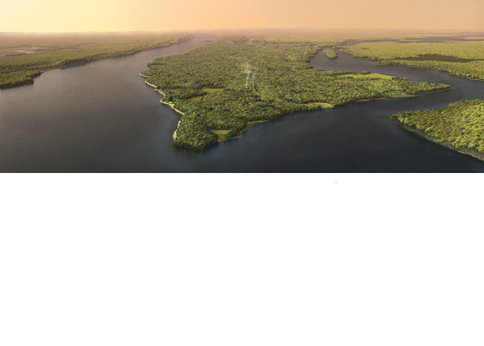

</center>

## {.smaller}

<center>

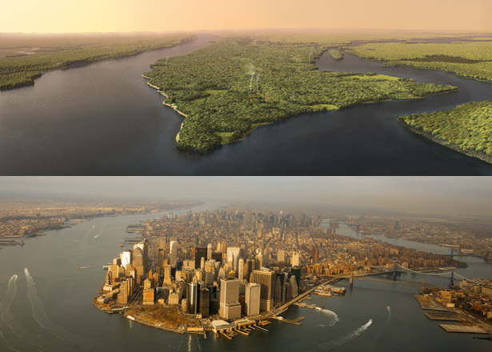

</center>

&nbsp;&nbsp;&nbsp;&nbsp;&nbsp;&nbsp;&nbsp;&nbsp;&nbsp;&nbsp;&nbsp;&nbsp;&nbsp;&nbsp;&nbsp;&nbsp; Computer Image: [Markley Boyer](https://www.facebook.com/markley.boyer), Photo Image: [Robert Clark](http://www.nationalgeographic.com/contributors/c/photographer-robert-clark/)  
&nbsp;&nbsp;&nbsp;&nbsp;&nbsp;&nbsp;&nbsp;&nbsp;&nbsp;&nbsp;&nbsp;&nbsp;&nbsp;&nbsp;&nbsp;&nbsp; [National Geographic](http://ngm.nationalgeographic.com/2009/09/manhattan/miller-text), [The Welikia Project](https://welikia.org/)


## {.smaller}

<center>

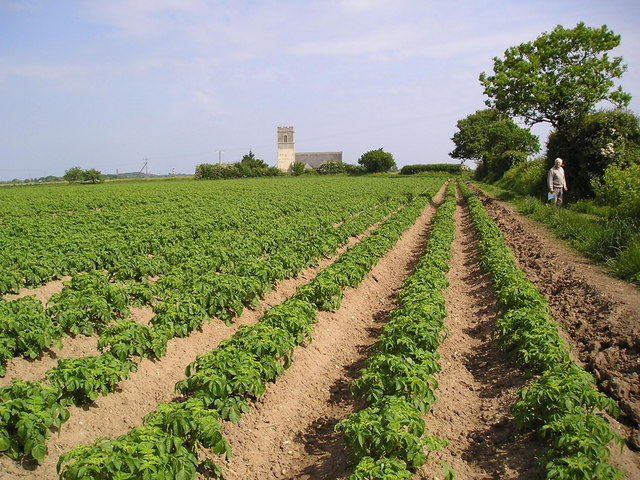

<br><br>

</center>

&nbsp;&nbsp;&nbsp;&nbsp;&nbsp;&nbsp;&nbsp;&nbsp;&nbsp;&nbsp;&nbsp;&nbsp;&nbsp;&nbsp;&nbsp;&nbsp; Image: [Janet Tench](https://commons.wikimedia.org/wiki/File:Norfolk_potato_field_-_geograph.org.uk_-_180521.jpg)

## {.smaller}

<center>

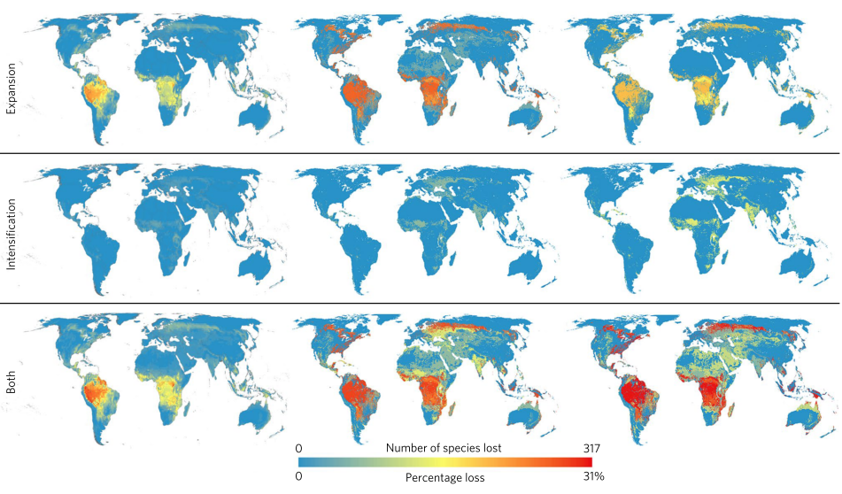

</center>

<br><br><br>

&nbsp;&nbsp;&nbsp;&nbsp;&nbsp;&nbsp;&nbsp;&nbsp;&nbsp;&nbsp;&nbsp;&nbsp;&nbsp;&nbsp;&nbsp;&nbsp; [Kehoe et al. (2017) *Nat. Ecol. Evol.* **1**:1129–1135](https://www.nature.com/articles/s41559-017-0234-3) 

##

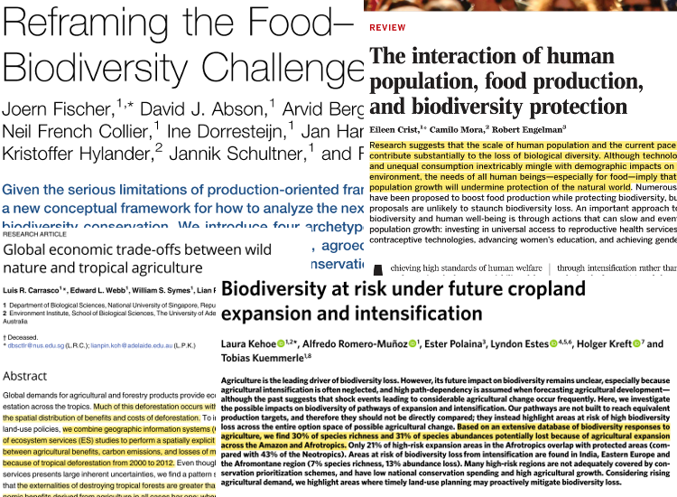

##

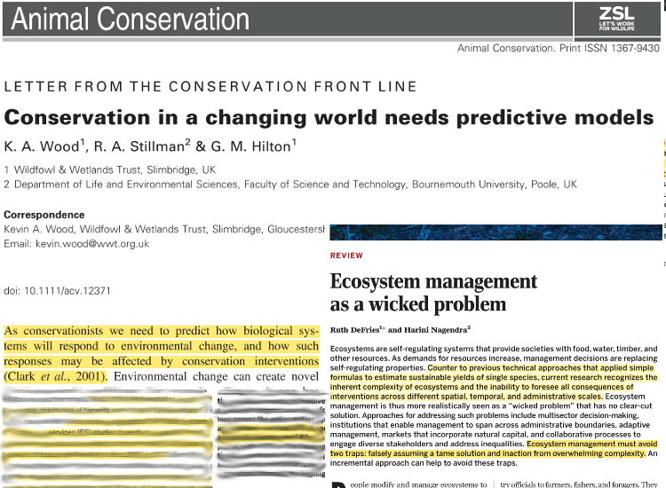

# Uncertainty and conservation conflict

##

<center>

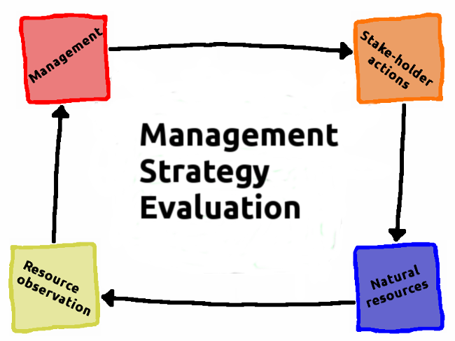

</center>

## {.smaller}

<center>

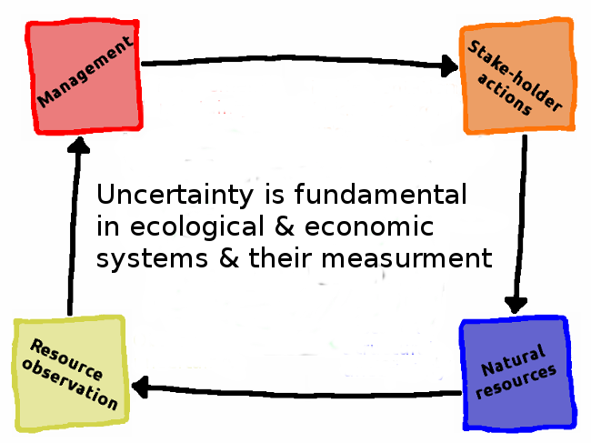

</center>

<br>

&nbsp;&nbsp;&nbsp;&nbsp;&nbsp;&nbsp;&nbsp;&nbsp;&nbsp;&nbsp;&nbsp;&nbsp;&nbsp;&nbsp;&nbsp;&nbsp; [Bunnefeld et al. (2011) *Trends. Ecol. Evol.* **26**:441-447](https://doi.org/10.1016/j.tree.2011.05.003)  
&nbsp;&nbsp;&nbsp;&nbsp;&nbsp;&nbsp;&nbsp;&nbsp;&nbsp;&nbsp;&nbsp;&nbsp;&nbsp;&nbsp;&nbsp;&nbsp; [Chadès et al. (2017) *Theor. Ecol.* **10**:1-10](https://doi.org/10.1007/s12080-016-0313-0)


## {.smaller}

<center>


</center>

<br>

&nbsp;&nbsp;&nbsp;&nbsp;&nbsp;&nbsp;&nbsp;&nbsp;&nbsp;&nbsp;&nbsp;&nbsp;&nbsp;&nbsp;&nbsp;&nbsp; [Bunnefeld et al. (2011) *Trends. Ecol. Evol.* **26**:441-447](https://doi.org/10.1016/j.tree.2011.05.003)  
&nbsp;&nbsp;&nbsp;&nbsp;&nbsp;&nbsp;&nbsp;&nbsp;&nbsp;&nbsp;&nbsp;&nbsp;&nbsp;&nbsp;&nbsp;&nbsp; [Chadès et al. (2017) *Theor. Ecol.* **10**:1-10](https://doi.org/10.1007/s12080-016-0313-0)


## {.smaller}

<!--- Transition from global to local scale --->

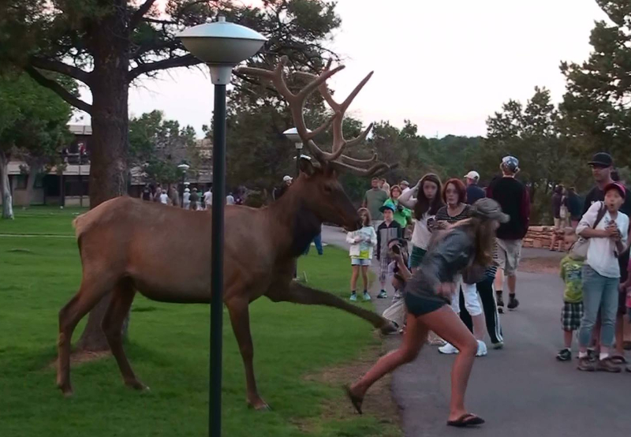

<center>
**Image**: [Public domain](https://commons.wikimedia.org/wiki/File:Human-wildlife_conflict.jpg)
</center>

## {.smaller}

<div class = "columns-2">

<!--- 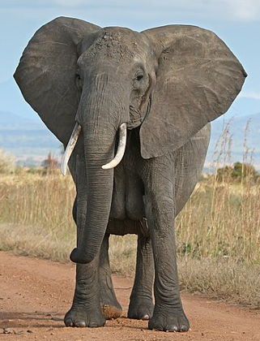 --->

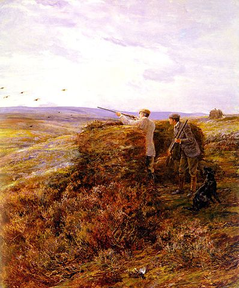


**Conservation conflicts between biodiversity and food security result when the outcome of one stake-holder is affected by one or more other stake-holders** ([Colyvan et al. (2011) *Biol. Conserv.* **144**:1246-1253](http://www.sciencedirect.com/science/article/pii/S000632071000488X?via%3Dihub))

<br>

- People with strongly held views clash over objectives
- Negative effect on sustainability, biodiversity, and human livelihood
- MSE does not integrate the livelihood decisions of people

</div>
<br><br>
<center>

**Image:** [Public](https://commons.wikimedia.org/wiki/File:Hardy_Heywood_-_The_Grouse_Shoot_1898.jpg) [Domain](https://commons.wikimedia.org/wiki/File:Henharrier.jpg)
<!--- **Image:** [Muhammad Mahdi Karim](https://en.wikipedia.org/wiki/User:Muhammad_Mahdi_Karim) --->

</center>

## {.smaller}

<div class = "columns-2">

<!---  --->

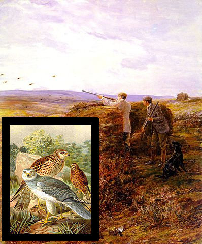


**Conservation conflicts between biodiversity and food security result when the outcome of one stake-holder is affected by one or more other stake-holders** ([Colyvan et al. (2011) *Biol. Conserv.* **144**:1246-1253](http://www.sciencedirect.com/science/article/pii/S000632071000488X?via%3Dihub))

<br>

- People with strongly held views clash over objectives
- Negative effect on sustainability, biodiversity, and human livelihood
- MSE does not integrate the livelihood decisions of people

</div>

<br><br>

<center>

**Image:** [Public](https://commons.wikimedia.org/wiki/File:Hardy_Heywood_-_The_Grouse_Shoot_1898.jpg) [Domain](https://commons.wikimedia.org/wiki/File:Henharrier.jpg)
<!--- **Image:** [Muhammad Mahdi Karim](https://en.wikipedia.org/wiki/User:Muhammad_Mahdi_Karim) --->

</center>


## The ConFooBio Project

**Resolving conflicts between food security and biodiversity conservation under uncertainty**

<div class = "columns-2">


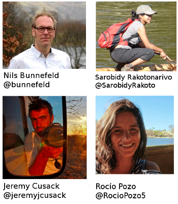

</div>


## The ConFooBio Project

**Resolving conflicts between food security and biodiversity conservation under uncertainty**

<div class = "columns-2">


<br><br><br>

- What leads to conservation conflict?
- How to resolve conservation conflict?
- Impact on sustainability of social-ecological systems?

</div>

# Game theory in conservation conflict

<!--- Get the ERC logo and EU flag in here? --->

## Game theory: conflict and cooperation

<div class="columns-2">

- Formalisation and study of conflict and cooperation between rational decision-makers
- Broadly encompasses combinatorial games (e.g., tic-tac-toe, chess) and evolutionary invasion analysis (adaptive dynamics)
- Compatibile with agent-based modelling


</div>
<hr>

<br>

&nbsp;&nbsp;&nbsp;&nbsp;&nbsp;&nbsp;&nbsp;&nbsp; [Adami et al. (2016) *Phys. Life. Rev.* **19**:1-26](http://dx.doi.org/10.1016/j.plrev.2016.08.015)

## {.smaller}

<div class="columns-2">

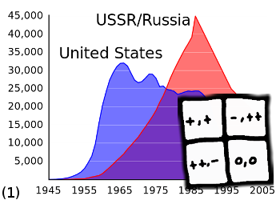.

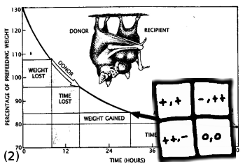.

.

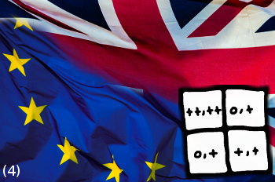.

</div>

<br>

&nbsp;&nbsp;&nbsp;&nbsp;&nbsp;&nbsp; **Images:** (1) [Public license](https://commons.wikimedia.org/wiki/File:US_and_USSR_nuclear_stockpiles.svg), (2) [Wilkinson 1990](https://projects.ncsu.edu/project/evoresources/Evolutionary%20medicine/Unitsofselection%20DM%20copy/wilkinson-foodsharing.pdf), (3) [Isaacdm](https://commons.wikimedia.org/wiki/File:PhysicsofPenalty.JPG?uselang=en-gb), (4) [Public license](http://www.publicdomainpictures.net/view-image.php?image=180560&picture=brexit-referendum-uk)


## Conflict in conservation

Game theory provides a natural framework for addressing issues of cooperation and conflict in conservation.

- Game theory can be used to understand stake-holder decision making ([Kark et al. 2015 *Curr. Opin. Environ. Sustainability* **12**:12-24]()).

- Game-theoretic models can suggest novel management strategies ([Colvan et al. 2011 *Biol. Conserv.* **144**:1246-1253](http://dx.doi.org/10.1016/j.biocon.2010.10.028); [Tilman et al. 2016 *Theor. Ecol.*](http://link.springer.com/article/10.1007%2Fs12080-016-0318-8)).

- Game theory can consider multiple management objectives simultaneously ([Lee 2012 *Chemosphere* **87**:608-613](http://dx.doi.org/10.1016/j.chemosphere.2012.01.014)).

## Stake-holders are complex

<div class="columns-2">

**Simple models assume that stake-holders:**

- Know what pay-offs will be
- Have clearly defined choices
- Behave rationally
- Understand the games
- Prioritise outcomes clearly


</div>

## Conservation conflicts are complex {.smaller}

<div class="columns-2">

 - **Asymmetric payoffs**: Payoffs of choices may depend instead on stake-holder identity.

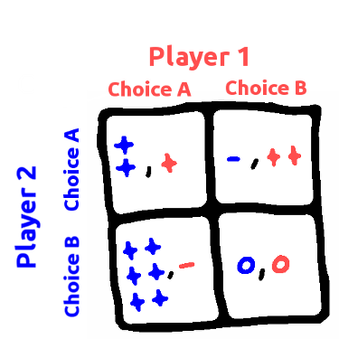

</div>

## But most games are more complex {.smaller}

<div class="columns-2">

 - **Asymmetric payoffs**: Payoffs of choices may depend instead on stake-holder identity.
  - **Multiple choices**: Players might have three or more choices.

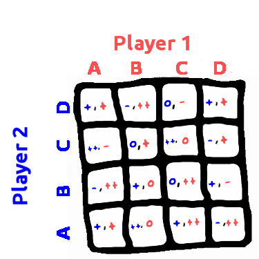

</div>

## But most games are more complex {.smaller}

<div class="columns-2">

 - **Asymmetric payoffs**: Payoffs of choices may depend instead on stake-holder identity.
 - **Multiple choices**: Players might have three or more choices.
 - **Multiple players**: More than two stake-holders might interact at one time.

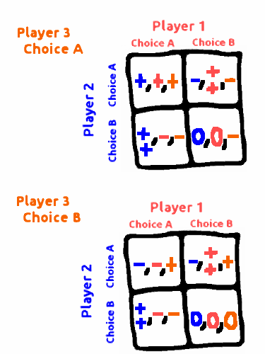

</div>

## But most games are more complex {.smaller}

<div class="columns-2">

 - **Asymmetric payoffs**: Payoffs of choices may depend instead on stake-holder identity.
 - **Multiple choices**: Players might have three or more choices.
 - **Multiple players**: More than two stake-holders might interact at one time.
 - **Iterated interactions**: Strategies maybe affected by interaction history.

```{r, echo=FALSE}
rounds  <- as.character(1:9);
players <- c("Player 1","Player 2");
plays   <- sample(x=c(0,1), size=18, replace=TRUE);
plays[plays == 0] <- "A";
plays[plays == 1] <- "B";
history <- matrix(data=plays, nrow=2);
rownames(history) <- players;
colnames(history) <- rounds;
kable(noquote(history));
```


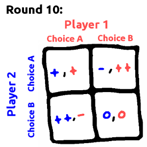


</div>


##{.smaller}

<center>


</center>


## {.smaller}

<center>

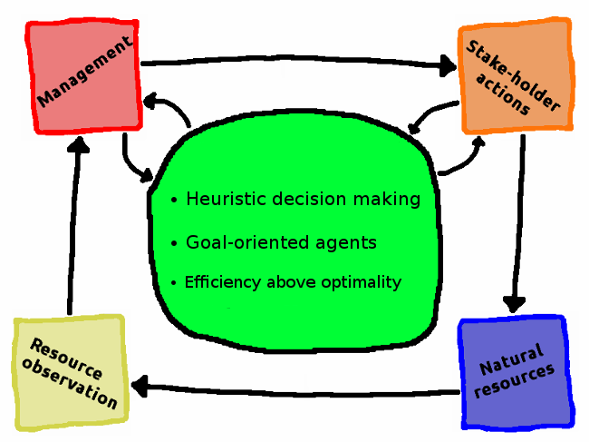

</center>

<br><br><br>

&nbsp;&nbsp;&nbsp;&nbsp;&nbsp;&nbsp;&nbsp;&nbsp;&nbsp;&nbsp;&nbsp;&nbsp;&nbsp;&nbsp;&nbsp;&nbsp; [Bunnefeld et al. (2011) *Trends. Ecol. Evol.* **26**:441-447](https://doi.org/10.1016/j.tree.2011.05.003)  

## {.smaller}

<center>

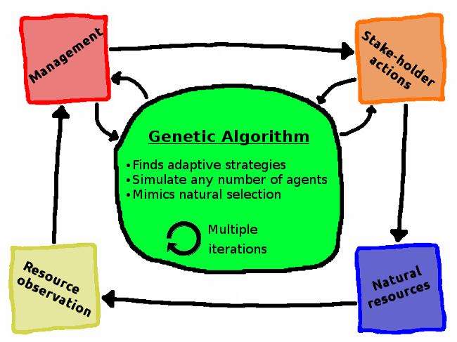

</center>

# Genetic algorithms, and an example using Prisoner's dilemma

<!--- 
    START OF THE GENETIC ALGORITHM SET OF SLIDES  ------------------------------
--->

## Structure of a genetic algorithm

<div class="columns-2">

```{r, echo=FALSE}
mbox <- function(x0, x1, y0, y1){
    xx <- seq(from=x0, to=x1, length.out = 100);
    yy <- seq(from=y0, to=y1, length.out = 100);
    xd <- c(rep(x0, 100), xx, rep(x1,100), rev(xx));
    yd <- c(yy, rep(y1,100), rev(yy), rep(y0, 100));
    return(list(x=xd, y=yd));
}

par(mar=c(0,0,0,0));
# ===============================================================
plot(x=0, y=0, type="n", xlim=c(0,200), ylim=c(0,100), xaxt="n", yaxt="n",
     xlab="",ylab="", bty="n");
abox <- mbox(x0 = 0, x1 = 45, y0 = 70, y1 = 90);
polygon(x=abox$x, y=abox$y, lwd=3, border="red", col="rosybrown1");
text(x=22, y=85, labels="Random", col="black");
text(x=22, y=80, labels="seed of", col="black");
text(x=22, y=75, labels="strategies", col="black");
# --------------------------------------------------------------
cbox <- mbox(x0 = 70, x1 = 140, y0 = 0, y1 = 90);
polygon(x=cbox$x, y=cbox$y, lwd=3, border="goldenrod4", col="gold3");
arrows(x0=46, x1=70, y0=82, y1=82, lwd=2, length=0.15);
dbox <- mbox(x0 = 75, x1 = 135, y0 = 75, y1 = 88);
polygon(x=dbox$x, y=dbox$y, lwd=3, border="goldenrod4", col="white");
text(x=105, y=84, labels="Begin new", col="black");
text(x=105, y=79, labels="generation", col="black");
# ===============================================================
```

<br>

**Table of strategies**

```{r, echo=FALSE}
randvals <- sample(x=1:5, size=32, replace=TRUE);
agents   <- matrix(data=randvals, nrow=8);
rownames(agents) <- c("Strategy 1", "Strategy 2", "Strategy 3", "Strategy 4",
                      "Strategy 5", "Strategy 6", "Strategy 7", "Strategy 8");
colnames(agents) <- c("L1", "L2", "L3", "L4");
kable(agents, format="html");
```

</div>

## Structure of a genetic algorithm

<div class="columns-2">

```{r, echo=FALSE}
mbox <- function(x0, x1, y0, y1){
    xx <- seq(from=x0, to=x1, length.out = 100);
    yy <- seq(from=y0, to=y1, length.out = 100);
    xd <- c(rep(x0, 100), xx, rep(x1,100), rev(xx));
    yd <- c(yy, rep(y1,100), rev(yy), rep(y0, 100));
    return(list(x=xd, y=yd));
}

par(mar=c(0,0,0,0));
# ===============================================================
plot(x=0, y=0, type="n", xlim=c(0,200), ylim=c(0,100), xaxt="n", yaxt="n",
     xlab="",ylab="", bty="n");
abox <- mbox(x0 = 0, x1 = 45, y0 = 70, y1 = 90);
polygon(x=abox$x, y=abox$y, lwd=3, border="red", col="rosybrown1");
text(x=22, y=85, labels="Random", col="black");
text(x=22, y=80, labels="seed of", col="black");
text(x=22, y=75, labels="strategies", col="black");
# --------------------------------------------------------------
cbox <- mbox(x0 = 70, x1 = 140, y0 = 0, y1 = 90);
polygon(x=cbox$x, y=cbox$y, lwd=3, border="goldenrod4", col="gold3");
arrows(x0=46, x1=70, y0=82, y1=82, lwd=2, length=0.15);
dbox <- mbox(x0 = 75, x1 = 135, y0 = 75, y1 = 88);
polygon(x=dbox$x, y=dbox$y, lwd=3, border="goldenrod4", col="white");
text(x=105, y=84, labels="Begin new", col="black");
text(x=105, y=79, labels="generation", col="black");
# --------------------------------------------------------------
ebox <- mbox(x0 = 75, x1 = 135, y0 = 63, y1 = 73);
polygon(x=ebox$x, y=ebox$y, lwd=3, border="goldenrod4", col="white");
text(x=105, y=68, labels="recombination", col="black");
# ===============================================================
```

<br>

**Table of strategies**

```{r, echo=FALSE}
for(i in 1:dim(agents)[1]){
    for(j in 1:dim(agents)[2]){
        check <- runif(n=1);
        if(check < 0.2){
            other            <- sample(x=1:dim(agents)[1], size=1);
            temp             <- agents[i,j];
            agents[i,j]      <- agents[other, j];
            agents[other, j] <- temp;
        }
    }
}
kable(agents, format="html");
```

</div>

## Structure of a genetic algorithm

<div class="columns-2">

```{r, echo=FALSE}
mbox <- function(x0, x1, y0, y1){
    xx <- seq(from=x0, to=x1, length.out = 100);
    yy <- seq(from=y0, to=y1, length.out = 100);
    xd <- c(rep(x0, 100), xx, rep(x1,100), rev(xx));
    yd <- c(yy, rep(y1,100), rev(yy), rep(y0, 100));
    return(list(x=xd, y=yd));
}

par(mar=c(0,0,0,0));
# ===============================================================
plot(x=0, y=0, type="n", xlim=c(0,200), ylim=c(0,100), xaxt="n", yaxt="n",
     xlab="",ylab="", bty="n");
abox <- mbox(x0 = 0, x1 = 45, y0 = 70, y1 = 90);
polygon(x=abox$x, y=abox$y, lwd=3, border="red", col="rosybrown1");
text(x=22, y=85, labels="Random", col="black");
text(x=22, y=80, labels="seed of", col="black");
text(x=22, y=75, labels="strategies", col="black");
# --------------------------------------------------------------
cbox <- mbox(x0 = 70, x1 = 140, y0 = 0, y1 = 90);
polygon(x=cbox$x, y=cbox$y, lwd=3, border="goldenrod4", col="gold3");
arrows(x0=46, x1=70, y0=82, y1=82, lwd=2, length=0.15);
dbox <- mbox(x0 = 75, x1 = 135, y0 = 75, y1 = 88);
polygon(x=dbox$x, y=dbox$y, lwd=3, border="goldenrod4", col="white");
text(x=105, y=84, labels="Begin new", col="black");
text(x=105, y=79, labels="generation", col="black");
# --------------------------------------------------------------
ebox <- mbox(x0 = 75, x1 = 135, y0 = 63, y1 = 73);
polygon(x=ebox$x, y=ebox$y, lwd=3, border="goldenrod4", col="white");
text(x=105, y=68, labels="recombination", col="black");
# --------------------------------------------------------------
fbox <- mbox(x0 = 75, x1 = 135, y0 = 51, y1 = 61);
polygon(x=fbox$x, y=fbox$y, lwd=3, border="goldenrod4", col="white");
text(x=105, y=56, labels="mutation", col="black");
# ===============================================================
```

<br>

**Table of strategies**

```{r, echo=FALSE}
for(i in 1:dim(agents)[1]){
    for(j in 1:dim(agents)[2]){
        check <- runif(n=1);
        if(check < 0.2){
            agents[i,j]  <- sample(x=1:5, size=1);
        }
    }
}
kable(agents, format="html");
```

</div>

## Structure of a genetic algorithm

<div class="columns-2">

```{r, echo=FALSE}
mbox <- function(x0, x1, y0, y1){
    xx <- seq(from=x0, to=x1, length.out = 100);
    yy <- seq(from=y0, to=y1, length.out = 100);
    xd <- c(rep(x0, 100), xx, rep(x1,100), rev(xx));
    yd <- c(yy, rep(y1,100), rev(yy), rep(y0, 100));
    return(list(x=xd, y=yd));
}

par(mar=c(0,0,0,0));
# ===============================================================
plot(x=0, y=0, type="n", xlim=c(0,200), ylim=c(0,100), xaxt="n", yaxt="n",
     xlab="",ylab="", bty="n");
abox <- mbox(x0 = 0, x1 = 45, y0 = 70, y1 = 90);
polygon(x=abox$x, y=abox$y, lwd=3, border="red", col="rosybrown1");
text(x=22, y=85, labels="Random", col="black");
text(x=22, y=80, labels="seed of", col="black");
text(x=22, y=75, labels="strategies", col="black");
# --------------------------------------------------------------
cbox <- mbox(x0 = 70, x1 = 140, y0 = 0, y1 = 90);
polygon(x=cbox$x, y=cbox$y, lwd=3, border="goldenrod4", col="gold3");
arrows(x0=46, x1=70, y0=82, y1=82, lwd=2, length=0.15);
dbox <- mbox(x0 = 75, x1 = 135, y0 = 75, y1 = 88);
polygon(x=dbox$x, y=dbox$y, lwd=3, border="goldenrod4", col="white");
text(x=105, y=84, labels="Begin new", col="black");
text(x=105, y=79, labels="generation", col="black");
# --------------------------------------------------------------
ebox <- mbox(x0 = 75, x1 = 135, y0 = 63, y1 = 73);
polygon(x=ebox$x, y=ebox$y, lwd=3, border="goldenrod4", col="white");
text(x=105, y=68, labels="recombination", col="black");
# --------------------------------------------------------------
fbox <- mbox(x0 = 75, x1 = 135, y0 = 51, y1 = 61);
polygon(x=fbox$x, y=fbox$y, lwd=3, border="goldenrod4", col="white");
text(x=105, y=56, labels="mutation", col="black");
# --------------------------------------------------------------
gbox <- mbox(x0 = 75, x1 = 135, y0 = 39, y1 = 49);
polygon(x=gbox$x, y=gbox$y, lwd=3, border="goldenrod4", col="white");
text(x=105, y=44, labels="check fitness", col="black");
# ===============================================================
```

<br>

**Table of strategies**

```{r, echo=FALSE}
fit <- apply(agents,1,sum);
kable(cbind(agents,fit), format="html");
```

</div>

## Structure of a genetic algorithm

<div class="columns-2">

```{r, echo=FALSE}
mbox <- function(x0, x1, y0, y1){
    xx <- seq(from=x0, to=x1, length.out = 100);
    yy <- seq(from=y0, to=y1, length.out = 100);
    xd <- c(rep(x0, 100), xx, rep(x1,100), rev(xx));
    yd <- c(yy, rep(y1,100), rev(yy), rep(y0, 100));
    return(list(x=xd, y=yd));
}

par(mar=c(0,0,0,0));
# ===============================================================
plot(x=0, y=0, type="n", xlim=c(0,200), ylim=c(0,100), xaxt="n", yaxt="n",
     xlab="",ylab="", bty="n");
abox <- mbox(x0 = 0, x1 = 45, y0 = 70, y1 = 90);
polygon(x=abox$x, y=abox$y, lwd=3, border="red", col="rosybrown1");
text(x=22, y=85, labels="Random", col="black");
text(x=22, y=80, labels="seed of", col="black");
text(x=22, y=75, labels="strategies", col="black");
# --------------------------------------------------------------
cbox <- mbox(x0 = 70, x1 = 140, y0 = 0, y1 = 90);
polygon(x=cbox$x, y=cbox$y, lwd=3, border="goldenrod4", col="gold3");
arrows(x0=46, x1=70, y0=82, y1=82, lwd=2, length=0.15);
dbox <- mbox(x0 = 75, x1 = 135, y0 = 75, y1 = 88);
polygon(x=dbox$x, y=dbox$y, lwd=3, border="goldenrod4", col="white");
text(x=105, y=84, labels="Begin new", col="black");
text(x=105, y=79, labels="generation", col="black");
# --------------------------------------------------------------
ebox <- mbox(x0 = 75, x1 = 135, y0 = 63, y1 = 73);
polygon(x=ebox$x, y=ebox$y, lwd=3, border="goldenrod4", col="white");
text(x=105, y=68, labels="recombination", col="black");
# --------------------------------------------------------------
fbox <- mbox(x0 = 75, x1 = 135, y0 = 51, y1 = 61);
polygon(x=fbox$x, y=fbox$y, lwd=3, border="goldenrod4", col="white");
text(x=105, y=56, labels="mutation", col="black");
# --------------------------------------------------------------
gbox <- mbox(x0 = 75, x1 = 135, y0 = 39, y1 = 49);
polygon(x=gbox$x, y=gbox$y, lwd=3, border="goldenrod4", col="white");
text(x=105, y=44, labels="check fitness", col="black");
# --------------------------------------------------------------
hbox <- mbox(x0 = 75, x1 = 135, y0 = 27, y1 = 37);
polygon(x=hbox$x, y=hbox$y, lwd=3, border="goldenrod4", col="white");
text(x=105, y=32, labels="selection", col="black");
# ===============================================================
```

<br>

**Table of strategies**

```{r, echo=FALSE}
ord <- order(fit, decreasing=TRUE);
agents <- agents[ord,];
fit    <- fit[ord];
kable(cbind(agents,fit), format="html");
```

</div>

## Structure of a genetic algorithm

<div class="columns-2">

```{r, echo=FALSE}
mbox <- function(x0, x1, y0, y1){
    xx <- seq(from=x0, to=x1, length.out = 100);
    yy <- seq(from=y0, to=y1, length.out = 100);
    xd <- c(rep(x0, 100), xx, rep(x1,100), rev(xx));
    yd <- c(yy, rep(y1,100), rev(yy), rep(y0, 100));
    return(list(x=xd, y=yd));
}

par(mar=c(0,0,0,0));
# ===============================================================
plot(x=0, y=0, type="n", xlim=c(0,200), ylim=c(0,100), xaxt="n", yaxt="n",
     xlab="",ylab="", bty="n");
abox <- mbox(x0 = 0, x1 = 45, y0 = 70, y1 = 90);
polygon(x=abox$x, y=abox$y, lwd=3, border="red", col="rosybrown1");
text(x=22, y=85, labels="Random", col="black");
text(x=22, y=80, labels="seed of", col="black");
text(x=22, y=75, labels="strategies", col="black");
# --------------------------------------------------------------
cbox <- mbox(x0 = 70, x1 = 140, y0 = 0, y1 = 90);
polygon(x=cbox$x, y=cbox$y, lwd=3, border="goldenrod4", col="gold3");
arrows(x0=46, x1=70, y0=82, y1=82, lwd=2, length=0.15);
dbox <- mbox(x0 = 75, x1 = 135, y0 = 75, y1 = 88);
polygon(x=dbox$x, y=dbox$y, lwd=3, border="goldenrod4", col="white");
text(x=105, y=84, labels="Begin new", col="black");
text(x=105, y=79, labels="generation", col="black");
# --------------------------------------------------------------
ebox <- mbox(x0 = 75, x1 = 135, y0 = 63, y1 = 73);
polygon(x=ebox$x, y=ebox$y, lwd=3, border="goldenrod4", col="white");
text(x=105, y=68, labels="recombination", col="black");
# --------------------------------------------------------------
fbox <- mbox(x0 = 75, x1 = 135, y0 = 51, y1 = 61);
polygon(x=fbox$x, y=fbox$y, lwd=3, border="goldenrod4", col="white");
text(x=105, y=56, labels="mutation", col="black");
# --------------------------------------------------------------
gbox <- mbox(x0 = 75, x1 = 135, y0 = 39, y1 = 49);
polygon(x=gbox$x, y=gbox$y, lwd=3, border="goldenrod4", col="white");
text(x=105, y=44, labels="check fitness", col="black");
# --------------------------------------------------------------
hbox <- mbox(x0 = 75, x1 = 135, y0 = 27, y1 = 37);
polygon(x=hbox$x, y=hbox$y, lwd=3, border="goldenrod4", col="white");
text(x=105, y=32, labels="selection", col="black");
# --------------------------------------------------------------
ibox <- mbox(x0 = 75, x1 = 135, y0 = 15, y1 = 25);
polygon(x=ibox$x, y=ibox$y, lwd=3, border="goldenrod4", col="white");
text(x=105, y=20, labels="replacement", col="black");
# ===============================================================
```

<br>

**Table of strategies**

```{r, echo=FALSE}
agents <- rbind(agents[1,],
                agents[1,],
                agents[2,],
                agents[2,],
                agents[3,],
                agents[3,],
                agents[4,],
                agents[4,]
                );
fit    <- c(fit[1], fit[1], fit[2], fit[2], fit[3], fit[3], fit[4], fit[4]);
kable(cbind(agents,fit), format="html");
```

</div>

## Structure of a genetic algorithm

<div class="columns-2">

```{r, echo=FALSE}
mbox <- function(x0, x1, y0, y1){
    xx <- seq(from=x0, to=x1, length.out = 100);
    yy <- seq(from=y0, to=y1, length.out = 100);
    xd <- c(rep(x0, 100), xx, rep(x1,100), rev(xx));
    yd <- c(yy, rep(y1,100), rev(yy), rep(y0, 100));
    return(list(x=xd, y=yd));
}

par(mar=c(0,0,0,0));
# ===============================================================
plot(x=0, y=0, type="n", xlim=c(0,200), ylim=c(0,100), xaxt="n", yaxt="n",
     xlab="",ylab="", bty="n");
abox <- mbox(x0 = 0, x1 = 45, y0 = 70, y1 = 90);
polygon(x=abox$x, y=abox$y, lwd=3, border="red", col="rosybrown1");
text(x=22, y=85, labels="Random", col="black");
text(x=22, y=80, labels="seed of", col="black");
text(x=22, y=75, labels="strategies", col="black");
# --------------------------------------------------------------
cbox <- mbox(x0 = 70, x1 = 140, y0 = 0, y1 = 90);
polygon(x=cbox$x, y=cbox$y, lwd=3, border="goldenrod4", col="gold3");
arrows(x0=46, x1=70, y0=82, y1=82, lwd=2, length=0.15);
dbox <- mbox(x0 = 75, x1 = 135, y0 = 75, y1 = 88);
polygon(x=dbox$x, y=dbox$y, lwd=3, border="goldenrod4", col="white");
text(x=105, y=84, labels="Begin new", col="black");
text(x=105, y=79, labels="generation", col="black");
# --------------------------------------------------------------
ebox <- mbox(x0 = 75, x1 = 135, y0 = 63, y1 = 73);
polygon(x=ebox$x, y=ebox$y, lwd=3, border="goldenrod4", col="white");
text(x=105, y=68, labels="recombination", col="black");
# --------------------------------------------------------------
fbox <- mbox(x0 = 75, x1 = 135, y0 = 51, y1 = 61);
polygon(x=fbox$x, y=fbox$y, lwd=3, border="goldenrod4", col="white");
text(x=105, y=56, labels="mutation", col="black");
# --------------------------------------------------------------
gbox <- mbox(x0 = 75, x1 = 135, y0 = 39, y1 = 49);
polygon(x=gbox$x, y=gbox$y, lwd=3, border="goldenrod4", col="white");
text(x=105, y=44, labels="check fitness", col="black");
# --------------------------------------------------------------
hbox <- mbox(x0 = 75, x1 = 135, y0 = 27, y1 = 37);
polygon(x=hbox$x, y=hbox$y, lwd=3, border="goldenrod4", col="white");
text(x=105, y=32, labels="selection", col="black");
# --------------------------------------------------------------
ibox <- mbox(x0 = 75, x1 = 135, y0 = 15, y1 = 25);
polygon(x=ibox$x, y=ibox$y, lwd=3, border="goldenrod4", col="white");
text(x=105, y=20, labels="replacement", col="black");
# --------------------------------------------------------------
jbox <- mbox(x0 = 75, x1 = 135, y0 = 3, y1 = 13);
polygon(x=jbox$x, y=jbox$y, lwd=3, border="goldenrod4", col="white");
text(x=105, y=8, labels="converge?", col="black");
# --------------------------------------------------------------
bbox <- mbox(x0 = 0, x1 = 45, y0 = 20, y1 = 40);
polygon(x=bbox$x, y=bbox$y, lwd=3, border="blue", col="lightsteelblue1");
arrows(x0=70, x1=22.5, y0=5, y1=5, lwd=2, length=0.0);
arrows(x0=22, x1=22, y0=5, y1=20, lwd=2, length=0.15);
arrows(x0=55, x1=55, y0=5, y1=82, lwd=2, length=0.15);
text(x=15, y=10, labels="Yes", col="black", srt=90);
text(x=50, y=10, labels="No", col="black", srt=90);
text(x=22, y=33, labels="Adaptive", col="black");
text(x=22, y=28, labels="strategies", col="black");
# ===============================================================
```

<br>

**Table of strategies**

```{r, echo=FALSE}
kable(cbind(agents,fit), format="html");
```

</div>

<!--- 
    END OF THE GENETIC ALGORITHM SET OF SLIDES  --------------------------------
--->

## Iterated Prisoner's dilemma rules {.smaller}

<div class="columns-2">


**General structure of Prisoner's dilemma scenario**

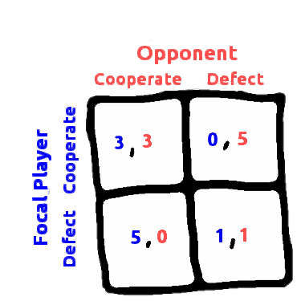
**Specific payoffs satisfying a Prisoner's dilemma scenario**

</div>

## Use of genetic algorithms {.smaller}

**Each locus is an focal player's choice given an opponent's past three choices (plus one choice of first move)**

<hr>


|                  | **CCC** | **CCD** | **CDC** | **CDD** | **DCC** | **DCD** | **DDC** | **DDD** | **1st** |
|------------------|---------|---------|---------|---------|---------|---------|---------|---------|---------|
| **Strategy 1**   | Choice  | Choice  | Choice  | Choice  | Choice  | Choice  | Choice  | Choice  | Choice  |
| **Strategy 2**   | Choice  | Choice  | Choice  | Choice  | Choice  | Choice  | Choice  | Choice  | Choice  |
| **...**          |   ...   |   ...   |   ...   |   ...   |   ...   |   ...   |   ...   |   ...   |   ...   |
| **Strategy N-1** | Choice  | Choice  | Choice  | Choice  | Choice  | Choice  | Choice  | Choice  | Choice  |
| **Strategy N**   | Choice  | Choice  | Choice  | Choice  | Choice  | Choice  | Choice  | Choice  | Choice  |

<hr>

**Total of 512 possible strategies**

## Use of genetic algorithms {.smaller}

```{r, echo=FALSE}
inputPanel(
    
  numericInput("CC", label = "CC", 0, width="30%"),
  numericInput("DC", label = "DC", 0, width="30%"),
  numericInput("CD", label = "CD", 0, width="30%"),
  numericInput("DD", label = "DD", 0, width="30%"),

  style='width: 2000px; height: 60px'
)
```

<br>

```{r, echo=FALSE}
gres <- reactive({ 
     cc <- input$CC;
     dc <- input$DC;
     cd <- input$CD;
     dd <- input$DD;
     rd <- 100;
     gn <- 100;
     co <- 0.05;
     mu <- 0.05;
 
     game_res <- games_ga(CC = cc, DC = dc, CD = cd, DD = dd, rounds = rd,
                          generations = gn, cross_prob = co, 
                          mutation_prob = mu, num_opponents = 100);     
     all <- c(game_res$genos, "break_1",
              rownames(game_res$genos), "break_2",
              game_res$fitness);
    })
```

```{r, echo = FALSE}
renderPlot({
    break2    <- which(gres()=="break_2")[1]+1;
    end       <- length(gres());
    fitnesses <- gres()[break2:end];
    fitnesses <- as.numeric(fitnesses);
    mean_fit  <- fitnesses / (100 * 100);
    maxpt     <- max(c(input$CC, input$CD, input$DC, input$DD));
    par(mar=c(5,5,1,1));
    plot(x = 1:length(mean_fit), y=mean_fit, type="l", ylim=c(0,maxpt), lwd = 3,
        xlab="Generation", ylab = "Mean strategy fitness per round",
         cex.axis=1.5, cex.lab=1.5);
})
```

## Adaptive strategies simulated {.smaller}

```{r, echo=FALSE}
renderTable({
      break1   <- which(gres()=="break_1")[1] - 1;
      break2   <- which(gres()=="break_2")[1] - 1;
      geno_vec <- gres()[1:break1];
      geno_row <- gres()[(break1+2):break2];
      genos    <- matrix(data =  geno_vec, ncol = 10, byrow = FALSE);
      rownames(genos) <- geno_row;
      colnames(genos) <- c("CCC", "CCD", "CDC", "CDD", "DCC", "DCD", "DDC",
                           "DDD", "1st", "Final %");
      final_table <- genos[1:10,];
     
}, include.rownames=TRUE)
```

# Genetic algorithms in Management Strategy Evaluation


## Generalised MSE {.smaller}

<div class = "columns-2">

- Integrates game theory and ecological theory to construct social-ecological models for adaptive management
- Simulates all aspects of management: population dynamics, manager observation of populations, manager decision making, and stake-holder responses to management decisions
- Mimic the decision-making process of managers and stake-holders under conditions of change, uncertainty, and conflict
- Provide a flexible modelling framework for future development of complex adaptive management models to be applied to conservation theory and specific case studies

<br><br>

<center>

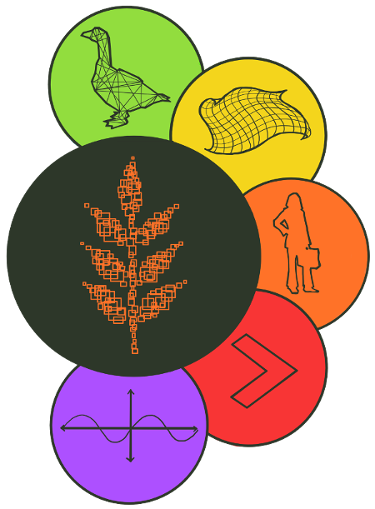

</center>

</div>

## Generalised MSE ('GMSE' R package)

<div class = "columns-2">

- Individual-based
- Spatially explicit
- Written in R and C
- Requires R (>= 3.3.3)
- License GPL (>=2)
- *v0.2.2.7* [available](https://cran.r-project.org/package=GMSE) on CRAN
- Browser-based GUI [available](https://bradduthie.shinyapps.io/gmse_gui/) via shiny
- Source code [available](https://github.com/bradduthie/gmse) on GitHub
- Intended for a wide range of software users

<br><br>

<center>


</center>

</div>


##

<center>

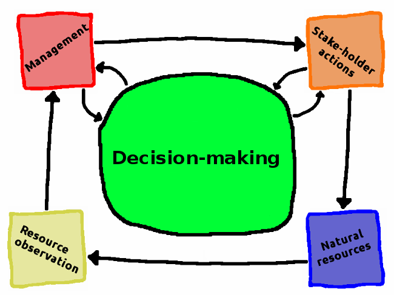

</center>


## GMSE: Natural resources 

<div class = "columns-2">


- Spatially explicit landscape
- Discrete individual resources
- Individual birth, movement, death

<br>

<center>

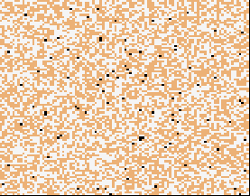

</center>

## GMSE: Resource observation {.smaller}

<div class = "columns-2">


- Four types of observation options
    1. Counting on a subset of landscape
    2. Mark and recapture
    3. Linear transect sampling
    4. Block transect sampling
- Mechanistic sampling process
- Generates simulated data frame used by the manager

<br>

<center>


</center>

</div>

<center>

<br><br><br><br><br><br><br><br>

**Image:** [Public Domain](https://commons.wikimedia.org/wiki/File:Fernglas(alt).JPG)

</center>

## GMSE: Management {.smaller}

<div class = "columns-2">


- One manager analyses observations and compares with a target abundance
- Five possible policy options (scaring, culling, castration, feeding, helping)
- Fixed budget and costs for setting policy
- Genetic algorithm anticipates policy effects from previous actions to set costs of actions for stake-holders

<br>

<center>

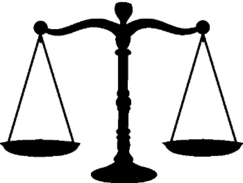

</center>

## GMSE: Stake-holder actions {.smaller}

<div class = "columns-2">

- Any number of stake-holders
- Stake-holders want to maximise harvest of resources or minimise resource effects on their land
- Seven possible actions (scaring, culling, castration, feeding, helping, tend crops, kill crops)
- Fixed budget for performing actions of potentially differing costs
- Genetic algorithm anticipates effects of actions on harvest or land yield

<br>

<center>

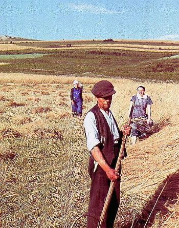

</center>


</div>

<center>

<br>

**Image:** [Public Domain](https://commons.wikimedia.org/wiki/File:Libiaz-zniwa1938.a.jpg)

</center>


# Example use of GMSE

## Running the gmse() function {.smaller}

```{r, echo = TRUE}
sim <- gmse(land_ownership = TRUE, stakeholders = 10, RESOURCE_ini = 1000,
            res_death_K = 2000, manage_target = 1000, res_consume = 1,
            manager_budget = 5000, user_budget = 5000, plotting = FALSE,
            scaring = TRUE, culling = TRUE, observe_type = 1, fixed_mark = 50, 
            fixed_recapt = 300);
```


## Inferring GMSE from plots {.smaller}

**General plot of simulation results.**


```{r, echo = TRUE, eval = FALSE}
plot_gmse_results(sim_results = sim);
```

<br>


**Plot of conflict among stake-holders**

```{r, echo = TRUE, eval = FALSE}
plot_gmse_effort(sim_results = sim);
```


##

<center>

```{r, echo = FALSE, fig.height = 6, fig.width = 7}
plot_gmse_results(sim_results = sim);
```

</center>

## {.smaller}

<center>

```{r, echo = FALSE, fig.height = 6.5, fig.width = 6}
plot_gmse_effort(sim_results = sim);
```

</center>


# [GMSE GUI](https://bradduthie.shinyapps.io/gmse_gui/)

## Use of GMSE: Model case studies

<div class = "columns-2">

<center>

  
**Image:** [M. M. Karim](https://en.wikipedia.org/wiki/User:Muhammad_Mahdi_Karim)

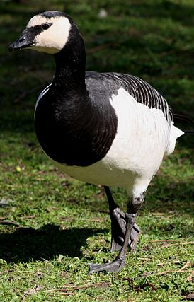  
**Image:** [Raju Kasambe](https://commons.wikimedia.org/wiki/File:Barnacle_Geese_Branta_leucopsis_London_UK_(4).JPG)

</center>

</div>

## Use of GMSE: Theoretical questions

<center>

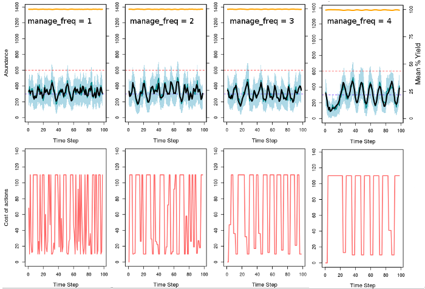 

</center>

## Future software development

<div class = "columns-2">

- Modular `gmse_apply()` function allowing user-supplied natural resource, observation, manager, and user models
- Stuctured populations (e.g., sex, stage)
- Multiple populations of interacting species
- Improved strategy prediction for managers and users
- Interactive decision-making with software users

<center>


</center>

</div>


## {.smaller}

<br>
<center>

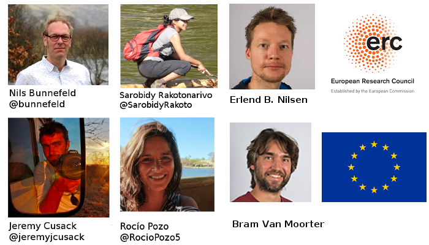

</center>


##

<br><br><br>

<div class = "columns-2">

<center>


  


</center>

</div>