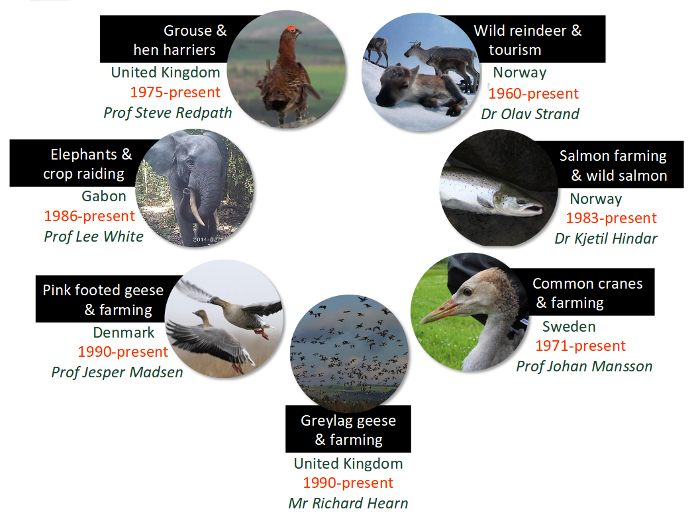
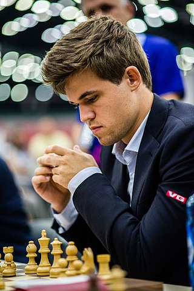
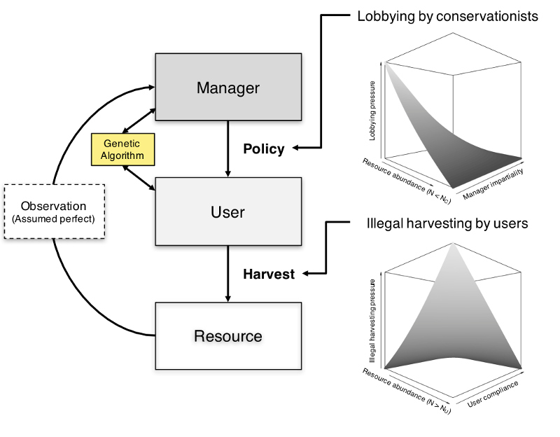
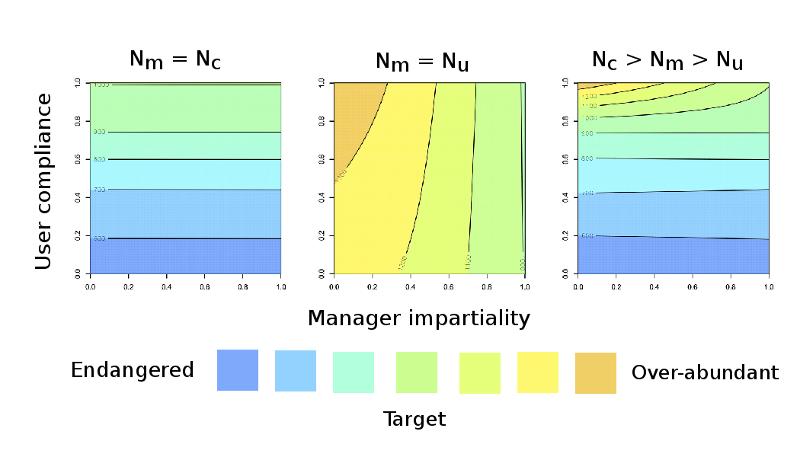
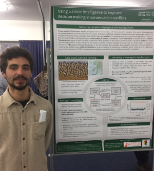
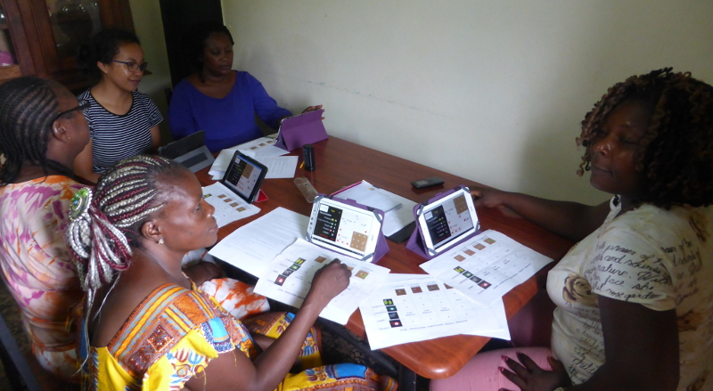
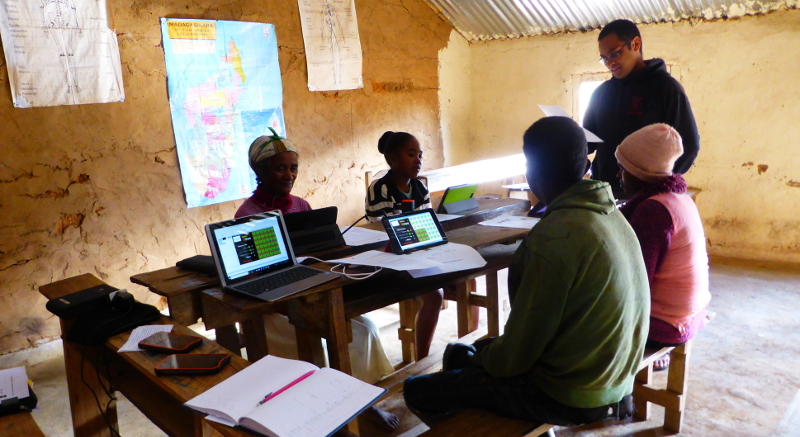
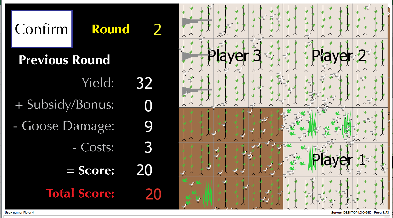
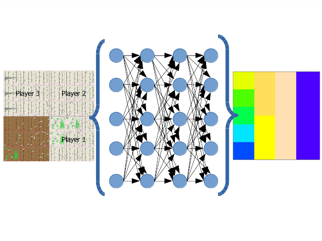
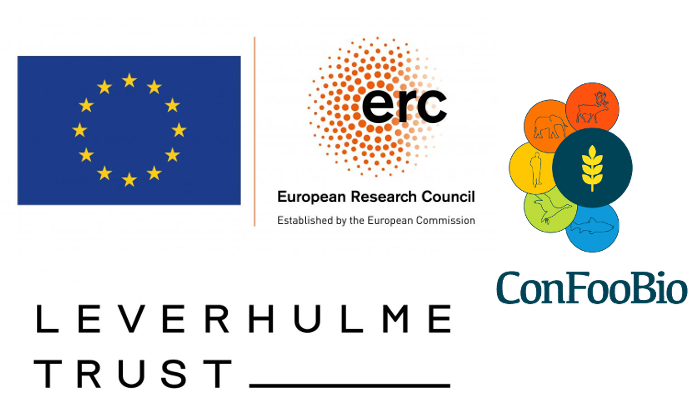

<style type="text/css">
body p {
  color: #000000;
}
ul {
  color: black;
}
ol {
  color: black;
}
a {
    color: darkblue;
    text-decoration: none
}
.fifty {
   font-size: 50%;
   }
.seventy {
   font-size: 70%;
   }
slides > slide.backdrop {
  background: none !important;
  background-color: white !important;
}
slides > slide.title-slide hgroup h1 {
  color: black;
}
slides > slide.title-slide p {
  color: black;
}
slides > slide.light > hgroup h2 {
  color: black;
}
slides > slide.light > hgroup h1 {
  color: black;
}
ul {
  color: black;
}
ol {
  color: black;
}
p {
  color: black
}
h1, h2, h3, h4, h5, h6, h7, h8, p {
    color: black;
}
.checkbox-inline, .radio-inline {
    margin-right: 90px;
}

.forceBreak { -webkit-column-break-after: always; break-after: column; }
</style>


```{r, echo=FALSE}
library(GMSE);
library(knitr);
library(shiny);
```

<!---
1. Know what to say about the Welikia project
---> 


<!---
https://welikia.org/
http://ngm.nationalgeographic.com/2009/09/manhattan/miller-text
https://welikia.org/explore/mannahatta-map/
--->

# Biodiversity and food security

## {.smaller}

<center>


</center>

## {.smaller}

<center>


[Markley Boyer](https://www.facebook.com/markley.boyer), [Robert Clark](http://www.nationalgeographic.com/contributors/c/photographer-robert-clark/), [National Geographic](http://ngm.nationalgeographic.com/2009/09/manhattan/miller-text), [Welikia Project](https://welikia.org/)

</center>

## {.smaller}

<center>


[Janet Tench](https://commons.wikimedia.org/wiki/File:Norfolk_potato_field_-_geograph.org.uk_-_180521.jpg)</footnote>

</center>

## {.smaller}

<center>


[Kehoe et al. (2017) *Nat. Ecol. Evol.* **1**:1129–1135](https://www.nature.com/articles/s41559-017-0234-3)</footnote>

</center>

##


##


# Modelling biodiversity dynamics and human decision-making

##

<center>


</center>

## {.smaller}

<center>


**Management Strategy Evaluation**

</center>

## {.smaller}

<center>


</center>
<br>

&nbsp;&nbsp;&nbsp;&nbsp;&nbsp;&nbsp;&nbsp;&nbsp;&nbsp;&nbsp; Bunnefeld et al. (2011) *Trends. Ecol. Evol.* [**26**:441-447](https://doi.org/10.1016/j.tree.2011.05.003) <br>
&nbsp;&nbsp;&nbsp;&nbsp;&nbsp;&nbsp;&nbsp;&nbsp;&nbsp;&nbsp; Chadès et al. (2017) *Theor. Ecol.* [**10**:1-10](https://doi.org/10.1007/s12080-016-0313-0)


## The ConFooBio Project

**Resolving conflicts between food security and biodiversity conservation under uncertainty**

<div class = "columns-2">


</div>


## Generalised Management Strategy Evaluation (GMSE) software

<div class = "columns-2">

- **Model biodiversity dynamics & realistic human decision-making**
- **Predict resource & land-use changes in social-ecological systems**
- **Integrate flexibly with existing ecological models**
- **Open-source on [CRAN](https://cran.r-project.org/package=GMSE) and [GitHub](https://github.com/ConFooBio/gmse)**

<p class="forceBreak"></p>

<center>


[](https://cran.r-project.org/package=GMSE) [](http://cranlogs.r-pkg.org/badges/grand-total/GMSE)

</center>

</div>
<br><br>
&nbsp;&nbsp;&nbsp;&nbsp;&nbsp;&nbsp;&nbsp; Duthie AB, et al. (2018) *Method. Ecol. Evol.* [**9**:2396-2401](https://besjournals.onlinelibrary.wiley.com/doi/10.1111/2041-210X.13091)

## GMSE: population modelling (defaults)

<div class = "columns-2"><br><br>

- **Default models individual-based (IBM)**
- **Spatially explicit landscape**
- **Individual birth, movement, death**
- **Can be over-ridden with custom models**

<p class="forceBreak"></p>
<br><br>
<center>


[](https://cran.r-project.org/package=GMSE) [](http://cranlogs.r-pkg.org/badges/grand-total/GMSE)

</center>

</div>

## {.smaller}

<center>



<br>

Cusack, JJ, et al. *Conserv. Lett.* (*In press*). DOI: [10.1111/conl.12450](https://onlinelibrary.wiley.com/doi/full/10.1111/conl.12450)

</center>

##

<center>


</center>


##

<center>


</center>

## Game theory: conflict and cooperation

<div class="columns-2">

- Formalisation and study of conflict and cooperation between rational decision-makers
- Compatibile with agent-based modelling
- Can suggest management strategiesand be used to understand stake-holder actions
- Conceptual unification

<p class="forceBreak"></p>


<center>
*Prisoner's dilemma*
</center>

</div><br>

&nbsp;&nbsp;&nbsp;&nbsp;&nbsp;&nbsp;&nbsp; Adami et al. (2016) *Phys. Life. Rev.* [**19**:1-26](http://dx.doi.org/10.1016/j.plrev.2016.08.015) <br>
&nbsp;&nbsp;&nbsp;&nbsp;&nbsp;&nbsp;&nbsp; Tilman et al. (2016) *Theor. Ecol.* [**10**:155-165](http://link.springer.com/article/10.1007%2Fs12080-016-0318-8)

## {.smaller}

<div class="columns-2">

.

.

.

.

</div>

<br>

&nbsp;&nbsp;&nbsp;&nbsp;&nbsp;&nbsp; **Images:** (1) [Public license](https://commons.wikimedia.org/wiki/File:US_and_USSR_nuclear_stockpiles.svg), (2) [Wilkinson 1990](https://projects.ncsu.edu/project/evoresources/Evolutionary%20medicine/Unitsofselection%20DM%20copy/wilkinson-foodsharing.pdf), (3) [Isaacdm](https://commons.wikimedia.org/wiki/File:PhysicsofPenalty.JPG?uselang=en-gb), (4) [Public license](http://www.publicdomainpictures.net/view-image.php?image=180560&picture=brexit-referendum-uk)


## Game theory for wicked problems

<div class="columns-2">

<u>**Large strategy space:**</u>

 - **Asymmetric payoffs** (payoffs affected by stake-holder identity)
 - **Multiple choices**
 - **Multiple players**
 - **Iterated interactions** (strategies affected by interaction history)

<p class="forceBreak"></p>


## Game theory for wicked problems

<div class="columns-2">

<u>**Large strategy space:**</u>

 - **Asymmetric payoffs** (payoffs affected by stake-holder identity)
 - **Multiple choices**
 - **Multiple players**
 - **Iterated interactions** (strategies affected by interaction history)

<p class="forceBreak"></p>


<center>
[Andreas Kontokanis](https://commons.wikimedia.org/wiki/File:Carlsen_Magnus_(30238051906).jpg)</footnote>
</center>

##

<center>


</center>

## {.smaller}

<center>


</center>


## GMSE: modelling decision-making

<div class = "columns-2">

**Up to 5 possible actions**

- Culling (&darr; survival)
- Castration (&darr; reproduction)
- Scaring (displacement)
- Feeding (&uarr; survival)
- Helping (&uarr; reproduction)

**Manager sets policy**

- Has a target population size
- Has a budget to set costs

<p class="forceBreak"></p>
<br><br>
<center>


[](https://cran.r-project.org/package=GMSE) [](http://cranlogs.r-pkg.org/badges/grand-total/GMSE)

</center>

</div>


## GMSE: modelling decision-making

<div class = "columns-2">

**Up to 5 possible actions**

- Culling (&darr; survival)
- Castration (&darr; reproduction)
- Scaring (displacement)
- Feeding (&uarr; survival)
- Helping (&uarr; reproduction)

**Users respond to policy**

- Maximise resource use
- Maximise land yield

<p class="forceBreak"></p>

<center>

```{r, echo = FALSE}
sim_old  <- gmse_apply(get_res = "Full", remove_pr = 0.122, lambda = 0.275,
                       res_d4eath_K = 93870, RESOURCE_ini = 35000, 
                       manage_target = 70000, res_death_type = 3,
                       manager_budget = 10000, user_budget = 10000,
                       public_land = 0.4, stakeholders = 8, res_consume = 0.02, 
                       res_birth_K = 200000, land_ownership = TRUE,
                       observe_type = 3, agent_view = 1, converge_crit = 0.01,
                       ga_mingen = 200);
sim_old$LAND[1:20,   1:20,  3] <- 2; 
sim_old$LAND[1:20,  21:40,  3] <- 3;
sim_old$LAND[1:20,  41:60,  3] <- 4;
sim_old$LAND[1:20,  61:80,  3] <- 5;
sim_old$LAND[1:20,  81:100, 3] <- 6;
sim_old$LAND[21:40,  1:50,  3] <- 7;
sim_old$LAND[21:40, 51:100, 3] <- 8;
sim_old$LAND[41:60,  1:100, 3] <- 9;
sim_old$LAND[61:100, 1:100, 3] <- 1; # Public land
image(x = sim_old$LAND[,,3], col = topo.colors(9), xaxt = "n", yaxt = "n");
```

</center>

</div>


## GMSE: modelling decision-making {.smaller}

Default individual-based models can be run using `gmse` in R ([multiple options](https://confoobio.github.io/gmse/reference/gmse.html)).

```{r, eval = FALSE}
sim <- gmse(time_max = 30, land_dim_1 = 100, land_dim_2 = 100,
            observe_type = 1, res_death_K = 4000, 
            manager_budget = 2000, user_budget = 500, 
            scaring = TRUE, land_ownership = TRUE,
            tend_crops = TRUE, stakeholders = 7,
            res_consume = 1, RESOURCE_ini = 600);
```

One function [shows](https://confoobio.github.io/gmse/reference/plot_gmse_results.html) the general results of simulation dynamics.

```{r, eval = FALSE}
plot_gmse_results(sim);
```

Another function [shows](https://confoobio.github.io/gmse/reference/plot_gmse_effort.html) manager permissiveness, and stakeholder effort, for each action.

```{r, eval = FALSE}
plot_gmse_effort(sim);
```


## {.smaller}

```{r, echo = FALSE}
plot_gmse_effort <- function(sim){
    
    agents <- sim$agents;
    paras  <- sim$paras;
    ACTION <- sim$action;
    COST   <- sim$cost;
    
    cols      <- c("green", "indianred1", "indianred3", "deepskyblue1",
                   "deepskyblue2");
    
    users    <- dim(agents[[1]])[1];
    max_time <- dim(paras)[1];
    
    para_vec <- paras[1,];
    
    allowed  <- sum(para_vec[89:93]);
    scar_cst  <- matrix(data = 0, nrow = max_time, ncol = users);
    cull_cst  <- matrix(data = 0, nrow = max_time, ncol = users);
    cast_cst  <- matrix(data = 0, nrow = max_time, ncol = users);
    feed_cst  <- matrix(data = 0, nrow = max_time, ncol = users);
    help_cst  <- matrix(data = 0, nrow = max_time, ncol = users);
    
    scar_act  <- matrix(data = 0, nrow = max_time, ncol = users);
    cull_act  <- matrix(data = 0, nrow = max_time, ncol = users);
    cast_act  <- matrix(data = 0, nrow = max_time, ncol = users);
    feed_act  <- matrix(data = 0, nrow = max_time, ncol = users);
    help_act  <- matrix(data = 0, nrow = max_time, ncol = users);
    scar_eff  <- matrix(data = 0, nrow = max_time, ncol = users);
    cull_eff  <- matrix(data = 0, nrow = max_time, ncol = users);
    cast_eff  <- matrix(data = 0, nrow = max_time, ncol = users);
    feed_eff  <- matrix(data = 0, nrow = max_time, ncol = users);
    help_eff  <- matrix(data = 0, nrow = max_time, ncol = users);    
    act_costs  <- matrix(data = 0, nrow = max_time, ncol = 5);
    pol_effort <- matrix(data = 0, nrow = max_time, ncol = 5);
    min_cost   <- para_vec[97];
    
    for(time in 1:max_time){
        #-- Scaring cost and actions
        scar_cst[time, 1] <- COST[[time]][3, 8, 1];
        for(user in 2:users){
            scar_cst[time, user] <- COST[[time]][1, 8, user];
        }
        scar_act[time, 1] <- ACTION[[time]][3, 8, 1] - min_cost;
        for(user in 2:users){
            scar_act[time, user] <- ACTION[[time]][1, 8, user];
        }
        scar_eff[time,] <- scar_act[time,]*scar_cst[time,]/agents[[time]][,17];
        #-- Culling cost and actions
        cull_cst[time, 1] <- COST[[time]][3, 9, 1];
        for(user in 2:users){
            cull_cst[time, user] <- COST[[time]][1, 9, user];
        }
        cull_act[time, 1] <- ACTION[[time]][3, 9, 1] - min_cost;
        for(user in 2:users){
            cull_act[time, user] <- ACTION[[time]][1, 9, user];
        }
        cull_eff[time,] <- cull_act[time,]*cull_cst[time,]/agents[[time]][,17];
        #-- Castration cost and actions
        cast_cst[time, 1] <- COST[[time]][3, 10, 1];
        for(user in 2:users){
            cast_cst[time, user] <- COST[[time]][1, 10, user];
        }
        cast_act[time, 1] <- ACTION[[time]][3, 10, 1] - min_cost;
        for(user in 2:users){
            cast_act[time, user] <- ACTION[[time]][1, 10, user];
        }
        cast_eff[time,] <- cast_act[time,]*cast_cst[time,]/agents[[time]][,17];
        #-- Feeding cost and actions
        feed_cst[time, 1] <- COST[[time]][3, 11, 1];
        for(user in 2:users){
            feed_cst[time, user] <- COST[[time]][1, 11, user];
        }
        feed_act[time, 1] <- ACTION[[time]][3, 11, 1] - min_cost;
        for(user in 2:users){
            feed_act[time, user] <- ACTION[[time]][1, 11, user];
        }
        feed_eff[time,] <- feed_act[time,]*feed_cst[time,]/agents[[time]][,17];
        #-- Helping cost and actions
        help_cst[time, 1] <- COST[[time]][3, 12, 1];
        for(user in 2:users){
            help_cst[time, user] <- COST[[time]][1, 12, user];
        }
        help_act[time, 1] <- ACTION[[time]][3, 12, 1] - min_cost;
        for(user in 2:users){
            help_act[time, user] <- ACTION[[time]][1, 12, user];
        }
        help_eff[time,] <- help_act[time,]*help_cst[time,]/agents[[time]][,17];
    }
    # -- Turn these into percentages:
    scar_eff <- scar_eff * 100;
    cull_eff <- cull_eff * 100;
    cast_eff <- cast_eff * 100;
    feed_eff <- feed_eff * 100;
    help_eff <- help_eff * 100;
    
    par(mfrow = c(5, 1), mar = c(0, 0, 0, 0), oma = c(6, 6, 0, 6));
    #---- Scaring
    if(para_vec[89] == 1){
        y1 <- 100;
        y2 <- y1 * 1.2
        plot(x = 1:max_time, y = 100 - scar_eff[,1], type = "l", lwd = 2, 
             cex.axis = 1.5, xaxt = "n", ylim = c(0, y2), yaxt = "n");
        axis(side = 2, at = c(50, 100), labels = c(50, 100), cex.axis = 1.5);
        par(new = TRUE);
        plot(x = 1:max_time, y = scar_eff[,2], type = "n", lwd = 2, 
             ylim = c(0, y2), xaxt="n", yaxt="n", 
             cex.axis = 1.5);
        for(stakeholder in 2:users){
            points(x = 1:max_time, y = scar_eff[,stakeholder], type = "l", 
                   lwd = 1, col = cols[1]);
        }
        axis(side = 4, at = c(50, 100),  labels = c(50, 100), cex.axis = 1.5);
        legend(x = 1, y = y2 + y2*0.1, fill = cols[1:5], horiz = TRUE,
               legend = c("scaring", "culling", "castration", "feeding", 
                          "helping"), bty = "n", cex = 1);
        abline(h = y1 + y1*0.1, lwd = 2);
    }else{
        plot(x = 1:max_time, y = scar_eff[,1], type = "n", xaxt= "n", 
             yaxt = "n", ylim = c(0, 110));
        text(x = 0, y = 90, cex = 2, labels = "No scaring allowed",
             pos = 4);
        abline(h = 100, lwd = 2);
        legend(x = 1, y = 119, fill = cols[1:5], horiz = TRUE,
               legend = c("scaring", "culling", "castration", "feeding", 
                          "helping"), bty = "n", cex = 1);
    }
    #---- Culling
    if(para_vec[90] == 1){
        plot(x = 1:max_time, y = 100 - cull_eff[,1], type = "l", lwd = 2, 
             cex.axis = 1.5, xaxt = "n", ylim = c(0, y1), yaxt = "n");
        axis(side = 2, at = c(50, 100), labels = c(50, 100), cex.axis = 1.5);
        par(new = TRUE);
        plot(x = 1:max_time, y = cull_eff[,2], type = "n", lwd = 2, 
             ylim = c(0, y1), xaxt="n", yaxt="n", cex.axis = 1.5);
        for(stakeholder in 2:users){
            points(x = 1:max_time, y = cull_eff[,stakeholder], type = "l", 
                   lwd = 1, col = cols[2]);
        }
        axis(side = 4, at = c(50, 100), labels = c(50, 100), cex.axis = 1.5);
    }else{
        plot(x = 1:max_time, y = cull_act[,1], type = "n", xaxt= "n", 
             yaxt = "n", ylim = c(0, 100));
        text(x = 0, y = 90, cex = 2, labels = "No culling allowed",
             pos = 4);
    }
    #---- Castrating
    if(para_vec[91] == 1){
        plot(x = 1:max_time, y = 100 - cast_eff[,1], type = "l", lwd = 2, 
             cex.axis = 1.5, xaxt = "n", ylim = c(0, y1), yaxt = "n");
        axis(side = 2, at = c(50, 100), labels = c(50, 100), cex.axis = 1.5);
        par(new = TRUE);
        plot(x = 1:max_time, y = cast_eff[,2], type = "n", lwd = 2, 
             ylim = c(0, y1), xaxt="n", yaxt="n", cex.axis = 1.5);
        for(stakeholder in 2:users){
            points(x = 1:max_time, y = cast_eff[,stakeholder], type = "l", 
                   lwd = 1, col = cols[3]);
        }
        axis(side = 4, at = c(50, 100), labels = c(50, 100), cex.axis = 1.5);
    }else{
        plot(x = 1:max_time, y = cast_act[,1], type = "n", xaxt= "n", 
             yaxt = "n", ylim = c(0, 100));
        text(x = 0, y = 90, cex = 2, labels = "No castration allowed",
             pos = 4);
    }
    #---- Axes labels
    mtext("Manager's permissiveness of user action", 
          side = 2, line = 3.5, cex = 1.5, col = "black");
    mtext("Percentage of user action effort expended", 
          side = 4, line = 3.5, cex = 1.5, col = "black");
    #---- Feeding
    if(para_vec[92] == 1){
        plot(x = 1:max_time, y = 100 - feed_eff[,1], type = "l", lwd = 2, 
             cex.axis = 1.5, xaxt = "n", ylim = c(0, y1), yaxt = "n");
        axis(side = 2, at = c(50, 100), labels = c(50, 100), cex.axis = 1.5);
        par(new = TRUE);
        plot(x = 1:max_time, y = feed_eff[,2], type = "n", lwd = 2, 
             ylim = c(0, y1), xaxt="n", yaxt="n", cex.axis = 1.5);
        for(stakeholder in 2:users){
            points(x = 1:max_time, y = feed_eff[,stakeholder], type = "l", 
                   lwd = 1, col = cols[4]);
        }
        axis(side = 4, at = c(50, 100), labels = c(50, 100), cex.axis = 1.5);
    }else{
        plot(x = 1:max_time, y = feed_act[,1], type = "n", xaxt= "n", 
             yaxt = "n", ylim = c(0, 100));
        text(x = 0, y = 90, cex = 2, labels = "No feeding allowed",
             pos = 4);
    }
    #---- Helping
    if(para_vec[93] == 1){
        plot(x = 1:max_time, y = 100 - help_eff[,1], type = "l", lwd = 2, 
             cex.axis = 1.5, xaxt = "n", ylim = c(0, y1), yaxt = "n");
        axis(side = 2, at = c(50, 100), labels = c(50, 100), cex.axis = 1.5);
        par(new = TRUE);
        plot(x = 1:max_time, y = help_eff[,2], type = "n", lwd = 2, 
             ylim = c(0, y1), xaxt="n", yaxt="n", cex.axis = 1.5);
        for(stakeholder in 2:users){
            points(x = 1:max_time, y = help_eff[,stakeholder], type = "l", 
                   lwd = 1, col = cols[5]);
        }
        axis(side = 4, at = c(50, 100), labels = c(50, 100), cex.axis = 1.5);
    }else{
        plot(x = 1:max_time, y = help_act[,1], type = "n", cex.axis = 1.5,
             yaxt = "n", ylim = c(0, 100));
        text(x = 0, y = 90, cex = 2, labels = "No helping offspring allowed",
             pos = 4);
    }    
    mtext("Time step", side = 1, line = 3.5, cex = 1.5, col = "black");
}
```


```{r, echo = FALSE}
inputPanel(
  actionButton("run", "Run Simulation"),
    actionButton("res", "Reset"),
  radioButtons("typ", "",
               c("General" = 1,
                 "Effort"  = 2),
               inline = TRUE, width = '800px')
)

sim      <- reactiveValues();
okay     <- reactiveValues();
sim$data <- NULL;
okay$go  <- 0;

sim_run <- observeEvent(input$run, {
              sim$data <- gmse(time_max = 30, land_dim_1 = 100, land_dim_2 = 100, 
                            observe_type = 1, res_death_K = 4000, plotting = FALSE,
                            manager_budget = 2000, user_budget = 500, 
                            scaring = TRUE, land_ownership = TRUE,
                            tend_crops = TRUE, stakeholders = 7,
                            res_consume = 1, RESOURCE_ini = 600,
                            fixed_mark = 100, fixed_recapt = 200)
              showNotification("Simulation has finished")
})

observeEvent(input$res, {
    sim$data <- NULL;
})

renderPlot(height = 500, {
    if(is.null(sim$data) == FALSE){
        if(input$typ == 1){
            plot_gmse_results(sim$data)
        }else{
            plot_gmse_effort(sim$data)
        }
    }
})
```

## {.smaller}

```{r, echo = FALSE}
renderDataTable(
    if(is.null(sim$data) == FALSE){
        dat <- gmse_table(sim$data)
        dat[,1:6];
    }
)
```

## {.smaller}

<center>


</center>


## Custom sub-models with gmse_apply {.smaller}


Custom models can be integrated into GMSE with `gmse_apply`, which [takes the arguments](https://confoobio.github.io/gmse/reference/gmse_apply.html) `res_mod`, `obs_mod`, `man_mod`, and `use_mod`.

```{r, eval = FALSE}
new_sim <- gmse_apply(res_mod      = custom_resource_model,
                      obs_mod      = custom_observation_model,
                      man_mod      = manager, # GMSE default
                      use_mod      = user,    # GMSE default
                      stakeholders = 5,       # GMSE option
                      custom_arg   = 200      # For custom function
                      );
```

The `gmse_apply` function [needs to be looped](https://confoobio.github.io/gmse/articles/SI2.html#running-gmse-simulations-by-looping-gmse_apply) for modelling more than one time step (e.g., using the `old_list` argument).

## Custom sub-models with gmse_apply {.smaller}


Custom models can be integrated into GMSE with `gmse_apply`, which [takes the arguments](https://confoobio.github.io/gmse/reference/gmse_apply.html) `res_mod`, `obs_mod`, `man_mod`, and `use_mod`.

Consider a logistic growth model:

$$N_{t+1} = N_{t} + rN_{t+1}\left(1 - \frac{N_{t}}{K}\right)$$

Written as a function in R to take in values from $N_{t}$ and return $N_{t+1}$.

```{r}
logistic_res_mod <- function(N_0, K = 2000, gr = 1){
    N_1 <- N_0 + gr * N_0 * ( 1 - N_0/K );
    return(N_1);
}

mod_result <- logistic_res_mod(N_0 = 200, gr = 0.3);
```

```{r, echo = FALSE}
print(mod_result);
```

The above function *and all of its arguments* can be integrated into `gmse_apply`.

## Custom sub-models with gmse_apply {.smaller}

```{r, echo = FALSE}
mod <- gmse_apply(res_mod = function(N_0 = 200, K = 2000, gr = 0.3) N_1 <- N_0 + gr * N_0 * ( 1 - N_0/K ), stakeholders = 2);
```

```{r, eval = FALSE}
mod <- gmse_apply(res_mod = logistic_res_mod, # Custom model
                  N_0 = 200, gr = 0.3,        # Custom arguments
                  stakeholders = 2);          # GMSE arguments
```

```{r, echo = FALSE}
print(mod);
```


## {.smaller}

<center>


</center>


## Social conflict and management {.smaller}

<div class = "columns-2">

**Investigate how disagreement over target population size affects natural resource management**

<center>

<br><br>


</center>

<br>

<p class="forceBreak"></p>

**General idea**

- Model divergent goals expressed by conservationists and resource users (two stake-holders)
- Modified `gmse_apply` to allow for policy lobbying and illegal harvesting
- Varied manager 'impartiality' (susceptability to lobbying pressure) 
- Compared population dynamics given conservationist and resource user disagreement over population target
    - Manager ($N_{m}$)
    - Conservationist ($N_{c}$)
    - Resource user ($N_{u}$)

</div>

## 



## 

<center>



</center>

## {.smaller}

<center>


</center>


## Using AI in population management

<div class = "columns-2">




<p class="forceBreak"></p>

**Using artificial intelligence to improve decision-making in conservation conflict**

- Develop a framework for modelling AI for stake-holder decision-making
- Develop AI software to simulate stake-holder interaction and negotiation
- Apply agent-based decision-making to one or more case studies to predict long-term population dynamics

</div>

## Behavioural games in conservation



## Behavioural games in conservation



## Behavioural games in conservation



## AI of stake-holder decision-making

<center>



</center>


## {.smaller}

<center>


</center>

## {.smaller}

<br>
<center>


</center>

## {.smaller}

<br>
<center>



</center>


# Supporting Information: Genetic algorithm


<!--- 
    START OF THE GENETIC ALGORITHM SET OF SLIDES  ------------------------------
--->

## Structure of a genetic algorithm

<div class="columns-2">

```{r, echo=FALSE}
library(gamesGA);
mbox <- function(x0, x1, y0, y1){
    xx <- seq(from=x0, to=x1, length.out = 100);
    yy <- seq(from=y0, to=y1, length.out = 100);
    xd <- c(rep(x0, 100), xx, rep(x1,100), rev(xx));
    yd <- c(yy, rep(y1,100), rev(yy), rep(y0, 100));
    return(list(x=xd, y=yd));
}
par(mar=c(0,0,0,0));
# ===============================================================
plot(x=0, y=0, type="n", xlim=c(0,200), ylim=c(0,100), xaxt="n", yaxt="n",
     xlab="",ylab="", bty="n");
abox <- mbox(x0 = 0, x1 = 45, y0 = 70, y1 = 90);
polygon(x=abox$x, y=abox$y, lwd=3, border="red", col="rosybrown1");
text(x=22, y=85, labels="Random", col="black");
text(x=22, y=80, labels="seed of", col="black");
text(x=22, y=75, labels="strategies", col="black");
# --------------------------------------------------------------
cbox <- mbox(x0 = 70, x1 = 140, y0 = 0, y1 = 90);
polygon(x=cbox$x, y=cbox$y, lwd=3, border="goldenrod4", col="gold3");
arrows(x0=46, x1=70, y0=82, y1=82, lwd=2, length=0.15);
dbox <- mbox(x0 = 75, x1 = 135, y0 = 75, y1 = 88);
polygon(x=dbox$x, y=dbox$y, lwd=3, border="goldenrod4", col="white");
text(x=105, y=84, labels="Begin new", col="black");
text(x=105, y=79, labels="generation", col="black");
# ===============================================================
```

<br>

**Table of strategies**

```{r, echo=FALSE}
randvals <- sample(x=1:5, size=32, replace=TRUE);
agents   <- matrix(data=randvals, nrow=8);
rownames(agents) <- c("Strategy 1", "Strategy 2", "Strategy 3", "Strategy 4",
                      "Strategy 5", "Strategy 6", "Strategy 7", "Strategy 8");
colnames(agents) <- c("L1", "L2", "L3", "L4");
kable(agents, format="html");
```

</div>

## Structure of a genetic algorithm

<div class="columns-2">

```{r, echo=FALSE}
mbox <- function(x0, x1, y0, y1){
    xx <- seq(from=x0, to=x1, length.out = 100);
    yy <- seq(from=y0, to=y1, length.out = 100);
    xd <- c(rep(x0, 100), xx, rep(x1,100), rev(xx));
    yd <- c(yy, rep(y1,100), rev(yy), rep(y0, 100));
    return(list(x=xd, y=yd));
}
par(mar=c(0,0,0,0));
# ===============================================================
plot(x=0, y=0, type="n", xlim=c(0,200), ylim=c(0,100), xaxt="n", yaxt="n",
     xlab="",ylab="", bty="n");
abox <- mbox(x0 = 0, x1 = 45, y0 = 70, y1 = 90);
polygon(x=abox$x, y=abox$y, lwd=3, border="red", col="rosybrown1");
text(x=22, y=85, labels="Random", col="black");
text(x=22, y=80, labels="seed of", col="black");
text(x=22, y=75, labels="strategies", col="black");
# --------------------------------------------------------------
cbox <- mbox(x0 = 70, x1 = 140, y0 = 0, y1 = 90);
polygon(x=cbox$x, y=cbox$y, lwd=3, border="goldenrod4", col="gold3");
arrows(x0=46, x1=70, y0=82, y1=82, lwd=2, length=0.15);
dbox <- mbox(x0 = 75, x1 = 135, y0 = 75, y1 = 88);
polygon(x=dbox$x, y=dbox$y, lwd=3, border="goldenrod4", col="white");
text(x=105, y=84, labels="Begin new", col="black");
text(x=105, y=79, labels="generation", col="black");
# --------------------------------------------------------------
ebox <- mbox(x0 = 75, x1 = 135, y0 = 63, y1 = 73);
polygon(x=ebox$x, y=ebox$y, lwd=3, border="goldenrod4", col="white");
text(x=105, y=68, labels="recombination", col="black");
# ===============================================================
```

<br>

**Table of strategies**

```{r, echo=FALSE}
for(i in 1:dim(agents)[1]){
    for(j in 1:dim(agents)[2]){
        check <- runif(n=1);
        if(check < 0.2){
            other            <- sample(x=1:dim(agents)[1], size=1);
            temp             <- agents[i,j];
            agents[i,j]      <- agents[other, j];
            agents[other, j] <- temp;
        }
    }
}
kable(agents, format="html");
```

</div>

## Structure of a genetic algorithm

<div class="columns-2">

```{r, echo=FALSE}
mbox <- function(x0, x1, y0, y1){
    xx <- seq(from=x0, to=x1, length.out = 100);
    yy <- seq(from=y0, to=y1, length.out = 100);
    xd <- c(rep(x0, 100), xx, rep(x1,100), rev(xx));
    yd <- c(yy, rep(y1,100), rev(yy), rep(y0, 100));
    return(list(x=xd, y=yd));
}
par(mar=c(0,0,0,0));
# ===============================================================
plot(x=0, y=0, type="n", xlim=c(0,200), ylim=c(0,100), xaxt="n", yaxt="n",
     xlab="",ylab="", bty="n");
abox <- mbox(x0 = 0, x1 = 45, y0 = 70, y1 = 90);
polygon(x=abox$x, y=abox$y, lwd=3, border="red", col="rosybrown1");
text(x=22, y=85, labels="Random", col="black");
text(x=22, y=80, labels="seed of", col="black");
text(x=22, y=75, labels="strategies", col="black");
# --------------------------------------------------------------
cbox <- mbox(x0 = 70, x1 = 140, y0 = 0, y1 = 90);
polygon(x=cbox$x, y=cbox$y, lwd=3, border="goldenrod4", col="gold3");
arrows(x0=46, x1=70, y0=82, y1=82, lwd=2, length=0.15);
dbox <- mbox(x0 = 75, x1 = 135, y0 = 75, y1 = 88);
polygon(x=dbox$x, y=dbox$y, lwd=3, border="goldenrod4", col="white");
text(x=105, y=84, labels="Begin new", col="black");
text(x=105, y=79, labels="generation", col="black");
# --------------------------------------------------------------
ebox <- mbox(x0 = 75, x1 = 135, y0 = 63, y1 = 73);
polygon(x=ebox$x, y=ebox$y, lwd=3, border="goldenrod4", col="white");
text(x=105, y=68, labels="recombination", col="black");
# --------------------------------------------------------------
fbox <- mbox(x0 = 75, x1 = 135, y0 = 51, y1 = 61);
polygon(x=fbox$x, y=fbox$y, lwd=3, border="goldenrod4", col="white");
text(x=105, y=56, labels="mutation", col="black");
# ===============================================================
```

<br>

**Table of strategies**

```{r, echo=FALSE}
for(i in 1:dim(agents)[1]){
    for(j in 1:dim(agents)[2]){
        check <- runif(n=1);
        if(check < 0.2){
            agents[i,j]  <- sample(x=1:5, size=1);
        }
    }
}
kable(agents, format="html");
```

</div>

## Structure of a genetic algorithm

<div class="columns-2">

```{r, echo=FALSE}
mbox <- function(x0, x1, y0, y1){
    xx <- seq(from=x0, to=x1, length.out = 100);
    yy <- seq(from=y0, to=y1, length.out = 100);
    xd <- c(rep(x0, 100), xx, rep(x1,100), rev(xx));
    yd <- c(yy, rep(y1,100), rev(yy), rep(y0, 100));
    return(list(x=xd, y=yd));
}
par(mar=c(0,0,0,0));
# ===============================================================
plot(x=0, y=0, type="n", xlim=c(0,200), ylim=c(0,100), xaxt="n", yaxt="n",
     xlab="",ylab="", bty="n");
abox <- mbox(x0 = 0, x1 = 45, y0 = 70, y1 = 90);
polygon(x=abox$x, y=abox$y, lwd=3, border="red", col="rosybrown1");
text(x=22, y=85, labels="Random", col="black");
text(x=22, y=80, labels="seed of", col="black");
text(x=22, y=75, labels="strategies", col="black");
# --------------------------------------------------------------
cbox <- mbox(x0 = 70, x1 = 140, y0 = 0, y1 = 90);
polygon(x=cbox$x, y=cbox$y, lwd=3, border="goldenrod4", col="gold3");
arrows(x0=46, x1=70, y0=82, y1=82, lwd=2, length=0.15);
dbox <- mbox(x0 = 75, x1 = 135, y0 = 75, y1 = 88);
polygon(x=dbox$x, y=dbox$y, lwd=3, border="goldenrod4", col="white");
text(x=105, y=84, labels="Begin new", col="black");
text(x=105, y=79, labels="generation", col="black");
# --------------------------------------------------------------
ebox <- mbox(x0 = 75, x1 = 135, y0 = 63, y1 = 73);
polygon(x=ebox$x, y=ebox$y, lwd=3, border="goldenrod4", col="white");
text(x=105, y=68, labels="recombination", col="black");
# --------------------------------------------------------------
fbox <- mbox(x0 = 75, x1 = 135, y0 = 51, y1 = 61);
polygon(x=fbox$x, y=fbox$y, lwd=3, border="goldenrod4", col="white");
text(x=105, y=56, labels="mutation", col="black");
# --------------------------------------------------------------
gbox <- mbox(x0 = 75, x1 = 135, y0 = 39, y1 = 49);
polygon(x=gbox$x, y=gbox$y, lwd=3, border="goldenrod4", col="white");
text(x=105, y=44, labels="check fitness", col="black");
# ===============================================================
```

<br>

**Table of strategies**

```{r, echo=FALSE}
fit <- apply(agents,1,sum);
kable(cbind(agents,fit), format="html");
```

</div>

## Structure of a genetic algorithm

<div class="columns-2">

```{r, echo=FALSE}
mbox <- function(x0, x1, y0, y1){
    xx <- seq(from=x0, to=x1, length.out = 100);
    yy <- seq(from=y0, to=y1, length.out = 100);
    xd <- c(rep(x0, 100), xx, rep(x1,100), rev(xx));
    yd <- c(yy, rep(y1,100), rev(yy), rep(y0, 100));
    return(list(x=xd, y=yd));
}
par(mar=c(0,0,0,0));
# ===============================================================
plot(x=0, y=0, type="n", xlim=c(0,200), ylim=c(0,100), xaxt="n", yaxt="n",
     xlab="",ylab="", bty="n");
abox <- mbox(x0 = 0, x1 = 45, y0 = 70, y1 = 90);
polygon(x=abox$x, y=abox$y, lwd=3, border="red", col="rosybrown1");
text(x=22, y=85, labels="Random", col="black");
text(x=22, y=80, labels="seed of", col="black");
text(x=22, y=75, labels="strategies", col="black");
# --------------------------------------------------------------
cbox <- mbox(x0 = 70, x1 = 140, y0 = 0, y1 = 90);
polygon(x=cbox$x, y=cbox$y, lwd=3, border="goldenrod4", col="gold3");
arrows(x0=46, x1=70, y0=82, y1=82, lwd=2, length=0.15);
dbox <- mbox(x0 = 75, x1 = 135, y0 = 75, y1 = 88);
polygon(x=dbox$x, y=dbox$y, lwd=3, border="goldenrod4", col="white");
text(x=105, y=84, labels="Begin new", col="black");
text(x=105, y=79, labels="generation", col="black");
# --------------------------------------------------------------
ebox <- mbox(x0 = 75, x1 = 135, y0 = 63, y1 = 73);
polygon(x=ebox$x, y=ebox$y, lwd=3, border="goldenrod4", col="white");
text(x=105, y=68, labels="recombination", col="black");
# --------------------------------------------------------------
fbox <- mbox(x0 = 75, x1 = 135, y0 = 51, y1 = 61);
polygon(x=fbox$x, y=fbox$y, lwd=3, border="goldenrod4", col="white");
text(x=105, y=56, labels="mutation", col="black");
# --------------------------------------------------------------
gbox <- mbox(x0 = 75, x1 = 135, y0 = 39, y1 = 49);
polygon(x=gbox$x, y=gbox$y, lwd=3, border="goldenrod4", col="white");
text(x=105, y=44, labels="check fitness", col="black");
# --------------------------------------------------------------
hbox <- mbox(x0 = 75, x1 = 135, y0 = 27, y1 = 37);
polygon(x=hbox$x, y=hbox$y, lwd=3, border="goldenrod4", col="white");
text(x=105, y=32, labels="selection", col="black");
# ===============================================================
```

<br>

**Table of strategies**

```{r, echo=FALSE}
ord <- order(fit, decreasing=TRUE);
agents <- agents[ord,];
fit    <- fit[ord];
kable(cbind(agents,fit), format="html");
```

</div>

## Structure of a genetic algorithm

<div class="columns-2">

```{r, echo=FALSE}
mbox <- function(x0, x1, y0, y1){
    xx <- seq(from=x0, to=x1, length.out = 100);
    yy <- seq(from=y0, to=y1, length.out = 100);
    xd <- c(rep(x0, 100), xx, rep(x1,100), rev(xx));
    yd <- c(yy, rep(y1,100), rev(yy), rep(y0, 100));
    return(list(x=xd, y=yd));
}
par(mar=c(0,0,0,0));
# ===============================================================
plot(x=0, y=0, type="n", xlim=c(0,200), ylim=c(0,100), xaxt="n", yaxt="n",
     xlab="",ylab="", bty="n");
abox <- mbox(x0 = 0, x1 = 45, y0 = 70, y1 = 90);
polygon(x=abox$x, y=abox$y, lwd=3, border="red", col="rosybrown1");
text(x=22, y=85, labels="Random", col="black");
text(x=22, y=80, labels="seed of", col="black");
text(x=22, y=75, labels="strategies", col="black");
# --------------------------------------------------------------
cbox <- mbox(x0 = 70, x1 = 140, y0 = 0, y1 = 90);
polygon(x=cbox$x, y=cbox$y, lwd=3, border="goldenrod4", col="gold3");
arrows(x0=46, x1=70, y0=82, y1=82, lwd=2, length=0.15);
dbox <- mbox(x0 = 75, x1 = 135, y0 = 75, y1 = 88);
polygon(x=dbox$x, y=dbox$y, lwd=3, border="goldenrod4", col="white");
text(x=105, y=84, labels="Begin new", col="black");
text(x=105, y=79, labels="generation", col="black");
# --------------------------------------------------------------
ebox <- mbox(x0 = 75, x1 = 135, y0 = 63, y1 = 73);
polygon(x=ebox$x, y=ebox$y, lwd=3, border="goldenrod4", col="white");
text(x=105, y=68, labels="recombination", col="black");
# --------------------------------------------------------------
fbox <- mbox(x0 = 75, x1 = 135, y0 = 51, y1 = 61);
polygon(x=fbox$x, y=fbox$y, lwd=3, border="goldenrod4", col="white");
text(x=105, y=56, labels="mutation", col="black");
# --------------------------------------------------------------
gbox <- mbox(x0 = 75, x1 = 135, y0 = 39, y1 = 49);
polygon(x=gbox$x, y=gbox$y, lwd=3, border="goldenrod4", col="white");
text(x=105, y=44, labels="check fitness", col="black");
# --------------------------------------------------------------
hbox <- mbox(x0 = 75, x1 = 135, y0 = 27, y1 = 37);
polygon(x=hbox$x, y=hbox$y, lwd=3, border="goldenrod4", col="white");
text(x=105, y=32, labels="selection", col="black");
# --------------------------------------------------------------
ibox <- mbox(x0 = 75, x1 = 135, y0 = 15, y1 = 25);
polygon(x=ibox$x, y=ibox$y, lwd=3, border="goldenrod4", col="white");
text(x=105, y=20, labels="replacement", col="black");
# ===============================================================
```

<br>

**Table of strategies**

```{r, echo=FALSE}
agents <- rbind(agents[1,],
                agents[1,],
                agents[2,],
                agents[2,],
                agents[3,],
                agents[3,],
                agents[4,],
                agents[4,]
                );
fit    <- c(fit[1], fit[1], fit[2], fit[2], fit[3], fit[3], fit[4], fit[4]);
kable(cbind(agents,fit), format="html");
```

</div>

## Structure of a genetic algorithm

<div class="columns-2">

```{r, echo=FALSE}
mbox <- function(x0, x1, y0, y1){
    xx <- seq(from=x0, to=x1, length.out = 100);
    yy <- seq(from=y0, to=y1, length.out = 100);
    xd <- c(rep(x0, 100), xx, rep(x1,100), rev(xx));
    yd <- c(yy, rep(y1,100), rev(yy), rep(y0, 100));
    return(list(x=xd, y=yd));
}
par(mar=c(0,0,0,0));
# ===============================================================
plot(x=0, y=0, type="n", xlim=c(0,200), ylim=c(0,100), xaxt="n", yaxt="n",
     xlab="",ylab="", bty="n");
abox <- mbox(x0 = 0, x1 = 45, y0 = 70, y1 = 90);
polygon(x=abox$x, y=abox$y, lwd=3, border="red", col="rosybrown1");
text(x=22, y=85, labels="Random", col="black");
text(x=22, y=80, labels="seed of", col="black");
text(x=22, y=75, labels="strategies", col="black");
# --------------------------------------------------------------
cbox <- mbox(x0 = 70, x1 = 140, y0 = 0, y1 = 90);
polygon(x=cbox$x, y=cbox$y, lwd=3, border="goldenrod4", col="gold3");
arrows(x0=46, x1=70, y0=82, y1=82, lwd=2, length=0.15);
dbox <- mbox(x0 = 75, x1 = 135, y0 = 75, y1 = 88);
polygon(x=dbox$x, y=dbox$y, lwd=3, border="goldenrod4", col="white");
text(x=105, y=84, labels="Begin new", col="black");
text(x=105, y=79, labels="generation", col="black");
# --------------------------------------------------------------
ebox <- mbox(x0 = 75, x1 = 135, y0 = 63, y1 = 73);
polygon(x=ebox$x, y=ebox$y, lwd=3, border="goldenrod4", col="white");
text(x=105, y=68, labels="recombination", col="black");
# --------------------------------------------------------------
fbox <- mbox(x0 = 75, x1 = 135, y0 = 51, y1 = 61);
polygon(x=fbox$x, y=fbox$y, lwd=3, border="goldenrod4", col="white");
text(x=105, y=56, labels="mutation", col="black");
# --------------------------------------------------------------
gbox <- mbox(x0 = 75, x1 = 135, y0 = 39, y1 = 49);
polygon(x=gbox$x, y=gbox$y, lwd=3, border="goldenrod4", col="white");
text(x=105, y=44, labels="check fitness", col="black");
# --------------------------------------------------------------
hbox <- mbox(x0 = 75, x1 = 135, y0 = 27, y1 = 37);
polygon(x=hbox$x, y=hbox$y, lwd=3, border="goldenrod4", col="white");
text(x=105, y=32, labels="selection", col="black");
# --------------------------------------------------------------
ibox <- mbox(x0 = 75, x1 = 135, y0 = 15, y1 = 25);
polygon(x=ibox$x, y=ibox$y, lwd=3, border="goldenrod4", col="white");
text(x=105, y=20, labels="replacement", col="black");
# --------------------------------------------------------------
jbox <- mbox(x0 = 75, x1 = 135, y0 = 3, y1 = 13);
polygon(x=jbox$x, y=jbox$y, lwd=3, border="goldenrod4", col="white");
text(x=105, y=8, labels="converge?", col="black");
# --------------------------------------------------------------
bbox <- mbox(x0 = 0, x1 = 45, y0 = 20, y1 = 40);
polygon(x=bbox$x, y=bbox$y, lwd=3, border="blue", col="lightsteelblue1");
arrows(x0=70, x1=22.5, y0=5, y1=5, lwd=2, length=0.0);
arrows(x0=22, x1=22, y0=5, y1=20, lwd=2, length=0.15);
arrows(x0=55, x1=55, y0=5, y1=82, lwd=2, length=0.15);
text(x=15, y=10, labels="Yes", col="black", srt=90);
text(x=50, y=10, labels="No", col="black", srt=90);
text(x=22, y=33, labels="Adaptive", col="black");
text(x=22, y=28, labels="strategies", col="black");
# ===============================================================
```

<br>

**Table of strategies**

```{r, echo=FALSE}
kable(cbind(agents,fit), format="html");
```

</div>

<!--- 
    END OF THE GENETIC ALGORITHM SET OF SLIDES  --------------------------------
--->

# Example of a genetic algorithm for Prisoner's dilemma


## Iterated Prisoner's dilemma rules {.smaller}

<div class="columns-2">


**General structure of Prisoner's dilemma scenario**


**Specific payoffs satisfying a Prisoner's dilemma scenario**

</div>

## Use of genetic algorithms {.smaller}

**Each locus is an focal player's choice given an opponent's past three choices (plus one choice of first move)**

<hr>


|                  | **CCC** | **CCD** | **CDC** | **CDD** | **DCC** | **DCD** | **DDC** | **DDD** | **1st** |
|------------------|---------|---------|---------|---------|---------|---------|---------|---------|---------|
| **Strategy 1**   | Choice  | Choice  | Choice  | Choice  | Choice  | Choice  | Choice  | Choice  | Choice  |
| **Strategy 2**   | Choice  | Choice  | Choice  | Choice  | Choice  | Choice  | Choice  | Choice  | Choice  |
| **...**          |   ...   |   ...   |   ...   |   ...   |   ...   |   ...   |   ...   |   ...   |   ...   |
| **Strategy N-1** | Choice  | Choice  | Choice  | Choice  | Choice  | Choice  | Choice  | Choice  | Choice  |
| **Strategy N**   | Choice  | Choice  | Choice  | Choice  | Choice  | Choice  | Choice  | Choice  | Choice  |

<hr>

**Total of 512 possible strategies**

## Use of genetic algorithms {.smaller}

```{r, echo=FALSE}
inputPanel(
    
  numericInput("CC", label = "CC", 0, width="30%"),
  numericInput("DC", label = "DC", 0, width="30%"),
  numericInput("CD", label = "CD", 0, width="30%"),
  numericInput("DD", label = "DD", 0, width="30%"),
  style='width: 2000px; height: 60px'
)
```

<br>

```{r, echo=FALSE}
gres <- reactive({ 
     cc <- input$CC;
     dc <- input$DC;
     cd <- input$CD;
     dd <- input$DD;
     rd <- 100;
     gn <- 100;
     co <- 0.05;
     mu <- 0.05;
 
     game_res <- games_ga(CC = cc, DC = dc, CD = cd, DD = dd, rounds = rd,
                          generations = gn, cross_prob = co, 
                          mutation_prob = mu, num_opponents = 100);     
     all <- c(game_res$genos, "break_1",
              rownames(game_res$genos), "break_2",
              game_res$fitness);
    })
```

```{r, echo = FALSE}
renderPlot({
    break2    <- which(gres()=="break_2")[1]+1;
    end       <- length(gres());
    fitnesses <- gres()[break2:end];
    fitnesses <- as.numeric(fitnesses);
    mean_fit  <- fitnesses / (100 * 100);
    maxpt     <- max(c(input$CC, input$CD, input$DC, input$DD));
    par(mar=c(5,5,1,1));
    plot(x = 1:length(mean_fit), y=mean_fit, type="l", ylim=c(0,maxpt), lwd = 3,
        xlab="Generation", ylab = "Mean strategy fitness per round",
         cex.axis=1.5, cex.lab=1.5);
})
```

## Adaptive strategies simulated {.smaller}

```{r, echo=FALSE}
renderTable({
      break1   <- which(gres()=="break_1")[1] - 1;
      break2   <- which(gres()=="break_2")[1] - 1;
      geno_vec <- gres()[1:break1];
      geno_row <- gres()[(break1+2):break2];
      genos    <- matrix(data =  geno_vec, ncol = 10, byrow = FALSE);
      rownames(genos) <- geno_row;
      colnames(genos) <- c("CCC", "CCD", "CDC", "CDD", "DCC", "DCD", "DDC",
                           "DDD", "1st", "Final %");
      final_table <- genos[1:10,];
     
}, include.rownames=TRUE)
```


